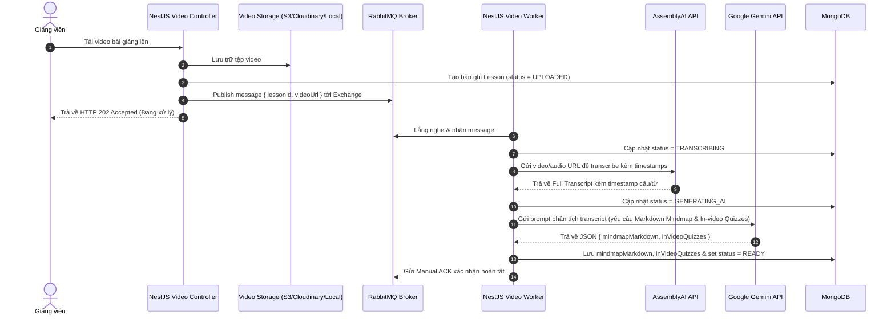

# AI Video Pipeline — Rules & Business Flows

> **Module:** Xử lý video bất đồng bộ qua RabbitMQ, AssemblyAI (Speech-to-Text) và Google Gemini API (sinh Mindmap Markdown & In-video Quiz).

---

## 1. Nghiệp vụ & Luồng Dữ liệu (Processing Flow)

---

## 2. Quy tắc Nghiệp vụ Cốt lõi (Core Business Rules)

1. **Chống nghẽn tiến trình (Non-blocking HTTP)**:
   - Tuyệt đối không gọi AssemblyAI hoặc Gemini đồng bộ bên trong request HTTP của người dùng.
2. **Khả năng chịu lỗi & Thử lại (Idempotency & Retry Strategy)**:
   - Worker chỉ gửi `ack` khi đã lưu dữ liệu thành công vào MongoDB.
   - Khi gặp lỗi mạng tạm thời từ External API (AssemblyAI/Gemini), worker sử dụng cơ chế retry tối đa 3 lần.
   - Nếu vượt quá số lần thử lại, message được chuyển sang Dead Letter Queue (DLQ) và trạng thái bài học được cập nhật là `FAILED` kèm lý do lỗi `failureReason`.
3. **Độ an toàn API Key**:
   - Khóa API của AssemblyAI và Google Gemini được cấu hình qua biến môi trường (`.env`), không hardcode trong mã nguồn.
