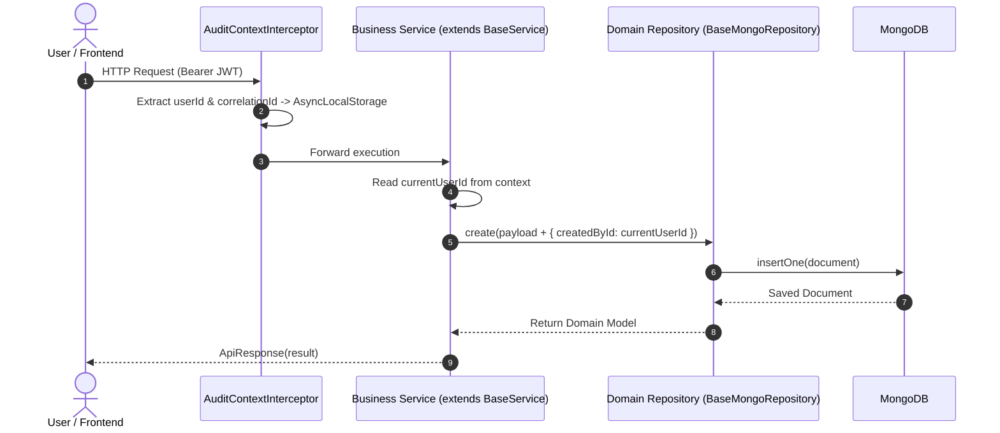

# Base Abstract & Audit Field — Rules & Business Flows

> **Module:** Core Base Document, Audit Capture Flow, Soft Delete Rules, and Repository Contracts

---

## 1. Automated Audit Capture Flow



### Audit Population Rules:
- **Create Operations**: Set `createdById = currentUserId`. `updatedById` can remain null or match `createdById`.
- **Update Operations**: Set `updatedById = currentUserId`. `createdById` MUST NEVER be modified after creation.
- **Delete Operations (Soft Delete)**: Set `deletedAt = new Date()`, `updatedById = currentUserId`.
- **System Actions**: When operations originate from background tasks, cron jobs, or unauthenticated seeders, `currentUserId` defaults to `'SYSTEM'`.

---

## 2. Soft Deletion & Query Filtering Rules

1. **Default Active Filter**:
   - Every read query in `BaseMongoRepository` (`find`, `findOne`, `findById`, `findManyWithPagination`) MUST automatically filter `{ deletedAt: null }`.
2. **Exclude Soft-Deleted by Default**:
   - Soft-deleted records are treated as non-existent for standard business operations.
3. **Hard Delete Restriction**:
   - ❌ **FORBIDDEN:** Calling `deleteOne` or `deleteMany` on business collections without explicit system architecture approval.
4. **Restore Capability**:
   - Calling `restore(id)` resets `deletedAt = null` and updates `updatedById = currentUserId`.

---

## 3. Database Indexing Rules for Base Documents

Every schema inheriting `BaseAbstractDocument` MUST register a compound index for soft deletion and sorting:

```typescript
EntitySchema.index({ deletedAt: 1, createdAt: -1 });
```

This compound index ensures that MongoDB can quickly exclude soft-deleted records and sort by creation time without performing an in-memory collection scan.

---

## 4. Strict Typing & Boundary Rules

- **Zero `any`**: All generic repository parameters (`DomainModel`, `ID`) must be strongly typed.
- **No Raw Leakage**: Mongoose `Document` methods (`.save()`, `.populate()`, `.exec()`) must remain internal to the Repository layer and never leak into Services or Controllers.
