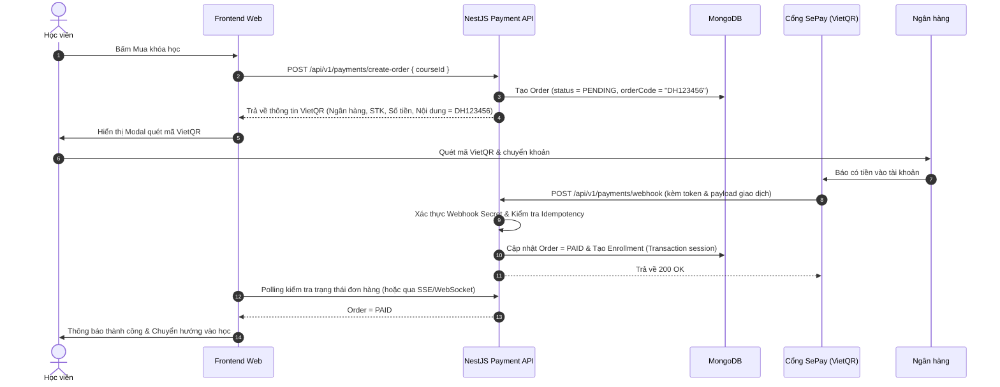

# Payment SePay — Rules & Business Flows

> **Module:** Thanh toán học phí tự động qua cổng SePay (quét mã VietQR và kích hoạt khóa học qua Webhook).

---

## 1. Nghiệp vụ & Luồng Thanh toán (Payment Flow)

---

## 2. Quy tắc Nghiệp vụ Cốt lõi (Core Business Rules)

1. **Bảo mật Webhook**:
   - Webhook endpoint phải xác thực Authorization Header (SePay API Token) hoặc Webhook Secret.
2. **Nguyên tắc Idempotency (Chống xử lý trùng)**:
   - Lưu trữ `sepayTransactionId` trong collection `Transactions`.
   - Nếu SePay retry gửi lại webhook có cùng `transactionId`, hệ thống kiểm tra và trả về `200 OK` ngay lập tức mà không cộng tiền hay tạo thêm bản ghi Enrollment.
3. **Tính Toàn vẹn Giao dịch (MongoDB Transaction)**:
   - Thao tác cập nhật trạng thái đơn hàng (`Order.status = PAID`) và cấp quyền học viên (`Enrollment`) phải nằm trọn trong một MongoDB `ClientSession` transaction.
