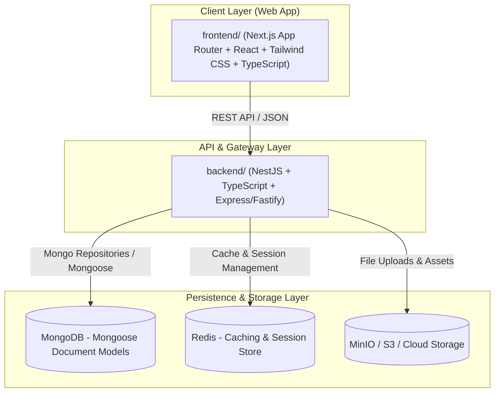

# Project Shape & Architecture Boundaries

> **Description:** System architecture map, interaction flows across modules, and strict source code modification boundaries (Code Boundaries) for NestJS + MongoDB + Next.js.

---

## 1. System Architecture Diagram (Mermaid)

---

## 2. Directory Structure & Roles

| Directory Path   | Role & Responsibilities                                    | Technologies                                      |
| :--------------- | :--------------------------------------------------------- | :------------------------------------------------ |
| `backend/`       | Core API, Business Logic, Mongoose Schemas, Repositories   | NestJS, TypeScript, Mongoose, MongoDB, Redis      |
| `frontend/`      | User Interface, Next.js App Router, Components, Hooks, API | Next.js (App Router), React, Tailwind CSS, TS     |
| `a-agentic/`     | AI Deep Context (Architecture, Guidelines, Feature Specs)  | Markdown                                          |

---

## 3. Code Modification Boundaries

### 🟢 SAFE EDIT ZONES (Standard AI Modification Scope)

- `backend/src/modules/**`: Controllers, Services, Domain Repositories, Schemas/Documents, DTOs.
- `backend/src/modules/**/tests/**`: Unit test files (`*.spec.ts`) per sub-module.
- `frontend/src/app/**`: Next.js App Router routes, layouts, page shells.
- `frontend/src/features/**`: Feature components, forms, tables, hooks, and types.
- `frontend/src/components/**`: Reusable UI components (`BaseDataTable`, `DialogLayout`, inputs, buttons).
- `a-agentic/features/**/dev-history.md`: Record bug fixes, lessons learned, and gotchas after task completion.
- `a-agentic/features/**/tech-spec.md`: Update schema descriptions and API endpoint tables.

### 🔴 STRICTLY RESTRICTED ZONES (Require Explicit Confirmation / Automated Output)

1. **Build & Generated Outputs (NEVER EDIT MANUALLY)**:
   - `dist/`, `build/`, `node_modules/`, `.next/`
2. **Lockfiles & Project Configs**:
   - `package-lock.json`, `pnpm-lock.yaml`, `yarn.lock` (Edit only when explicitly managing dependencies).
3. **Environment & Secrets**:
   - `.env`, `.env.production` (Never commit secrets, passwords, or production keys).
