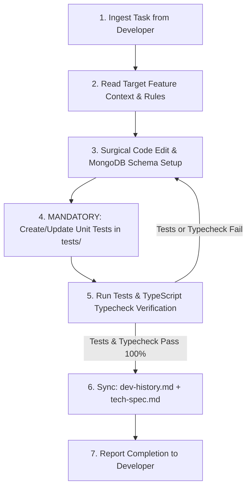

# Context Maintenance & Living Docs Guide

> **Description:** Rules and automated workflows for synchronizing Living Docs, updating `dev-history.md`, maintaining `tech-spec.md`, and keeping architecture context current.

---

## 1. Core Principles of Living Documentation

Living documentation evolves continuously with the codebase. Whenever code changes:

1. **Gotchas and Bug Fixes**: Document root causes, solutions, and anti-patterns in `dev-history.md`.
2. **Schema & API Changes**: Update database schema descriptions, Mongoose collections, and endpoint tables in `tech-spec.md`.
3. **Module Architecture**: Update dependencies and interaction flows in `dependencies.md` and `rules-and-flows.md`.

---

## 2. Task Lifecycle & Context Synchronization Workflow



---

## 3. Required Entry Format for `dev-history.md`

Whenever completing a task or fixing a bug, append an entry using the following template:

```markdown
### [YYYY-MM-DD] - <Brief Title of Change>

- **Problem**: Description of the issue or feature requirement.
- **Root Cause**: Why the bug occurred or what technical constraint was encountered.
- **Solution**: How the problem was resolved (services, DTOs, schemas modified).
- **Gotchas & Lessons**: What rules or pitfalls future developers/AIs must remember.
```

---

## 4. Documentation Maintenance Protocol

When modifying public APIs or system behavior:

1. Update the corresponding feature specification in `a-agentic/features/<feature>/tech-spec.md`.
2. Keep DTO and response contracts in sync with backend controllers.
3. Document any newly introduced environment variables in `.env.example`.
