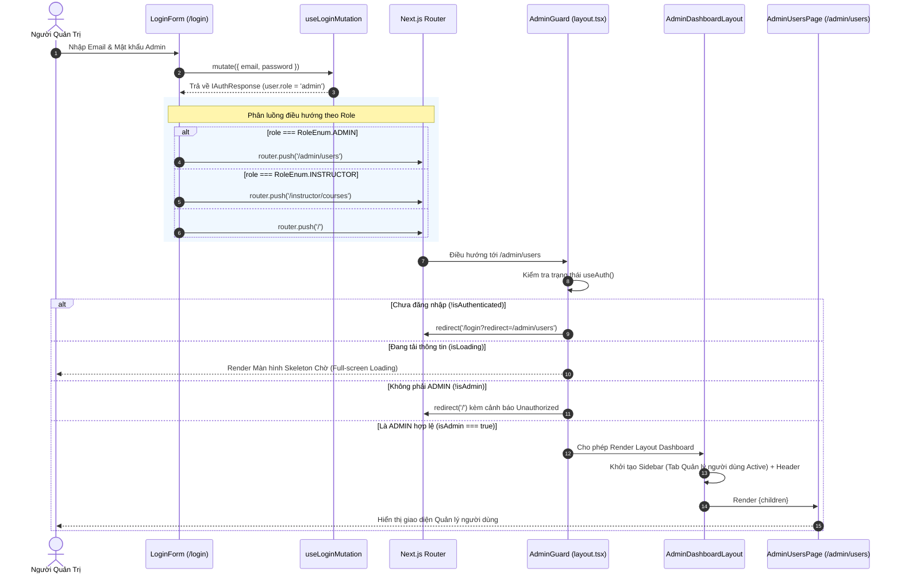

# Kế Hoạch Triển Khai: Admin Route, Điều Hướng Theo Role & Layout Dashboard Admin

> **Mục tiêu:**
> 1. Xử lý điều hướng thông minh sau khi đăng nhập: Người dùng đăng nhập có `role === RoleEnum.ADMIN` sẽ tự động chuyển hướng vào Cổng Quản Trị (`/admin` hoặc `/admin/users`), `role === RoleEnum.INSTRUCTOR` điều hướng vào `/instructor/courses`, `role === RoleEnum.STUDENT` (hoặc mặc định) điều hướng về trang chủ `/`.
> 2. Xây dựng cơ chế bảo vệ Route Quản trị (`AdminGuard`): Ngăn chặn người dùng chưa đăng nhập hoặc không có quyền `ADMIN` truy cập trái phép vào bất kỳ đường dẫn `/admin/*` nào.
> 3. Thiết kế & triển khai Layout chung chuyên nghiệp cho trang Admin (`/admin`):
>    - Sidebar cố định bên trái (Desktop) với khả năng thu gọn (Collapse/Drawer trên Mobile).
>    - Menu điều hướng với tab đầu tiên được kích hoạt mặc định: **"Quản lý người dùng"** (`/admin/users`).
>    - Header Admin tinh tế: hiển thị Breadcrumb/Tiêu đề trang, trạng thái người dùng (Avatar, Tên, Badge "Quản trị viên") và nút Đăng xuất.
> 4. Tạo trang mẫu Placeholder cho tab "Quản lý người dùng" (`/admin/users`): Chuẩn hóa cấu trúc layout viewport, container theo kiến trúc `min-h-0 flex-1 flex flex-col` sẵn sàng cho việc lập trình bảng dữ liệu người dùng (`BaseDataTable`) ở giai đoạn tiếp theo.
>
> **Task Slug:** `admin-dashboard-route`  
> **Plan File:** `docs/PLAN-admin-dashboard-route.md`  
> **Primary Agent:** `project-planner`  
> **Executing Agents:** `frontend-specialist`  
> **Skills:** `clean-code`, `frontend-design`, `react-best-practices`, `plan-writing`

---

## 1. Phân Tích Kỹ Thuật & Khảo Sát Hiện Trạng Codebase

### 1.1. Hiện Trạng Authentication & Role Trong Hệ Thống

1. **Enum Role (`share-lib`)**:
   ```typescript
   export enum RoleEnum {
     STUDENT = 'student',
     INSTRUCTOR = 'instructor',
     ADMIN = 'admin',
     USER = 'student',
   }
   ```
2. **Hook `useAuth()` (`frontend/src/features/auth/hooks/use-auth.ts`)**:
   - Đã cung cấp sẵn: `user`, `isLoading`, `isAuthenticated`, `isAdmin` (`user?.role === RoleEnum.ADMIN`), `isUser`, `logout`.
3. **Form Đăng Nhập Hiện Tại (`frontend/src/features/auth/components/login-form.tsx`)**:
   - Tại dòng 33–37, hàm `onSubmit` hiện đang fix cứng điều hướng về trang chủ:
     ```typescript
     loginMutation.mutate(data, {
       onSuccess: () => {
         router.push('/');
       },
     });
     ```
   - Mutation `useLoginMutation` trả về đối tượng `IAuthResponse` chứa `{ user: IUserProfile, tokens: { accessToken, refreshToken } }`.
4. **Cấu Trúc Thư Mục Next.js App Router Hiện Tại**:
   - Thư mục `frontend/src/app/(admin)` đã tồn tại nhưng hiện đang trống.
   - Thư mục `frontend/src/features/` hiện có `auth`, `course`, `profile`. Cần bổ sung feature module `admin` (`frontend/src/features/admin/`).

---

### 1.2. Sơ Đồ Luồng Hoạt Động (Sequence & Architecture Diagram)



---

## 2. Đặc Tả Kiến Trúc & Cấu Trúc File Mới

```
frontend/
├── src/
│   ├── app/
│   │   └── (admin)/
│   │       ├── admin/
│   │       │   ├── layout.tsx             # Root Layout của Cổng Admin (bọc AdminGuard & AdminLayout)
│   │       │   ├── page.tsx               # Redirect tự động từ /admin sang /admin/users
│   │       │   └── users/
│   │       │       └── page.tsx           # Trang mẫu Quản lý người dùng
│   ├── features/
│   │   ├── admin/
│   │   │   ├── components/
│   │   │   │   ├── admin-guard.tsx        # Component bảo vệ route theo role ADMIN
│   │   │   │   ├── admin-layout.tsx       # Khung layout Dashboard (Sidebar + Header + Content)
│   │   │   │   ├── admin-sidebar.tsx      # Sidebar bên trái (Logo, Navigation Links, Collapse)
│   │   │   │   ├── admin-header.tsx       # Thanh Topbar (Breadcrumbs, User Info, Quick Actions)
│   │   │   │   └── admin-users-placeholder.tsx # Trang mẫu Quản lý người dùng ban đầu
│   │   │   ├── constants/
│   │   │   │   └── admin-navigation.ts    # Danh sách cấu hình menu items
│   │   │   ├── types/
│   │   │   │   └── index.ts               # Type definitions cho Admin Navigation
│   │   │   └── index.ts                   # Public API export của module admin
│   │   └── auth/
│   │       └── components/
│   │           └── login-form.tsx         # Cập nhật xử lý router.push theo role
```

---

## 3. Kế Hoạch Triển Khai Chi Tiết (Task Breakdown)

### Task 1: Xử Lý Phân Quyền & Điều Hướng Theo Role Tại Form Đăng Nhập
- **Mã Task:** `TASK-AUTH-ROLE-REDIRECT`
- **Agent Phụ Trách:** `frontend-specialist`
- **Skills:** `clean-code`, `react-best-practices`
- **Độ Ưu Tiên:** P0 (Nền tảng luồng nghiệp vụ)
- **Dependencies:** Không
- **Mô Tả Chi Tiết:**
  - Cập nhật hàm `onSubmit` trong `frontend/src/features/auth/components/login-form.tsx`.
  - Nhận kết quả `authData` từ callback `onSuccess` của `loginMutation.mutate(data, { onSuccess: (res) => ... })`.
  - Triển khai logic điều hướng chuẩn xác:
    - Nếu `res.user.role === RoleEnum.ADMIN`: Chuyển hướng tới `/admin/users` (hoặc `/admin`).
    - Nếu `res.user.role === RoleEnum.INSTRUCTOR`: Chuyển hướng tới `/instructor/courses`.
    - Mặc định (`STUDENT` hoặc role khác): Chuyển hướng tới `/`.
- **INPUT:** `IAuthResponse` từ `loginMutation`.
- **OUTPUT:** Người dùng đăng nhập được chuyển hướng ngay lập tức về trang tương ứng với vai trò.
- **VERIFY:** 
  - Đăng nhập bằng tài khoản Admin -> Tự động chuyển đến `/admin/users`.
  - Đăng nhập bằng tài khoản thường -> Chuyển đến `/`.

---

### Task 2: Xây Dựng Component Bảo Vệ Route Quản Trị (`AdminGuard`)
- **Mã Task:** `TASK-ADMIN-GUARD`
- **Agent Phụ Trách:** `frontend-specialist`
- **Skills:** `clean-code`, `react-best-practices`
- **Độ Ưu Tiên:** P0 (Bảo mật giao diện)
- **Dependencies:** `TASK-AUTH-ROLE-REDIRECT`
- **Mô Tả Chi Tiết:**
  - Tạo file `frontend/src/features/admin/components/admin-guard.tsx`.
  - Sử dụng hook `useAuth()` để theo dõi:
    - Trạng thái `isLoading`: Hiển thị Skeleton Loader chuyên nghiệp toàn màn hình với hiệu ứng tinh tế.
    - Trạng thái `!isAuthenticated`: Chuyển hướng người dùng về `/login?redirect=${encodeURIComponent(pathname)}`.
    - Trạng thái đã đăng nhập nhưng `!isAdmin`: Hiển thị thông báo hoặc chuyển hướng về `/` kèm Toast thông báo "Bạn không có quyền truy cập khu vực Quản trị".
    - Khi `isAdmin === true`: Render trực tiếp `{children}`.
- **INPUT:** React children components.
- **OUTPUT:** Lớp bảo vệ chắc chắn cho toàn bộ các route con của `/admin`.
- **VERIFY:**
  - Người dùng ẩn danh truy cập trực tiếp URL `http://localhost:3000/admin` -> Bị đẩy về `/login`.
  - Người dùng role `student` truy cập `http://localhost:3000/admin` -> Bị chặn và chuyển về `/`.

---

### Task 3: Định Nghĩa Cấu Trúc Menu & Dữ Liệu Navigation Admin
- **Mã Task:** `TASK-ADMIN-NAV-CONFIG`
- **Agent Phụ Trách:** `frontend-specialist`
- **Skills:** `clean-code`
- **Độ Ưu Tiên:** P1
- **Dependencies:** Không
- **Mô Tả Chi Tiết:**
  - Tạo `frontend/src/features/admin/types/index.ts` định nghĩa kiểu dữ liệu `AdminNavItem` (title, href, icon, badge, disabled).
  - Tạo `frontend/src/features/admin/constants/admin-navigation.ts` khai báo danh sách menu:
    1. **Quản lý người dùng** (`/admin/users`) — Icon: `lucide:users`, Active / Mặc định.
    2. **Tổng quan hệ thống** (`/admin/dashboard`) — Icon: `lucide:layout-dashboard`, badge: "Sắp ra mắt".
    3. **Quản lý khóa học** (`/admin/courses`) — Icon: `lucide:book-open`, badge: "Sắp ra mắt".
    4. **Cài đặt hệ thống** (`/admin/settings`) — Icon: `lucide:settings`, badge: "Sắp ra mắt".
- **INPUT:** Cấu trúc định nghĩa menu.
- **OUTPUT:** File cấu hình tập trung, dễ mở rộng thêm các tab sau này.
- **VERIFY:** TypeScript type check không có cảnh báo nào.

---

### Task 4: Xây Dựng Sidebar & Header Của Admin Dashboard
- **Mã Task:** `TASK-ADMIN-SIDEBAR-HEADER`
- **Agent Phụ Trách:** `frontend-specialist`
- **Skills:** `frontend-design`, `clean-code`
- **Độ Ưu Tiên:** P1
- **Dependencies:** `TASK-ADMIN-NAV-CONFIG`
- **Mô Tả Chi Tiết:**
  - Xây dựng `frontend/src/features/admin/components/admin-sidebar.tsx`:
    - Chiều rộng Desktop: `w-64`, thanh chia tách `border-r border-border/50`.
    - Phần Header Sidebar: Logo hệ thống DATN Portal + Tag "ADMIN".
    - Phần Navigation: Render danh sách link, so sánh chính xác với `pathname` hiện tại để gán style Active (nền primary/10, chữ primary, viền nổi bật).
    - Phần Footer Sidebar: Thu gọn hiển thị profile Admin rút gọn + Nút Đăng xuất (`logoutMutation`).
  - Xây dựng `frontend/src/features/admin/components/admin-header.tsx`:
    - Thanh điều hướng trên cùng (Sticky/Fixed top).
    - Nút Toggle Sidebar khi ở chế độ màn hình nhỏ (Mobile/Tablet Sheet/Drawer).
    - Breadcrumb hiển thị vị trí trang hiện tại: `Admin / Quản lý người dùng`.
    - Avatar, tên người dùng của Admin, nút chuyển theme (nếu có) và nút đăng xuất nhanh.
  - Tuân thủ quy tắc Design:
    - Không sử dụng màu tím (Purple Ban).
    - Sử dụng `@iconify/react` qua component `Icon` chuẩn của dự án.
    - Không sử dụng font inline lạ.
- **INPUT:** State người dùng từ `useAuth()`, URL pathname.
- **OUTPUT:** Giao diện Sidebar & Header Dashboard chuẩn mực, mượt mà, phản hồi tốt trên mọi kích thước màn hình.
- **VERIFY:** Sidebar hiển thị đẹp mắt, highlight đúng tab Quản lý người dùng, phản hồi click logout chuẩn xác.

---

### Task 5: Hoàn Thiện Layout Admin Chung & Route Pages
- **Mã Task:** `TASK-ADMIN-LAYOUT-PAGES`
- **Agent Phụ Trách:** `frontend-specialist`
- **Skills:** `frontend-design`, `react-best-practices`
- **Độ Ưu Tiên:** P1
- **Dependencies:** `TASK-ADMIN-GUARD`, `TASK-ADMIN-SIDEBAR-HEADER`
- **Mô Tả Chi Tiết:**
  - Tạo `frontend/src/features/admin/components/admin-layout.tsx`: Kết hợp Sidebar, Header và khung Content chính với chuẩn `min-h-0 flex-1 flex flex-col` giúp loại bỏ lỗi 2 thanh cuộn (double scrollbar).
  - Tạo `frontend/src/app/(admin)/admin/layout.tsx`: Bọc toàn bộ các route con trong `<AdminGuard><AdminLayout>{children}</AdminLayout></AdminGuard>`.
  - Tạo `frontend/src/app/(admin)/admin/page.tsx`: Tự động redirect về `/admin/users` bằng Next.js `redirect('/admin/users')`.
  - Tạo `frontend/src/features/admin/components/admin-users-placeholder.tsx` và `frontend/src/app/(admin)/admin/users/page.tsx`:
    - Giao diện mẫu chuyên nghiệp gồm:
      - Header trang: Tiêu đề "Quản lý người dùng", Mô tả ngắn gọn về chức năng quản lý tài khoản và phân quyền.
      - Thẻ tóm tắt nhanh (Summary KPI Cards): Tổng người dùng, Giảng viên, Sinh viên, Quản trị viên (dữ liệu mock/placeholder tĩnh).
      - Khung vùng nội dung chính (Placeholder Container): Thông báo sẵn sàng kết nối bảng dữ liệu (`BaseDataTable`) cho giai đoạn tiếp theo.
- **INPUT:** Khung layout và trang mẫu.
- **OUTPUT:** Cụm tính năng hoàn chỉnh từ route `/admin` tới `/admin/users`.
- **VERIFY:**
  - Truy cập `/admin` tự động dẫn đến `/admin/users`.
  - Giao diện trang hiển thị trọn vẹn, không vỡ layout, không lỗi console.

---

## 4. Ranh Giới Phạm Vi Nghiêm Ngặt (Scope Boundaries)

| Trong Phạm Vi Milestone Này (IN SCOPE) | Ngoài Phạm Vi (DEFERRED TO NEXT MILESTONES) |
| :--- | :--- |
| Điều hướng đăng nhập theo Role (Admin, Instructor, Student) | Code toàn bộ bảng dữ liệu danh sách người dùng (`BaseDataTable`) |
| Bảo vệ Route `AdminGuard` phía Client | Xây dựng API Backend quản lý người dùng mới (phân trang, lọc, xóa) |
| Layout Dashboard hoàn chỉnh (Sidebar bên trái, Header, Content) | Chức năng Thêm/Sửa/Xóa/Đổi vai trò người dùng |
| Tab đầu tiên: "Quản lý người dùng" (Giao diện mẫu/Placeholder) | Xây dựng các tab khác (Quản lý khóa học, Cài đặt) |
| Cấu trúc Responsive cho thiết bị di động | Cookie-based Server Middleware Authentication |

---

## 5. Kế Hoạch Kiểm Thử & Nghiệm Thu (Phase X: Verification Checklist)

- [x] **Kiểm thử Điều hướng Đăng nhập**:
  - Đăng nhập với tài khoản Admin -> Tự động chuyển tới `/admin/users`.
  - Đăng nhập với tài khoản Giảng viên -> Tự động chuyển tới `/instructor/courses`.
  - Đăng nhập với tài khoản Sinh viên -> Chuyển về `/`.
- [x] **Kiểm thử Bảo vệ Route (AdminGuard)**:
  - Chưa đăng nhập truy cập `/admin/users` -> Tự động chuyển hướng về `/login?redirect=...`.
  - Tài khoản không có quyền Admin truy cập `/admin/users` -> Bị từ chối, hiển thị toast cảnh báo và chuyển hướng về `/`.
- [x] **Kiểm thử Giao diện & Thẩm mỹ**:
  - Sidebar hiển thị đầy đủ, tab "Quản lý người dùng" được highlight chính xác.
  - Header hiển thị đúng tên Admin, nút về Cổng chính và nút Đăng xuất hoạt động chuẩn.
  - Tuân thủ quy định màu sắc (không dùng dải màu tím).
  - Nghiêm cấm kiểu `any` trong TypeScript.
- [x] **Kiểm tra Build & Lints**:
  - Chạy `pnpm --filter frontend lint` thành công (0 errors, 0 warnings).
  - Chạy `pnpm --filter frontend exec tsc --noEmit` thành công (0 errors).

---

## ✅ PHASE X COMPLETE

- **ESLint**: ✅ Pass (0 errors, 0 warnings)
- **TypeScript**: ✅ Pass (0 type errors, strict type check)
- **Role Redirection**: ✅ Hoàn thành (`login-form.tsx`)
- **Admin Guard**: ✅ Hoàn thành (`admin-guard.tsx`)
- **Admin Layout & Sidebar**: ✅ Hoàn thành (`admin-sidebar.tsx`, `admin-header.tsx`, `admin-layout.tsx`)
- **Placeholder Tab Quản lý người dùng**: ✅ Hoàn thành (`admin-users-placeholder.tsx`, `/admin/users`)
- **Date**: 2026-10-07
