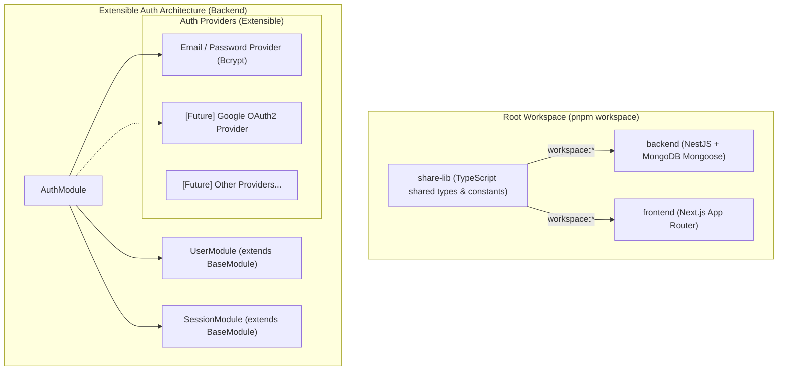

# PLAN: Triển Khai Monorepo Workspace, Thư Mục `share-lib` & Module Auth Mở Rộng

> **Mục tiêu:**
> 1. Thiết lập cấu hình **pnpm workspace** ở thư mục gốc để quản lý `backend`, `frontend`, và `share-lib`.
> 2. Tạo thư mục **`share-lib`** (ngang cấp với `backend` và `frontend`) xuất ra các types, interfaces, enums, constants dùng chung (Role `ADMIN`/`USER`, Auth contracts, ApiResponse, v.v.).
> 3. Cấu hình root `package.json` để chạy `pnpm dev` và `pnpm build` đồng bộ toàn bộ workspace.
> 4. Thiết kế và triển khai **Module Auth** (Email + Bcrypt + JWT Access/Refresh Token rotation + 2 Role `USER` và `ADMIN`) với kiến trúc mở (Strategy/Provider-ready) để dễ dàng tích hợp Google OAuth hoặc các provider khác sau này.
>
> **Task Slug:** `auth-and-shared-lib`
> **Primary Agent:** `project-planner`
> **Supporting Agents:** `backend-specialist`, `security-auditor`

---

## 1. Kiến Trúc Tổng Thể & Phân Tích



---

## 2. Chi Tiết Kế Hoạch Từng Thành Phần

### Thành Phần A: Thiết Lập pnpm Workspace & Scripts Gốc
1. **`pnpm-workspace.yaml` (ở thư mục gốc)**:
   ```yaml
   packages:
     - 'backend'
     - 'frontend'
     - 'share-lib'
   ```
2. **`package.json` (ở thư mục gốc)**:
   - Cài đặt công cụ điều phối chạy song song nhẹ nhàng (ví dụ `concurrently`).
   - Khai báo scripts:
     - `pnpm dev`: Build watch `share-lib` và chạy song song `backend` (`pnpm --filter backend run start:dev`) và `frontend` (`pnpm --filter frontend run dev`).
     - `pnpm build`: Build `share-lib` trước, sau đó build `backend` và `frontend`.
     - `pnpm lint`, `pnpm test`.

---

### Thành Phần B: Xây Dựng Thư Mục `share-lib/`
Cấu trúc thư mục `share-lib/`:
```plaintext
share-lib/
├── package.json               # name: "@project/share-lib" hoặc "share-lib", type: "module"
├── tsconfig.json              # declaration: true, outDir: "./dist"
└── src/
    ├── enums/
    │   ├── role.enum.ts       # RoleEnum: 'ADMIN', 'USER'
    │   ├── user-status.enum.ts# UserStatus: 'ACTIVE', 'INACTIVE', 'SUSPENDED'
    │   └── auth-provider.enum.ts # AuthProvider: 'LOCAL', 'GOOGLE', 'FACEBOOK', etc.
    ├── interfaces/
    │   ├── user.interface.ts  # IUser, IUserProfile
    │   ├── auth.interface.ts  # ILoginPayload, IRegisterPayload, IAuthTokens, ITokenPayload
    │   └── session.interface.ts # ISession
    ├── constants/
    │   └── auth.constants.ts  # Default TTL, header keys, roles
    └── index.ts               # Barrel export
```
- Khi chạy `pnpm build` trong `share-lib`, TypeScript sẽ biên dịch sang `dist/` kèm file khai báo `.d.ts`.
- `backend` và `frontend` chỉ cần thêm dependency `"share-lib": "workspace:*"` để import trực tiếp.

---

### Thành Phần C: Thiết Kế Module Auth Mở Rộng Trong `backend/`

#### 1. Mongoose Schemas (kế thừa `BaseAbstractDocument`):
- **`UserDocument` (`backend/src/modules/user/schemas/user.schema.ts`)**:
  - `email`: `string` (Unique, lowercase, trimmed)
  - `password`: `string` (Nullable - null đối với tài khoản đăng nhập thuần bằng Google/OAuth)
  - `provider`: `enum` (`LOCAL`, `GOOGLE`, v.v. - default: `LOCAL`)
  - `providerId`: `string` (Nullable - ID người dùng từ Google/OAuth)
  - `role`: `enum` (`ADMIN`, `USER` - default: `USER`)
  - `status`: `enum` (`ACTIVE`, `INACTIVE`, `SUSPENDED` - default: `ACTIVE`)
  - `firstName`, `lastName`, `avatar`
  - Kế thừa toàn bộ audit fields từ `BaseAbstractDocument`: `createdAt`, `updatedAt`, `deletedAt`, `createdById`, `updatedById`.
  - Compound Index: `{ email: 1, deletedAt: 1 }` và `{ provider: 1, providerId: 1 }`.
- **`SessionDocument` (`backend/src/modules/session/schemas/session.schema.ts`)**:
  - `userId`: `Types.ObjectId` (Index -> users._id)
  - `refreshTokenHash`: `string` (Mã hóa SHA256 hoặc bcrypt)
  - `previousRefreshTokenHash`: `string` (Nullable - phục vụ **30-second Grace Period**)
  - `hashRotatedAt`: `Date` (Thời điểm xoay token)
  - `expiresAt`: `Date` (TTL Index tự động dọn dẹp session hết hạn)
  - `isRevoked`: `boolean` (default: false)

#### 2. Kiến Trúc Xử Lý Mở (Strategy / Factory Pattern):
- **`IAuthProviderService` Interface**:
  - Mọi phương thức xác thực (Local Email/Password, Google OAuth, etc.) đều implement chung interface này hoặc trả về chuẩn `ValidatedAuthUser`:
    ```typescript
    export interface ValidatedAuthUser {
      id: string;
      email: string;
      role: RoleEnum;
      status: UserStatus;
    }
    ```
- **`LocalAuthService` (Email & Password)**:
  - Kiểm tra email, so sánh hash mật khẩu bằng `bcrypt.compare`.
  - Validate trạng thái tài khoản `ACTIVE`.
- **`AuthTokenService` (Token Generation & Session Grace Period)**:
  - Sinh cặp Access Token (15m) và Refresh Token (7d).
  - Quản lý phiên làm việc trong collection `sessions`.
  - Áp dụng cơ chế **30s Session Grace Period**: Khi nhiều tab cùng gửi refresh token cũ trong vòng 30s sau khi xoay hash, vẫn cấp phát token mới thay vì trả về 401.
- **`AuthService` (Orchestrator)**:
  - `loginWithEmail(dto)`
  - `register(dto)`
  - `refreshToken(token)`
  - `logout(userId)`
  - `validateOAuthLogin(provider, profile)`: Sẵn sàng cho Google OAuth sau này, nếu email đã tồn tại thì liên kết provider, nếu chưa thì tạo user mới với role `USER`.

#### 3. Phân Quyền & Bảo Vệ (Guards & Decorators):
- **`JwtAuthGuard`**: Bảo vệ các private endpoints, trích xuất user vào request.
- **`RolesGuard` + `@Roles(RoleEnum.ADMIN, RoleEnum.USER)`**: Kiểm tra role cơ bản, hỗ trợ `ADMIN` bypass.
- **`@CurrentUser()`**: Custom decorator lấy nhanh thông tin user đang đăng nhập.

#### 4. Endpoints:
- `POST /api/v1/auth/register`: Đăng ký tài khoản (mặc định role `USER`).
- `POST /api/v1/auth/login`: Đăng nhập bằng Email & Password.
- `POST /api/v1/auth/refresh`: Xoay Refresh Token với 30s Grace Period.
- `POST /api/v1/auth/logout`: Thu hồi session.
- `GET /api/v1/auth/me`: Lấy thông tin user hiện tại (Yêu cầu JWT).

---

## 3. Các Bước Triển Khai Cụ Thể (Implementation Phases)

### Phase 1: Khởi Tạo Workspace & `share-lib`
1. Tạo `pnpm-workspace.yaml` tại root.
2. Tạo thư mục `share-lib/` với `package.json`, `tsconfig.json`.
3. Định nghĩa các enum (`RoleEnum`, `AuthProvider`, `UserStatus`) và interfaces trong `share-lib/src/`.
4. Cấu hình root `package.json` với các scripts `dev` và `build`.
5. Chạy `pnpm build` trong `share-lib` để kiểm tra build ra `dist/`.
6. Liên kết `share-lib` vào `backend/package.json` qua `"share-lib": "workspace:*"`.

### Phase 2: Triển Khai User & Session Domain trong `backend/`
1. Tạo `backend/src/modules/user/`:
   - `schemas/user.schema.ts` (kế thừa `BaseAbstractDocument`).
   - `repositories/user.repository.ts` (kế thừa `BaseMongoRepository`).
   - `services/user.service.ts` (kế thừa `BaseService`).
2. Tạo `backend/src/modules/session/`:
   - `schemas/session.schema.ts`.
   - `repositories/session.repository.ts`.
   - `services/session.service.ts`.

### Phase 3: Triển Khai Auth Module & Provider Mở Rộng
1. Tạo `backend/src/modules/auth/`:
   - `dto/login.dto.ts`, `dto/register.dto.ts`, `dto/refresh-token.dto.ts` (kèm `@Transform` trim whitespace).
   - `strategies/jwt.strategy.ts`.
   - `guards/jwt-auth.guard.ts`, `guards/roles.guard.ts`.
   - `decorators/roles.decorator.ts`, `decorators/current-user.decorator.ts`.
   - `services/auth.service.ts`, `services/token.service.ts`.
   - `auth.controller.ts`.
   - `auth.module.ts`.

### Phase 4: Unit Testing & Verification
1. Viết unit tests cho `AuthService` (đăng nhập email thành công, mật khẩu sai, tài khoản bị khóa, xoay token 30s grace period).
2. Viết unit tests cho `RolesGuard` (kiểm tra phân quyền `ADMIN` vs `USER`).
3. Chạy `pnpm build` toàn workspace kiểm tra compile 100% không lỗi.
4. Chạy `pnpm test` kiểm tra toàn bộ test suites.

### Phase 5: Cập Nhật Living Docs
1. Cập nhật [`a-agentic/features/auth-identity/dev-history.md`](file:///d:/TrinhHongCuong/thc-datn/Do_an_tot_nghiep/a-agentic/features/auth-identity/dev-history.md).
2. Cập nhật [`a-agentic/project-shape.md`](file:///d:/TrinhHongCuong/thc-datn/Do_an_tot_nghiep/a-agentic/project-shape.md) bổ sung `share-lib`.

---

## 4. Verification Plan

- [ ] `pnpm build` tại thư mục gốc build thành công cả `share-lib` và `backend`.
- [ ] `backend` import các types/enums từ `share-lib` mượt mà, không gặp lỗi resolution.
- [ ] Các endpoints `/api/v1/auth/register`, `/api/v1/auth/login`, `/api/v1/auth/refresh`, `/api/v1/auth/me` hoạt động chính xác.
- [ ] Bảo đảm 100% tuân thủ quy tắc **Zero `any`** và tự động trim input whitespace.
- [ ] 100% unit tests pass.
