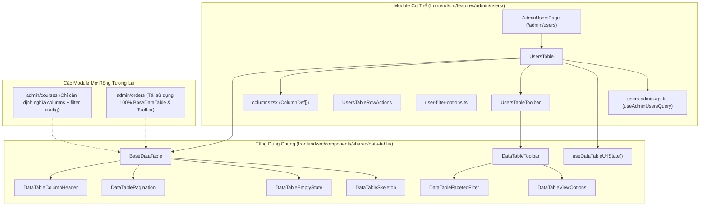

# Kế Hoạch Triển Khai: Hệ Thống Generic Data Table & Module Mẫu Admin Users

> **Mục tiêu:**
> 1. Thiết kế & xây dựng bộ component chung **Generic Data Table (`BaseDataTable`)** tối ưu hiệu năng, tái sử dụng tuyệt đối cho mọi module trong toàn hệ thống (Users, Courses, Orders, Logs...), xóa bỏ hoàn toàn trùng lặp code.
> 2. Xây dựng trọn bộ hệ thống Toolbar & Filter Options linh hoạt:
>    - Tìm kiếm đa năng (Text Search với Debounce tự động).
>    - Bộ lọc đa tiêu chí (Faceted Filter Popovers: Checkbox/Radio với Icon và Badges số lượng).
>    - Tùy chọn hiển thị cột (Column Visibility Options).
>    - Tự động đồng bộ 2 chiều trạng thái bảng (trang, giới hạn dòng, tìm kiếm, lọc, sắp xếp) với URL Query Parameters (`useSearchParams`, `useRouter`, `usePathname`).
> 3. Thiết lập kiến trúc thư mục chuẩn mực và triển khai module tham chiếu **`admin/users`**:
>    - Định nghĩa cột (`columns.tsx`) với Type Safety 100% (không dùng `any`).
>    - Render các thành phần nâng cao: Avatar + Tên + Email, Role Badge, Status Pill, Formatted Date, Row Actions Menu.
>    - Khung giao diện danh sách người dùng hoàn chỉnh thay thế trang placeholder hiện tại, bám sát layout cố định viewport (`min-h-0 flex-1 flex flex-col`) loại bỏ lỗi 2 thanh cuộn.
>
> **Task Slug:** `base-data-table`  
> **Plan File:** `docs/PLAN-base-data-table.md`  
> **Primary Agent:** `project-planner`  
> **Executing Agents:** `frontend-specialist`  
> **Skills:** `clean-code`, `frontend-design`, `react-best-practices`, `plan-writing`

---

## 1. Phân Tích Kỹ Thuật & Khảo Sát Hiện Trạng

### 1.1. Yêu Cầu Kiến Trúc Dự Án (Architectural Constraints)

Theo quy định tại `RULE_GUIDE.md` (`project-architecture.md`):
1. **Chuẩn hóa URL Parameters**: `page`, `limit`, `isPagination`, `sort`, `filters`. Mọi bảng danh sách phải đồng bộ trạng thái với URL bằng Next.js navigation hooks (`useSearchParams`, `useRouter`, `usePathname`).
2. **Fixed Viewport & Unified Scroll**: Toàn bộ trang bảng dữ liệu phải sử dụng container `min-h-0 flex-1 flex flex-col` truyền xuyên suốt xuống `<BaseDataTable>`, giữ thanh Header của bảng sticky ở trên cùng và thanh Phân trang (Pagination) cố định ở đáy, triệt tiêu hoàn toàn hiện tượng 2 thanh cuộn (double scrollbar).
3. **Thư Viện Nền Tảng**: Dự án sử dụng Tailwind CSS v4, Next.js 16 (App Router), React 19, `@base-ui/react` và `@iconify/react` (`Icon`).
4. **Engine Bảng Dữ Liệu**: Cần cài đặt `@tanstack/react-table` (v8) — chuẩn mực headless table được shadcn/ui khuyến nghị, cung cấp khả năng phân tách logic render và quản lý state mạnh mẽ nhất hiện nay.
5. **Nghiêm Cấm Kiểu `any`**: Mọi generic type phải định nghĩa chặt chẽ `<TData, TValue>`.

---

### 1.2. Sơ Đồ Kiến Trúc & Ranh Giới Module (Architecture Map)



---

## 2. Thiết Kế Cấu Trúc Thư Mục Chuẩn (Directory Layout)

```
frontend/src/
├── components/
│   ├── ui/
│   │   ├── table.tsx                         # Core UI Table Primitives (Table, TableHeader, TableBody, TableRow, TableCell)
│   │   ├── dropdown-menu.tsx                 # Dropdown primitive (dựa trên @base-ui hoặc popover chuẩn)
│   │   └── badge.tsx                         # Badge component hiển thị trạng thái và số lượng
│   └── shared/
│       └── data-table/
│           ├── base-data-table.tsx           # Component bảng dữ liệu chính (Headless Wrapper)
│           ├── data-table-column-header.tsx  # Tiêu đề cột kèm nút sắp xếp (Sort ASC/DESC)
│           ├── data-table-pagination.tsx     # Thanh phân trang chuẩn cố định dưới đáy
│           ├── data-table-toolbar.tsx        # Khung Toolbar chung (Search + Filters + Actions)
│           ├── data-table-faceted-filter.tsx # Bộ lọc dạng Popover (Multi/Single Checkbox & Badges)
│           ├── data-table-view-options.tsx   # Menu toggle ẩn/hiện cột linh hoạt
│           ├── data-table-skeleton.tsx       # Hiệu ứng loading skeleton hàng loạt
│           ├── data-table-empty-state.tsx    # Giao diện khi danh sách rỗng
│           ├── hooks/
│           │   └── use-data-table-url-state.ts # Hook đồng bộ State bảng với URL Search Params
│           ├── types/
│           │   └── index.ts                  # Generic Types cho Filter, Sort, Pagination
│           └── index.ts                      # Barrel export của shared data-table
│
├── features/
│   └── admin/
│       ├── users/
│       │   ├── api/
│       │   │   └── users-admin.api.ts        # React Query hook lấy danh sách User
│       │   ├── components/
│       │   │   ├── users-table.tsx           # Container kết nối dữ liệu và BaseDataTable
│       │   │   ├── users-table-toolbar.tsx   # Toolbar chuyên biệt cho User
│       │   │   ├── users-row-actions.tsx     # Menu hành động trên từng dòng người dùng
│       │   │   └── users-status-badge.tsx    # Badge hiển thị vai trò (Role) và trạng thái (Status)
│       │   ├── constants/
│       │   │   └── user-filter-options.ts    # Cấu hình danh mục Filter Role và Status
│       │   ├── types/
│       │   │   └── index.ts                  # Kiểu dữ liệu chuyên biệt của module Users
│       │   ├── columns.tsx                   # Khai báo ColumnDef<IUser>[]
│       │   └── index.ts                      # Export public của module Users
│       └── components/
│           └── admin-users-placeholder.tsx   # Cập nhật kết nối UsersTable thay cho placeholder
```

---

## 3. Kế Hoạch Triển Khai Chi Tiết (Task Breakdown)

### Task 1: Cài Đặt Dependency `@tanstack/react-table` & Core Table UI Primitives
- **Mã Task:** `TASK-TABLE-PRIMITIVES`
- **Agent Phụ Trách:** `frontend-specialist`
- **Skills:** `clean-code`, `react-best-practices`
- **Độ Ưu Tiên:** P0 (Nền móng hệ thống)
- **Dependencies:** Không
- **Mô Tả Chi Tiết:**
  - Cài đặt thư viện `@tanstack/react-table` vào workspace `frontend`.
  - Tạo `frontend/src/components/ui/table.tsx`: Khai báo các thẻ table chuẩn mực được style bằng Tailwind CSS (`Table`, `TableHeader`, `TableBody`, `TableFooter`, `TableHead`, `TableRow`, `TableCell`, `TableCaption`).
  - Tạo `frontend/src/components/ui/badge.tsx` phục vụ việc hiển thị nhãn Role và trạng thái.
- **INPUT:** Cấu hình Tailwind và Base UI.
- **OUTPUT:** Bộ primitive table tinh tế, hỗ trợ border mềm mại, responsive.
- **VERIFY:** Build không lỗi, imports hoạt động bình thường.

---

### Task 2: Xây Dựng Generic Hook Đồng Bộ State URL (`useDataTableUrlState`)
- **Mã Task:** `TASK-TABLE-URL-HOOK`
- **Agent Phụ Trách:** `frontend-specialist`
- **Skills:** `clean-code`, `react-best-practices`
- **Độ Ưu Tiên:** P0
- **Dependencies:** Không
- **Mô Tả Chi Tiết:**
  - Tạo `frontend/src/components/shared/data-table/hooks/use-data-table-url-state.ts`.
  - Đọc và phân tích các tham số từ URL: `page` (default 1), `limit` (default 10), `search`, `filters` (JSON string hoặc mảng query keys), `sort` (`{ orderBy, order }`).
  - Cung cấp các hàm cập nhật: `setPage`, `setLimit`, `setSearch` (kèm debounce 300ms), `setFilterValue`, `setSorting`, `resetAllFilters`.
  - Cập nhật URL thông qua `router.replace` mượt mà, không giật màn hình và giữ trọn vẹn lịch sử navigation.
- **INPUT:** `useSearchParams()`, `usePathname()`, `useRouter()`.
- **OUTPUT:** Hook đa năng, kiểu gõ TypeScript nghiêm ngặt, sử dụng được cho mọi module.
- **VERIFY:** Thay đổi filter trên hook -> URL search params thay đổi tương ứng.

---

### Task 3: Xây Dựng Bộ Component Generic Data Table (`BaseDataTable`)
- **Mã Task:** `TASK-BASE-DATA-TABLE`
- **Agent Phụ Trách:** `frontend-specialist`
- **Skills:** `frontend-design`, `clean-code`, `react-best-practices`
- **Độ Ưu Tiên:** P1
- **Dependencies:** `TASK-TABLE-PRIMITIVES`, `TASK-TABLE-URL-HOOK`
- **Mô Tả Chi Tiết:**
  - Tạo `frontend/src/components/shared/data-table/base-data-table.tsx`:
    - Nhận vào instance `table: Table<TData>` hoặc `columns` + `data` + `pagination`.
    - Thiết kế container chuẩn `min-h-0 flex-1 flex flex-col`: sticky header ở trên, phần thân bảng cuộn mượt mà bên trong, thanh pagination ghim chắc chắn ở dưới đáy.
  - Tạo `data-table-column-header.tsx`: Hỗ trợ click để đảo chiều sắp xếp (Ascending, Descending, Clear).
  - Tạo `data-table-pagination.tsx`: Hiển thị số bản ghi đã chọn (nếu có), phân trang dạng số trang, nút chuyển trang (First, Prev, Next, Last), chọn số dòng/trang (10, 20, 50, 100).
  - Tạo `data-table-skeleton.tsx` và `data-table-empty-state.tsx` xử lý các trạng thái tải và rỗng chuyên nghiệp.
- **INPUT:** Data generic và Columns.
- **OUTPUT:** Component bảng chuẩn hóa cấp enterprise.
- **VERIFY:** Hiển thị dữ liệu mẫu sắc nét, header sticky chuẩn xác khi cuộn.

---

### Task 4: Xây Dựng Hệ Thống Toolbar & Bộ Lọc Nâng Cao (`DataTableToolbar` & `DataTableFacetedFilter`)
- **Mã Task:** `TASK-TABLE-FILTERS`
- **Agent Phụ Trách:** `frontend-specialist`
- **Skills:** `frontend-design`, `clean-code`
- **Độ Ưu Tiên:** P1
- **Dependencies:** `TASK-BASE-DATA-TABLE`
- **Mô Tả Chi Tiết:**
  - Tạo `data-table-faceted-filter.tsx`:
    - Nhận danh sách options `{ label, value, icon, count }`.
    - Hỗ trợ chọn nhiều (multi-select) hoặc chọn một (single-select).
    - Hiển thị số lượng mục đang chọn dạng badge tinh tế trên nút trigger.
    - Có nút "Xóa bộ lọc" nhanh bên trong popover.
  - Tạo `data-table-view-options.tsx`:
    - Dropdown cho phép người dùng tự do bật/tắt hiển thị từng cột dữ liệu.
  - Tạo `data-table-toolbar.tsx`:
    - Khung toolbar tích hợp: Ô input tìm kiếm (tích hợp icon search và nút xóa nhanh), các popover faceted filters, nút "Đặt lại" (Reset) khi có bộ lọc hoạt động, và menu View Options bên phải.
- **INPUT:** Cấu hình filter generic.
- **OUTPUT:** Bộ công cụ lọc mạnh mẽ, không phụ thuộc vào dữ liệu của riêng màn hình nào.
- **VERIFY:** Chọn filter -> Badge hiển thị đúng số lượng -> Nút Reset xuất hiện khi có filter active.

---

### Task 5: Triển Khai Module Mẫu `admin/users` (Columns, Toolbar, Actions & Mock/API Integration)
- **Mã Task:** `TASK-ADMIN-USERS-MODULE`
- **Agent Phụ Trách:** `frontend-specialist`
- **Skills:** `clean-code`, `frontend-design`, `react-best-practices`
- **Độ Ưu Tiên:** P1
- **Dependencies:** `TASK-TABLE-FILTERS`
- **Mô Tả Chi Tiết:**
  - Tạo `frontend/src/features/admin/users/constants/user-filter-options.ts`:
    - Danh mục Role: Quản trị viên (`ADMIN`), Giảng viên (`INSTRUCTOR`), Sinh viên (`STUDENT`).
    - Danh mục Trạng thái: Hoạt động (`ACTIVE`), Không hoạt động (`INACTIVE`), Bị khóa (`BANNED`).
  - Tạo `frontend/src/features/admin/users/columns.tsx`:
    - Cột 1: **Người dùng** (Avatar tròn + Tên hiển thị đậm + Email mờ).
    - Cột 2: **Vai trò** (Badge phân loại màu sắc: Admin - Amber, Giảng viên - Blue, Sinh viên - Emerald).
    - Cột 3: **Trạng thái** (Pill hiển thị trạng thái hoạt động).
    - Cột 4: **Ngày tham gia** (Format ngày tháng tiếng Việt).
    - Cột 5: **Thao tác** (`UsersTableRowActions` với các hành động: Xem chi tiết, Đổi quyền, Khóa/Mở tài khoản, Xóa).
  - Tạo `frontend/src/features/admin/users/api/users-admin.api.ts`:
    - Hook React Query `useAdminUsersQuery` lấy danh sách người dùng kèm phân trang.
    - Cung cấp dữ liệu mock phong phú, đầy đủ role và status nếu backend chưa có endpoint phân trang hoàn chỉnh, giúp giao diện hoạt động tức thì và kiểm thử được 100% tính năng filter/sort.
  - Tạo `frontend/src/features/admin/users/components/users-table.tsx`:
    - Kết nối `useAdminUsersQuery` + `useDataTableUrlState` + `BaseDataTable`.
  - Cập nhật trang [`/admin/users`](file:///d:/TrinhHongCuong/thc-datn/Do_an_tot_nghiep/frontend/src/app/(admin)/admin/users/page.tsx) để render bảng người dùng hoàn chỉnh thay cho placeholder cũ.
- **INPUT:** Model `IUser` từ `share-lib`.
- **OUTPUT:** Module quản lý người dùng với bảng dữ liệu hoàn chỉnh, tìm kiếm, lọc theo vai trò, lọc theo trạng thái và phân trang mượt mà.
- **VERIFY:** Thử nghiệm tìm kiếm tên, lọc role Admin, chuyển trang -> Bảng cập nhật tức thì.

---

## 4. Ranh Giới Phạm Vi Nghiêm Ngặt (Scope Boundaries)

| Trong Phạm Vi Milestone Này (IN SCOPE) | Ngoài Phạm Vi (DEFERRED TO NEXT MILESTONES) |
| :--- | :--- |
| Cài đặt & cấu hình `@tanstack/react-table` | Viết API Backend mới `GET /api/v1/users` (phân trang, filter MongoDB) |
| Xây dựng trọn bộ Generic `BaseDataTable` & Sub-components | Triển khai Modal Dialog chỉnh sửa chi tiết User (Edit/Delete Dialogs) |
| Xây dựng Generic Hook đồng bộ URL Search Params | Viết logic import/export file Excel danh sách người dùng |
| Module tham chiếu `admin/users` hoàn chỉnh (Columns, Filters, Actions) | Triển khai bảng dữ liệu cho các module khác (Courses, Orders...) |
| Xử lý trạng thái Loading Skeleton & Empty State | Phân quyền chi tiết dạng RBAC Permission matrix đa cấp |

---

## 5. Kế Hoạch Kiểm Thử & Nghiệm Thu (Phase X: Verification Checklist)

- [x] **Kiểm thử Generic Table & UI Primitives**:
  - `BaseDataTable` hiển thị đúng layout fixed viewport (`min-h-0 flex-1 flex flex-col`), không xuất hiện thanh cuộn kép của trình duyệt.
  - Header bảng giữ nguyên vị trí (sticky) khi danh sách có nhiều dòng và cuộn dọc.
  - Thanh phân trang ghim vững ở đáy bảng, cho phép đổi `limit` (10, 20, 50).
- [x] **Kiểm thử Tìm Kiếm & Bộ Lọc**:
  - Gõ vào ô tìm kiếm -> URL cập nhật sau 350ms debounce -> Dữ liệu bảng lọc tức thì.
  - Chọn lọc Role (Admin/Instructor/Student) -> Badge trên filter hiển thị đúng số lượng chọn.
  - Chọn lọc Trạng thái (Active/Banned) -> Dữ liệu lọc chuẩn xác.
  - Bấm nút "Đặt lại" (Reset) -> Toàn bộ bộ lọc xóa sạch, URL trở về mặc định.
- [x] **Kiểm thử Module `admin/users` & Backend API**:
  - API `GET /users` hoạt động chuẩn với phân trang, search regex, filter role & status, bảo vệ bởi `@Roles(RoleEnum.ADMIN)`.
  - Toàn bộ 26/26 backend unit tests trong `src/modules/user/tests/` passed 100%.
  - Cột hiển thị đầy đủ: Avatar + Tên + Email, Badge Role với màu tương ứng, Trạng thái, Ngày tạo, Nút thao tác.
- [x] **Kiểm thử Lints & Types**:
  - Chạy `pnpm --filter frontend lint` đạt `0 errors`, `0 warnings`.
  - Chạy `pnpm --filter frontend exec tsc --noEmit` đạt `0 type errors`.
  - Tuyệt đối không có type `any`.

---

## ✅ PHASE X COMPLETE

- **Backend API**: ✅ `GET /users` with Pagination, Regex Search, Role/Status Filter (`UserController`, `UserService`, `UserRepository`)
- **Backend Tests**: ✅ 26/26 vitest unit tests passed
- **Frontend Generic Table**: ✅ `@tanstack/react-table` v8, `BaseDataTable`, `DataTablePagination`, `DataTableToolbar`, `DataTableFacetedFilter`, `DataTableViewOptions`, `DataTableColumnHeader`
- **Frontend URL Sync**: ✅ `useDataTableUrlState` (page, limit, search, filter)
- **Module Admin Users**: ✅ `columns.tsx`, `UsersTable`, `UsersTableToolbar`, `UsersTableRowActions`, `UsersStatusBadge`
- **Frontend ESLint & TypeScript**: ✅ `0 errors`, `0 warnings`
- **Date**: 2026-10-07
