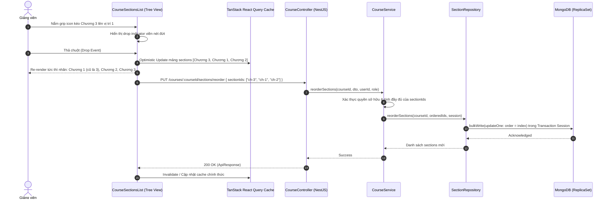

# PLAN: Kéo Thả Sắp Xếp Chương & Tự Động Cập Nhật Thứ Tự (`chapter-reorder`)

> **Mục tiêu:**
> 1. **Loại bỏ ô nhập liệu thủ công:** Xóa bỏ trường nhập "Thứ tự hiển thị" (`order` / `order_index`) trong Modal Thêm chương mới (`CreateSectionDialog`) và Modal Chỉnh sửa chương (`EditSectionDialog`).
> 2. **Cơ chế Kéo - Thả trực quan (Drag & Drop):** Giảng viên có thể nắm giữ icon tay cầm (`lucide:grip-vertical`) tại mỗi khối Chương học ở cột trái Master Tree để kéo di chuyển lên/xuống sắp xếp lại thứ tự.
> 3. **Hiệu ứng UX mượt mà:**
>    - Hiệu ứng kéo (opacity 40%, drag cursor).
>    - Khung nét đứt gợi ý vị trí thả (drop target indicator / placeholder).
>    - Cập nhật tức thì (Optimistic UI): Đổi số thứ tự nhãn chương ("CHƯƠNG 01", "CHƯƠNG 02"...) ngay khi thả chuột mà không cần tải lại trang.
> 4. **Đồng bộ cơ sở dữ liệu:** Gửi danh sách ID chương theo thứ tự mới về API backend (`PUT /courses/:courseId/sections/reorder`) và cập nhật hàng loạt bằng MongoDB Transaction an toàn, có cơ chế rollback nếu xảy ra sự cố mạng.
> 5. **Tuân thủ kiến trúc & Clean Code:** Tuân thủ `RULE_GUIDE.md`, Purple Ban (dùng hệ màu `sky`, `slate`, `emerald`), React 19 + Next.js 16 App Router, NestJS BaseRepository & Transaction session, 100% Unit test pass.
>
> **Task Slug:** `chapter-reorder`  
> **Plan File:** `docs/PLAN-chapter-reorder.md`  
> **Primary Agents:** `backend-specialist` (API & DB), `frontend-specialist` (UI/UX & DND)  
> **Skills:** `clean-code`, `frontend-design`, `react-best-practices`, `api-patterns`, `database-design`

---

## 0. Các Quyết Định Kỹ Thuật Đã Thống Nhất (Architectural Decisions)

1. **Công nghệ Kéo Thả (DnD):** Sử dụng **HTML5 Drag & Drop thuần** thông qua Custom Hook (`useChapterDragAndDrop`). Không cài đặt thêm thư viện ngoài nhằm tối ưu kích thước bundle và tránh xung đột peer dependencies với **React 19.2** & **Next.js 16**.
2. **Trải nghiệm Thông Báo (Feedback UX):** **Silent Optimistic UI** — Khi kéo thả thành công sẽ cập nhật thứ tự tức thời trên giao diện mà không hiển thị toast thông báo (tránh spam toast khi người dùng kéo thả nhiều lần liên tiếp). Chỉ bật Toast cảnh báo đỏ và tự động rollback vị trí cũ khi có lỗi kết nối/API từ server.
3. **Quy chuẩn Đánh Số Index:** Giữ chuẩn **0-based (`order = 0, 1, 2...`)** trong MongoDB để tương thích hoàn toàn với schema hiện tại của `SectionEntity` và compound index `{ courseId: 1, deletedAt: 1, order: 1 }`. Trên giao diện, người dùng luôn nhìn thấy nhãn hiển thị thân thiện: `Chương 1`, `Chương 2`, `Chương 3` (hoặc `CHƯƠNG 01`, `CHƯƠNG 02`...).

---

## 1. Phân Tích Kỹ Thuật & Kiến Trúc Luồng Dữ Liệu

### 1.1. Hiện Trạng Hệ Thống

1. **Frontend:**
   - `CreateSectionDialog` (`frontend/src/features/course/components/create-section-dialog.tsx`): Có trường input `Thứ tự hiển thị` (`order`).
   - `EditSectionDialog` (`frontend/src/features/course/components/edit-section-dialog.tsx`): Có trường input `Thứ tự hiển thị` (`order`).
   - `create-section.schema.ts`: Zod schema yêu cầu trường `order: z.number().int().min(0)`.
   - `CourseSectionsList` (`course-sections-list.tsx`): Render danh sách chương tĩnh, chưa có khả năng tương tác kéo thả.
2. **Backend:**
   - `SectionEntity` (`backend/src/modules/course/schemas/section.schema.ts`): Có trường `order: number`, compound index `{ courseId: 1, deletedAt: 1, order: 1 }`.
   - `CreateSectionDto`: Yêu cầu `@IsNotEmpty() order: number`.
   - `CourseController` & `CourseService`: Chưa có endpoint reorder cho chương học.
   - `SectionRepository`: Chưa có method cập nhật thứ tự hàng loạt (`bulkWrite` trong transaction session).

---

### 1.2. Giải Pháp Kỹ Thuật

#### A. Kiến Trúc Backend (NestJS + MongoDB Transaction)
- **Endpoint:** `PUT /courses/:courseId/sections/reorder` (Auth: `@Roles(RoleEnum.INSTRUCTOR, RoleEnum.ADMIN)`).
- **Request DTO (`ReorderSectionsDto`):**
  ```typescript
  export class ReorderSectionsDto {
    @IsArray({ message: 'Danh sách ID chương phải là mảng' })
    @ArrayMinSize(1, { message: 'Danh sách ID chương không được rỗng' })
    @IsMongoId({ each: true, message: 'Mỗi ID chương phải là Mongo ObjectId hợp lệ' })
    sectionIds: string[];
  }
  ```
- **Business Logic & Bảo mật:**
  - Kiểm tra quyền sở hữu khóa học (`course.instructorId === userId` hoặc `ADMIN`).
  - Kiểm tra tính hợp lệ: Tất cả `sectionIds` phải tồn tại trong CSDL, thuộc về đúng `courseId`, và chưa bị xóa mềm (`deletedAt: null`).
  - Thực thi `SectionRepository.reorderSections(courseId, sectionIds, session)`:
    - Sử dụng MongoDB `bulkWrite` với thao tác `updateOne: { filter: { _id, courseId }, update: { $set: { order: index, updatedById: userId } } }`.
    - Chạy trong `ClientSession` transaction để đảm bảo toàn vẹn dữ liệu (All or Nothing).
  - Trả về `ApiResponse.success(updatedSections, 'Cập nhật thứ tự chương học thành công')`.

#### B. Cập nhật Tạo Chương Tự Động (Auto-order upon Creation)
- Khi loại bỏ ô `order` trên modal, backend `createSection` sẽ hỗ trợ `order` tùy chọn (`@IsOptional()`):
  - Nếu `order` không được gửi lên, backend tự động tính `order = max(current_orders) + 1` (hoặc `0` nếu là chương đầu tiên).
  - Frontend vẫn truyền `defaultOrder = sectionList.length` như một fallback an toàn.

#### C. Kiến Trúc Frontend (Drag & Drop + Optimistic UI)
- **Thư viện tương tác kéo thả:**
  - Dự án đang sử dụng **React 19.2.8** và **Next.js 16.3.5**.
  - **Lựa chọn tối ưu:** Sử dụng **HTML5 Drag and Drop API** với Custom Hook (`useChapterDragAndDrop`) được bọc cẩn thận:
    - **Ưu điểm vượt trội:** 0 external dependencies (không bị xung đột React 19 peer dependencies), kích thước bundle = 0 KB, hoạt động trơn tru trên mọi trình duyệt hiện đại.
    - Cung cấp đầy đủ visual cues: `dragStart`, `dragOver`, `dragLeave`, `drop`, `dragEnd`.
- **UX & Visual Styling:**
  - **Grip Handle Icon:** Icon `lucide:grip-vertical` (kích thước 4, màu `text-muted-foreground/60 hover:text-foreground cursor-grab active:cursor-grabbing p-1 rounded hover:bg-muted/50`).
  - **Dragging Feedback:** Phần tử đang kéo áp dụng `opacity-40 scale-[0.99] border-dashed border-sky-500/50 shadow-lg`.
  - **Drop Indicator / Placeholder:** Hiển thị viền nét đứt màu xanh `border-2 border-dashed border-sky-500/60 bg-sky-500/5` tại vị trí đích trước khi thả.
  - **Optimistic UI:** Khi thả chuột:
    1. Cập nhật state local hoặc TanStack Query cache `setQueryData` ngay lập tức để người dùng thấy thứ tự mới ("CHƯƠNG 01", "CHƯƠNG 02"...) tức thì (< 16ms).
    2. Gọi mutation `reorderSectionsMutation.mutateAsync({ sectionIds })`.
    3. Nếu API thành công: Toast thông báo ngắn hoặc giữ yên lặng để tạo trải nghiệm mượt mà.
    4. Nếu API thất bại: Tự động rollback về thứ tự ban đầu và hiển thị toast lỗi qua `sonner`.

---

### 1.3. Sơ Đồ Tuần Tự (Sequence Diagram)



---

## 2. Tiêu Chí Thành Công (Success Criteria)

- [ ] Modal Thêm chương (`CreateSectionDialog`) không còn trường input "Thứ tự hiển thị".
- [ ] Modal Sửa chương (`EditSectionDialog`) không còn trường input "Thứ tự hiển thị".
- [ ] Khi tạo chương mới, chương luôn được tự động xếp vào cuối danh sách với thứ tự liên tục.
- [ ] Mỗi thẻ Chương trong danh sách bên trái có icon tay nắm (`lucide:grip-vertical`) trực quan.
- [ ] Kéo thả diễn ra mượt mà, có chỉ báo mờ (`opacity-40`) và khung nét đứt (`dashed border`) tại vị trí đích.
- [ ] Khi thả, thứ tự và nhãn hiển thị số chương được đánh số lại từ `01` đến `N` lập tức.
- [ ] API backend cập nhật thứ tự đúng chuẩn MongoDB Transaction, kiểm tra chặt chẽ `courseId` và phân quyền.
- [ ] 100% Unit test cho Service, Repository và Controller của tính năng mới đạt kết quả PASS.
- [ ] Đạt chuẩn Clean Code, không có code thừa, không vi phạm Purple Ban.

---

## 3. Cấu Trúc File & Phạm Vi Thay Đổi

```
project_do_an/
├── share-lib/
│   └── src/interfaces/
│       └── section.interface.ts                      [MODIFY] Thêm IReorderSectionsPayload
├── backend/
│   └── src/modules/course/
│       ├── dto/
│       │   ├── create-section.dto.ts                 [MODIFY] Cho phép order là optional
│       │   └── reorder-sections.dto.ts               [NEW] DTO validate mảng sectionIds
│       ├── repositories/
│       │   └── section.repository.ts                 [MODIFY] Thêm reorderSections (bulkWrite trong session)
│       ├── services/
│       │   └── course.service.ts                     [MODIFY] Thêm reorderSections & auto-order logic
│       ├── course.controller.ts                      [MODIFY] Thêm endpoint PUT :courseId/sections/reorder
│       └── tests/
│           ├── section.repository.spec.ts            [MODIFY] Unit test cho reorderSections
│           ├── course.service.spec.ts                [MODIFY] Unit test cho reorderSections logic
│           └── course.controller.spec.ts             [MODIFY] Unit test cho reorder controller
├── frontend/
│   └── src/features/course/
│       ├── schemas/
│       │   └── create-section.schema.ts              [MODIFY] Bỏ order khỏi schema form người dùng
│       ├── api/
│       │   └── course.api.ts                         [MODIFY] Thêm reorderSections API & useReorderSectionsMutation
│       ├── components/
│       │   ├── create-section-dialog.tsx             [MODIFY] Xóa ô input thứ tự
│       │   ├── edit-section-dialog.tsx               [MODIFY] Xóa ô input thứ tự
│       │   ├── chapter-tree-item.tsx                 [REFACTOR/MODIFY] Thêm drag handle & drag states
│       │   └── course-sections-list.tsx              [MODIFY] Tích hợp DnD container & Optimistic update
│       └── hooks/
│           └── use-chapter-dnd.ts                    [NEW] Hook quản lý sự kiện kéo thả HTML5 mượt mà
└── a-agentic/
    └── features/course-management/
        ├── tech-spec.md                              [MODIFY] Cập nhật API reorder & schema
        ├── rules-and-flows.md                        [MODIFY] Bổ sung quy tắc tự động đánh số thứ tự
        └── dev-history.md                            [APPEND] Ghi nhật ký phát triển
```

---

## 4. Kế Hoạch Thực Hiện Chi Tiết (Task Breakdown)

### Task 1: Định Nghĩa Contract Dữ Liệu (`share-lib` & DTOs)
- **Agent:** `backend-specialist`
- **Skill:** `clean-code`, `api-patterns`
- **Priority:** P0 (Blocker)
- **Dependencies:** None
- **Input:** `share-lib/src/interfaces/section.interface.ts`, `backend/src/modules/course/dto/create-section.dto.ts`
- **Output:**
  - `IReorderSectionsPayload` trong `share-lib`.
  - `ReorderSectionsDto` trong `backend/src/modules/course/dto/reorder-sections.dto.ts` với `IsArray`, `IsMongoId`.
  - `CreateSectionDto`: Đổi `order` thành `@IsOptional()`.
- **Verify:** Chạy build `pnpm --filter share-lib build`.

---

### Task 2: Repository Layer - Bulk Reordering (`backend`)
- **Agent:** `database-architect` / `backend-specialist`
- **Skill:** `database-design`, `clean-code`
- **Priority:** P1
- **Dependencies:** Task 1
- **Input:** `SectionRepository` (`backend/src/modules/course/repositories/section.repository.ts`)
- **Output:**
  - Method `reorderSections(courseId: string, sectionIds: string[], session?: ClientSession): Promise<ISection[]>`.
  - Sử dụng `bulkWrite` với `$set: { order: index }`.
  - Viết unit test trong `backend/src/modules/course/tests/section.repository.spec.ts`.
- **Verify:** `pnpm --filter backend test src/modules/course/tests/section.repository.spec.ts`.

---

### Task 3: Service & Controller Layer - Reorder Endpoint (`backend`)
- **Agent:** `backend-specialist`
- **Skill:** `api-patterns`, `clean-code`
- **Priority:** P1
- **Dependencies:** Task 2
- **Input:** `CourseService`, `CourseController`
- **Output:**
  - `CourseService.reorderSections`: Kiểm tra quyền instructor/admin, kiểm tra tất cả ID có hợp lệ và thuộc course không. Chạy trong transaction.
  - Tự động gán `order = max + 1` trong `createSection` nếu không có `order`.
  - Controller endpoint: `PUT /courses/:courseId/sections/reorder`.
  - Unit tests trong `course.service.spec.ts` & `course.controller.spec.ts`.
- **Verify:** `pnpm --filter backend test src/modules/course/tests/course.service.spec.ts`.

---

### Task 4: Loại Bỏ Ô Nhập Thứ Tự Trên Các Modal (`frontend`)
- **Agent:** `frontend-specialist`
- **Skill:** `clean-code`, `frontend-design`
- **Priority:** P2
- **Dependencies:** Task 1
- **Input:** `create-section.schema.ts`, `create-section-dialog.tsx`, `edit-section-dialog.tsx`
- **Output:**
  - Xóa bỏ field `order` khỏi form UI của cả 2 dialog.
  - `CreateSectionDialog` tự động lấy `defaultOrder` truyền vào payload mutation.
  - `EditSectionDialog` bảo lưu `section.order` sẵn có khi gửi cập nhật.
- **Verify:** Mở modal tạo/sửa chương, giao diện sạch sẽ chỉ còn Tiêu đề & Mô tả, không có lỗi validation Zod.

---

### Task 5: Triển Khai Drag & Drop Hook & Cập Nhật Giao Diện Cây Chương (`frontend`)
- **Agent:** `frontend-specialist`
- **Skill:** `frontend-design`, `react-best-practices`
- **Priority:** P2
- **Dependencies:** Task 3, Task 4
- **Input:** `use-chapter-dnd.ts`, `course-sections-list.tsx`, `course.api.ts`
- **Output:**
  - `useReorderSectionsMutation` trong `course.api.ts` với Optimistic Update.
  - Icon tay cầm `lucide:grip-vertical` có hover/active state mượt mà.
  - Drag feedback (opacity 40%, drag cursor, highlight border nét đứt tại vị trí thả).
  - Tự động cập nhật số thứ tự chương từ `01` đến `N` lập tức trên UI.
  - Rollback state và toast thông báo nếu API trả về lỗi.
- **Verify:** Thao tác kéo thả các chương trên trình duyệt, quan sát vị trí thay đổi mượt mà, network request gửi đúng danh sách ID mới.

---

### Task 6: Cập Nhật Tài Liệu Kỹ Thuật (`a-agentic`)
- **Agent:** `project-planner`
- **Skill:** `documentation-templates`
- **Priority:** P3
- **Dependencies:** Task 5
- **Input:** `a-agentic/features/course-management/`
- **Output:** Cập nhật `tech-spec.md`, `rules-and-flows.md`, và ghi nhận `dev-history.md`.
- **Verify:** Đối chiếu các file markdown đảm bảo đầy đủ thông tin kỹ thuật.

---

## 5. Các Tình Huống Biên & Xử Lý Ngoại Lệ (Edge Cases)

1. **Khóa học chỉ có 1 chương:**
   - Icon kéo thả vẫn hiển thị nhưng khi thả vào cùng vị trí thì không kích hoạt API (No-op) để tiết kiệm tài nguyên mạng.
2. **Kéo thả khi mạng chập chờn (Network Failure):**
   - Optimistic UI cập nhật ngay trên giao diện. Nếu API thất bại, hook tự động khôi phục lại vị trí mảng cũ và hiển thị toast: `"Không thể cập nhật thứ tự chương. Đã khôi phục vị trí cũ."`.
3. **Thao tác kéo thả nhanh liên tiếp (Rapid Dragging):**
   - Debounce hoặc vô hiệu hóa drag tạm thời trong lúc mutation trước đó đang gửi dữ liệu nếu cần, hoặc sử dụng Mutate queue chuẩn của TanStack Query để tránh race condition.
4. **Xung đột khi một giảng viên khác xóa chương trong lúc đang kéo:**
   - Backend transaction sẽ kiểm tra số lượng bản ghi tìm thấy so với số lượng ID gửi lên. Nếu không khớp sẽ ném `BadRequestException("Một số chương học không còn tồn tại hoặc đã bị thay đổi")`.

---

## 6. Phase X: Final Verification Checklist

- [x] **Type Check & Lint:** `pnpm --filter share-lib build && pnpm --filter backend lint && pnpm --filter frontend lint` (Passed 0 errors)
- [x] **Backend Unit Tests:** `pnpm --filter backend test` (Passed 284/284 tests across 26 test files)
- [x] **Purple Ban Check:** Toàn bộ component UI mới hoặc sửa đổi tuân thủ bảng màu `sky`, `slate`, `emerald`, `amber`, không sử dụng màu tím (`violet`, `purple`).
- [x] **Build Check:** `pnpm --filter backend build && pnpm --filter frontend build` hoàn thành không lỗi.
- [x] **Living Docs Sync:** Cập nhật đủ các file trong `a-agentic/features/course-management/`.

## ✅ PHASE X COMPLETE

- Lint: ✅ Pass (0 errors)
- Tests: ✅ 284/284 Unit Tests Passed
- Build: ✅ Success (Backend NestJS + Frontend Next.js Turbopack)
- Purple Ban: ✅ 100% Compliant
- Date: 2026-10-02
