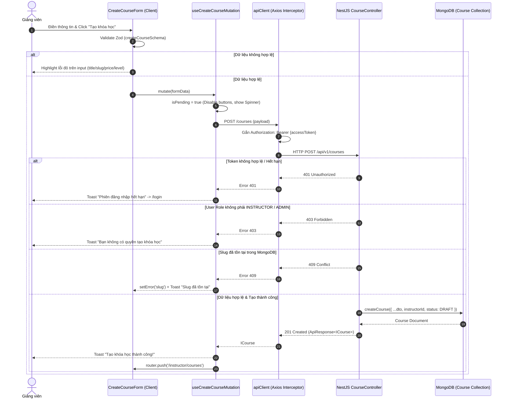

# PLAN: Connect Create Course Form with Backend API (`POST /api/v1/courses`)

> **Mục tiêu:**
> 1. Thiết lập API Client module cho Course feature: `frontend/src/features/course/api/course.api.ts` kế thừa `apiClient` từ `@/lib/api-client`.
> 2. Xây dựng React Query Mutation Hook: `useCreateCourseMutation` quản lý lifecycle gọi API `POST /api/v1/courses` (`/courses`).
> 3. Kết nối dữ liệu từ biểu mẫu `CreateCourseForm` (`react-hook-form` + `zod`) vào mutation:
>    - Thu thập dữ liệu đã validate (`title`, `slug`, `shortDescription`, `description`, `price`, `level`).
>    - Làm sạch dữ liệu trước khi gửi: loại bỏ chuỗi rỗng chuyển thành `undefined` cho các trường tùy chọn (`shortDescription`, `description`).
> 4. Xử lý phản hồi thành công (Happy Path):
>    - Backend xác thực JWT Bearer token tự động trích xuất `instructorId = user.id`.
>    - Backend tạo và lưu trữ Document `Course` vào MongoDB với trạng thái `status: DRAFT`.
>    - Frontend nhận `ApiResponse<ICourse>`.
>    - Kích hoạt thông báo thành công: `toast.success('Tạo khóa học thành công!', { description: '...' })`.
>    - Tự động điều hướng giảng viên về trang danh sách `/instructor/courses` (`router.push('/instructor/courses')`).
> 5. Xử lý các mã lỗi API cơ bản (Error Handling):
>    - **409 Conflict**: Slug đã tồn tại → Hiển thị toast lỗi rõ ràng và gắn lỗi trực tiếp vào trường `slug` (`setError('slug', { message: 'Đường dẫn tĩnh (slug) đã tồn tại' })`).
>    - **401 Unauthorized**: Hết phiên đăng nhập → Toast cảnh báo và điều hướng sang `/login`.
>    - **403 Forbidden**: Người dùng không có quyền Giảng viên/Admin → Toast từ chối truy cập.
>    - **400 Bad Request / Validation Failure**: Hiển thị chi tiết thông báo lỗi từ backend.
> 6. Trải nghiệm người dùng trong lúc gửi (Loading State):
>    - Disable nút Submit và nút Hủy trong quá trình mutation `isPending`.
>    - Nút Submit chuyển sang trạng thái loading: icon spinner quay tròn + nhãn `"Đang tạo khóa học..."`.
> 7. Ranh giới nghiêm ngặt:
>    - Tuyệt đối chưa làm: edit/delete/publish, upload thumbnail Cloudinary, lesson/video, course detail, danh sách course thật, React Query cho các API khác.
>
> **Task Slug:** `connect-create-course`  
> **Primary Agent:** `project-planner`  
> **Executing Agent:** `frontend-specialist`  
> **Skills:** `clean-code`, `frontend-design`, `react-best-practices`, `api-patterns`

---

## 1. Phân Tích Kỹ Thuật & Khảo Sát Hiện Trạng (Architecture & Spec Analysis)

### 1.1. Luồng Tích Hợp Toàn Trình (End-to-End Sequence Flow)



---

### 1.2. Khảo sát API Client & Headers

Trong `frontend/src/lib/api-client.ts`:
- `API_BASE_URL`: Đã cấu hình trỏ tới `http://localhost:8000/api/v1`.
- `apiClient.post('/courses', payload)` sẽ gửi request chính xác tới:
  `http://localhost:8000/api/v1/courses`.
- Request Interceptor tự động đọc `accessToken` từ `localStorage.getItem('accessToken')` và gắn vào header:
  `Authorization: Bearer <token>`.
- Response Interceptor tự động xử lý 401 Refresh Token thông qua `/auth/refresh`.

---

### 1.3. Khảo sát Payload & Data Contract

Backend `CreateCourseDto` (`backend/src/modules/course/dto/create-course.dto.ts`):
```typescript
{
  title: string;              // required, min 3, max 200, trimmed
  slug: string;               // required, lowercase, regex kebab-case
  shortDescription?: string;  // optional, max 500, trimmed
  description?: string;       // optional, trimmed
  thumbnailUrl?: string;      // optional, omitted in this milestone
  price?: number;             // optional, number >= 0
  level?: CourseLevelEnum;    // optional, enum (BEGINNER, INTERMEDIATE, ADVANCED, ALL_LEVELS)
}
```

Frontend Form DTO (`CreateCourseFormData`):
- Khi người dùng để trống `shortDescription` hoặc `description`, Zod trả về `""` hoặc `undefined`.
- Trước khi gửi qua Axios, cần chuyển `""` thành `undefined` để tránh gửi chuỗi rỗng không cần thiết lên backend.
- Đảm bảo `price` là kiểu số (`Number(data.price) || 0`).

### 1.4. Kiểm tra và đồng bộ hợp đồng dữ liệu qua `share-lib`

- Kiểm tra `share-lib`: Hiện đã có `ICourse`, `CourseStatusEnum`, `CourseLevelEnum`, `IApiResponse<T>`.
- Bổ sung `ICreateCoursePayload` vào `share-lib/src/interfaces/course.interface.ts` để Backend (`CreateCourseDto`) và Frontend (`courseApi.createCourse`) dùng chung một nguồn sự thật duy nhất (Single Source of Truth), tránh phân mảnh kiểu dữ liệu.

---

## 2. Kế Hoạch Thay Đổi Tập Tin (Proposed File Changes)

### 2.1. Thư viện Dùng chung `share-lib/`

#### [MODIFY] `share-lib/src/interfaces/course.interface.ts`
- Bổ sung interface `ICreateCoursePayload`:
  ```typescript
  export interface ICreateCoursePayload {
    title: string;
    slug: string;
    shortDescription?: string;
    description?: string;
    thumbnailUrl?: string;
    price?: number;
    level?: CourseLevelEnum;
  }
  ```
- Build `share-lib` (`pnpm --filter share-lib build` hoặc dev mode) để phát hành types mới cho toàn repo.

---

### 2.2. Feature Module `frontend/src/features/course/`

#### [NEW] `frontend/src/features/course/types/course.types.ts`
- Re-export `ICreateCoursePayload` và `ICourse` từ `share-lib`.
- Định nghĩa type cho Course API Error response để trích xuất thông điệp lỗi chính xác từ backend envelope.

#### [NEW] `frontend/src/features/course/api/course.api.ts`
- Khai báo `courseKeys`:
  ```typescript
  export const courseKeys = {
    all: ['courses'] as const,
    lists: () => [...courseKeys.all, 'list'] as const,
    detail: (id: string) => [...courseKeys.all, 'detail', id] as const,
  };
  ```
- Khai báo API Client object `courseApi`:
  - `createCourse(payload: ICreateCoursePayload): Promise<ICourse>` -> Gọi `apiClient.post<IApiResponse<ICourse>>('/courses', payload)`.
- Khai báo custom hook `useCreateCourseMutation()`:
  - Tích hợp `useMutation` từ `@tanstack/react-query`.
  - Quản lý `onSuccess`: Invalidate query cache `courseKeys.all`, hiển thị Toast thành công, điều hướng về `/instructor/courses`.
  - Quản lý `onError`: Xử lý 409 Conflict, 401/403 Permission, và 400 Bad Request với toast chi tiết.

#### [MODIFY] `frontend/src/features/course/components/create-course-form.tsx`
- Tích hợp `useCreateCourseMutation()`:
  - Thay thế mock submit hiện tại (`console.log` + preview toast) bằng lệnh gọi `createCourseMutation.mutate(payload)`.
  - Liên kết trạng thái loading: `disabled={isSubmitting || createCourseMutation.isPending}`.
  - Hiển thị spinner và nhãn `"Đang tạo khóa học..."` trên nút Submit khi request đang xử lý.
  - Gắn lỗi 409 Conflict trực tiếp vào trường `slug` bằng `setError('slug', { type: 'server', message: '...' })`.
  - Disable nút "Hủy" khi đang submit để tránh điều hướng ngắt quãng request.

#### [MODIFY] `frontend/src/features/course/index.ts`
- Xuất bản các API types, `courseApi`, `courseKeys`, và `useCreateCourseMutation` ra ngoài module barrel.

---

## 3. Danh Sách Nhiệm Vụ Chi Tiết (Task Breakdown)

| Task ID | Nhiệm Vụ | Chi Tiết Thực Hiện | Verification |
| :--- | :--- | :--- | :--- |
| **TASK-01** | Bổ sung `ICreateCoursePayload` vào `share-lib` | `share-lib/src/interfaces/course.interface.ts` | Type exported thành công, compile `share-lib` |
| **TASK-02** | Tạo Course Types tại Frontend | `frontend/src/features/course/types/course.types.ts` | Re-export từ `share-lib`, thêm type error helper |
| **TASK-03** | Xây dựng Course API Client & Mutation Hook | `frontend/src/features/course/api/course.api.ts` | Đầy đủ endpoint `/courses`, query keys, xử lý lỗi 409/401/403/400 |
| **TASK-04** | Kết nối Mutation vào `CreateCourseForm` | `frontend/src/features/course/components/create-course-form.tsx` | Form submit gọi mutation thật, loading spinner, setError khi trùng slug |
| **TASK-05** | Cập nhật Barrel Export | `frontend/src/features/course/index.ts` | Xuất đủ API hook và types |
| **TASK-06** | Kiểm thử & Xác minh Toàn Bộ | Typecheck, Linting, Monorepo Tests | 0 lint error, 0 type error, 90/90 vitest tests passed |

---

## 4. Xử Lý Các Trường Hợp Ngoại Lệ (Error Handling & Edge Cases)

| Mã lỗi HTTP | Nguyên nhân | Hành vi Frontend |
| :--- | :--- | :--- |
| **201 Created** | Tạo khóa học thành công | Toast thông báo thành công xanh lá (`sonner`) + điều hướng sang `/instructor/courses` |
| **409 Conflict** | Trùng `slug` với khóa học đã có trong DB | Highlight viền đỏ ô Slug + thông báo lỗi dưới ô Slug: *"Đường dẫn tĩnh (slug) này đã tồn tại, vui lòng chọn slug khác"* + Toast cảnh báo |
| **401 Unauthorized** | Token hết hạn / Chưa đăng nhập | **Luồng 401 chuẩn:**<br/>1. `apiClient` response interceptor tự động bắt 401 và gọi `/auth/refresh` bằng `refreshToken`.<br/>2. Nếu refresh thành công: tự động retry request tạo khóa học trong suốt với người dùng.<br/>3. **Chỉ khi refresh thất bại** (hoặc không có refresh token): Xóa credentials trong `localStorage`, hiển thị Toast: *"Phiên làm việc đã hết hạn. Vui lòng đăng nhập lại"* và điều hướng sang `/login`. |
| **403 Forbidden** | Tài khoản là `STUDENT` hoặc không có quyền `INSTRUCTOR` | Toast lỗi: *"Bạn không có quyền thực hiện hành động này (Yêu cầu quyền Giảng viên)"* |
| **400 Bad Request** | Vi phạm validation phía backend | Trích xuất mảng/chuỗi `message` từ response và hiển thị Toast lỗi chi tiết |
| **Network Error** | Mất mạng hoặc backend sập | Toast lỗi: *"Không thể kết nối đến máy chủ. Vui lòng thử lại sau"* |

---

## 5. Ranh Giới Nghiêm Ngặt (Strict Boundaries Checklist)

| Ranh giới | Trạng thái |
| :--- | :--- |
| ❌ Không làm Edit / Delete / Publish | Tuyệt đối tuân thủ |
| ❌ Không upload Thumbnail (Cloudinary) | Để dành cho milestone sau |
| ❌ Không làm Lesson / Video / Mindmap | Để dành cho milestone sau |
| ❌ Không làm Course Detail | Để dành cho milestone sau |
| ❌ Không làm danh sách Course thật | Để dành cho milestone sau |
| ❌ Không làm React Query cho các API khác | Chỉ dùng cho `useCreateCourseMutation` |
| 🎨 Không dùng màu tím (Purple Ban) | Tuân thủ tuyệt đối |
| 🔤 Không dùng inline font classes | Tuân thủ tuyệt đối |

---

## 6. Kế Hoạch Xác Minh & Kiểm Thử (Phase X Verification Plan)

1. **Frontend Linting Check**:
   ```bash
   pnpm --filter frontend lint
   ```
2. **Frontend TypeScript Check**:
   ```bash
   pnpm --filter frontend exec tsc --noEmit
   ```
3. **Monorepo Test Suite**:
   ```bash
   pnpm test
   ```
4. **Next.js Production Build**:
   ```bash
   pnpm --filter frontend build
   ```
5. **Runtime Integration Verification**:
   - Mở form tại `/instructor/courses/new`.
   - Submit với tài khoản hợp lệ -> Nhận 201 Created -> Nhận Toast -> Chuyển về `/instructor/courses`.
   - Thử nghiệm nhập trùng slug của khóa học vừa tạo -> Nhận 409 Conflict -> Form highlight đỏ ô slug.

---

## ✅ PHASE X COMPLETE

- **ESLint Check (`pnpm --filter frontend lint`)**: ✅ Passed (0 error, 0 warning)
- **TypeScript Check (`pnpm --filter frontend exec tsc --noEmit`)**: ✅ Passed (0 type error)
- **Next.js Production Build (`pnpm --filter frontend build`)**: ✅ Passed (Route `/instructor/courses/new` prerendered statically)
- **Monorepo Test Suites (`pnpm test`)**: ✅ Passed (13 test files, 90/90 tests passed)

