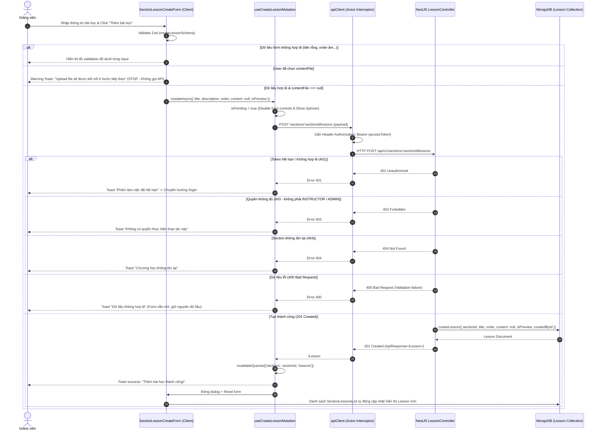

# PLAN: Connect Lesson Create UI với Create Lesson API (`POST /api/v1/sections/:sectionId/lessons`)

> **Mục tiêu:**
> 1. Đồng bộ Interface payload `ICreateLessonPayload` trong `share-lib` làm nguồn sự thật duy nhất (Single Source of Truth).
> 2. Mở rộng `courseApi` trong `frontend/src/features/course/api/course.api.ts` với hàm `createLesson(sectionId, payload)`.
> 3. Xây dựng React Query Mutation Hook `useCreateLessonMutation(sectionId)` quản lý lifecycle, invalidate cache `courseKeys.lessons(sectionId)` và hiển thị toast qua `sonner`.
> 4. Tích hợp `useCreateLessonMutation` vào `SectionLessonCreateForm`:
>    - Xử lý payload khi không chọn file: gửi `content: null`, `isPreview: boolean`.
>    - Xử lý Guard khi người dùng chọn `contentFile`: chặn submit, hiển thị thông báo rõ ràng "Upload file sẽ được kết nối ở bước tiếp theo", không gọi API tạo bài học.
>    - Loading state: disable form inputs & buttons, hiển thị spinner và nhãn "Đang thêm bài học...".
>    - Success flow: Invalidate `useSectionLessonsQuery(sectionId)`, đóng modal, reset form, hiển thị toast thành công.
>    - Error flow: Giữ nguyên modal, không reset form, hiển thị toast lỗi (400, 401, 403, 404, 500) để người dùng sửa và submit lại.
> 5. Cập nhật `course-sections-list.tsx` để kết nối hoàn chỉnh với `SectionLessonCreateForm`.
> 6. Ranh giới nghiêm ngặt: Tuyệt đối CHƯA triển khai upload file (Cloudinary/multipart), RabbitMQ/AI pipeline, Edit/Delete Lesson.
>
> **Task Slug:** `connect-create-lesson`  
> **Primary Agent:** `project-planner`  
> **Executing Agent:** `frontend-specialist`  
> **Skills:** `clean-code`, `frontend-design`, `react-best-practices`, `api-patterns`

---

## 1. Phân Tích Kỹ Thuật & Khảo Sát Hiện Trạng (Architecture & Spec Analysis)

### 1.1. Luồng Tích Hợp Toàn Trình (End-to-End Sequence Flow)



---

### 1.2. Khảo sát API Client & Endpoint Mapping

- `frontend/src/lib/api-client.ts`: Đã cấu hình `baseURL: http://localhost:8000/api/v1`.
- Backend Route:
  - Controller: `@Controller('sections')` trong [`backend/src/modules/course/lesson.controller.ts`](file:///d:/Download/hk1_2027/project_do_an/backend/src/modules/course/lesson.controller.ts).
  - Method: `@Post(':sectionId/lessons')`.
  - Roles: `@Roles(RoleEnum.INSTRUCTOR, RoleEnum.ADMIN)`.
- Đường dẫn gọi từ frontend:
  ```ts
  apiClient.post<IApiResponse<ILesson>>(`/sections/${sectionId}/lessons`, payload)
  ```
  -> Ánh xạ chính xác tới: `http://localhost:8000/api/v1/sections/:sectionId/lessons`.
- `sectionId` nằm hoàn toàn trên URL parameter, tuyệt đối **không** nằm trong request body.

---

### 1.3. Khảo sát Hợp Đồng Dữ Liệu (Data Contracts)

#### Backend `CreateLessonDto`:
```ts
{
  title: string;           // required, 1-200 chars, trimmed
  description?: string;    // optional, max 1000 chars, trimmed (chuyển chuỗi rỗng thành undefined)
  order: number;           // required, integer >= 0
  content?: LessonContentDto | null; // optional, null khi chưa có file
  isPreview?: boolean;     // optional, boolean (mặc định false)
}
```

#### Frontend Payload gửi lên API trong Milestone này:
```ts
{
  title: string;
  description?: string;
  order: number;
  content: null;           // Bắt buộc null khi không có file, không gửi object rỗng {}
  isPreview: boolean;
}
```

#### `share-lib` contract (`share-lib/src/interfaces/lesson.interface.ts`):
Cần bổ sung interface `ICreateLessonPayload`:
```ts
export interface ICreateLessonPayload {
  title: string;
  description?: string;
  order: number;
  content?: ILessonContent | null;
  isPreview?: boolean;
}
```

---

## 2. Thiết Kế Chi Tiết & Giải Pháp Kỹ Thuật (Solutioning)

### 2.1. Nâng cấp API Client & React Query Mutation

Trong [`frontend/src/features/course/api/course.api.ts`](file:///d:/Download/hk1_2027/project_do_an/frontend/src/features/course/api/course.api.ts):

1. **Thêm phương thức vào `courseApi`:**
   ```ts
   async createLesson(sectionId: string, payload: ICreateLessonPayload): Promise<ILesson> {
     const res = await apiClient.post<IApiResponse<ILesson>>(
       `/sections/${sectionId}/lessons`,
       payload,
     );
     return res.data.data;
   }
   ```

2. **Tạo custom hook `useCreateLessonMutation(sectionId: string)`:**
   - Quản lý trạng thái gọi API thông qua `useMutation`.
   - `mutationFn`: Gọi `courseApi.createLesson(sectionId, payload)`.
   - `onSuccess`:
     - Tự động gọi `queryClient.invalidateQueries({ queryKey: courseKeys.lessons(sectionId) })`.
     - Kích hoạt `toast.success('Thêm bài học thành công!', { description: `Bài học "${data.title}" đã được thêm vào chương.` })`.
   - `onError`:
     - Xử lý mã lỗi HTTP 400, 401, 403, 404, 500 đồng bộ với pattern của `useCreateSectionMutation` và `useCreateCourseMutation`.
     - Hiển thị toast lỗi chi tiết qua `sonner`.

---

### 2.2. Guard & UX trong `SectionLessonCreateForm`

Trong [`frontend/src/features/course/components/section-lesson-create-form.tsx`](file:///d:/Download/hk1_2027/project_do_an/frontend/src/features/course/components/section-lesson-create-form.tsx):

1. **Khởi tạo Mutation:**
   ```ts
   const createLessonMutation = useCreateLessonMutation(sectionId);
   const isPending = isSubmitting || createLessonMutation.isPending;
   ```

2. **Kiểm tra File Guard trước khi gọi API:**
   ```ts
   const onFormSubmit = async (data: CreateLessonFormData) => {
     if (selectedFile) {
       toast.warning('Chức năng upload file đang phát triển', {
         description:
           'Tính năng tải lên video và tài liệu sẽ được kết nối ở bước tiếp theo. Vui lòng gỡ bỏ file để tạo bài học dạng nội dung trước.',
       });
       return;
     }

     try {
       await createLessonMutation.mutateAsync({
         title: data.title.trim(),
         description: data.description?.trim() ? data.description.trim() : undefined,
         order: data.order,
         content: null,
         isPreview: data.isPreview,
       });

       handleClose();
     } catch {
       // Lỗi đã được xử lý hiển thị toast trong onError của hook
       // Form giữ nguyên trạng thái mở và không mất dữ liệu của user
     }
   };
   ```

3. **Loading State:**
   - Toàn bộ Input (`title`, `order`), Textarea (`description`), Checkbox (`isPreview`), Nút chọn file, Nút Hủy và Nút Thêm bài học bị disable khi `isPending === true`.
   - Nút Submit chuyển sang trạng thái:
     ```tsx
     {isPending ? (
       <>
         <Icon icon="lucide:loader-2" className="size-3.5 animate-spin" />
         <span>Đang thêm...</span>
       </>
     ) : (
       <>
         <Icon icon="lucide:plus" className="size-3.5" />
         <span>Thêm bài học</span>
       </>
     )}
     ```

4. **Đồng bộ với `course-sections-list.tsx`:**
   - Trong `course-sections-list.tsx`, `SectionLessonCreateForm` đã nhận `open`, `onOpenChange`, `sectionId`, `sectionTitle`.
   - Giờ đây form tự xử lý lifecycle tạo bài học và invalidate query, không còn dùng hàm mock `onSubmit` tạm thời nữa.

---

## 3. Kế Hoạch Triển Khai Từng Bước (Implementation Breakdown)

### Giai đoạn 1: Hợp đồng dữ liệu `share-lib`
- [ ] Mở [`share-lib/src/interfaces/lesson.interface.ts`](file:///d:/Download/hk1_2027/project_do_an/share-lib/src/interfaces/lesson.interface.ts):
  - Thêm `ICreateLessonPayload`.
- [ ] Export qua [`share-lib/src/index.ts`](file:///d:/Download/hk1_2027/project_do_an/share-lib/src/index.ts).
- [ ] Chạy `pnpm --filter share-lib build` để cập nhật TypeScript dist.

### Giai đoạn 2: API Client & Mutation Hook
- [ ] Mở [`frontend/src/features/course/api/course.api.ts`](file:///d:/Download/hk1_2027/project_do_an/frontend/src/features/course/api/course.api.ts):
  - Import `ICreateLessonPayload`.
  - Thêm `courseApi.createLesson(sectionId: string, payload: ICreateLessonPayload): Promise<ILesson>`.
  - Thêm hook `useCreateLessonMutation(sectionId: string)`.
  - Thiết lập đầy đủ `onSuccess` (invalidation key `courseKeys.lessons(sectionId)`, toast thông báo) và `onError` (bắt 400, 401, 403, 404, 500).

### Giai đoạn 3: Kết nối Form UI & Guard Logic
- [ ] Mở [`frontend/src/features/course/components/section-lesson-create-form.tsx`](file:///d:/Download/hk1_2027/project_do_an/frontend/src/features/course/components/section-lesson-create-form.tsx):
  - Nhúng `useCreateLessonMutation(sectionId)`.
  - Cập nhật logic submit:
    - Nếu `selectedFile` tồn tại: Hiển thị toast warning và dừng lại (không gọi API).
    - Nếu `selectedFile === null`: Gọi `mutateAsync` với payload chuẩn (`content: null`).
  - Cập nhật `isPending`: disable inputs/buttons và hiển thị icon loading spinner.
  - Sau khi `mutateAsync` hoàn tất: gọi `handleClose()` để đóng modal và reset form.
- [ ] Mở [`frontend/src/features/course/components/course-sections-list.tsx`](file:///d:/Download/hk1_2027/project_do_an/frontend/src/features/course/components/course-sections-list.tsx):
  - Cập nhật thẻ `<SectionLessonCreateForm />` để loại bỏ handler dummy cũ, để form tự quản lý mutation.

### Giai đoạn 4: Kiểm Thử & Đảm Bảo Chất Lượng
- [ ] Kiểm tra kiểu dữ liệu tĩnh: `pnpm --filter frontend exec tsc --noEmit`.
- [ ] Kiểm tra Lint frontend: `pnpm --filter frontend lint`.
- [ ] Chạy regression tests backend: `pnpm --filter backend test` để đảm bảo API contract vẫn thỏa mãn 100% tests.

---

## 4. Bảng Kiểm Thử (Verification & Testing Matrix)

| STT | Kịch bản kiểm thử | Hành động thực hiện | Kết quả mong đợi |
| :--- | :--- | :--- | :--- |
| **TC01** | Tạo bài học không chọn file (Happy Path) | Nhập `title: "Bài 1: Giới thiệu"`, `order: 0`, không chọn file -> Click "Thêm bài học" | Gửi payload `{ title, order: 0, content: null, isPreview: false }`. Toast thành công hiển thị, modal đóng, form reset, bài học mới lập tức xuất hiện trong Section. |
| **TC02** | Ngăn chặn submit khi có file (Guard Test) | Chọn 1 file video `test.mp4` -> Click "Thêm bài học" | **Không gửi request API**. Hiển thị warning toast: "Upload file sẽ được kết nối ở bước tiếp theo...". Modal giữ nguyên. |
| **TC03** | Khóa giao diện khi đang gửi (Loading State) | Click "Thêm bài học" và mạng đang xử lý | Nút chuyển sang "Đang thêm..." với spinner, disable các input và nút bấm, không cho click lặp lại. Modal không bị đóng trước khi có kết quả. |
| **TC04** | Xử lý lỗi API (Error Flow) | Giả lập lỗi 400 Bad Request hoặc 404 Section Not Found | Modal **vẫn mở**, dữ liệu user đã nhập **không bị mất**, hiển thị toast lỗi tương ứng để user chỉnh sửa lại. |
| **TC05** | Cache Invalidation | Tạo bài học thành công | Query `['sections', sectionId, 'lessons']` tự động refetch, `SectionLessonsList` hiển thị item mới mà không cần F5/reload trang. |

---

## 5. Ranh Giới Nghiêm Ngặt & Cam Kết (Scope Boundaries)

- ❌ **TUYỆT ĐỐI CHƯA:**
  - Không upload file lên Cloudinary hay server.
  - Không tạo endpoint upload file hay xử lý `multipart/form-data`.
  - Không kết nối RabbitMQ, AssemblyAI, Gemini.
  - Không sửa API backend nếu backend contract hiện tại đã đạt chuẩn.
  - Không sửa các tính năng Edit/Delete/Reorder bài học.
- ✅ **CAM KẾT:**
  - `sectionId` chỉ lấy từ URL endpoint `POST /api/v1/sections/:sectionId/lessons`.
  - Không bao giờ gửi `sectionId` trong body.
  - `content` luôn là `null` trong milestone này, không bao giờ là `{}`.
