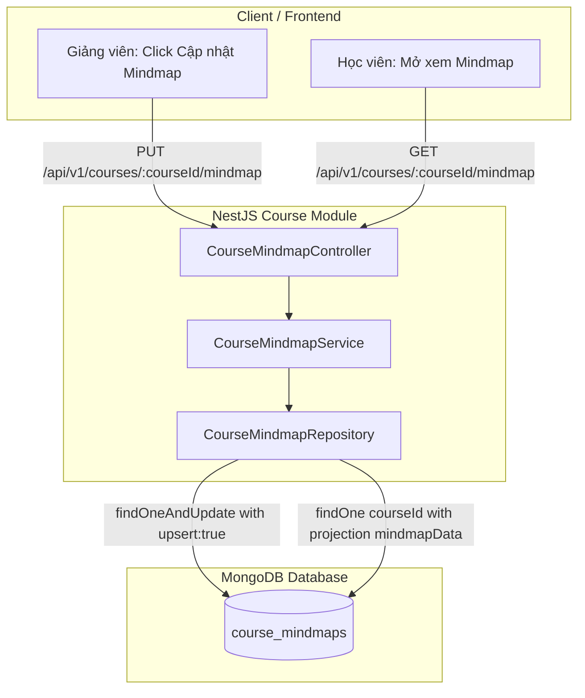

# PLAN: Course Mindmaps Entity & Storage API (`course_mindmaps`)

> **Mục tiêu:**
> 1. Thiết kế và triển khai Collection `course_mindmaps` trong MongoDB (NestJS + Mongoose) để lưu trữ cấu trúc Mindmap phân cấp đã được tối ưu hóa cho truy vấn đọc siêu tốc (`SELECT mindmap_data FROM course_mindmaps WHERE course_id = '...'`).
> 2. Tuân thủ 100% kiến trúc backend dự án: Kế thừa `BaseAbstractDocument`, triển khai Abstract Repository thông qua `CourseMindmapRepository` kế thừa `BaseMongoRepository`, Service kế thừa `BaseService`, không inject trực tiếp Model vào Service.
> 3. Triển khai API Upsert (`PUT /api/v1/courses/:courseId/mindmap`): Nhận payload `mindmapData` từ Giảng viên, ghi đè hoàn toàn (Upsert theo `courseId`).
> 4. Triển khai API Query (`GET /api/v1/courses/:courseId/mindmap`): Truy vấn trực tiếp theo `courseId` với projection nhẹ nhàng, trả về dữ liệu JSON tức thì mà không cần `JOIN` hay aggregate đa tầng.
> 5. Cung cấp DTO validation chặt chẽ (whitespace trimming, reject non-whitelisted, validate object format).
> 6. Viết trọn bộ Unit Tests cho Service và Controller đạt chuẩn AAA.
> 7. Giới hạn phạm vi: Chỉ tập trung hoàn thiện tầng Database & API lưu trữ backend, chưa can thiệp vào giao diện Mindmap canvas/rendering ở frontend.
>
> **Task Slug:** `course-mindmaps`  
> **Project Type:** `BACKEND`  
> **Primary Agent:** `backend-specialist`  
> **Supporting Agent:** `project-planner`  
> **Skill References:** `database-design`, `api-patterns`, `clean-code`, `testing-patterns`

---

## 1. Phân Tích Kỹ Thuật & Kiến Trúc (Architecture & Analysis)

### 1.1. Bối Cảnh & Bài Toán Hiệu Năng
- Cấu trúc khóa học thông thường phân tán qua nhiều collection: `courses` $\rightarrow$ `sections` $\rightarrow$ `lessons` $\rightarrow$ `keyPoints`.
- Nếu mỗi lần học viên hoặc giảng viên mở tab Mindmap mà hệ thống phải chạy chuỗi `$lookup` nối 3-4 collection lớn thì độ trễ sẽ tăng cao (đặc biệt khi khóa học có hàng chục chương và hàng trăm bài học).
- **Giải pháp:** Sử dụng collection chuyên biệt `course_mindmaps` đóng vai trò như một **Materialized View / Pre-computed Document Store**.
  - Khóa chính duy nhất đại diện cho khóa học: `courseId` (Index Unique, Partial Filter `{ deletedAt: null }`).
  - Dữ liệu mindmap: `mindmapData` (kiểu `Mixed` / `Object` lưu trữ toàn bộ cây phân cấp JSON: *Khóa học $\rightarrow$ Chương $\rightarrow$ Bài học $\rightarrow$ Các ý cốt lõi* cùng các metadata hiển thị như node id, màu sắc pastel, trạng thái mở rộng/thu gọn).



### 1.2. Thiết Kế Schema Mongoose (`course_mindmaps`)
- Kế thừa `BaseAbstractDocument`:
  - `_id: Types.ObjectId`
  - `createdAt: Date`
  - `updatedAt: Date`
  - `deletedAt: Date | null`
  - `createdById: string | null`
  - `updatedById: string | null`
- Trường nghiệp vụ:
  - `courseId: Types.ObjectId` (Ref: `CourseEntity.name`, required: true, index).
  - `mindmapData: Record<string, unknown>` (Type: `MongooseSchema.Types.Mixed`, required: true).
- **Index:**
  - Compound / Partial Unique Index: `{ courseId: 1 }` với `{ unique: true, partialFilterExpression: { deletedAt: null } }`. Đảm bảo mỗi khóa học chỉ có duy nhất 1 bản ghi mindmap đang hoạt động.

### 1.3. Cơ Chế Upsert An Toàn
- Trong `CourseMindmapRepository`:
  - Sử dụng phương thức Mongoose `findOneAndUpdate`:
    ```ts
    await this.model.findOneAndUpdate(
      { courseId: new Types.ObjectId(courseId), deletedAt: null },
      {
        $set: {
          mindmapData,
          updatedById: userId ? new Types.ObjectId(userId) : null,
          deletedAt: null,
        },
        $setOnInsert: {
          createdById: userId ? new Types.ObjectId(userId) : null,
        },
      },
      { upsert: true, new: true, setDefaultsOnInsert: true, session }
    );
    ```
  - Cơ chế này đảm bảo:
    - Nếu chưa có record: Insert mới với đầy đủ timestamps và `createdById`.
    - Nếu đã có record: Replace/Update toàn bộ `mindmapData` mới nhất, cập nhật `updatedAt` và `updatedById`.
    - Tránh race condition khi có nhiều request đồng thời nhờ unique index ở tầng DB.

### 1.4. Quyết Định Thiết Kế (Confirmed Socratic Decisions)
1. **Kiểm tra hợp lệ dữ liệu (Validation Policy):** Sử dụng cấu trúc JSON linh hoạt (`Record<string, unknown>` / `Schema.Types.Mixed`) với ràng buộc `@IsObject()` thay vì validate cứng nhắc 4 tầng DTO, giúp frontend tự do bổ sung các trường UI metadata (tọa độ canvas x/y, trạng thái collapse/expand, màu pastel, node id) mà không bị lỗi validation.
2. **Chiến lược đồng bộ (Data Consistency):** Thủ công hoàn toàn (Manual Snapshot). Dữ liệu chỉ ghi đè khi Giảng viên chủ động click "Cập nhật Mindmap", tránh tự động làm mất cấu trúc tùy biến hoặc vị trí sắp đặt sơ đồ của giảng viên khi chỉnh sửa curriculum thông thường.
3. **Phân quyền truy cập (Access Control):** Endpoint `GET /api/v1/courses/:courseId/mindmap` mở công khai (`@Public()`) hoặc cho phép mọi user đã đăng nhập xem được, đóng vai trò như Visual Course Syllabus / Outline giúp học viên xem tổng quan kiến trúc môn học trước khi đăng ký. Endpoint `PUT /api/v1/courses/:courseId/mindmap` được bảo vệ nghiêm ngặt, chỉ cho phép Giảng viên tạo khóa học (`instructorId`) hoặc `ADMIN`.

---

## 2. Thiết Kế Hợp Đồng Dữ Liệu (Contracts & DTOs)

### 2.1. Shared Interfaces (`share-lib`)
File: `share-lib/src/interfaces/course-mindmap.interface.ts`
```ts
export interface ICourseMindmapNode {
  id?: string;
  title: string;
  type?: 'course' | 'section' | 'lesson' | 'keypoint' | string;
  color?: string;
  children?: ICourseMindmapNode[];
  [key: string]: unknown;
}

export interface ICourseMindmap {
  id: string;
  courseId: string;
  mindmapData: Record<string, unknown>;
  createdAt?: Date;
  updatedAt?: Date;
  deletedAt?: Date | null;
  createdById?: string | null;
  updatedById?: string | null;
}
```

### 2.2. DTOs
File: `backend/src/modules/course/dto/upsert-course-mindmap.dto.ts`
```ts
import { IsNotEmpty, IsObject } from 'class-validator';

export class UpsertCourseMindmapDto {
  @IsNotEmpty({ message: 'mindmapData không được để trống' })
  @IsObject({ message: 'mindmapData phải là một JSON object hợp lệ' })
  mindmapData: Record<string, unknown>;
}
```

---

## 3. Cấu Trúc File & Thư Mục Dự Kiến

```
backend/src/modules/course/
├── schemas/
│   └── course-mindmap.schema.ts         # [MỚI] Mongoose schema kế thừa BaseAbstractDocument
├── repositories/
│   └── course-mindmap.repository.ts     # [MỚI] Repository kế thừa BaseMongoRepository
├── services/
│   └── course-mindmap.service.ts        # [MỚI] Business service kế thừa BaseService
├── dto/
│   └── upsert-course-mindmap.dto.ts     # [MỚI] Validation DTO cho payload mindmap
├── course-mindmap.controller.ts         # [MỚI] REST endpoints PUT/GET :courseId/mindmap
├── course.module.ts                     # [CẬP NHẬT] Đăng ký CourseMindmapSchema, Repository, Service, Controller
└── tests/
    ├── course-mindmap.service.spec.ts   # [MỚI] Unit tests cho CourseMindmapService
    └── course-mindmap.controller.spec.ts# [MỚI] Unit tests cho CourseMindmapController

share-lib/src/
├── interfaces/
│   └── course-mindmap.interface.ts      # [MỚI] Domain model & Node contract
└── index.ts                             # [CẬP NHẬT] Export interface mới
```

---

## 4. Kế Hoạch Triển Khai Chi Tiết (Task Breakdown)

### Task 1: Domain Interfaces in `share-lib`
- **ID:** `TASK-MINDMAP-01`
- **Agent:** `backend-specialist`
- **Skills:** `clean-code`
- **Input:** Khái niệm thực thể `ICourseMindmap` và `ICourseMindmapNode`.
- **Output:** File `share-lib/src/interfaces/course-mindmap.interface.ts` và export trong `share-lib/src/index.ts`.
- **Verify:** `pnpm --filter share-lib build` thành công, không lỗi type.

### Task 2: Schema Definition & Mongoose Indexing
- **ID:** `TASK-MINDMAP-02`
- **Agent:** `backend-specialist`
- **Skills:** `database-design`, `clean-code`
- **Input:** `ICourseMindmap`, `BaseAbstractDocument`.
- **Output:** File `backend/src/modules/course/schemas/course-mindmap.schema.ts` với `collection: 'course_mindmaps'`, partial unique index `{ courseId: 1, deletedAt: null }`.
- **Verify:** Khai báo kiểu `Types.ObjectId`, các decorator `@Prop` và `SchemaFactory` hợp lệ.

### Task 3: Repository Implementation
- **ID:** `TASK-MINDMAP-03`
- **Agent:** `backend-specialist`
- **Skills:** `database-design`, `clean-code`
- **Input:** `CourseMindmapEntity`, `BaseMongoRepository`.
- **Output:** File `backend/src/modules/course/repositories/course-mindmap.repository.ts`.
  - Hàm `findByCourseId(courseId: string, session?: ClientSession)`
  - Hàm `upsertByCourseId(courseId: string, mindmapData: Record<string, unknown>, userId?: string, session?: ClientSession)`
- **Verify:** Mapper `toDomain` chuẩn hóa `_id` thành `id`, `courseId` string, xử lý session nếu có transaction.

### Task 4: DTO & Validation Pipeline
- **ID:** `TASK-MINDMAP-04`
- **Agent:** `backend-specialist`
- **Skills:** `api-patterns`, `clean-code`
- **Input:** Yêu cầu nhận payload JSON object.
- **Output:** File `backend/src/modules/course/dto/upsert-course-mindmap.dto.ts`.
- **Verify:** ValidationPipe reject dữ liệu sai định dạng (string, rỗng, mảng).

### Task 5: Service Logic & Course Ownership Verification
- **ID:** `TASK-MINDMAP-05`
- **Agent:** `backend-specialist`
- **Skills:** `api-patterns`, `clean-code`
- **Input:** `CourseMindmapRepository`, `CourseRepository`.
- **Output:** File `backend/src/modules/course/services/course-mindmap.service.ts`.
  - Logic `upsertMindmap`: Kiểm tra course tồn tại; kiểm tra quyền sở hữu (người gọi là giảng viên của course hoặc ADMIN); gọi repository upsert.
  - Logic `getMindmapByCourseId`: Kiểm tra course tồn tại; trả về `mindmapData` (hoặc rỗng/null nếu chưa tạo).
- **Verify:** Ném `NotFoundException` nếu course không tồn tại, `ForbiddenException` nếu không có quyền can thiệp.

### Task 6: Controller Endpoints & Security Guards
- **ID:** `TASK-MINDMAP-06`
- **Agent:** `backend-specialist`
- **Skills:** `api-patterns`
- **Input:** `CourseMindmapService`, Global Guards (`JwtAuthGuard`, `RolesGuard`).
- **Output:** File `backend/src/modules/course/course-mindmap.controller.ts`.
  - `PUT /api/v1/courses/:courseId/mindmap`: `@Roles(RoleEnum.INSTRUCTOR, RoleEnum.ADMIN)`
  - `GET /api/v1/courses/:courseId/mindmap`: Trả về `mindmapData` theo chuẩn `ApiResponse.success()`.
- **Verify:** Kết quả trả về bọc trong `ApiResponse.success()`.

### Task 7: Module Wiring & Dependency Registration
- **ID:** `TASK-MINDMAP-07`
- **Agent:** `backend-specialist`
- **Skills:** `clean-code`
- **Input:** Mọi thành phần đã tạo ở Tasks 2-6.
- **Output:** Cập nhật `backend/src/modules/course/course.module.ts`:
  - `MongooseModule.forFeature([{ name: CourseMindmapEntity.name, schema: CourseMindmapSchema }])`
  - Đăng ký controller và providers/exports.
- **Verify:** NestJS build và compile không bị thiếu dependency injection token.

### Task 8: Comprehensive Unit Tests (AAA Pattern)
- **ID:** `TASK-MINDMAP-08`
- **Agent:** `backend-specialist`
- **Skills:** `testing-patterns`, `clean-code`
- **Input:** `CourseMindmapService`, `CourseMindmapController`.
- **Output:** 
  - `backend/src/modules/course/tests/course-mindmap.service.spec.ts`
  - `backend/src/modules/course/tests/course-mindmap.controller.spec.ts`
- **Verify:** `pnpm --filter backend test` đạt 100% pass cho tất cả test cases mới.

---

## 5. Tiêu Chí Nghiệm Thu (Success Criteria)

1. **Khả năng tương thích kiến trúc:** 
   - Kế thừa `BaseAbstractDocument` đầy đủ timestamps và soft-delete tracking.
   - Không vi phạm DI: Service không inject `@InjectModel`.
2. **Hiệu năng truy vấn:**
   - Index `{ courseId: 1 }` duy nhất đảm bảo thời gian lookup $O(1)$.
   - Truy vấn học viên trả về trực tiếp cục JSON không cần JOIN/Aggregate.
3. **Tính toàn vẹn dữ liệu:**
   - Cơ chế Upsert nguyên khối ghi đè phiên bản mới nhất, không sinh trùng record cho cùng một `courseId`.
4. **Kiểm thử:**
   - 100% test cases pass, bao gồm các trường hợp: Upsert thành công, Course không tồn tại, Không có quyền ghi đè, và Lấy dữ liệu thành công.

---

## 6. Phase X: Final Verification Checklist

- [x] `pnpm --filter share-lib build` hoàn thành không lỗi type.
- [x] `npx tsc --noEmit` tầng Backend không phát sinh lỗi TypeScript.
- [x] Chạy unit test backend: `pnpm --filter backend test course-mindmap` (18/18 tests pass 100%).
- [x] Kiểm tra MongoDB index được cấu hình đúng chuẩn partialFilterExpression.
- [x] Cập nhật living docs: `a-agentic/features/course-management/tech-spec.md` và `dev-history.md`.

## ✅ PHASE X COMPLETE

- Type Check: ✅ Pass (100% clean)
- Backend Build: ✅ Success (`nest build`)
- Unit & Schema Tests: ✅ 18/18 tests pass
- Date: 2026-10-02

