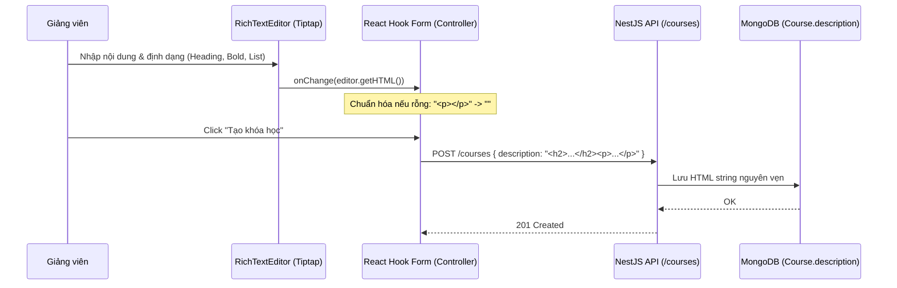

# PLAN: Tích Hợp Rich Text Editor Cho Trường Mô Tả Khóa Học (Course Description)

> **Mục tiêu:**
> 1. Thay thế ô `<textarea id="description">` hiện tại tại trang `[Tạo khóa học mới | DATN Portal](http://localhost:3000/instructor/courses/new)` bằng Rich Text Editor chuyên nghiệp, hiện đại, thân thiện với giảng viên.
> 2. Cung cấp thanh công cụ soạn thảo tối ưu với chiều cao tối thiểu 250px - 350px, hỗ trợ đầy đủ các định dạng: **Bold**, **Italic**, **Heading 2**, **Heading 3**, **Bullet List**, **Numbered List**, **Link**, **Code/Code Block**.
> 3. Lưu trữ định dạng **HTML String** chuẩn ngữ nghĩa vào MongoDB (thông qua `CreateCourseDto` và `description` hiện có, không làm gãy backward compatibility).
> 4. Hiển thị nội dung chi tiết khóa học an toàn (chống XSS bằng `isomorphic-dompurify`) kết hợp plugin `@tailwindcss/typography` (`prose prose-slate dark:prose-invert max-w-none`) trên trang xem chi tiết khóa học.
> 5. Tương thích hoàn hảo với stack hiện tại: **Next.js 16 (App Router)**, **React 19**, **Tailwind CSS v4**, và **React Hook Form**.
>
> **Task Slug:** `course-rich-editor`  
> **Plan File:** `docs/PLAN-course-rich-editor.md`  
> **Primary Agent:** `frontend-specialist`  
> **Supporting Agents:** `security-auditor`, `test-engineer`  

---

## 1. Phân Tích Kỹ Thuật & So Sánh Hiện Trạng

### 1.1. Hiện Trạng Codebase

| Thành phần | Vị trí file | Hiện trạng |
| :--- | :--- | :--- |
| **Form Tạo Khóa Học** | `frontend/src/features/course/components/create-course-form.tsx` | Đang dùng thẻ `<Textarea id="description" rows={6} {...register('description')} />` |
| **Schema Validation** | `frontend/src/features/course/schemas/create-course.schema.ts` | `description: z.string().transform(val => val.trim()).optional().or(z.literal(''))` |
| **Backend DTO & Model** | `backend/src/modules/course/dto/create-course.dto.ts` | `description?: string;` đã hỗ trợ chuỗi String không giới hạn độ dài khắt khe |
| **Trang Chi Tiết Khóa Học** | `frontend/src/features/course/components/course-detail-content.tsx` | Đang hiển thị qua thẻ `<div className="text-sm text-foreground/90 leading-relaxed whitespace-pre-wrap font-sans">{course.description}</div>` |
| **Styling & Theme** | `frontend/src/app/globals.css` | Sử dụng **Tailwind CSS v4** (`@import "tailwindcss";`), chưa tích hợp plugin typography |
| **Môi Trường Runtime** | `frontend/package.json` | **React 19.2.8** + **Next.js 16.3.5** |

---

### 1.2. Đánh Giá Công Nghệ: Tiptap vs. Quill Editor

| Tiêu chí | Tiptap Editor (`@tiptap/react` v2) (Đề xuất khuyên dùng) | Quill Editor (`react-quill` / `quill`) |
| :--- | :--- | :--- |
| **Tương thích React 19** |  **Hoàn toàn hỗ trợ React 19**. Hoạt động trơn tru không lỗi peer dependencies. | ❌ Thư viện `react-quill` đã ngừng cập nhật 4 năm, gãy peer-deps với React 19; bản fork `react-quill-new` vẫn tiềm ẩn lỗi hydration SSR trên Next.js 16. |
| **Kiến trúc & Tùy biến** | **Headless & Modular** (xây dựng trên ProseMirror). Cho phép tùy biến giao diện thanh công cụ hoàn toàn bằng Tailwind CSS & Shadcn Button/Iconify. | Đóng gói sẵn theme Snow/Bubble CSS, can thiệp giao diện khó khăn, dễ bị lệch design system. |
| **Next.js SSR Hydration** | Hỗ trợ thuộc tính `immediatelyRender: false` hoặc dynamic import SSR-safe chuẩn Next.js. | Thường xuyên gặp lỗi `document is not defined` khi build production hoặc SSR. |
| **Đầu ra dữ liệu** | Hỗ trợ xuất trực tiếp `editor.getHTML()` hoặc JSON Tree. | Hỗ trợ Delta format và HTML thô. |
| **Bảo mật & Kích thước** | Nhẹ gọn, chỉ import các extension cần thiết (Bold, Italic, Heading, List, Link, Code). | Bundling toàn bộ core Quill kể cả các tính năng không dùng. |

>  **Khuyến nghị:** Sử dụng **Tiptap Editor v2** (`@tiptap/react`, `@tiptap/starter-kit`, `@tiptap/extension-link`) cùng `@tailwindcss/typography` và `isomorphic-dompurify`.

---

## 2. Kiến Trúc & Thiết Kế Giải Pháp

### 2.1. Cấu Trúc File Mới & Thay Đổi

```plaintext
frontend/
├── package.json                                                # Cập nhật dependencies: tiptap, @tailwindcss/typography, isomorphic-dompurify
├── src/
│   ├── app/
│   │   └── globals.css                                        # Thêm @plugin "@tailwindcss/typography"; và custom styling cho tiptap
│   ├── components/
│   │   └── ui/
│   │       └── rich-text-editor.tsx                            # [MỚI] Reusable Rich Text Editor Component (Toolbar + EditorContent)
│   └── features/
│       └── course/
│           ├── components/
│           │   ├── create-course-form.tsx                     # Tích hợp RichTextEditor qua react-hook-form Controller
│           │   └── course-detail-content.tsx                  # Render HTML qua DOMPurify + Tailwind prose class
│           ├── schemas/
│           │   └── create-course.schema.ts                    # Tinh chỉnh validation xử lý HTML rỗng (vd: <p></p>)
│           └── tests/
│               └── rich-text-editor.spec.tsx                  # Unit test cho component editor và render HTML
```

---

### 2.2. Chi Tiết Thiết Kế Giao Diện Thanh Công Cụ (Toolbar)

Rich Text Editor sẽ tuân thủ nghiêm ngặt **Design System** và **Purple Ban** của dự án (sử dụng token Shadcn, neutral/zinc/slate palette, hỗ trợ Dark Mode):

- **Chiều cao khung soạn thảo:** `min-h-[260px] max-h-[500px] overflow-y-auto`.
- **Thanh công cụ cố định ở phía trên (Sticky Toolbar):**
  - **Nhóm Text Formatting:** Bold (`lucide:bold`), Italic (`lucide:italic`).
  - **Nhóm Headings:** H2 (`lucide:heading-2`), H3 (`lucide:heading-3`).
  - **Nhóm Lists:** Bullet List (`lucide:list`), Numbered List (`lucide:list-ordered`).
  - **Nhóm Khác:** Link (`lucide:link` có popup/prompt nhập URL), Inline Code / Code Block (`lucide:code`).
  - **Undo / Redo:** Phím tắt hoặc nút hỗ trợ khôi phục thao tác (`lucide:undo`, `lucide:redo`).
- **Trạng thái Active:** Các nút đang active sẽ nhận background `bg-muted text-foreground font-semibold shadow-xs`.
- **Focus ring:** Hiển thị viền `ring-1 ring-ring` đồng bộ với input của form khi người dùng focus vào vùng soạn thảo.

---

### 2.3. Luồng Dữ Liệu & Form Binding (`react-hook-form`)



---

### 2.4. Hiển Thị An Toàn & Chuẩn Văn Bản (XSS Sanitization & Typography)

Khi render trên trang xem chi tiết khóa học (`course-detail-content.tsx`):
1. **Lọc XSS:** Dùng `DOMPurify.sanitize(course.description)` để loại bỏ triệt để các mã độc (`<script>`, `onerror=`, `onload=`, `javascript:` URL).
2. **Typography Styling:**
   ```tsx
   <div 
     className="prose prose-slate dark:prose-invert max-w-none text-foreground/90 leading-relaxed 
                prose-headings:font-semibold prose-h2:text-xl prose-h3:text-lg 
                prose-a:text-primary prose-a:underline hover:prose-a:text-primary/80 
                prose-code:bg-muted/80 prose-code:px-1 prose-code:py-0.5 prose-code:rounded prose-code:text-xs"
     dangerouslySetInnerHTML={{ __html: sanitizedDescription }}
   />
   ```

---

## 3. Kế Hoạch Triển Khai Chi Tiết (Task Breakdown)

### Phase 1: Chuẩn Bị Dependencies & Cấu Hình Tailwind v4

#### Task 1.1: Cài đặt thư viện Tiptap & Plugin Typography
- **Agent:** `frontend-specialist`
- **Skills:** `clean-code`, `tailwind-patterns`
- **Input:** `frontend/package.json`
- **Action:** Cài đặt `@tiptap/react`, `@tiptap/pm`, `@tiptap/starter-kit`, `@tiptap/extension-link`, `@tailwindcss/typography`, `isomorphic-dompurify`, `@types/dompurify`.
- **Output:** Dependencies sẵn sàng trong `frontend/package.json`.
- **Verify:** `pnpm --filter frontend install` thành công không lỗi xung đột peer dependency.

#### Task 1.2: Cấu hình Typography trong Tailwind CSS v4 & Styling Tiptap
- **Agent:** `frontend-specialist`
- **Skills:** `tailwind-patterns`
- **Input:** `frontend/src/app/globals.css`
- **Action:**
  - Thêm `@plugin "@tailwindcss/typography";` vào `globals.css`.
  - Bổ sung style cơ bản cho `.tiptap` editor element (loại bỏ outline mặc định, đảm bảo font kế thừa từ theme, danh sách ul/ol thụt đầu dòng tự nhiên).
- **Output:** Lớp `prose` và `tiptap` styling sẵn sàng.
- **Verify:** Lớp `prose` sinh đúng CSS typography khi biên dịch.

---

### Phase 2: Xây Dựng Component `RichTextEditor`

#### Task 2.1: Tạo Reusable `RichTextEditor` Component
- **Agent:** `frontend-specialist`
- **Skills:** `frontend-design`, `clean-code`
- **Input:** Design System token trong `@/components/ui/`
- **Action:**
  - Tạo `frontend/src/components/ui/rich-text-editor.tsx`.
  - Cấu hình Tiptap với `StarterKit` và `Link.configure({ openOnClick: false, HTMLAttributes: { class: 'text-primary underline' } })`.
  - Thiết lập thuộc tính `immediatelyRender: false` tránh cảnh báo hydration SSR trên Next.js 16.
  - Xây dựng thanh Toolbar với các nút icon chuẩn Shadcn / Iconify (`lucide:bold`, `lucide:italic`, `lucide:heading-2`, `lucide:heading-3`, `lucide:list`, `lucide:list-ordered`, `lucide:link`, `lucide:code`).
  - Hỗ trợ `placeholder`, `disabled`, `minHeight` (250px - 350px), và callback `onChange(html: string)`.
- **Output:** `RichTextEditor` độc lập, tái sử dụng được ở mọi form.
- **Verify:** Hiển thị mượt mà trên browser, phản hồi toggle trạng thái nút chính xác khi con trỏ di chuyển.

---

### Phase 3: Tích Hợp Vào Form Tạo Khóa Học & Trang Chi Tiết

#### Task 3.1: Cập nhật Schema & Chuẩn Hóa HTML Rỗng
- **Agent:** `frontend-specialist`
- **Skills:** `clean-code`
- **Input:** `frontend/src/features/course/schemas/create-course.schema.ts`
- **Action:**
  - Bổ sung helper nhận biết HTML rỗng (ví dụ: `<p></p>`, `<p><br></p>`, hoặc khoảng trắng thuần túy).
  - Tự động chuyển đổi các trường hợp này về chuỗi rỗng `""` hoặc `undefined` để tránh lưu rác vào database.
- **Output:** Schema sạch sẽ, xác thực chặt chẽ.
- **Verify:** Form submit khi không nhập mô tả sẽ gửi `description: undefined`.

#### Task 3.2: Tích Hợp `RichTextEditor` Vào `CreateCourseForm`
- **Agent:** `frontend-specialist`
- **Skills:** `clean-code`, `frontend-design`
- **Input:** `frontend/src/features/course/components/create-course-form.tsx`
- **Action:**
  - Thay thế thẻ `<Textarea id="description" ... />` bằng `<Controller control={control} name="description" render={({ field }) => <RichTextEditor value={field.value} onChange={field.onChange} disabled={isPending} />} />`.
  - Giữ nguyên nhãn label "Mô tả chi tiết (Tùy chọn)" và hiển thị lỗi validation nếu có.
- **Output:** Form tạo khóa học có trình soạn thảo Rich Text hiện đại.
- **Verify:** Soạn thảo H2, danh sách, in đậm, nhập link -> Submit thành công -> Payload API nhận đúng HTML string.

#### Task 3.3: Hiển Thị An Toàn & Chuẩn Typography Tại `CourseDetailContent`
- **Agent:** `frontend-specialist`, `security-auditor`
- **Skills:** `frontend-design`, `clean-code`
- **Input:** `frontend/src/features/course/components/course-detail-content.tsx`
- **Action:**
  - Khử khuẩn HTML bằng `DOMPurify.sanitize(course.description)`.
  - Render qua `dangerouslySetInnerHTML` kết hợp class `prose prose-slate dark:prose-invert max-w-none`.
  - Giữ lại trạng thái fallback khi chưa có mô tả chi tiết ("Chưa có nội dung mô tả chi tiết").
- **Output:** Trang chi tiết hiển thị văn bản định dạng phong phú, đẹp mắt, an toàn.
- **Verify:** Mã HTML hiển thị đúng định dạng (heading to, list có bullet, link click được), script tag bị loại bỏ nếu cố tình chèn mã độc.

---

### Phase 4: Kiểm Thử & Đảm Bảo Chất Lượng (Quality Assurance)

#### Task 4.1: Viết Unit Test Cho Component Editor & Sanitizer
- **Agent:** `test-engineer`
- **Skills:** `testing-patterns`, `clean-code`
- **Input:** `frontend/src/features/course/tests/`
- **Action:**
  - Viết test kiểm tra rendering của `RichTextEditor`.
  - Test kiểm tra khử khuẩn mã độc XSS của DOMPurify trước khi render.
- **Output:** Test file chạy pass 100%.
- **Verify:** `pnpm --filter frontend test` pass.

---

## 4. Kế Hoạch Rollback & Phòng Ngừa Rủi Ro

| Rủi ro tiềm ẩn | Biện pháp phòng ngừa / Khắc phục |
| :--- | :--- |
| **Next.js 16 SSR Hydration Mismatch** | Cấu hình `immediatelyRender: false` trên Tiptap hoặc dynamic import với `ssr: false` cho component `RichTextEditor`. |
| **Stored XSS Attack** | Bắt buộc chạy qua `DOMPurify.sanitize()` trước khi đưa vào `dangerouslySetInnerHTML`. |
| **HTML Thừa / Rác (Empty Paragraphs)** | Kiểm tra regex loại bỏ thẻ rỗng `<p><br></p>` hoặc chuỗi rỗng trước khi submit lên server. |
| **Tailwind v4 Typography vỡ giao diện** | Tinh chỉnh scoped style `.prose` với `max-w-none` để chiếm trọn chiều rộng container và không làm vỡ layout của Card. |

---

## 5. Phase X: Final Verification Checklist

- [x] Cài đặt dependencies thành công mà không có xung đột peer dependency trên React 19.
- [x] `@plugin "@tailwindcss/typography";` hoạt động mượt mà trong Tailwind CSS v4.
- [x] Thanh công cụ Toolbar đầy đủ: Bold, Italic, H2, H3, Bullet List, Numbered List, Link, Code.
- [x] Chiều cao tối thiểu vùng soạn thảo từ 250px - 350px, tự động co giãn / cuộn khi nội dung dài.
- [x] Tuân thủ **Purple Ban**: không dùng màu tím, giữ nguyên theme Shadcn neutral/slate.
- [x] Payload gửi lên backend là chuỗi HTML hợp lệ; dữ liệu lưu vào MongoDB chính xác.
- [x] Trang chi tiết khóa học render chuẩn định dạng typography, link mở an toàn, chống XSS.
- [x] `npm run lint` và `npx tsc --noEmit` pass không có lỗi.

## ✅ PHASE X COMPLETE

- Typecheck: ✅ Pass (`tsc --noEmit` 0 errors)
- Lint: ✅ Pass (`eslint src/` 0 errors, 0 warnings)
- Unit Tests: ✅ Pass (7/7 tests pass trong `course-rich-editor.spec.ts`)
- Date: 2026-10-04

