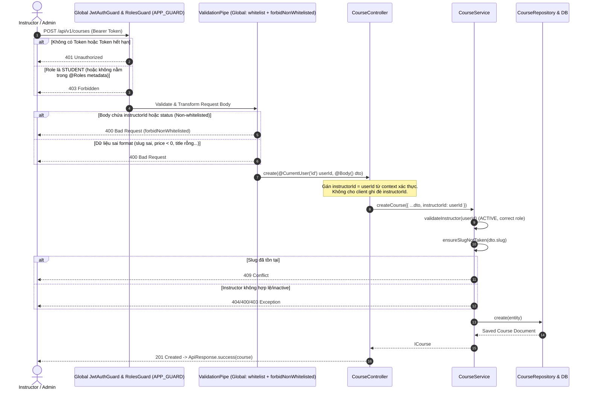

# PLAN: Create Course API (`POST /api/v1/courses`)

> **Mục tiêu:**
> 1. Triển khai API tạo mới khóa học: `POST /api/v1/courses`.
> 2. Endpoint được bảo vệ tự động bởi `JwtAuthGuard` và `RolesGuard` (đã đăng ký toàn cục qua `APP_GUARD` trong `AuthModule`). Do đó **KHÔNG** khai báo `@UseGuards` dư thừa trên controller.
> 3. Phân quyền chỉ cho phép `INSTRUCTOR` và `ADMIN` tạo khóa học thông qua decorator `@Roles(RoleEnum.INSTRUCTOR, RoleEnum.ADMIN)`.
> 4. Tuyệt đối không nhận `instructorId` và `status` từ client body. `instructorId` lấy từ context user đăng nhập (`@CurrentUser('id')`), `status` mặc định là `DRAFT`.
> 5. Xây dựng `CreateCourseDto` tuân thủ nghiêm ngặt quy tắc validation (whitespace trimming, lowercase slug, regex kebab-case, positive price, enum validation, cấm non-whitelisted properties).
> 6. Sử dụng hàm `CourseService.createCourse()` đã có từ foundation v1, giữ nguyên kiến trúc Repository/Service hiện tại.
> 7. Trả response theo chuẩn `ApiResponse.success(..., HttpStatus.CREATED)`.
> 8. Viết bộ controller test tinh gọn, tập trung vào 5 kịch bản yêu cầu, không duplicate các test authorization của `RolesGuard` đã có sẵn trong `roles.guard.spec.ts`.
> 9. Tuyệt đối không implement thêm Get/List/Update/Delete/Publish/Archive trong task này.
>
> **Task Slug:** `create-course-api`  
> **Executing Agent:** `backend-specialist`

---

## 1. Phân Tích Kỹ Thuật & Kiến Trúc (Architecture & Spec Analysis)

### 1.1. Luồng Xử Lý Endpoint `POST /api/v1/courses`



---

### 1.2. Xác Nhận Guards Toàn Cục (Global Guards Verification)

Trong `backend/src/modules/auth/auth.module.ts`:
```ts
providers: [
  {
    provide: APP_GUARD,
    useClass: JwtAuthGuard,
  },
  {
    provide: APP_GUARD,
    useClass: RolesGuard,
  },
]
```
- `JwtAuthGuard` và `RolesGuard` đã được cấu hình cấp ứng dụng thông qua `APP_GUARD`.
- Mọi endpoint mặc định đều yêu cầu xác thực JWT (trừ khi có `@Public()`).
- Phân quyền chỉ cần khai báo `@Roles(RoleEnum.INSTRUCTOR, RoleEnum.ADMIN)`.
- **Kết luận:** `CourseController` **KHÔNG** thêm `@UseGuards(JwtAuthGuard, RolesGuard)` để tránh trùng lặp dư thừa.

---

### 1.3. Đặc Tả DTO & Validation: `CreateCourseDto`

File: `backend/src/modules/course/dto/create-course.dto.ts`

| Trường | Kiểu dữ liệu | Bắt buộc | Validation Rules & Transforms |
| :--- | :--- | :--- | :--- |
| `title` | `string` | **Có** | `@IsNotEmpty()`, `@IsString()`, `@MinLength(3)`, `@MaxLength(200)`<br/>`@Transform(({ value }) => value?.trim())` |
| `slug` | `string` | **Có** | `@IsNotEmpty()`, `@IsString()`, `@Matches(/^[a-z0-9]+(?:-[a-z0-9]+)*$/)`<br/>`@Transform(({ value }) => value?.toLowerCase().trim())` |
| `shortDescription`| `string` | Không | `@IsOptional()`, `@IsString()`, `@MaxLength(500)`<br/>`@Transform(({ value }) => value?.trim() \|\| undefined)` |
| `description` | `string` | Không | `@IsOptional()`, `@IsString()`<br/>`@Transform(({ value }) => value?.trim() \|\| undefined)` |
| `thumbnailUrl` | `string` | Không | `@IsOptional()`, `@IsString()`<br/>`@Transform(({ value }) => value?.trim() \|\| undefined)` |
| `price` | `number` | Không | `@IsOptional()`, `@IsNumber()`, `@Min(0)`<br/>`@Type(() => Number)` (Mặc định: 0) |
| `level` | `CourseLevelEnum` | Không | `@IsOptional()`, `@IsEnum(CourseLevelEnum)`<br/>(Mặc định: `CourseLevelEnum.ALL_LEVELS`) |

> **Quy tắc an ninh Zero-Trust Input:**
> - Tuyệt đối **KHÔNG khai báo** `instructorId` và `status` trong `CreateCourseDto`.
> - Do `main.ts` cấu hình `whitelist: true, forbidNonWhitelisted: true`, client gửi `instructorId` hoặc `status` trong payload sẽ nhận ngay lỗi `400 Bad Request`.
> - Tại Controller, chỉ truyền `instructorId: userId` từ `@CurrentUser('id')`.

---

### 1.4. Cấu Trúc Controller: `CourseController`

File: `backend/src/modules/course/course.controller.ts`

```ts
@Controller('courses')
export class CourseController {
  constructor(private readonly courseService: CourseService) {}

  @Post()
  @HttpCode(HttpStatus.CREATED)
  @Roles(RoleEnum.INSTRUCTOR, RoleEnum.ADMIN)
  async create(
    @CurrentUser('id') userId: string,
    @Body() dto: CreateCourseDto,
  ): Promise<ApiResponse<ICourse>> {
    const course = await this.courseService.createCourse({
      ...dto,
      instructorId: userId,
    });
    return ApiResponse.success(course, 'Tạo khóa học thành công', HttpStatus.CREATED);
  }
}
```

---

## 2. Kế Hoạch Thực Hiện Chi Tiết (Task Breakdown)

| Task ID | Nhiệm Vụ | Chi Tiết File |
| :--- | :--- | :--- |
| **TASK-01** | Tạo DTO `CreateCourseDto` | `backend/src/modules/course/dto/create-course.dto.ts` |
| **TASK-02** | Tạo Controller `CourseController` | `backend/src/modules/course/course.controller.ts` |
| **TASK-03** | Đăng ký Controller vào `CourseModule` | `backend/src/modules/course/course.module.ts` |
| **TASK-04** | Viết Controller & API Tests tinh gọn | `backend/src/modules/course/tests/course.controller.spec.ts` |

### Chi tiết các kịch bản trong `course.controller.spec.ts`:

1. **Instructor tạo course thành công**:
   - Gọi `controller.create('instructor_1', validDto)`.
   - Kết quả: `ApiResponse` 201, `courseService.createCourse` được gọi với đúng `instructorId: 'instructor_1'`.
2. **Admin tạo course thành công**:
   - Gọi `controller.create('admin_1', validDto)`.
   - Kết quả: `ApiResponse` 201, `courseService.createCourse` được gọi với đúng `instructorId: 'admin_1'`.
3. **Phân quyền route (Metadata & Roles)**:
   - Xác minh metadata `@Roles` trên method `create` là `[RoleEnum.INSTRUCTOR, RoleEnum.ADMIN]`.
   - Xác minh `STUDENT` bị từ chối truy cập qua `RolesGuard`.
4. **Slug trùng bị từ chối**:
   - Mock `courseService.createCourse` ném ra `ConflictException`.
   - Controller ném `ConflictException` (409 Conflict).
5. **instructorId trong body bị từ chối / không được dùng**:
   - `ValidationPipe`: payload chứa `instructorId` bị từ chối ngay với `BadRequestException` (`property instructorId should not exist`).
   - Controller binding: Đảm bảo controller luôn gán `instructorId: userId` từ context xác thực.
6. **Validation Edge Cases**:
   - Giá âm (`price: -1`) bị `ValidationPipe` từ chối.
   - Title rỗng hoặc slug không đúng regex kebab-case bị từ chối.

---

## 3. Kế Hoạch Nghiệm Thu (Verification Plan)

- [ ] Chạy Controller Spec: `pnpm --filter backend test src/modules/course/tests/course.controller.spec.ts`
- [ ] Chạy toàn bộ Test Suites: `pnpm --filter backend test`
- [ ] TypeScript Type-check: `pnpm --filter backend exec npx tsc --noEmit`
- [ ] Linter Check: `pnpm --filter backend lint`
- [ ] Cập nhật tài liệu: `a-agentic/features/course-management/dev-history.md`
