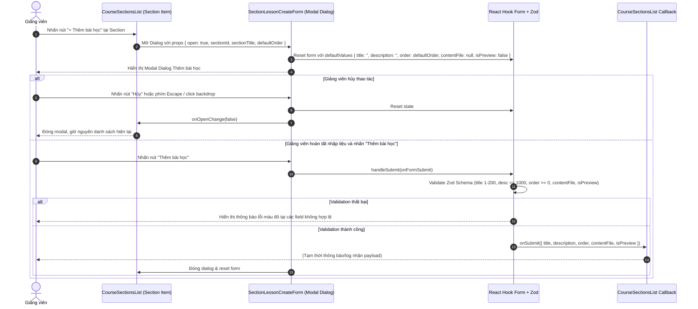

# PLAN: Giao Diện Thêm Bài Học (Lesson Create UI) Cho Section Trên Course Detail

> **Mục tiêu:**
> 1. Xây dựng giao diện cho phép Giảng viên thêm Bài học (Lesson) mới trong từng Chương học (Section) trên trang Chi tiết Khóa học (`/instructor/courses/[id]`).
> 2. Xác định đúng component đang render `SectionLessonsList` ([course-sections-list.tsx](file:///d:/Download/hk1_2027/project_do_an/frontend/src/features/course/components/course-sections-list.tsx)).
> 3. Thêm nút kích hoạt **"+ Thêm bài học"** trong mỗi Section.
> 4. Nhấn nút → mở hộp thoại **Modal Dialog** chứa component `section-lesson-create-form.tsx` với `sectionId` được gắn tự động từ Section hiện tại (chỉ đọc / không cho phép người dùng nhập).
> 5. Form bao gồm các trường dữ liệu và validation chuẩn Zod + React Hook Form:
>    - `title`: Bắt buộc, chuỗi từ 1 đến 200 ký tự, tự động trim khoảng trắng thừa.
>    - `description`: Không bắt buộc, chuỗi tối đa 1000 ký tự, tự động trim.
>    - `order`: Bắt buộc, số nguyên không âm ($\ge 0$), tự động gợi ý giá trị mặc định dựa trên số lượng bài học hiện có trong Section.
>    - `contentFile`: UI chọn tài liệu hoặc video đính kèm (`video/mp4, video/webm, video/quicktime, application/pdf, .doc, .docx`), giữ đối tượng `File` trong frontend state, **tuyệt đối chưa upload**.
>    - `isPreview`: Toggle/Checkbox "Cho phép học thử miễn phí", lưu trong frontend state.
> 6. Hành vi điều khiển:
>    - **Nút "Hủy"**: Đóng modal dialog và reset toàn bộ state của form về mặc định.
>    - **Nút "Thêm bài học"**: Thực thi validate dữ liệu, khi hợp lệ thì bàn giao payload ra ngoài qua callback `onSubmit(payload)` và đóng modal.
> 7. **Ranh giới nghiêm ngặt (Strict Out of Scope Boundaries):**
>    - ❌ **KHÔNG** gọi API tạo Lesson (`POST /sections/:sectionId/lessons`).
>    - ❌ **KHÔNG** upload lên Cloudinary, S3 hay bất kỳ storage nào.
>    - ❌ **KHÔNG** sửa bất kỳ file nào thuộc backend.
>    - ❌ **KHÔNG** tạo mutation hay gọi invalidate React Query.
>    - ❌ **KHÔNG** làm các tính năng Edit / Delete / Reorder hay Video Editor.
>
> **Task Slug:** `create-lesson-ui`  
> **Plan File:** `docs/PLAN-create-lesson-ui.md`  
> **Primary Agent:** `project-planner`  
> **Executing Agent:** `frontend-specialist`  
> **Skills:** `clean-code`, `frontend-design`, `react-best-practices`, `brainstorming`  
> **Project Type:** `WEB`

---

## 1. Khảo Sát Hiện Trạng & Ràng Buộc Kiến Trúc (Context Check)

### 1.1. Khảo Sát Component Render `SectionLessonsList`
- Trong file [course-sections-list.tsx](file:///d:/Download/hk1_2027/project_do_an/frontend/src/features/course/components/course-sections-list.tsx):
  - Đoạn code từ dòng 120 - 159 duyệt qua mảng `sections.map((section) => ...)`:
    - **Dòng 132 - 149:** Header của Section hiển thị số thứ tự `displayOrder`, `section.title` và `section.description`.
    - **Dòng 152 - 154:** Vùng chứa danh sách bài học:
      ```tsx
      {/* Lesson List Container */}
      <div className="border-t border-border/30 bg-muted/5 px-3.5 py-2.5">
        <SectionLessonsList sectionId={section.id} />
      </div>
      ```
  - **Kết luận:** Đây chính là vị trí cần bổ sung nút **"+ Thêm bài học"** trong mỗi Section và liên kết mở Modal Dialog `section-lesson-create-form.tsx`.

### 1.2. Khảo Sát Design System & UI Components Sẵn Có
- Thư viện UI nguyên tử tại `frontend/src/components/ui`:
  - [dialog.tsx](file:///d:/Download/hk1_2027/project_do_an/frontend/src/components/ui/dialog.tsx): `Dialog`, `DialogContent`, `DialogHeader`, `DialogTitle`, `DialogDescription`, `DialogFooter`. Đã dùng thành công trong `CreateSectionDialog`.
  - [button.tsx](file:///d:/Download/hk1_2027/project_do_an/frontend/src/components/ui/button.tsx): Biến thể `default`, `outline`, `secondary`, `ghost`, `destructive` cùng kích thước `sm`, `default`, `lg`, `icon`.
  - [input.tsx](file:///d:/Download/hk1_2027/project_do_an/frontend/src/components/ui/input.tsx): Base input hỗ trợ text, number, file.
  - [textarea.tsx](file:///d:/Download/hk1_2027/project_do_an/frontend/src/components/ui/textarea.tsx): Textarea hỗ trợ mô tả đa dòng.
  - [label.tsx](file:///d:/Download/hk1_2027/project_do_an/frontend/src/components/ui/label.tsx): Label đồng bộ font và accessibility.
  - [icon.tsx](file:///d:/Download/hk1_2027/project_do_an/frontend/src/components/ui/icon.tsx): Hỗ trợ icon Iconify / Lucide (ví dụ: `lucide:plus`, `lucide:upload-cloud`, `lucide:x`, `lucide:file-video`, `lucide:file-text`, `lucide:trash-2`).
- Thư viện quản lý Form & Validation:
  - `react-hook-form` + `@hookform/resolvers/zod` + `zod`.
  - Tuân thủ tiền lệ chuẩn trong [create-section.schema.ts](file:///d:/Download/hk1_2027/project_do_an/frontend/src/features/course/schemas/create-section.schema.ts).

### 1.3. Khảo Sát Types & Payload
- Frontend Type chuẩn: Định nghĩa `CreateLessonFormData` và Zod schema `createLessonSchema`.
  ```ts
  export interface CreateLessonFormData {
    title: string;
    description?: string;
    order: number;
    contentFile?: File | null;
    isPreview: boolean;
  }
  ```
- Tuân thủ nghiêm ngặt quy định Strict Typing: Tuyệt đối không dùng `any`.

---

## 2. Quyết Định Thiết Kế Đã Thống Nhất (Architectural Decisions - Approved)

Dựa trên kết quả phản hồi Socratic Gate, các quyết định kiến trúc được chốt như sau:

### 2.1. Hình Thức Hiển Thị Form: Modal Dialog Popup
- **Thiết kế:** Sử dụng Modal Dialog (`@/components/ui/dialog`) tương đồng phong cách với `CreateSectionDialog`.
- **Tương tác:**
  - Trong mỗi Section item trên `CourseSectionsList`, thêm nút nhỏ gọn **"+ Thêm bài học"** (đặt ở góc phải của Section Header hoặc bên dưới danh sách bài học).
  - Khi click nút: Lưu `activeSection: { id: section.id, title: section.title }` và mở Dialog `SectionLessonCreateForm`.
  - `sectionId` được truyền trực tiếp vào component và ẩn hoàn toàn khỏi form (không cho phép người dùng can thiệp).
  - Tiêu đề dialog thể hiện rõ ngữ cảnh: *"Thêm bài học mới - [Tên chương]"*.

### 2.2. Ràng Buộc Loại File Đính Kèm (`contentFile`)
- **Định dạng cho phép:** Video (`video/mp4, video/webm, video/quicktime`) và tài liệu học tập (`application/pdf, .doc, .docx`).
- **Tương tác chọn file:**
  - Khu vực chọn file trang nhã với nét đứt `border-dashed border-border/60 hover:border-primary/50`.
  - Icon phân biệt thông minh: hiển thị icon video (`lucide:file-video`) khi chọn file video, hoặc icon tài liệu (`lucide:file-text`) khi chọn PDF/Word.
  - Hiển thị tên file và kích thước file dạng đọc được (`15.4 MB`, `2.1 GB`).
  - Nút bấm `Xóa file` (`lucide:trash-2`) cho phép hủy lựa chọn và đặt lại `contentFile = null`.
  - **Lưu ý an toàn:** File chỉ được giữ trong frontend React state (hoặc React Hook Form state), **tuyệt đối không gửi request upload lên cloud**.

### 2.3. Thứ Tự Mặc Định (`order`)
- **Gợi ý tự động:** Khi mở form cho một Section, hệ thống tự động tính toán `defaultOrder` dựa trên số lượng bài học hiện có của Section đó (truyền qua prop `defaultOrder`).
- Người dùng vẫn có thể chỉnh sửa số thứ tự này trực tiếp trên ô nhập số.

### 2.4. Toggle "Cho Phép Học Thử Miễn Phí" (`isPreview`)
- UI Card toggle trực quan với nhãn *"Cho phép học thử miễn phí"* và dòng giải thích trợ giúp.
- Giá trị mặc định là `false`.

---

## 3. Kiến Trúc Luồng Hoạt Động (Component & Interaction Flow)

### 3.1. Sơ Đồ Trình Tự Tương Tác (Sequence Diagram)



---

## 4. Kế Hoạch Triển Khai Chi Tiết (Step-by-Step Task Breakdown)

### Task 1: Định Nghĩa Schema Validation & Types
- **Mã Task:** `T1-LESSON-CREATE-SCHEMA`
- **File tạo:** `frontend/src/features/course/schemas/create-lesson.schema.ts`
- **Agent:** `frontend-specialist` | **Skills:** `clean-code`
- **Nội dung:**
  - Xây dựng Zod schema `createLessonSchema`:
    - `title`: `z.string().trim().min(1, 'Tiêu đề bài học không được để trống').max(200, 'Tiêu đề không được vượt quá 200 ký tự')`.
    - `description`: `z.string().trim().max(1000, 'Mô tả không được vượt quá 1000 ký tự').optional()`.
    - `order`: `z.coerce.number({ invalid_type_error: 'Thứ tự phải là một số' }).int('Thứ tự phải là số nguyên').min(0, 'Thứ tự không được là số âm')`.
    - `contentFile`: Custom file type `z.custom<File | null | undefined>().optional()`.
    - `isPreview`: `z.boolean().default(false)`.
  - Xuất bản type:
    ```ts
    export type CreateLessonFormData = z.infer<typeof createLessonSchema>;
    ```
  - Khai báo danh sách extension / MIME types hợp lệ:
    `const ACCEPTED_FILE_TYPES = 'video/mp4,video/webm,video/quicktime,application/pdf,.doc,.docx';`
- **INPUT → OUTPUT → VERIFY:**
  - *Input:* Quy chuẩn validation theo yêu cầu đề bài.
  - *Output:* File schema TypeScript hoàn chỉnh, không `any`.
  - *Verify:* `pnpm --filter frontend exec tsc --noEmit` pass không lỗi.

---

### Task 2: Xây Dựng Component Modal `SectionLessonCreateForm`
- **Mã Task:** `T2-LESSON-CREATE-FORM-COMPONENT`
- **File tạo:** `frontend/src/features/course/components/section-lesson-create-form.tsx`
- **Agent:** `frontend-specialist` | **Skills:** `frontend-design`, `react-best-practices`, `clean-code`
- **Nội dung:**
  - Định nghĩa interface props:
    ```ts
    export interface SectionLessonCreateFormProps {
      sectionId: string;
      sectionTitle?: string;
      open: boolean;
      onOpenChange: (open: boolean) => void;
      defaultOrder?: number;
      onSubmit?: (data: CreateLessonFormData) => void;
    }
    ```
  - Bọc trong cấu trúc `Dialog`, `DialogContent`, `DialogHeader`, `DialogTitle`, `DialogDescription`, `DialogFooter`.
  - Khởi tạo `useForm<CreateLessonFormData>` với `zodResolver(createLessonSchema)`:
    - Khi `open` thay đổi thành `true`: Tự động gọi `reset()` với `defaultOrder`, `title: ''`, `description: ''`, `contentFile: null`, `isPreview: false`.
  - Các trường giao diện:
    1. **Tiêu đề bài học (`title`)**: `<Input placeholder="Ví dụ: Giới thiệu tổng quan về khóa học..." />` kèm label và thông báo lỗi.
    2. **Mô tả bài học (`description`)**: `<Textarea rows={3} placeholder="Mô tả tóm tắt nội dung bài học..." />`.
    3. **Thứ tự (`order`)**: `<Input type="number" min={0} />` hiển thị giá trị gợi ý mặc định.
    4. **Tài liệu/Video đính kèm (`contentFile`)**:
       - Input ẩn `<input type="file" ref={fileInputRef} accept={ACCEPTED_FILE_TYPES} className="hidden" />`.
       - Vùng chọn file thiết kế đẹp mắt: Nút kích hoạt mở file picker.
       - Khi đã có file: Hiển thị box thông tin gồm Icon (video/doc), Tên file, Dung lượng file format chuẩn, và nút icon `lucide:trash-2` để xóa file.
       - Lưu file vào react-hook-form state qua `setValue('contentFile', file)`.
    5. **Học thử miễn phí (`isPreview`)**:
       - Card nhỏ với switch / checkbox trực quan: "Cho phép học thử miễn phí".
  - Hành động Footer:
    - Nút **"Hủy"**: Đóng dialog và gọi `reset()`.
    - Nút **"Thêm bài học"**: `type="submit"`, submit form hợp lệ thì gọi `onSubmit?.(data)`, sau đó đóng modal và reset state.
  - Tôn trọng quy chuẩn thiết kế:
    - Bo góc, typography đồng bộ token Tailwind.
    - Tuyệt đối tuân thủ **Purple Ban** (không sử dụng màu tím).
- **INPUT → OUTPUT → VERIFY:**
  - *Input:* Props, schema và UI specs.
  - *Output:* Component Dialog Form độc lập, xử lý mở/đóng/reset hoàn hảo.
  - *Verify:* Typecheck pass, render không lỗi lints.

---

### Task 3: Tích Hợp Vào `CourseSectionsList`
- **Mã Task:** `T3-INTEGRATE-LESSON-CREATE-TRIGGER`
- **File sửa:** `frontend/src/features/course/components/course-sections-list.tsx`
- **Agent:** `frontend-specialist` | **Skills:** `react-best-practices`, `clean-code`
- **Nội dung:**
  - Bổ sung state quản lý modal tạo bài học:
    ```tsx
    const [lessonSectionTarget, setLessonSectionTarget] = useState<{
      id: string;
      title: string;
      defaultOrder: number;
    } | null>(null);
    ```
  - Trong mỗi Section item:
    - Bổ sung nút **"+ Thêm bài học"**:
      - Vị trí: Đặt ở góc phải của Section Header (hoặc cạnh badge Section) với kích thước `size="sm"`, `variant="outline"`.
      - Khi nhấn: Thiết lập `setLessonSectionTarget({ id: section.id, title: section.title, defaultOrder: ... })`.
  - Nhúng component `SectionLessonCreateForm`:
    ```tsx
    <SectionLessonCreateForm
      open={Boolean(lessonSectionTarget)}
      onOpenChange={(open) => {
        if (!open) setLessonSectionTarget(null);
      }}
      sectionId={lessonSectionTarget?.id ?? ''}
      sectionTitle={lessonSectionTarget?.title}
      defaultOrder={lessonSectionTarget?.defaultOrder ?? 0}
      onSubmit={(payload) => {
        // Expose payload theo yêu cầu, đóng modal
        setLessonSectionTarget(null);
      }}
    />
    ```
- **INPUT → OUTPUT → VERIFY:**
  - *Input:* Component `CourseSectionsList` hiện tại.
  - *Output:* Nút "+ Thêm bài học" hoạt động mượt mà cho từng section, mở modal dialog đúng sectionId.
  - *Verify:* Nhấn mở form, nhấn Hủy đóng form, state reset hoàn toàn.

---

### Task 4: Xuất Bản Module & Kiểm Định Chất Lượng Toàn Diện
- **Mã Task:** `T4-EXPORT-AND-VERIFY`
- **File sửa:** `frontend/src/features/course/index.ts`
- **Agent:** `frontend-specialist` | **Skills:** `clean-code`
- **Nội dung:**
  - Re-export `SectionLessonCreateForm` và schema `createLessonSchema` trong `frontend/src/features/course/index.ts`.
  - Chạy toàn bộ kiểm định chất lượng:
    1. TypeScript Typecheck: `pnpm --filter frontend exec tsc --noEmit`.
    2. Frontend ESLint: `pnpm --filter frontend run lint`.
    3. Backend Regression Check: Kiểm tra các tests backend liên quan để xác nhận không có tác dụng phụ.
  - Rà soát xác nhận nghiêm ngặt danh sách các việc **TUYỆT ĐỐI KHÔNG LÀM**:
    - Không có bất kỳ HTTP POST request nào tới endpoint tạo bài học.
    - Không có thao tác upload file lên Cloudinary / Storage.
    - Không sửa backend hay tạo React Query mutation.
- **INPUT → OUTPUT → VERIFY:**
  - *Input:* Codebase sau khi tích hợp.
  - *Output:* 0 errors, 0 warnings.
  - *Verify:* Kiểm tra trực tiếp lệnh linter và compiler pass 100%.

---

## 5. Bảng Đối Chiếu Yêu Cầu (Requirements Traceability Matrix)

| Yêu Cầu Spec | Vị Trí Triển Khai | Trạng Thái Kế Hoạch |
| :--- | :--- | :--- |
| **Tìm component render SectionLessonsList** | [course-sections-list.tsx](file:///d:/Download/hk1_2027/project_do_an/frontend/src/features/course/components/course-sections-list.tsx) (dòng 153) | ✅ Đã định vị chính xác |
| **Thêm nút "+ Thêm bài học" trong mỗi Section** | Trong Header của từng Section Card trong `CourseSectionsList` | ✅ Kế hoạch tại Task 3 |
| **Click nút → mở section-lesson-create-form.tsx** | Mở Modal Dialog `SectionLessonCreateForm` | ✅ Kế hoạch tại Task 2 & 3 |
| **`sectionId` lấy từ Section hiện tại, không cho nhập** | Prop truyền ngầm định `sectionId={lessonSectionTarget.id}` | ✅ Kế hoạch tại Task 2 & 3 |
| **Field `title`: bắt buộc, 1–200 ký tự** | `createLessonSchema` & Input form | ✅ Kế hoạch tại Task 1 & 2 |
| **Field `description`: không bắt buộc, tối đa 1000 ký tự** | `createLessonSchema` & Textarea form | ✅ Kế hoạch tại Task 1 & 2 |
| **Field `order`: bắt buộc, integer >= 0, gợi ý theo section** | `createLessonSchema` & Number Input với `defaultOrder` | ✅ Kế hoạch tại Task 1, 2, 3 |
| **Field `contentFile`: UI chọn tài liệu/video, chỉ giữ `File` state, chưa upload** | File UI picker cho video/docs, giữ `File` state, không upload | ✅ Kế hoạch tại Task 2 |
| **Field `isPreview`: Toggle "Cho phép học thử miễn phí", chỉ frontend state** | Toggle/Checkbox UI lưu trong form state | ✅ Kế hoạch tại Task 2 |
| **Action "Hủy" → đóng form + reset state** | Reset React Hook Form & đóng modal dialog | ✅ Kế hoạch tại Task 2 & 3 |
| **Action "Thêm bài học" → validate & expose qua `onSubmit`** | `handleSubmit` với payload `{ title, description, order, contentFile, isPreview }` | ✅ Kế hoạch tại Task 2 |
| **Tuyệt đối không gọi API / Không upload file** | Chỉ dừng ở frontend state và callback `onSubmit` | ✅ Tuân thủ 100% |
