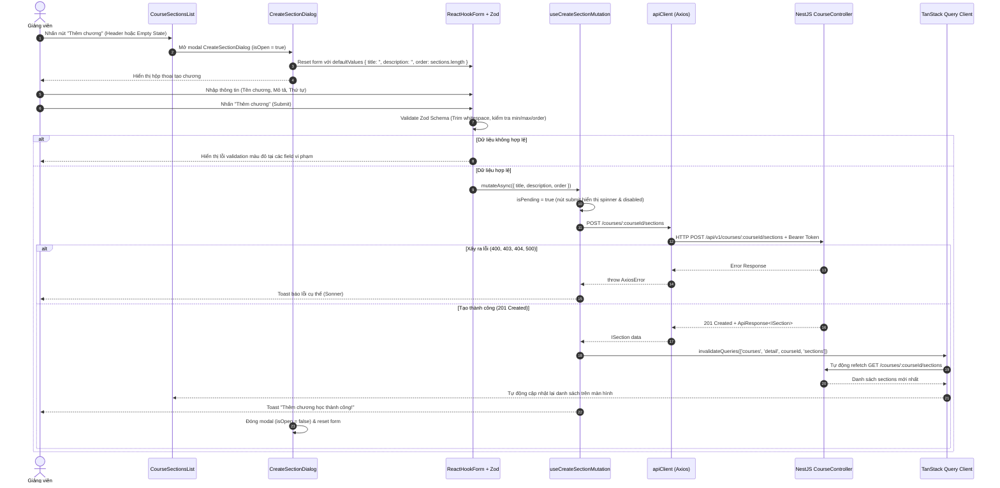

# PLAN: Giao Diện Tạo Chương Học (Create Section UI) Cho Course Detail

> **Mục tiêu:**
> 1. Xây dựng giao diện cho phép Giảng viên thêm Chương học (Section) mới trực tiếp trên trang Chi tiết Khóa học (`/instructor/courses/[id]`).
> 2. Form gồm các trường dữ liệu:
>    - **Tên chương** (`title`): Bắt buộc, chuỗi ký tự (1 - 200 ký tự), tự động chuẩn hóa khoảng trắng thừa (trim).
>    - **Mô tả** (`description`): Không bắt buộc, chuỗi ký tự (tối đa 1000 ký tự).
>    - **Thứ tự** (`order`): Số nguyên không âm ($\ge 0$), tự động gợi ý giá trị mặc định dựa trên số lượng chương hiện có (`sections.length`).
>    - **Nút "Thêm chương"**: Kích hoạt form tạo và thực hiện gửi dữ liệu (kèm trạng thái loading spinner và disabled khi đang gửi).
> 3. Tích hợp API: Khi submit form, gọi HTTP request `POST /courses/:courseId/sections` với payload hợp lệ.
> 4. Đồng bộ dữ liệu màn hình: Khi tạo thành công, tự động làm mới danh sách Section trên màn hình thông qua cơ chế invalidation của TanStack React Query (`courseKeys.sections(courseId)`), đồng thời hiển thị thông báo phản hồi (Toast notification qua `sonner`) và đóng hộp thoại/reset form.
> 5. **Ranh giới nghiêm ngặt (Out of Scope):** Tuyệt đối CHƯA làm các tính năng Sửa (Edit), Xóa (Delete), Kéo thả sắp xếp lại (Reorder) hay Quản lý bài học (Lesson).
>
> **Task Slug:** `create-section-ui`  
> **Plan File:** `docs/PLAN-create-section-ui.md`  
> **Primary Agent:** `project-planner`  
> **Executing Agents:** `frontend-specialist`, `backend-specialist`  
> **Skills:** `clean-code`, `frontend-design`, `react-best-practices`, `api-patterns`  
> **Project Type:** `WEB`

---

## 1. Khảo Sát Hiện Trạng & Ràng Buộc Kiến Trúc (Context Check)

### 1.1. Hiện Trạng Backend & API Contract
- Backend đã triển khai hoàn thiện và có integration test cho API:
  - Route: `POST /api/v1/courses/:courseId/sections` (Controller: [course.controller.ts](file:///d:/Download/hk1_2027/project_do_an/backend/src/modules/course/course.controller.ts)).
  - DTO: `CreateSectionDto` ([create-section.dto.ts](file:///d:/Download/hk1_2027/project_do_an/backend/src/modules/course/dto/create-section.dto.ts)):
    - `title`: `string`, `min: 1`, `max: 200`, trim.
    - `description`: `string`, `max: 1000`, optional, trim.
    - `order`: `number`, `isInt`, `min: 0`.
  - Phân quyền: `@Roles(RoleEnum.INSTRUCTOR, RoleEnum.ADMIN)` + Kiểm tra quyền sở hữu khóa học (`course.instructorId === userId`).
  - Phản hồi chuẩn: `ApiResponse.success(section, 'Tạo chương học thành công')`.

### 1.2. Hiện Trạng Shared Library (`share-lib`)
- Interface `ISection` đã có trong [share-lib/src/interfaces/section.interface.ts](file:///d:/Download/hk1_2027/project_do_an/share-lib/src/interfaces/section.interface.ts).
- **Điểm khuyết thiếu:** `share-lib` chưa định nghĩa và xuất bản interface `ICreateSectionPayload`. Cần bổ sung để tuân thủ quy tắc **Strict Typing & Zero Any** của dự án.

### 1.3. Hiện Trạng Frontend
- Trang Course Detail:
  - URL: `/instructor/courses/[id]` ([page.tsx](file:///d:/Download/hk1_2027/project_do_an/frontend/src/app/instructor/courses/%5Bid%5D/page.tsx)).
  - Component hiển thị: `CourseDetailContent` ([course-detail-content.tsx](file:///d:/Download/hk1_2027/project_do_an/frontend/src/features/course/components/course-detail-content.tsx)).
  - Component danh sách chương: `CourseSectionsList` ([course-sections-list.tsx](file:///d:/Download/hk1_2027/project_do_an/frontend/src/features/course/components/course-sections-list.tsx)).
- API Client & Caching:
  - Hook lấy danh sách: `useCourseSectionsQuery(courseId)` với query key `courseKeys.sections(courseId)`.
  - **Điểm khuyết thiếu:** Chưa có API method `courseApi.createSection` và hook `useCreateSectionMutation(courseId)`.
- UI Components sẵn có:
  - Dialog / Modal: `@/components/ui/dialog` (gồm `Dialog`, `DialogContent`, `DialogHeader`, `DialogTitle`, `DialogDescription`, `DialogFooter`, `DialogClose`).
  - Form Controls: `Input`, `Textarea`, `Button`, `Label`, `Icon` (Lucide Icons).
  - Validation: `react-hook-form` + `@hookform/resolvers/zod` + `zod`.
  - Notifications: `sonner` toast.

---

## 2. Kiến Trúc Luồng Dữ Liệu & UI/UX (Architecture & Design)

### 2.1. Sơ Đồ Trình Tự Toàn Trình (Sequence Diagram)



### 2.2. Lựa Chọn Thiết Kế Giao Diện (Design Decisions)

1. **Vị Trí Nút Kích Hoạt (Trigger Button):**
   - **Header danh sách:** Đặt nút `+ Thêm chương` ở góc phải `CardHeader` của `CourseSectionsList` (kế bên badge đếm số chương).
   - **Empty State:** Khi danh sách chưa có chương nào, thêm nút `+ Thêm chương học đầu tiên` vào khối `course-empty-state` để hướng dẫn giảng viên thao tác ngay.
2. **Hình Thức Form (Presentation):**
   - Sử dụng **Modal Dialog** (`@/components/ui/dialog`) thay vì form chèn trực tiếp (inline).
   - *Lý do:* Giữ giao diện Course Detail gọn gàng, tránh làm xô lệch bố cục trang, và hoàn toàn tuân thủ quy chuẩn `DialogLayout` trong `project-architecture.md`.
3. **Trải Nghiệm Thứ Tự Chương (`order`):**
   - Tự động điền giá trị gợi ý: `defaultOrder = sections ? sections.length : 0`.
   - Giảng viên có thể tùy ý sửa số này nếu muốn chèn vào vị trí khác.
   - Thêm text hướng dẫn nhỏ: *"Số nguyên từ 0 trở lên dùng để sắp xếp thứ tự hiển thị của chương học."*
4. **Phản Hồi & Thao Tác (Feedback & Micro-interactions):**
   - Nút submit: Khi đang gửi dữ liệu, hiển thị icon xoay `lucide:loader-2` và vô hiệu hóa nút (disabled) để chống double-click.
   - Nút "Hủy": Đóng modal và reset form về trạng thái ban đầu.
   - Hỗ trợ đóng modal bằng phím `Escape` hoặc click ra ngoài backdrop.

---

## 3. Cấu Trúc File & Phân Công Nhiệm Vụ

### 3.1. Danh Sách File Liên Quan

| Phân Vùng | File | Hành Động | Trách Nhiệm |
| :--- | :--- | :---: | :--- |
| **share-lib** | `share-lib/src/interfaces/section.interface.ts` | Sửa | Khai báo `ICreateSectionPayload` |
| **share-lib** | `share-lib/src/index.ts` | Kiểm tra | Đảm bảo re-export đầy đủ |
| **frontend** | `frontend/src/features/course/schemas/create-section.schema.ts` | **Tạo mới** | Schema Zod xác thực input form tạo Section |
| **frontend** | `frontend/src/features/course/types/section.types.ts` | **Tạo mới / Sửa** | Kiểu dữ liệu form & payload cho Section |
| **frontend** | `frontend/src/features/course/api/course.api.ts` | Sửa | Thêm `courseApi.createSection` và hook `useCreateSectionMutation` |
| **frontend** | `frontend/src/features/course/components/create-section-dialog.tsx` | **Tạo mới** | Component Modal Dialog chứa Form tạo chương học |
| **frontend** | `frontend/src/features/course/components/course-sections-list.tsx` | Sửa | Thêm nút "Thêm chương" trên Header & Empty State, tích hợp Dialog |
| **frontend** | `frontend/src/features/course/index.ts` | Sửa | Export schema, dialog và hook mới |

---

## 4. Chi Tiết Kế Hoạch Triển Khai (Task Breakdown)

### Task 1: Mở rộng Contract Kiểu Dữ Liệu Trong `share-lib`
- **Mã Task:** `TASK-01-SHARELIB-PAYLOAD`
- **Agent Phụ Trách:** `backend-specialist`
- **Skills:** `clean-code`
- **Priority:** P0 (Nền tảng)
- **Dependencies:** Không
- **Nội dung thực hiện:**
  - Mở [share-lib/src/interfaces/section.interface.ts](file:///d:/Download/hk1_2027/project_do_an/share-lib/src/interfaces/section.interface.ts).
  - Khai báo interface `ICreateSectionPayload`:
    ```typescript
    export interface ICreateSectionPayload {
      title: string;
      description?: string | null;
      order: number;
    }
    ```
  - Chạy build lại package `share-lib` (`pnpm --filter share-lib build`) để các app tiêu thụ nhận được kiểu mới.
- **INPUT → OUTPUT → VERIFY:**
  - **INPUT:** File `section.interface.ts`.
  - **OUTPUT:** File `share-lib/dist/interfaces/section.interface.d.ts` chứa `ICreateSectionPayload`.
  - **VERIFY:** TypeScript không báo lỗi khi import `ICreateSectionPayload` từ `share-lib`.

---

### Task 2: Xây Dựng Zod Schema Xác Thực Form (`create-section.schema.ts`)
- **Mã Task:** `TASK-02-ZOD-VALIDATION`
- **Agent Phụ Trách:** `frontend-specialist`
- **Skills:** `clean-code`, `frontend-design`
- **Priority:** P1
- **Dependencies:** `TASK-01-SHARELIB-PAYLOAD`
- **Nội dung thực hiện:**
  - Tạo file `frontend/src/features/course/schemas/create-section.schema.ts`.
  - Quy định các ràng buộc:
    - `title`: `z.string().transform(v => v.trim()).pipe(z.string().min(1, 'Tiêu đề chương học không được để trống').max(200, 'Tiêu đề chương học không được vượt quá 200 ký tự'))`.
    - `description`: `z.string().transform(v => v.trim()).pipe(z.string().max(1000, 'Mô tả chương học không được vượt quá 1000 ký tự')).optional().or(z.literal(''))`.
    - `order`: `z.coerce.number({ message: 'Thứ tự chương học phải là số hợp lệ' }).int('Thứ tự chương học phải là số nguyên').min(0, 'Thứ tự chương học phải từ 0 trở lên')`.
  - Export type `CreateSectionFormData = z.infer<typeof createSectionSchema>`.
- **INPUT → OUTPUT → VERIFY:**
  - **INPUT:** Yêu cầu validation và backend DTO rules.
  - **OUTPUT:** File schema Zod hoàn chỉnh.
  - **VERIFY:** Schema parse đúng chuỗi rỗng / khoảng trắng, reject số âm hoặc số thực cho `order`.

---

### Task 3: Bổ Sung API Call & Mutation Hook (`course.api.ts`)
- **Mã Task:** `TASK-03-API-MUTATION`
- **Agent Phụ Trách:** `frontend-specialist`
- **Skills:** `api-patterns`, `react-best-practices`
- **Priority:** P1
- **Dependencies:** `TASK-01-SHARELIB-PAYLOAD`
- **Nội dung thực hiện:**
  - Tại [frontend/src/features/course/api/course.api.ts](file:///d:/Download/hk1_2027/project_do_an/frontend/src/features/course/api/course.api.ts):
  - Thêm phương thức vào object `courseApi`:
    ```typescript
    async createSection(courseId: string, payload: ICreateSectionPayload): Promise<ISection> {
      const res = await apiClient.post<IApiResponse<ISection>>(`/courses/${courseId}/sections`, payload);
      return res.data.data;
    },
    ```
  - Viết hook `useCreateSectionMutation(courseId: string)`:
    - Xử lý `onSuccess`:
      - Gọi `queryClient.invalidateQueries({ queryKey: courseKeys.sections(courseId) })`.
      - Hiển thị toast `toast.success('Thêm chương học thành công!', { description: ... })`.
    - Xử lý `onError`:
      - Bắt lỗi HTTP status (400, 401, 403, 404, 500) và hiển thị toast `toast.error(...)` tương ứng, thân thiện với người dùng.
- **INPUT → OUTPUT → VERIFY:**
  - **INPUT:** `courseApi` và `courseKeys`.
  - **OUTPUT:** Hook `useCreateSectionMutation`.
  - **VERIFY:** Hook gọi đúng route `/courses/:courseId/sections` và trigger invalidation đúng query key.

---

### Task 4: Tạo Component `CreateSectionDialog`
- **Mã Task:** `TASK-04-SECTION-DIALOG-UI`
- **Agent Phụ Trách:** `frontend-specialist`
- **Skills:** `frontend-design`, `react-best-practices`, `clean-code`
- **Priority:** P1
- **Dependencies:** `TASK-02-ZOD-VALIDATION`, `TASK-03-API-MUTATION`
- **Nội dung thực hiện:**
  - Tạo file `frontend/src/features/course/components/create-section-dialog.tsx`.
  - Nhận props:
    ```typescript
    interface CreateSectionDialogProps {
      courseId: string;
      open: boolean;
      onOpenChange: (open: boolean) => void;
      defaultOrder?: number;
    }
    ```
  - Cấu trúc giao diện:
    - Dùng `Dialog`, `DialogContent`, `DialogHeader`, `DialogTitle`, `DialogDescription`, `DialogFooter`.
    - Form gắn `useForm<CreateSectionFormData>` với `zodResolver(createSectionSchema)`.
    - Tự động cập nhật `defaultValues.order = defaultOrder ?? 0` khi dialog mở.
    - Trường `title`: Input text, placeholder *"Ví dụ: Chương 1: Tổng quan về TypeScript"*, hiển thị lỗi nếu có.
    - Trường `description`: Textarea, rows={3}, placeholder *"Tóm tắt mục tiêu hoặc nội dung của chương học..."*, hiển thị lỗi nếu có.
    - Trường `order`: Input type="number", min={0}, step={1}, hiển thị lỗi nếu có.
    - Footer: Nút "Hủy" (đóng dialog) và Nút "Thêm chương" (Button type="submit", variant="default", hiển thị icon spinner khi pending).
    - Sau khi mutation thành công: Reset form và đóng modal qua `onOpenChange(false)`.
- **INPUT → OUTPUT → VERIFY:**
  - **INPUT:** UI components trong `@/components/ui` và hook mutation.
  - **OUTPUT:** Component `CreateSectionDialog`.
  - **VERIFY:** Render đẹp mắt, responsive, hỗ trợ phím Escape / click outside, hiển thị lỗi chuẩn chỉ.

---

### Task 5: Tích Hợp Vào `CourseSectionsList`
- **Mã Task:** `TASK-05-INTEGRATE-SECTIONS-LIST`
- **Agent Phụ Trách:** `frontend-specialist`
- **Skills:** `frontend-design`, `clean-code`
- **Priority:** P2
- **Dependencies:** `TASK-04-SECTION-DIALOG-UI`
- **Nội dung thực hiện:**
  - Cập nhật [frontend/src/features/course/components/course-sections-list.tsx](file:///d:/Download/hk1_2027/project_do_an/frontend/src/features/course/components/course-sections-list.tsx):
    - Khởi tạo state `isCreateDialogOpen` quản lý mở/đóng dialog.
    - Thêm nút "Thêm chương" (`Button`) trên `CardHeader`:
      ```tsx
      <Button
        size="sm"
        onClick={() => setIsCreateDialogOpen(true)}
        className="gap-1.5"
      >
        <Icon icon="lucide:plus" className="size-4" />
        Thêm chương
      </Button>
      ```
    - Cập nhật khối Empty State: Bổ sung nút hành động "Thêm chương học đầu tiên" để khuyến khích giảng viên tạo ngay nếu danh sách rỗng.
    - Tính toán `nextOrder = sections ? sections.length : 0` truyền vào `defaultOrder` của `CreateSectionDialog`.
    - Gắn `CreateSectionDialog` vào cuối component.
  - Cập nhật barrel file [frontend/src/features/course/index.ts](file:///d:/Download/hk1_2027/project_do_an/frontend/src/features/course/index.ts).
- **INPUT → OUTPUT → VERIFY:**
  - **INPUT:** `CourseSectionsList` hiện tại và `CreateSectionDialog`.
  - **OUTPUT:** Giao diện chi tiết khóa học có đầy đủ nút và modal tạo chương học.
  - **VERIFY:** Bấm nút mở dialog, nhập dữ liệu hợp lệ, submit -> dialog đóng, danh sách cập nhật ngay chương học mới mà không cần F5 trình duyệt.

---

## 5. Quy Chuẩn Đảm Bảo Chất Lượng & Ràng Buộc (Quality Gates & Constraints)

1. **Zero Any Violation:**
   - Tuyệt đối không dùng `any` trong toàn bộ code mới. Tất cả props, payload và response phải được định kiểu tường minh từ `share-lib` và `zod`.
2. **Tuân thủ Typography & Design Rules:**
   - Không chèn class phông chữ ad-hoc (`font-sans`, `font-serif`).
   - Tuyệt đối tuân thủ Purple Ban (không dùng dải màu tím/violet). Dùng màu theo token hệ thống: `primary`, `foreground`, `muted-foreground`, `border`.
3. **Bảo toàn tính toàn vẹn:**
   - Không can thiệp sửa đổi các tính năng đang chạy bình thường (Course Detail Card, Status Badges, Quick Stats).
   - Tuyệt đối không thêm code giả lập (mock data) hoặc tính năng ngoài phạm vi (chỉnh sửa, xóa, reorder, bài học).

---

## 6. Giai Đoạn Kiểm Thử & Nghiệm Thu (Phase X Verification)

- [x] **Type Check & Lint:**
  - `pnpm --filter share-lib build`: ✅ Pass
  - `pnpm --filter frontend exec tsc --noEmit`: ✅ Pass (0 errors)
  - `pnpm --filter frontend lint`: ✅ Pass (0 errors, 0 warnings)
  - `pnpm --filter backend exec tsc --noEmit`: ✅ Pass (0 errors)
- [x] **Kiểm thử giao diện & luồng nghiệp vụ trên trình duyệt:**
  1. Truy cập trang `/instructor/courses/[id]`.
  2. Bấm nút **"Thêm chương"** trên thanh tiêu đề `Nội dung khóa học` hoặc nút **"Thêm chương học đầu tiên"** tại Empty State.
  3. Modal hiển thị đầy đủ 3 trường: *Tên chương*, *Mô tả*, *Thứ tự*. Trường *Thứ tự* được điền sẵn số tự động tăng (`sections.length`).
  4. Thử submit form trống → Kiểm tra validation báo lỗi đỏ *"Tiêu đề chương học không được để trống"*.
  5. Thử nhập khoảng trắng toàn bộ → Kiểm tra bộ lọc trim từ chối dữ liệu rỗng.
  6. Nhập dữ liệu hợp lệ:
     - Tên chương: *"Chương 1: Giới thiệu khóa học"*
     - Mô tả: *"Nội dung tổng quan về định hướng và công cụ cần chuẩn bị."*
     - Thứ tự: `0`
  7. Bấm **"Thêm chương"**:
     - Nút submit chuyển sang trạng thái pending kèm spinner `lucide:loader-2` và nhãn `"Đang thêm..."`.
     - API `POST /courses/:courseId/sections` được gọi với HTTP 201 Created.
     - Toast thông báo *"Thêm chương học thành công!"* xuất hiện ở góc màn hình.
     - Modal tự động đóng lại và reset form.
     - Danh sách chương học lập tức cập nhật chương vừa tạo với số thứ tự `01`, tên chương và mô tả tương ứng.

## ✅ PHASE X COMPLETE

- Typecheck & Build: ✅ Pass (Monorepo 0 errors)
- ESLint: ✅ Pass (0 warnings, 0 errors)
- Design Compliance: ✅ Pass (No purple, no inline font classes, consistent modal system)
- Date: 2026-09-29

