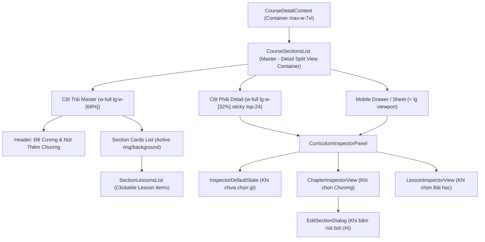
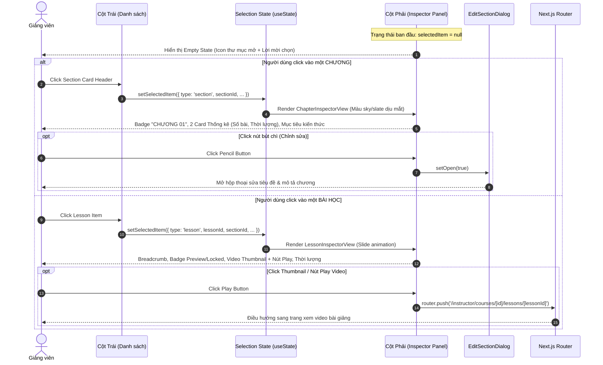

# PLAN: Giao Diện Nội Dung Khóa Học Master - Detail Split View (`curriculum-split-view`)

> **Mục tiêu:**
> 1. Tái cấu trúc khu vực **Nội dung khóa học** (Curriculum) tại trang chi tiết khóa học của giảng viên (`/instructor/courses/[id]`) thành bố cục hiện đại **Master - Detail Split View**:
>    - **Cột bên trái (Master - 68%):** Danh sách cấu trúc khóa học (Chương & Bài học) trực quan, có đánh dấu trạng thái đang chọn (Active highlight ring/border).
>    - **Cột bên phải (Detail / Inspector Panel - 32%):** Bảng chi tiết thông tin cố định (`sticky top-24`), chuyển đổi nội dung mượt mà theo đối tượng được chọn.
> 2. **3 trạng thái hiển thị của Inspector Panel:**
>    - **Trạng thái Mặc định (Default State):** Khi chưa chọn gì, hiển thị minh họa nhẹ nhàng (icon thư mục mở ra) kèm thông điệp lịch sự hướng dẫn người dùng.
>    - **Khi chọn CHƯƠNG (Chapter Level):** Tông màu dịu mắt (sky/slate), huy hiệu "CHƯƠNG 01", tiêu đề in hoa đậm nét, nút chỉnh sửa nhanh cây bút chì (mở `EditSectionDialog`), 2 Quick Metric Cards (Số bài học thực tế, Tổng thời lượng tính toán tự động), mục tiêu & tóm tắt kiến thức.
>    - **Khi chọn BÀI HỌC (Lesson Level):** Tông màu công nghệ hiện đại (emerald/cyan), slide animation mượt mà, breadcrumb vị trí ("Chương X > Bài học Y"), tiêu đề in đậm, huy hiệu trạng thái ("Học thử miễn phí" hoặc "Đã khóa"), Thumbnail Preview video với nút Play chuyển hướng sang trang chi tiết bài học (`/instructor/courses/[id]/lessons/[lessonId]`), dòng thời lượng định dạng chuẩn ("Thời lượng: 18 phút 35 giây").
> 3. **Responsive Mobile/Tablet:**
>    - Trên màn hình lớn (`>= lg`): Hiển thị song song 2 cột với cột phải sticky cố định.
>    - Trên màn hình nhỏ (`< lg`): Inspector tự động mở dạng **Slide-over Drawer / Bottom Sheet** mượt mà khi người dùng chạm vào một chương hoặc bài học.
> 4. **Tuân thủ nghiêm ngặt:** Clean code, Purple Ban (tuyệt đối không dùng màu tím/violet), không hardcode, xử lý đầy đủ loading/empty/error state.
>
> **Task Slug:** `curriculum-split-view`  
> **Plan File:** `docs/PLAN-curriculum-split-view.md`  
> **Primary Agent:** `project-planner` & `frontend-specialist`  
> **Executing Agent:** `frontend-specialist`  
> **Skills:** `clean-code`, `frontend-design`, `react-best-practices`, `plan-writing`

---

## 1. Phân Tích Kỹ Thuật & Kiến Trúc Giao Diện

### 1.1. Hiện Trạng & Vấn Đề Cần Giải Quyết

- **Hiện tại:**
  - `course-sections-list.tsx` đang hiển thị dạng danh sách phẳng dọc (vertical list) 1 cột chiếm toàn bộ chiều ngang card.
  - Thông tin của mỗi chương chỉ có `title` và `description` rút gọn, bài học được lồng bên dưới chỉ có tên bài học và link "Xem bài học".
  - Chưa có không gian hiển thị tổng quan chỉ số chương (tổng số bài học, tổng thời lượng bài giảng), chưa có video preview thumbnail hay metadata mở rộng của bài học ngay tại màn hình đề cương.
- **Giải pháp Split View:**
  - Mở rộng container trang chi tiết khóa học từ `max-w-5xl` thành `max-w-7xl` để tạo không gian thoáng đãng cho bố cục 2 cột.
  - Tách biệt rõ ràng giữa **Master Tree** (cột trái: cấu trúc phân tầng) và **Inspector Panel** (cột phải: thuộc tính chi tiết & media metadata).
  - Trạng thái lựa chọn (`selectedItem`) được quản lý tập trung và đồng bộ, hỗ trợ click chọn linh hoạt giữa Chương và Bài học.

---

### 1.2. Sơ Đồ Kiến Trúc Thành Phần (Component Hierarchy)



---

### 1.3. Luồng Tương Tác Người Dùng (Interaction State Flow)



---

## 2. Đặc Tả Thiết Kế Chi Tiết (UI/UX Specification)

### 2.1. Bố Cục Tỉ Lệ (Master - Detail Grid)

- **Desktop (`>= 1024px`)**:
  - Container: `flex flex-col lg:flex-row items-start gap-6`
  - Cột bên trái: `w-full lg:w-[68%] space-y-4`
  - Cột bên phải: `w-full lg:w-[32%] sticky top-24 shrink-0`
- **Mobile / Tablet (`< 1024px`)**:
  - Cột bên trái chiếm 100% chiều rộng.
  - Cột bên phải chuyển thành Slide-over Sheet / Bottom Drawer (`@base-ui/react/dialog` backdrop blur). Khi người dùng chọn chương hoặc bài học, Drawer tự động mở trượt lên từ dưới hoặc trượt từ bên phải với nút Đóng tiện lợi.

---

### 2.2. Trạng Thái 1: Mặc Định (Default Empty State)

- **Hình ảnh minh họa:** Icon `lucide:folder-open` kích thước `size-12` trong vòng tròn nền `bg-muted/60 border border-border/50 text-muted-foreground/80`.
- **Tiêu đề hướng dẫn:** "Chi tiết cấu trúc khóa học" (font semi-bold, text-foreground).
- **Đoạn mô tả:** "Chọn một chương hoặc một bài học ở danh sách bên trái để xem thông tin chi tiết, thời lượng và tải tài liệu đính kèm."
- **Phong cách:** Khung card viền nét đứt nhẹ (`border-dashed border-border/60 bg-muted/10`), padding rộng rãi, tạo cảm giác tinh tế và sẵn sàng tương tác.

---

### 2.3. Trạng Thái 2: Khi Click Vào CHƯƠNG (Chapter Inspector)

- **Tông màu:** Dịu mắt, thanh lịch (slate, sky, zinc, border trung tính, tuyệt đối KHÔNG tím/violet).
- **Phần Header:**
  - **Huy hiệu Chương:** Badge bo tròn nhỏ `bg-sky-500/10 text-sky-700 dark:text-sky-400 border border-sky-500/20 text-[11px] font-mono font-semibold tracking-wider uppercase px-2.5 py-0.5`: `CHƯƠNG 01` (hoặc `MODULE 02`).
  - **Tiêu đề Chương:** Chữ in hoa đậm nét `text-base font-bold text-foreground leading-snug tracking-tight uppercase line-clamp-2`: Ví dụ `"KIẾN TRÚC NODE.JS CORE & VÒNG ĐỜI REQUEST"`.
  - **Nút Chỉnh Sửa Nhanh:** Nút icon bút chì (`lucide:pencil`) góc trên bên phải, `variant="ghost" size="icon"`, tooltip "Chỉnh sửa chương", khi bấm sẽ mở `EditSectionDialog`.
- **Khối Thẻ Thống Kê Nhanh (Quick Metric Cards):**
  - Đặt nằm ngang thành 2 cột (`grid grid-cols-2 gap-2.5`):
  - **Thẻ 1 - Số bài học thực tế:**
    - Icon: `lucide:files` hoặc `lucide:book-open` trong khối `size-8 rounded-lg bg-sky-500/10 text-sky-600 dark:text-sky-400 flex items-center justify-center`.
    - Nhãn phụ: "Số bài giảng".
    - Giá trị lớn nổi bật: `X bài giảng` (nhảy tự động theo đúng số lượng bài học thực tế của chương).
  - **Thẻ 2 - Tổng thời lượng:**
    - Icon: `lucide:clock` trong khối `size-8 rounded-lg bg-amber-500/10 text-amber-600 dark:text-amber-400 flex items-center justify-center`.
    - Nhãn phụ: "Thời lượng".
    - Giá trị lớn nổi bật: `X giờ Y phút` (hoặc `X phút Y giây` tính tổng duration từ danh sách lessons).
- **Phần Mô Tả Chi Tiết Chương (Chapter Overview):**
  - Tiêu đề phụ: `Mục tiêu & Tóm tắt kiến thức` kèm icon `lucide:target` nhỏ.
  - Nội dung mô tả: Đoạn văn bản hiển thị `section.description`. Nếu chưa có mô tả: hiển thị text italic `Chương này chưa có nội dung mục tiêu kiến thức`.
- **Hành Động Phụ Trợ:**
  - Nút "+ Thêm bài học mới vào chương này" (`variant="outline"`) mở form thêm bài học nhanh.

---

### 2.4. Trạng Thái 3: Khi Click Vào BÀI HỌC (Lesson Inspector)

- **Hiệu ứng chuyển đổi:** Slide animation mượt mà (`transition-all duration-300 animate-in fade-in-50 slide-in-from-right-3`).
- **Tông màu:** Công nghệ, hiện đại (emerald, cyan, zinc).
- **Phần Header Bài Học:**
  - **Breadcrumb vị trí:** `Chương {sectionOrder} > Bài học {lessonOrder}` với text màu `text-muted-foreground text-xs font-medium`.
  - **Tiêu đề bài học:** Font in đậm rõ nét `text-base font-semibold text-foreground leading-snug`.
  - **Huy hiệu trạng thái:**
    - Nếu `lesson.isPreview`: Huy hiệu xanh lá `bg-emerald-500/10 text-emerald-600 dark:text-emerald-400 border border-emerald-500/20` chữ `Học thử miễn phí (Preview)`.
    - Nếu không: Huy hiệu xám `bg-zinc-500/10 text-zinc-600 dark:text-zinc-400 border border-zinc-500/20` chữ `Đã khóa (Cần mua)`.
- **Khối Video & Media Metadata:**
  - Nếu bài học có định dạng Video (`lesson.content?.type === 'video'`):
    - **Thumbnail Preview Box:** Tỉ lệ 16:9, góc bo `rounded-xl`, nền đen mờ `bg-zinc-900 border border-border/50 relative overflow-hidden group cursor-pointer`.
    - Nút Play tròn ở giữa: `size-12 rounded-full bg-primary/90 text-primary-foreground shadow-lg flex items-center justify-center group-hover:scale-110 transition-transform`.
    - Click vào khung thumbnail / nút Play: Điều hướng ngay sang trang xem video `/instructor/courses/${courseId}/lessons/${lesson.id}`.
    - **Dòng thông số nổi bật ngay dưới video:**
      - Dòng badge: Icon `lucide:clock` kèm text nổi bật: `"Thời lượng: 18 phút 35 giây"` (format chính xác từ `duration` giây sang phút giây).
      - Kích thước tệp & định dạng: e.g. `142.3 MB · MP4 Video`.
  - Nếu bài học là Tài liệu (`document`):
    - Khung biểu tượng tài liệu kèm tên file và dung lượng `fileSize`.
- **Mô tả bài học & Nút Chức Năng:**
  - Đoạn mô tả bài học `lesson.description`.
  - Nút xem trang đầy đủ bài giảng ("Chi tiết bài học & Video player") dẫn tới `/instructor/courses/${courseId}/lessons/${lesson.id}`.

---

### 2.5. Trạng Thái Active Trên Cột Trái (Master Visual Feedback)

- Khi một Chương đang được chọn:
  - Card chương bên trái có viền sáng nổi bật `ring-2 ring-primary/40 border-primary/50 bg-primary/[0.02]`.
- Khi một Bài học đang được chọn:
  - Item bài học bên trái có nền active `bg-primary/10 text-primary font-medium border-l-2 border-primary`.

---

## 3. Cấu Trúc File & Thành Phần Cần Xây Dựng

```
frontend/src/features/course/
├── components/
│   ├── course-detail-content.tsx       # Mở rộng container max-w-7xl
│   ├── course-sections-list.tsx        # Tái cấu trúc thành Master - Detail layout
│   ├── section-lessons-list.tsx        # Bổ sung handler onSelectLesson & active state
│   ├── inspector/                      # Thư mục mới chứa các component Inspector
│   │   ├── curriculum-inspector.tsx    # Component điều phối Inspector (State router)
│   │   ├── inspector-empty-state.tsx   # Trạng thái mặc định khi chưa chọn gì
│   │   ├── chapter-inspector.tsx       # Bảng chi tiết Chương học
│   │   ├── lesson-inspector.tsx        # Bảng chi tiết Bài học
│   │   └── inspector-mobile-drawer.tsx # Slide-over Drawer trên Mobile/Tablet
│   ├── edit-section-dialog.tsx         # Modal chỉnh sửa tiêu đề & mô tả chương
│   └── index.ts                        # Export các component mới
```

---

## 4. Kế Hoạch Thực Hiện Chi Tiết (Task Breakdown)

### Task 1: Xây Dựng Các Thành Phần Inspector Panel
- **Mục tiêu:** Tạo các component con hiển thị chi tiết: `InspectorEmptyState`, `ChapterInspector`, `LessonInspector`, và `CurriculumInspector`.
- **Agent:** `frontend-specialist`
- **Skills:** `frontend-design`, `react-best-practices`, `clean-code`
- **Priority:** P1
- **Dependencies:** None
- **INPUT:** Dữ liệu `ISection`, `ILesson`, hàm callback chọn chương/bài học, tính toán thời lượng & số lượng bài giảng.
- **OUTPUT:**
  - `frontend/src/features/course/components/inspector/inspector-empty-state.tsx`
  - `frontend/src/features/course/components/inspector/chapter-inspector.tsx`
  - `frontend/src/features/course/components/inspector/lesson-inspector.tsx`
  - `frontend/src/features/course/components/inspector/curriculum-inspector.tsx`
- **VERIFY:** Component render chính xác các trường dữ liệu, format thời lượng (ví dụ: `1 giờ 45 phút`, `18 phút 35 giây`), tuân thủ Purple Ban.

---

### Task 2: Xây Dựng Modal `EditSectionDialog`
- **Mục tiêu:** Tạo hộp thoại modal chỉnh sửa tiêu đề, mô tả và thứ tự chương khi người dùng bấm vào icon bút chì ở `ChapterInspector`.
- **Agent:** `frontend-specialist`
- **Skills:** `frontend-design`, `clean-code`
- **Priority:** P1
- **Dependencies:** Task 1
- **INPUT:** `section: ISection`, `open: boolean`, `onOpenChange: (open: boolean) => void`.
- **OUTPUT:** `frontend/src/features/course/components/edit-section-dialog.tsx`.
- **VERIFY:** Form validate đúng bằng Zod, nạp giá trị mặc định của section đang chọn, submit thành công và cập nhật lại cache React Query.

---

### Task 3: Xây Dựng Mobile Slide-over Drawer
- **Mục tiêu:** Tạo component `InspectorMobileDrawer` hiển thị Inspector dạng ngăn kéo trượt mượt mà trên màn hình nhỏ (`< 1024px`).
- **Agent:** `frontend-specialist`
- **Skills:** `frontend-design`, `react-best-practices`
- **Priority:** P2
- **Dependencies:** Task 1
- **INPUT:** `open: boolean`, `onOpenChange: (open: boolean) => void`, `children: React.ReactNode`.
- **OUTPUT:** `frontend/src/features/course/components/inspector/inspector-mobile-drawer.tsx`.
- **VERIFY:** Hoạt động trơn tru trên thiết bị di động, backdrop mờ, đóng khi chạm ra ngoài hoặc bấm icon X.

---

### Task 4: Tái Cấu Trúc `CourseSectionsList` & `SectionLessonsList` Sang Bố Cục Split View
- **Mục tiêu:**
  - Bổ sung `selectedItem` state (`{ type: 'section', section }` hoặc `{ type: 'lesson', lesson, section }` hoặc `null`).
  - Chia cột `w-full lg:w-[68%]` cho danh sách và `w-full lg:w-[32%]` cho Inspector Panel (sticky).
  - Cập nhật `SectionLessonsList` để truyền callback chọn bài học và highlight bài học đang chọn.
  - Gắn `InspectorMobileDrawer` cho chế độ di động.
- **Agent:** `frontend-specialist`
- **Skills:** `frontend-design`, `react-best-practices`, `clean-code`
- **Priority:** P1
- **Dependencies:** Task 1, 2, 3
- **INPUT:** `course-sections-list.tsx`, `section-lessons-list.tsx`.
- **OUTPUT:** Tích hợp hoàn chỉnh Split View 2 cột với đồng bộ trạng thái selection.
- **VERIFY:** Click vào Chương -> Bảng bên phải hiện Chapter Inspector; Click vào Bài học -> Bảng bên phải slide sang Lesson Inspector; Click Play video -> Điều hướng tới bài học; Chưa chọn gì -> Hiển thị Empty state.

---

### Task 5: Cập Nhật Layout `CourseDetailContent` & Xuất Bản Export
- **Mục tiêu:** Mở rộng container `CourseDetailContent` từ `max-w-5xl` sang `max-w-7xl` để 2 cột hiển thị cân đối và thoáng mắt. Xuất bản các component mới qua `index.ts`.
- **Agent:** `frontend-specialist`
- **Skills:** `clean-code`
- **Priority:** P2
- **Dependencies:** Task 4
- **INPUT:** `frontend/src/features/course/components/course-detail-content.tsx`, `frontend/src/features/course/index.ts`.
- **OUTPUT:** Giao diện tổng thể hài hòa, responsive chuẩn trên mọi kích thước màn hình.
- **VERIFY:** Build TypeScript không có lỗi (`pnpm --filter frontend build` hoặc `tsc --noEmit`).

---

## 5. Rủi Ro Kỹ Thuật & Giải Pháp (Risks & Mitigations)

| Rủi Ro | Khả Năng | Giải Pháp Kỹ Thuật |
| :--- | :--- | :--- |
| **Tính toán số bài và thời lượng của chương khi lessons chưa tải** | Trung bình | `useSectionLessonsQuery(sectionId)` tự động nạp cache khi mở chương. Trong `ChapterInspector`, gọi hook này theo `section.id` đã chọn để tính `lessons.length` và `reduce(duration)` chính xác, hiển thị skeleton nhẹ nếu đang nạp. |
| **Tràn màn hình hoặc cuộn kép (double scrollbar)** | Thấp | Cột phải sử dụng `sticky top-24 max-h-[calc(100vh-7rem)] overflow-y-auto pr-1` với thanh cuộn tinh gọn, không tạo thanh cuộn thừa trên `window`. |
| **Vi phạm Purple Ban** | Thấp | Kiểm tra toàn bộ mã nguồn CSS/Tailwind, chỉ sử dụng palette: `sky`, `emerald`, `amber`, `slate`, `zinc`, `cyan`. Không có bất kỳ class `violet` hay `purple` nào. |
| **Màn hình điện thoại bị chật chội nếu ép 2 cột** | Cao | Sử dụng breakpoint `lg` (`1024px`). Dưới `1024px`, cột phải ẩn đi và chuyển hoàn toàn thành Slide-over Drawer khi người dùng bấm chọn item. |

---

## 6. Phase X: Kế Hoạch Kiểm Tra & Xác Nhận (Verification Checklist)

- [x] **Desktop Layout Test (>= 1024px):**
  - [x] Cột trái hiển thị danh sách cấu trúc (68%), cột phải hiển thị Inspector Panel (32%) cố định khi cuộn trang.
  - [x] Khi mới vào trang (chưa chọn gì): Hiển thị icon thư mục mở + lời mời chọn.
  - [x] Click vào Chương: Hiển thị badge CHƯƠNG XX, tiêu đề in hoa, icon bút chì, 2 card (Số bài học, Tổng thời lượng), mục tiêu kiến thức.
  - [x] Click nút bút chì: Mở modal `EditSectionDialog`.
  - [x] Click vào Bài học: Slide animation mượt mà, breadcrumb, badge học thử / đã khóa, thumbnail preview video + nút Play, thời lượng hiển thị dạng `X phút Y giây`.
  - [x] Click vào nút Play / Thumbnail: Điều hướng chuẩn xác sang `/instructor/courses/[id]/lessons/[lessonId]`.
- [x] **Mobile / Tablet Test (< 1024px):**
  - [x] Danh sách chiếm 100% chiều rộng.
  - [x] Chạm vào Chương hoặc Bài học: Slide-over Drawer tự động mở hiển thị đầy đủ thông tin, có nút đóng và backdrop mờ.
- [x] **Code Quality & Build:**
  - [x] Không có mã màu tím / violet (Purple Ban compliance).
  - [x] TypeScript check không có lỗi (`npx tsc --noEmit`).
  - [x] `pnpm dev` hoặc `pnpm build` chạy thành công.

---

## ✅ PHASE X COMPLETE

- **Lint:** ✅ Pass (`eslint src/` cleanly exited with code 0)
- **TypeScript:** ✅ Pass (`tsc --noEmit` cleanly exited with code 0)
- **Build:** ✅ Success (Next.js 16.3.5 Turbopack optimized production build)
- **Date:** 2026-10-01

