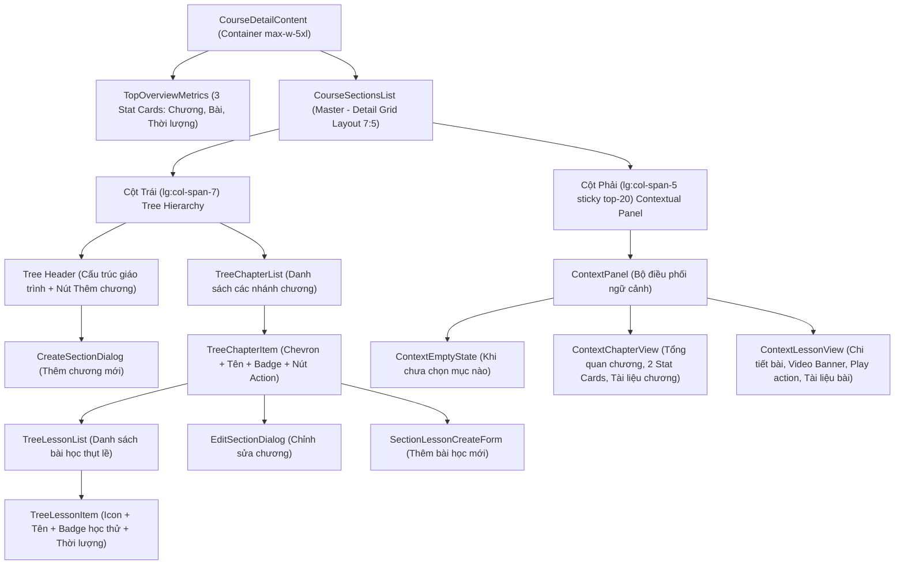

# PLAN: Cấu Trúc Cây Phân Cấp Khóa Học & Contextual Inspector Studio (`curriculum-tree-studio`)

> **Mục tiêu:**
> 1. Tái cấu trúc khu vực **Nội dung khóa học** (Curriculum) theo mô hình **Course Studio Master - Detail**:
>    - **Thanh Thông Số Tổng Quan (Top Metric Bar):** 3 thẻ chỉ số nhanh ở đầu (`Tổng số chương`, `Tổng bài giảng`, `Thời lượng học`).
>    - **Cột Trái (Master Tree - `lg:col-span-7`):** Cây phân cấp (Tree Hierarchy) trực quan từ Khóa học → Chương / Module → Bài học / Lecture.
>      - Cho phép **đóng/mở (expand/collapse)** linh hoạt từng nhánh chương với icon chevron xoay mượt mà.
>      - **Mặc định khi vừa vào trang:** Tất cả các chương đều thu gọn (**All Collapsed**) theo lựa chọn của người dùng.
>      - Khi click vào một Chương: Đánh dấu active (`border-sky-500 ring-2 ring-sky-500/10`), đổi ngữ cảnh cột phải sang Chi tiết Chương.
>      - Khi click vào một Bài học: Đánh dấu active (`bg-sky-500/10 border-l-4 border-sky-500`), đổi ngữ cảnh cột phải sang Chi tiết Bài học.
>    - **Cột Phải (Contextual Inspector - `lg:col-span-5` sticky top-20):**
>      - Bảng thông tin cố định trong lưới (không dùng drawer hay overlay lướt ra), thay đổi nội dung linh hoạt theo ngữ cảnh được chọn:
>        - **Khi chọn Chương:** Header badge "Tổng quan chương", tiêu đề & mô tả, 2 thẻ chỉ số thực tế (`Số bài giảng thực tế`, `Tổng thời lượng`), danh sách tài liệu chung của chương.
>        - **Khi chọn Bài học:** Header badge "Chi tiết bài học", breadcrumb chương, tiêu đề & mô tả, khung phát thử video (Preview Box) với nút Play chuyển sang trang bài học, trạng thái khóa/học thử, danh sách tài liệu riêng của bài học.
>        - **Khi chưa chọn gì:** Thông báo nhẹ nhàng kèm icon chỉ tay hướng dẫn chọn chương hoặc bài học bên trái.
> 2. **Tích hợp hộp thoại chỉnh sửa:** Nút icon bút chì (`lucide:pencil`) tại Header chương mở `EditSectionDialog`, nút `+ Thêm bài` mở `SectionLessonCreateForm`.
> 3. **Tuân thủ quy chuẩn dự án:** Clean code, Purple Ban (thay thế màu tím bằng bảng màu `sky`, `slate`, `emerald`, `amber`, `zinc`), Next.js 16 App Router, React 19, Base UI dialogs, React Query.
>
> **Task Slug:** `curriculum-tree-studio`  
> **Plan File:** `docs/PLAN-curriculum-tree-studio.md`  
> **Primary Agent:** `project-planner` & `frontend-specialist`  
> **Executing Agent:** `frontend-specialist`  
> **Skills:** `clean-code`, `frontend-design`, `react-best-practices`, `plan-writing`

---

## 1. Phân Tích Kỹ Thuật & Cấu Trúc Thành Phần

### 1.1. Hiện Trạng & Kiến Trúc Mới

- **Bản mẫu HTML được cung cấp:**
  - Mô hình Studio chuẩn mực: Danh sách cây phân cấp Master bên trái (chiếm 7 phần) và Inspector Panel Detail bên phải (chiếm 5 phần, sticky top-20).
  - Tách biệt rõ 4 cấp phả hệ:
    - **Cấp 1 (Root):** Khóa học với 3 metric cards tổng quan.
    - **Cấp 2 (Chương):** Khối card có nút chevron đóng/mở, tên chương, badge số lượng bài & thời lượng, nút Thêm bài, nút Sửa chương.
    - **Cấp 3 (Bài học):** Hàng bài học thụt lề (`pl-8 sm:pl-10`), icon loại bài giảng (video/tài liệu), tên bài học, badge "Học thử", thời lượng phút.
    - **Cấp 4 (Tài nguyên & Nội dung cốt lõi):** Được hiển thị tập trung tại Inspector Panel bên phải để giữ cây bên trái luôn thanh thoát, scannable và không bị rối mắt.

---

### 1.2. Sơ Đồ Cấu Trúc Giao Diện (Component Hierarchy)



---

### 1.3. Mô Hình Quản Lý State (State Management Contract)

```typescript
// Định nghĩa đối tượng đang được chọn ở Cột Phải
export type ContextSelection =
  | { type: 'chapter'; chapterId: string }
  | { type: 'lesson'; lessonId: string; chapterId: string }
  | null;

// Quản lý trạng thái đóng/mở của từng chương (mặc định tất cả đóng)
// Record<chapterId, boolean> (false = collapsed, true = expanded)
type ExpandedChaptersState = Record<string, boolean>;
```

---

## 2. Đặc Tả Giao Diện Chi Tiết (UI/UX Specification)

### 2.1. Thanh Thông Số Tổng Quan (Top Metric Bar)
- Vị trí: Đặt ngay trên khối lưới chính, chia thành 3 ô đều nhau (`grid grid-cols-3 gap-3`).
- **Ô 1 (Tổng số chương):** Nền thẻ card bo góc `rounded-2xl border border-border/60 bg-card/70 p-4 text-center shadow-xs`.
  - Nhãn: `TỔNG SỐ CHƯƠNG` (text-[11px] font-bold uppercase text-muted-foreground).
  - Con số: `${totalChapters}` (text-xl sm:text-2xl font-black text-foreground mt-1).
- **Ô 2 (Tổng bài giảng):**
  - Nhãn: `TỔNG BÀI GIẢNG`.
  - Con số: `${totalLessons}` (text-xl sm:text-2xl font-black text-foreground mt-1).
- **Ô 3 (Thời lượng học):**
  - Nhãn: `THỜI LƯỢNG HỌC`.
  - Con số: `${totalDurationText}` (text-xl sm:text-2xl font-black text-sky-600 dark:text-sky-400 mt-1).

---

### 2.2. Cột Trái: Cấu Trúc Cây Phân Cấp (`lg:col-span-7`)
1. **Header Khung Cây:**
   - Card trắng bo góc `rounded-2xl border border-border/60 bg-card/70 p-4 shadow-xs flex items-center justify-between`.
   - Tiêu đề: `Cấu trúc giáo trình` kèm gợi ý `Click vào Chương hoặc Bài học để xem chi tiết bên phải.`
   - Nút `+ Thêm chương` (`bg-sky-600 hover:bg-sky-700 text-white rounded-xl text-xs font-semibold px-3.5 py-1.5 shadow-xs flex items-center`).
2. **Nhánh Chương (Cấp 2):**
   - Khung card `rounded-2xl border transition-all shadow-xs overflow-hidden`:
     - Nếu đang active: `border-sky-500 ring-2 ring-sky-500/15 bg-sky-500/[0.02]`.
     - Nếu bình thường: `border-border/60 bg-card/70 hover:border-border/90`.
   - **Header Chương:**
     - Nút icon chevron (`lucide:chevron-right`): Xoay góc `transition-transform duration-200` (`rotate-90` khi mở, `rotate-0` khi đóng). Mặc định: Thu gọn (`rotate-0`).
     - Tiêu đề chương: In đậm `text-xs sm:text-sm font-bold text-foreground truncate`.
     - Badge thông số: `bg-muted/60 border border-border/50 text-[10px] font-medium text-muted-foreground px-2 py-0.5 rounded-full`: Ví dụ `6 bài • 105p`.
     - Cụm nút thao tác (bên phải):
       - Nút `+ Thêm bài`: `text-[11px] font-semibold text-sky-600 dark:text-sky-400 bg-sky-500/10 border border-sky-500/20 hover:bg-sky-500/20 px-2.5 py-1 rounded-lg`.
       - Nút icon bút chì (`lucide:pencil`): Mở `EditSectionDialog`.
3. **Danh Sách Bài Học Con (Cấp 3):**
   - Khi chương mở rộng (`expanded`): Hiển thị dạng danh sách chia vạch (`divide-y divide-border/30`).
   - Mỗi hàng bài học:
     - Thụt lề phân cấp: `p-3 pl-8 sm:pl-10 flex items-center justify-between cursor-pointer transition-colors`.
     - Nếu bài học đang active: `bg-sky-500/10 border-l-4 border-sky-600 font-semibold text-sky-950 dark:text-sky-100`.
     - Nếu bình thường: `hover:bg-muted/30 text-foreground`.
     - Icon loại bài: Khối vuông nhỏ `size-6 rounded-lg flex items-center justify-center text-xs shrink-0`:
       - Video: `bg-sky-500/10 text-sky-600 dark:text-sky-400` + icon `lucide:video`.
       - Tài liệu: `bg-emerald-500/10 text-emerald-600 dark:text-emerald-400` + icon `lucide:file-text`.
     - Tiêu đề bài học: `text-xs font-medium truncate`.
     - Badge "Học thử" (nếu có `isPreview`): `text-[9px] text-emerald-700 bg-emerald-500/10 border border-emerald-500/20 px-1 py-0.2 rounded`.
     - Thời lượng: `text-[10px] text-muted-foreground ml-2 shrink-0` (Ví dụ: `15 phút`).

---

### 2.3. Cột Phải: Contextual Inspector Panel (`lg:col-span-5 sticky top-20`)
Khung card cố định `rounded-2xl border border-border/60 bg-card/80 backdrop-blur-xs shadow-xs p-5 space-y-4 transition-all duration-200`:

1. **Khi Chọn CHƯƠNG:**
   - Dải Header: Huy hiệu `TỔNG QUAN CHƯƠNG` bo tròn màu ngọc lục bảo (`bg-emerald-500/10 text-emerald-700 dark:text-emerald-400 border border-emerald-500/20 px-2.5 py-0.5 rounded-full text-[10px] font-bold uppercase`) và con số bài giảng.
   - Tiêu đề chương in đậm rõ nét & đoạn văn bản mô tả mục tiêu chương.
   - Khối 2 thẻ thống kê nhanh:
     - Ô 1: "Số bài giảng thực tế": `${ch.lessons.length} bài`.
     - Ô 2: "Tổng thời lượng": `${totalDuration} phút`.
   - **Tài liệu chung của chương (Cấp 4):**
     - Tiêu đề nhỏ kèm icon `lucide:folder-open text-amber-500`: "Tài liệu chung của chương".
     - Danh sách file tài liệu kèm nút "Tải về" / "Mở file".
2. **Khi Chọn BÀI HỌC:**
   - Dải Header: Huy hiệu `CHI TIẾT BÀI HỌC` màu xanh dương (`bg-sky-500/10 text-sky-700 dark:text-sky-400 border border-sky-500/20 text-[10px] font-bold uppercase px-2.5 py-0.5 rounded-full`) và thời lượng bài giảng.
   - Breadcrumb vị trí: Tiêu đề chương cha.
   - Tiêu đề bài học & mô tả bài học.
   - **Khung xem trước Video (Media Banner):**
     - Hộp card màu tối `bg-zinc-950 rounded-xl p-4 text-white space-y-2 border border-border/40`.
     - Dòng trạng thái phát: Icon ổ khóa + text `Cho phép học thử` (màu emerald) hoặc `Cần mua khóa học` (màu amber).
     - Nút Play to nổi bật ở giữa: Khối nút `flex items-center justify-center py-4 bg-zinc-900 rounded-lg cursor-pointer hover:bg-zinc-800 transition` với icon `lucide:play-circle text-2xl text-sky-400 mr-2` + nhãn `Xem trước bài giảng`.
     - Khi bấm vào khung/nút: Điều hướng trực tiếp sang trang xem bài học `/instructor/courses/${courseId}/lessons/${lesson.id}`.
   - **Tài liệu riêng của bài (Cấp 4):**
     - Tiêu đề nhỏ kèm icon `lucide:file-code text-sky-500`: "Tài liệu riêng của bài".
     - Danh sách file tài liệu (từ `lesson.content?.fileName` hoặc `url`) kèm nút mở/tải về.
3. **Khi Chưa Chọn Gì (Default):**
   - Minh họa icon `lucide:mouse-pointer-click text-3xl text-muted-foreground/60` ở giữa.
   - Đoạn hướng dẫn: "Chọn một Chương hoặc Bài học ở danh sách bên trái để hiển thị thông tin chi tiết và tài liệu đính kèm."

---

## 3. Kế Hoạch Triển Khai Chi Tiết (Task Breakdown)

### Task 1: Xây Dựng Component `TopOverviewMetrics`
- **Mục tiêu:** Tính toán và hiển thị 3 chỉ số tổng quan ở đầu màn hình: Tổng số chương, Tổng bài giảng, và Tổng thời lượng học.
- **Agent:** `frontend-specialist`
- **Skills:** `frontend-design`, `react-best-practices`
- **Priority:** P1
- **Dependencies:** None
- **INPUT:** `sections: ISection[]`, dữ liệu bài học nạp từ queries.
- **OUTPUT:** `frontend/src/features/course/components/course-overview-metrics.tsx`.
- **VERIFY:** Hiển thị 3 card số liệu đúng, căn chỉnh grid 3 cột đều đặn.

---

### Task 2: Xây Dựng Cột Phải `ContextualInspectorPanel`
- **Mục tiêu:** Xây dựng component cố định bên phải (`lg:col-span-5 sticky top-20`) chuyển đổi mượt mà giữa 3 chế độ: Empty state, Chapter View, và Lesson View.
- **Agent:** `frontend-specialist`
- **Skills:** `frontend-design`, `react-best-practices`
- **Priority:** P1
- **Dependencies:** None
- **INPUT:** `selection: ContextSelection`, `sections: ISection[]`, `courseId: string`.
- **OUTPUT:** `frontend/src/features/course/components/contextual-inspector-panel.tsx`.
- **VERIFY:** Hiển thị đúng dữ liệu tương ứng khi `selection` thay đổi, nút play chuyển hướng đúng sang trang `/instructor/courses/[id]/lessons/[lessonId]`.

---

### Task 3: Xây Dựng Cột Trái Cây Phân Cấp Trong `CourseSectionsList`
- **Mục tiêu:**
  - Tổ chức bố cục lưới `grid grid-cols-1 lg:grid-cols-12 gap-6 items-start`.
  - Cột trái (`lg:col-span-7`): Quản lý state `expandedChapters` (mặc định tất cả đóng `{}` / all collapsed).
  - Nút chevron đóng/mở với transition xoay 90 độ.
  - Active selection viền xanh dương cho chương và bài học.
  - Nút `+ Thêm bài`, nút bút chì sửa chương, nút `+ Thêm chương`.
- **Agent:** `frontend-specialist`
- **Skills:** `frontend-design`, `clean-code`
- **Priority:** P1
- **Dependencies:** Task 1, Task 2
- **INPUT:** `frontend/src/features/course/components/course-sections-list.tsx`.
- **OUTPUT:** `course-sections-list.tsx` hoàn thiện theo mô hình cây phân cấp studio.
- **VERIFY:** Click chevron mở/đóng mượt mà; click chương/bài học cập nhật ngay cột phải.

---

### Task 4: Cập Nhật `CourseDetailContent` & Xuất Bản Exports
- **Mục tiêu:**
  - Tích hợp `CourseOverviewMetrics` phía trên `CourseSectionsList`.
  - Giữ container `max-w-5xl` chuẩn theo bản mẫu.
  - Cập nhật exports trong `frontend/src/features/course/index.ts`.
- **Agent:** `frontend-specialist`
- **Skills:** `clean-code`
- **Priority:** P2
- **Dependencies:** Task 3
- **INPUT:** `course-detail-content.tsx`, `index.ts`.
- **OUTPUT:** Trang chi tiết khóa học hoàn chỉnh, không có cảnh báo hay lỗi import.
- **VERIFY:** `tsc --noEmit` và `next build` pass 100%.

---

## 4. Phase X: Kế Hoạch Kiểm Tra & Xác Nhận (Verification Checklist)

- [x] **Giao Diện & Trải Nghiệm Người Dùng:**
  - [x] 3 thẻ thông số tổng quan (Chương, Bài, Thời lượng) hiển thị chuẩn xác ở trên cùng.
  - [x] Cột trái hiển thị cây phân cấp (Tree Hierarchy) theo tỉ lệ 7:5 so với cột phải.
  - [x] Mặc định khi vừa vào trang: Tất cả các chương đều **thu gọn (All Collapsed)**.
  - [x] Click nút Chevron: Đóng / mở nhánh bài học mượt mà (icon xoay 90 độ).
  - [x] Click vào Chương: Cột phải hiển thị thông tin tổng quan chương, 2 ô số liệu và tài liệu chương; Thẻ chương bên trái active viền sáng.
  - [x] Click vào Bài học: Cột phải hiển thị thông tin bài học, khung phát video banner, nút "Xem trước bài giảng"; Hàng bài học bên trái active viền trái.
  - [x] Click nút "Xem trước bài giảng": Điều hướng trực tiếp sang trang chi tiết bài giảng.
  - [x] Nút bút chì mở modal `EditSectionDialog` chỉnh sửa chương học thành công.
  - [x] Nút "+ Thêm bài" và "+ Thêm chương" mở form thêm bài/chương tương ứng.
- [x] **Chất Lượng Mã Nguồn & Tiêu Chuẩn:**
  - [x] Tuân thủ tuyệt đối Purple Ban: Sử dụng bảng màu `sky`, `slate`, `emerald`, `amber`, `zinc`.
  - [x] TypeScript check pass 100% (`tsc --noEmit`).
  - [x] Linter pass 0 errors, 0 warnings (`eslint src/`).
  - [x] Next.js Build pass (`pnpm --filter frontend build`).

---

## ✅ PHASE X COMPLETE

- **Lint:** ✅ Pass (`eslint src/` cleanly exited with code 0)
- **TypeScript:** ✅ Pass (`tsc --noEmit` cleanly exited with code 0)
- **Build:** ✅ Success (Next.js 16.3.5 Turbopack production compile succeeded)
- **Date:** 2026-10-02

