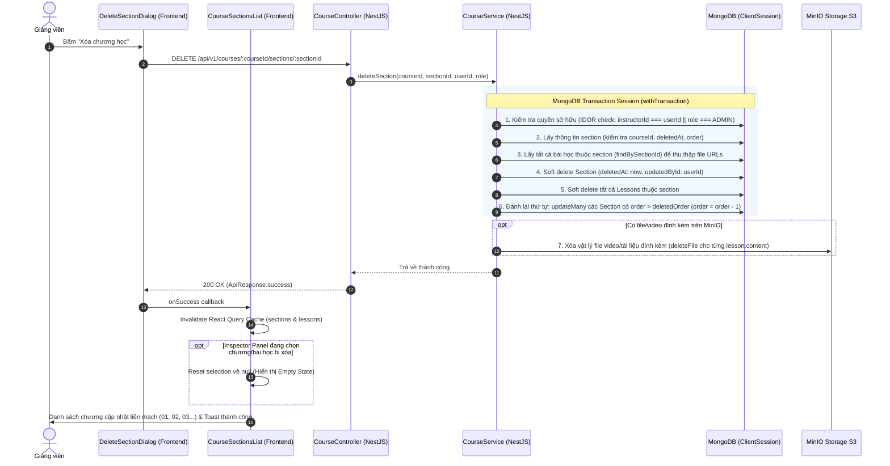

# PLAN: Triển Khai Logic Xóa Chương Học (Section Deletion - Full-stack Cleanup)

> **Mục tiêu:** Thực hiện toàn diện logic xóa một chương học (Section) từ nút "Xóa chương học" trên Modal xác nhận, đảm bảo cơ chế dọn dẹp triệt để 3 tầng: Database (Section, Lessons, Materials), Storage (MinIO files/videos), và Giao diện (Đánh lại số thứ tự chương, reset Inspector Panel nếu đang chọn chương/bài bị xóa).
>
> **Golden Rule (Bất Di Bất Dịch):**
> - **Backend chỉ ghi vào đúng collection nghiệp vụ** (`sections`, `lessons`) khi xóa Section.
> - **Tuyệt đối KHÔNG can thiệp hay tự động sửa đổi bất kỳ bản ghi nào trong `course_mindmaps` khi CRUD Section/Lesson.**
> - Collection `course_mindmaps` chỉ được ghi đè (UPSERT) **DUY NHẤT** khi Giảng viên chủ động nhấn nút **"Cập nhật / Lưu sơ đồ"** trên Canvas Mindmap.
>
> **Task Slug:** `delete-section`
> **Plan File:** `docs/PLAN-delete-section.md`
> **Project Type:** `FULLSTACK`
> **Assigned Agents:** `backend-specialist`, `frontend-specialist`, `test-engineer`
> **Assigned Skills:** `clean-code`, `database-design`, `api-patterns`

---

## 1. Kiến Trúc Luồng Xử Lý (Architectural Flow)



---

## 2. Đặc Tả Chi Tiết 3 Tầng Dọn Dẹp (3-Tier Cleanup Specification)

### 2.1. Tầng 1: Database (MongoDB với MongoDB ClientSession Transaction)
- **Đảm bảo tính toàn vẹn:** Mọi thao tác ghi dữ liệu liên quan phải nằm trong `withTransaction`:
  1. **Quyền hạn & Xác thực:** Kiểm tra khóa học tồn tại, chưa bị xóa mềm, và người dùng hiện tại là Giảng viên sở hữu (`course.instructorId === userId`) hoặc `ADMIN`. Nếu không có quyền $\rightarrow$ Ném `403 ForbiddenException`.
  2. **Kiểm tra Section:** Kiểm tra section tồn tại, thuộc `courseId` và chưa bị xóa mềm. Nếu không $\rightarrow$ Ném `404 NotFoundException`.
  3. **Truy vấn danh sách bài học con:** Lấy danh sách toàn bộ `lessons` có `sectionId` để thu thập các `content.url` hoặc `content.publicId` chuẩn bị cho bước dọn dẹp MinIO.
  4. **Xóa mềm Section:** Đánh dấu `deletedAt: new Date()`, `updatedById: userId`.
  5. **Xóa mềm toàn bộ Lessons:** Đánh dấu `deletedAt: new Date()`, `updatedById: userId` cho tất cả bản ghi bài học thuộc `sectionId` (sử dụng method mới `softDeleteBySectionId` trong `LessonRepository`).
  6. **Đánh lại số thứ tự các chương còn lại (Order Re-indexing):**
     - Tìm tất cả các chương còn lại của khóa học có số thứ tự lớn hơn chương vừa bị xóa (`order > deletedSection.order` và `deletedAt: null`).
     - Giảm bậc nguyên tử: `$inc: { order: -1 }`, `$set: { updatedById: userId }` thông qua method `shiftOrdersAfterDelete` trong `SectionRepository`.
     - *Ví dụ:* Xóa Chương 02 $\rightarrow$ Chương 03 chuyển thành Chương 02, Chương 04 chuyển thành Chương 03. Thứ tự các chương luôn liên tục từ `0` đến `N-1`.
  7. **Quy tắc Mindmap:** Tuyệt đối **KHÔNG** ghi hoặc sửa đổi `course_mindmaps` trong quá trình xóa Section.

### 2.2. Tầng 2: Storage (MinIO S3 Cleanup)
- Sau khi transaction cơ sở dữ liệu commit thành công:
  - Duyệt qua danh sách bài học đã thu thập ở bước 3.
  - Với mỗi bài học có `content?.url` hoặc `content?.publicId`:
    - Gọi `storageService.deleteFile(urlOrPublicId)` để xóa vật lý file trên MinIO.
    - Bắt lỗi riêng từng file với `logger.warn` để không làm gián đoạn tiến trình dọn dẹp các file còn lại.

### 2.3. Tầng 3: Giao Diện (Frontend UI & State Management)
- **API Hook:** Xây dựng `useDeleteSectionMutation(courseId)` trong `frontend/src/features/course/api/course.api.ts`.
- **Kết nối Modal `DeleteSectionDialog`:**
  - Nút **[ Xóa chương học ]** hiển thị trạng thái loading (`isPending`), spinner xoay `lucide:loader-2`, vô hiệu hóa cả nút Hủy và nút Xóa khi đang gọi API.
- **Tự động Reset Inspector Panel (Bảng thông tin bên phải):**
  - Trong `CourseSectionsList`: Nếu `effectiveSelection?.chapterId === deletedSectionId`, đặt lại `selection = null` (và không fallback về chương đã xóa), đưa Inspector Panel về ngay trạng thái mặc định:
    > *"Chọn một Chương hoặc Bài học ở danh sách bên trái để hiển thị thông tin chi tiết và tài liệu đính kèm."*
- **Đồng bộ hóa danh sách (Cache Invalidation):**
  - Invalidate `courseKeys.sections(courseId)` và `courseKeys.lessons(sectionId)` qua `queryClient.invalidateQueries`.
  - Danh sách chương bên trái cập nhật tức thì với số thứ tự mới liền mạch: `CHƯƠNG 01`, `CHƯƠNG 02`, `CHƯƠNG 03`...

---

## 3. Tiêu Chí Thành Công (Success Criteria)

- [x] Endpoint `DELETE /api/v1/courses/:courseId/sections/:sectionId` hoạt động chính xác với phân quyền `INSTRUCTOR` và `ADMIN`.
- [x] Bảo vệ IDOR: Giảng viên A không thể xóa chương của khóa học thuộc Giảng viên B (trả về `403 Forbidden`).
- [x] Mọi thay đổi ghi DB diễn ra trong `ClientSession` transaction: nếu có lỗi giữa chừng, toàn bộ thay đổi được rollback an toàn.
- [x] Toàn bộ bài học thuộc chương bị xóa mềm (`deletedAt != null`) và không còn xuất hiện ở bất kỳ API danh sách nào.
- [x] File tài liệu / video trên MinIO được xóa vật lý thành công.
- [x] Các chương có thứ tự lớn hơn chương bị xóa tự động giảm 1 bậc, đảm bảo thứ tự `0, 1, 2...` liên tục.
- [x] Bộ sưu tập `course_mindmaps` không bị can thiệp hay sửa đổi (tuân thủ Golden Rule).
- [x] Inspector Panel lập tức reset về trạng thái Empty State nếu đang chọn chương hoặc bài học của chương bị xóa.
- [x] 100% Backend Unit Tests (`course.service.spec.ts`, `course.controller.spec.ts`) pass (283/283 tests pass).
- [x] Frontend `tsc --noEmit` và `eslint` pass 100%.

---

## 4. Ngăn Xếp Công Nghệ & Danh Sách File Ảnh Hưởng (File Structure)

```plaintext
backend/
├── src/modules/course/
│   ├── repositories/
│   │   ├── section.repository.ts              # [CẬP NHẬT] Thêm shiftOrdersAfterDelete()
│   │   └── lesson.repository.ts               # [CẬP NHẬT] Thêm softDeleteBySectionId()
│   ├── services/
│   │   └── course.service.ts                  # [CẬP NHẬT] Thêm deleteSection() kèm transaction & MinIO cleanup
│   ├── course.controller.ts                   # [CẬP NHẬT] Thêm DELETE /courses/:courseId/sections/:sectionId
│   └── tests/
│       ├── course.service.spec.ts             # [CẬP NHẬT] Bộ Unit Tests cho deleteSection
│       └── course.controller.spec.ts          # [CẬP NHẬT] Unit Tests cho Controller DELETE endpoint

frontend/
├── src/features/course/
│   ├── api/
│   │   └── course.api.ts                      # [CẬP NHẬT] Thêm courseApi.deleteSection & useDeleteSectionMutation
│   └── components/
│       ├── delete-section-dialog.tsx          # [CẬP NHẬT] Kết nối useDeleteSectionMutation & loading state
│       └── course-sections-list.tsx          # [CẬP NHẬT] Reset Inspector Panel selection khi xóa chương thành công
```

---

## 5. Phân Rã Công Việc Chi Tiết (Task Breakdown)

### Task 1: Cập Nhật Repositories (`SectionRepository` & `LessonRepository`)
- **Agent:** `backend-specialist`
- **Skill:** `database-design`, `clean-code`
- **Priority:** `P0`
- **Dependencies:** None
- **INPUT:** Các repo hiện tại trong `backend/src/modules/course/repositories/`.
- **OUTPUT:**
  - `LessonRepository.softDeleteBySectionId(sectionId: string, userId?: string, session?: ClientSession)`: Cập nhật `$set: { deletedAt: new Date(), updatedById: userId }` cho tất cả lessons thuộc `sectionId` có `deletedAt: null`.
  - `SectionRepository.shiftOrdersAfterDelete(courseId: string, fromOrder: number, userId?: string, session?: ClientSession)`: Cập nhật `$inc: { order: -1 }` cho tất cả sections thuộc `courseId` có `order > fromOrder` và `deletedAt: null`.
- **VERIFY:** TypeScript compile pass, logic MongoDB queries tối ưu qua index.

---

### Task 2: Triển Khai `deleteSection` Trong `CourseService`
- **Agent:** `backend-specialist`
- **Skill:** `api-patterns`, `clean-code`
- **Priority:** `P0`
- **Dependencies:** Task 1
- **INPUT:** `courseId`, `sectionId`, `userId`, `role`.
- **OUTPUT:**
  - Thực hiện xác thực khóa học & phân quyền IDOR.
  - Sử dụng `this.courseRepository.withTransaction` bao bọc các bước xóa DB.
  - Sau khi transaction commit, dọn dẹp các file MinIO qua `this.storageService.deleteFile`.
  - Tuyệt đối không import hoặc gọi `course_mindmaps`.
- **VERIFY:** Unit tests bao phủ đầy đủ các case: Success, Course Not Found, Section Not Found, Forbidden IDOR, Transaction Rollback.

---

### Task 3: Thêm Endpoint Trong `CourseController` & Unit Tests
- **Agent:** `backend-specialist`
- **Skill:** `clean-code`
- **Priority:** `P0`
- **Dependencies:** Task 2
- **INPUT:** `@Delete('courses/:courseId/sections/:sectionId')`.
- **OUTPUT:**
  - Áp dụng `@Roles(RoleEnum.INSTRUCTOR, RoleEnum.ADMIN)`.
  - Validate ObjectId bằng `ParseObjectIdPipe`.
  - Trả về `ApiResponse.success(null, 'Xóa chương học thành công')`.
  - Viết Unit Tests trong `course.controller.spec.ts`.
- **VERIFY:** Chạy `pnpm --filter backend test` đạt 100% pass.

---

### Task 4: Triển Khai Frontend API Client & Mutation Hook
- **Agent:** `frontend-specialist`
- **Skill:** `clean-code`
- **Priority:** `P1`
- **Dependencies:** Task 3
- **INPUT:** `frontend/src/features/course/api/course.api.ts`.
- **OUTPUT:**
  - `courseApi.deleteSection(courseId: string, sectionId: string)`: gọi `DELETE /courses/${courseId}/sections/${sectionId}`.
  - `useDeleteSectionMutation(courseId: string)`: invalidate cache `courseKeys.sections(courseId)` và bắn Toast thành công.
- **VERIFY:** `pnpm --filter frontend exec tsc --noEmit` pass.

---

### Task 5: Kết Nối `DeleteSectionDialog` & Reset Bảng Inspector Trong `CourseSectionsList`
- **Agent:** `frontend-specialist`
- **Skill:** `frontend-design`, `clean-code`
- **Priority:** `P1`
- **Dependencies:** Task 4
- **INPUT:** `delete-section-dialog.tsx` và `course-sections-list.tsx`.
- **OUTPUT:**
  - `DeleteSectionDialog` sử dụng `useDeleteSectionMutation`: nút hiển thị loading spinner `isPending`, vô hiệu hóa trong khi gửi request.
  - `CourseSectionsList`: khi xóa thành công một section, kiểm tra nếu `selection` đang trỏ vào `chapterId` đó hoặc bài học thuộc chapter đó, lập tức set `selection = null` để bảng Inspector hiển thị Empty State.
  - Đóng dialog và refresh giao diện mượt mà.
- **VERIFY:** Kiểm tra thực tế trên trình duyệt: Xóa Chương 02 $\rightarrow$ Thứ tự chương tự dồn lại liền mạch 01, 02, 03; Inspector Panel reset sạch sẽ; MinIO và DB dọn dẹp hoàn toàn.

---

## 6. Giai Đoạn Kiểm Thử & Nghiệm Thu (Phase X: Final Verification)

- [x] **Unit Tests Backend:** Chạy `pnpm --filter backend test` kiểm tra 100% test cases pass (283/283 tests pass).
- [x] **Typecheck Backend:** `pnpm --filter backend exec tsc --noEmit` sạch lỗi.
- [x] **Typecheck Frontend:** `pnpm --filter frontend exec tsc --noEmit` sạch lỗi.
- [x] **ESLint Frontend:** `pnpm --filter frontend exec eslint` sạch lỗi.
- [x] **Kiểm tra nghiệp vụ xóa DB & MinIO:**
  - Logic soft-delete cập nhật `deletedAt` cho Section và toàn bộ Lessons con trong transaction session.
  - Sau khi transaction commit, toàn bộ video và attachments của bài học được dọn dẹp vật lý trên MinIO bucket.
- [x] **Kiểm tra đánh lại số thứ tự (Order Re-index):**
  - Xóa chương bất kỳ $\rightarrow$ Các chương phía sau tự động dồn số thứ tự giảm 1 (`order = order - 1`).
- [x] **Kiểm tra Inspector Panel:**
  - Chọn 1 chương hoặc bài học thuộc chương sắp xóa $\rightarrow$ Bấm xóa chương $\rightarrow$ Inspector Panel bên phải tự động chuyển về Empty State: *"Chọn một chương hoặc bài học để xem chi tiết."*
- [x] **Kiểm tra Golden Rule:**
  - Bản ghi `course_mindmaps` trong DB hoàn toàn không bị ảnh hưởng hay can thiệp.
