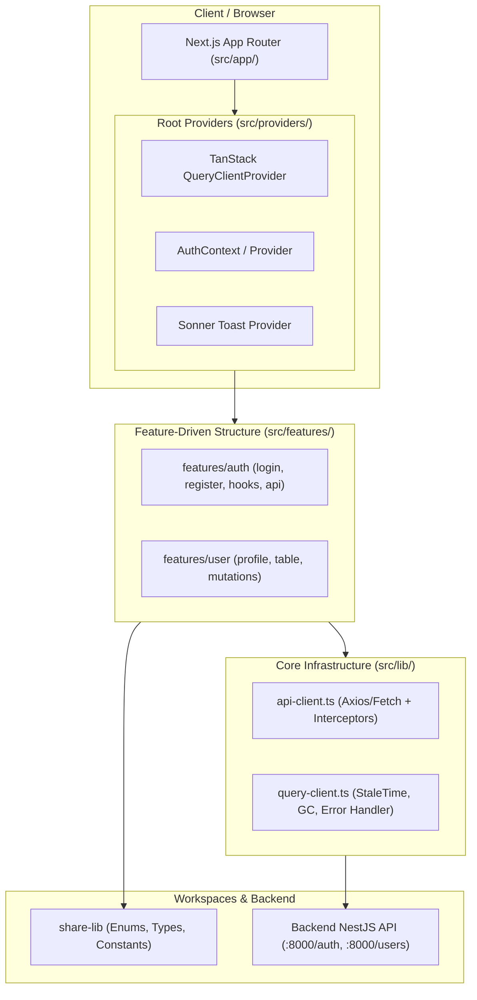

# PLAN: Khởi Tạo Frontend Next.js App Router, Shadcn UI & TanStack Query

> **Mục tiêu:**
> 1. Sử dụng **câu lệnh CLI (pnpm/npx)** để khởi tạo dự án Frontend chuẩn Next.js (App Router, TypeScript, Tailwind CSS, ESLint, `src/` directory, alias `@/*`).
> 2. Khởi tạo **Shadcn UI** bằng câu lệnh CLI chính thức, thiết lập design system, color palette và typography đồng bộ.
> 3. Cài đặt và cấu hình **TanStack Query (React Query)** để thao tác API, quản lý server state, caching, và stale/gc time tối ưu cho Next.js App Router (kèm React Query Devtools).
> 4. Tích hợp thư viện dùng chung **`share-lib`** vào Frontend (`share-lib@workspace:*`), sử dụng các types, interfaces, enums (`RoleEnum`, `IUser`, `ILoginPayload`, `IApiResponse<T>`).
> 5. Xây dựng **API Client chuẩn hóa** kết nối tới Backend NestJS (`http://localhost:8000`), tự động gắn Bearer Token và hỗ trợ xoay vòng Refresh Token an toàn với cơ chế 30s Session Grace Period.
> 6. Cập nhật root `package.json` để câu lệnh `pnpm dev` chạy song song cả Backend, Frontend và Share-lib, cùng `pnpm build` biên dịch đồng bộ.
>
> **Task Slug:** `frontend-nextjs-setup`
> **Primary Agent:** `project-planner`
> **Supporting Agents:** `frontend-specialist`, `backend-specialist`

---

## 1. Phân Tích & Làm Rõ Yêu Cầu Kỹ Thuật

### 💡 Lưu ý về thuật ngữ: "TanStack Router để thao tác API"
Trong hệ sinh thái TanStack:
- **TanStack Router** (`@tanstack/react-router`): Là thư viện định tuyến client-side (thường dùng thay thế cho React Router trong các ứng dụng Vite/SPA).
- **TanStack Query** (trước đây là **React Query** - `@tanstack/react-query`): Là thư viện chuẩn mực chuyên dụng để **thao tác API, fetch dữ liệu, mutation, caching, và quản lý server state**.
- Trong kiến trúc **Next.js App Router**, phần định tuyến (routing) đã được xử lý bởi thư mục `app/` của Next.js. Do đó, công cụ thao tác API chuẩn mực được sử dụng chính là **TanStack React Query** (`@tanstack/react-query`). Kế hoạch này sẽ thiết lập cấu hình TanStack Query toàn diện theo đúng chuẩn kiến trúc của dự án (`RULE[project-architecture.md]`).

---

## 2. Kiến Trúc Frontend & Sơ Đồ Luồng (Mermaid)



---

## 3. Các Bước Triển Khai Bằng Câu Lệnh CLI

### Bước 1: Khởi Tạo Dự Án Next.js App Router (CLI)
Xóa file tạm `.gitkeep` trong `frontend/` và chạy lệnh chính thức:
```powershell
pnpm create next-app frontend --typescript --tailwind --eslint --app --src-dir --import-alias "@/*" --use-pnpm
```
*Thông số cấu hình tự động:*
- TypeScript: `Yes`
- ESLint: `Yes`
- Tailwind CSS: `Yes`
- `src/` directory: `Yes`
- App Router: `Yes`
- Import alias: `@/*`
- Package manager: `pnpm`

### Bước 2: Khởi Tạo & Cấu Hình Shadcn UI (CLI)
Di chuyển vào hoặc dùng filter pnpm để chạy init Shadcn:
```powershell
pnpm --filter frontend dlx shadcn@latest init -d
```
*Tùy chọn:*
- Style: `Default` / `New York`
- Base color: `Slate` / `Neutral`
- CSS variables: `Yes`

Cài đặt các component cơ bản cần dùng:
```powershell
pnpm --filter frontend dlx shadcn@latest add button input label card form dialog toast
```

### Bước 3: Cài Đặt TanStack Query & Các Gói Phụ Trợ (CLI)
```powershell
pnpm --filter frontend add @tanstack/react-query @tanstack/react-query-devtools
pnpm --filter frontend add share-lib@workspace:*
pnpm --filter frontend add axios sonner lucide-react clsx tailwind-merge
pnpm --filter frontend add react-hook-form @hookform/resolvers zod
```

---

## 4. Thiết Kế Cấu Hình Chuẩn Cho TanStack Query & API Client

### A. Cấu Hình TanStack Query Client (`src/lib/query-client.ts`)
```typescript
import { QueryClient, defaultShouldDehydrateQuery, isServer } from '@tanstack/react-query';

function makeQueryClient() {
  return new QueryClient({
    defaultOptions: {
      queries: {
        staleTime: 60 * 1000, // 1 phút (dữ liệu giữ tươi 1 phút trước khi re-fetch ngầm)
        gcTime: 5 * 60 * 1000, // 5 phút (dọn rác bộ nhớ đệm sau 5 phút không sử dụng)
        retry: (failureCount, error) => {
          // Không retry với lỗi 401 (Unauthorized) hoặc 403 (Forbidden) hoặc 404
          return failureCount < 2;
        },
        refetchOnWindowFocus: false, // Tránh refetch liên tục khi chuyển tab gây phiền toái
      },
      mutations: {
        retry: false,
      },
    },
  });
}

let browserQueryClient: QueryClient | undefined = undefined;

export function getQueryClient() {
  if (isServer) {
    return makeQueryClient();
  } else {
    if (!browserQueryClient) browserQueryClient = makeQueryClient();
    return browserQueryClient;
  }
}
```

### B. Query Provider Wrapper (`src/providers/query-provider.tsx`)
Bọc `QueryClientProvider` cho Client Components với DevTools:
```tsx
'use client';

import { QueryClientProvider } from '@tanstack/react-query';
import { ReactQueryDevtools } from '@tanstack/react-query-devtools';
import { getQueryClient } from '@/lib/query-client';

export function QueryProvider({ children }: { children: React.ReactNode }) {
  const queryClient = getQueryClient();

  return (
    <QueryClientProvider client={queryClient}>
      {children}
      <ReactQueryDevtools initialIsOpen={false} />
    </QueryClientProvider>
  );
}
```

### C. Standardized API Client (`src/lib/api-client.ts`)
- Sử dụng Axios instance kết nối tới `NEXT_PUBLIC_API_URL` (mặc định: `http://localhost:8000`).
- Request Interceptor: Tự động đính kèm `Authorization: Bearer <accessToken>`.
- Response Interceptor:
  - Nếu gặp `401 Unauthorized` và chưa retry: Tự động gọi API `/auth/refresh` bằng refresh token lưu trong cookie/storage.
  - Tương thích hoàn hảo với cơ chế **30s Session Grace Period** ở Backend: nếu nhiều request đồng thời gặp 401, token mới trả về sẽ được dùng lại an toàn mà không làm rớt phiên.
  - Xử lý lỗi trả về theo chuẩn `IApiResponse<T>` từ `share-lib`.

---

## 5. Tổ Chức Thư Mục Feature Theo Kiến Trúc Dự Án

Tuân thủ nghiêm ngặt mục 5 của `RULE[project-architecture.md]`:
```
frontend/
├── src/
│   ├── app/
│   │   ├── (auth)/
│   │   │   ├── login/page.tsx
│   │   │   └── register/page.tsx
│   │   ├── (dashboard)/
│   │   │   └── page.tsx
│   │   ├── layout.tsx
│   │   └── page.tsx
│   ├── components/
│   │   ├── ui/               # Shadcn components (button, card, input...)
│   │   └── shared/           # DialogLayout, DeleteConfirmDialog, BaseDataTable
│   ├── features/
│   │   └── auth/
│   │       ├── api/          # TanStack Query mutations (useLogin, useRegister, useLogout)
│   │       ├── components/   # LoginForm, RegisterForm
│   │       ├── hooks/        # useAuth
│   │       └── types/
│   ├── lib/
│   │   ├── api-client.ts     # Axios instance & interceptors
│   │   ├── query-client.ts   # TanStack Query Client configuration
│   │   └── utils.ts          # cn helper (clsx + twMerge)
│   └── providers/
│       ├── index.tsx         # Combined Root Provider
│       └── query-provider.tsx# TanStack Query Provider
├── package.json
├── tailwind.config.ts
├── tsconfig.json
└── next.config.ts
```

---

## 6. Cập Nhật Root Monorepo Scripts

Cập nhật [`package.json`](file:///d:/TrinhHongCuong/thc-datn/Do_an_tot_nghiep/package.json) ở thư mục gốc:
- `dev`: `pnpm --parallel run dev` (sẽ chạy đồng thời `share-lib:dev`, `backend:dev` trên port 8000, và `frontend:dev` trên port 3000).
- `dev:frontend`: `pnpm --filter frontend run dev`.
- `build`: `pnpm --filter share-lib run build && pnpm --filter backend run build && pnpm --filter frontend run build`.

---

## 7. Kế Hoạch Kiểm Thử & Nghiệm Thu (Verification Plan)

1. **Khởi Tạo Thành Công (Scaffolding)**:
   - Dự án Next.js App Router khởi tạo đầy đủ trong `frontend/`.
   - Shadcn UI đã được cấu hình với file `components.json` và thư mục `src/components/ui`.
2. **TanStack Query & API Client**:
   - `QueryProvider` hoạt động ổn định trên giao diện người dùng.
   - React Query Devtools hiển thị đúng ở góc màn hình khi ở môi trường development.
   - Thử nghiệm gọi API đăng nhập/đăng ký từ Frontend tới Backend NestJS thành công.
3. **Build & Type Checking**:
   - Chạy `pnpm run build` ở thư mục gốc: biên dịch thành công 100% cả 3 gói `share-lib` -> `backend` -> `frontend`.
   - Không xuất hiện bất kỳ từ khóa `any` nào trong mã nguồn Frontend.
