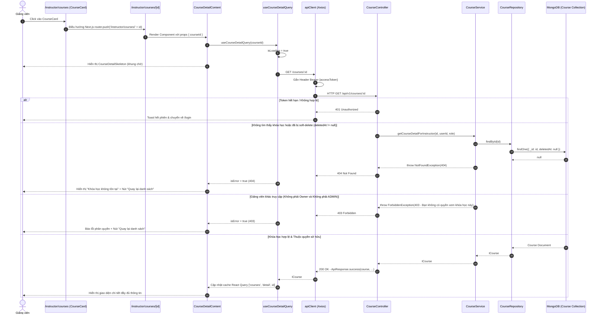

# PLAN: Chi Tiết Khóa Học Dành Cho Giảng Viên (`/instructor/courses/[id]`)

> **Mục tiêu:**
> 1. Xây dựng API Backend `GET /api/v1/courses/:id` lấy chi tiết một khóa học cụ thể, kiểm soát quyền truy cập chặt chẽ (chỉ Giảng viên sở hữu khóa học hoặc Quản trị viên mới được xem).
> 2. Mở rộng `courseApi.getCourseById` và React Query hook `useCourseDetailQuery` tại `frontend/src/features/course/api/course.api.ts`.
> 3. Cập nhật `CourseCard` tại `/instructor/courses` để trở thành liên kết điều hướng sang trang chi tiết (`/instructor/courses/[id]`).
> 4. Tạo trang chi tiết `/instructor/courses/[id]` (`InstructorCourseDetailPage` + `CourseDetailContent`):
>    - Hiển thị đầy đủ thông tin: `title`, `slug`, `shortDescription`, `description`, `price` (chuẩn hóa "Miễn phí" nếu = 0), `level`, `status`, `createdAt`.
>    - Nút điều hướng "Quay lại danh sách khóa học" dẫn về `/instructor/courses`.
>    - Xử lý các trạng thái: Loading (Skeleton), Error (404 Không tìm thấy hoặc 403 Không có quyền).
> 5. **Ranh giới nghiêm ngặt:** Tuyệt đối CHƯA làm chỉnh sửa (Edit), xóa (Delete), xuất bản (Publish), danh sách bài học (Lesson), hay tải video (Video upload).
>
> **Task Slug:** `instructor-course-detail`  
> **Plan File:** `docs/PLAN-instructor-course-detail.md`  
> **Primary Agent:** `project-planner`  
> **Executing Agents:** `backend-specialist`, `frontend-specialist`  
> **Skills:** `clean-code`, `api-patterns`, `react-best-practices`, `frontend-design`

---

## 1. Phân Tích Kỹ Thuật & Khảo Sát Hiện Trạng

### 1.1. Luồng Tích Hợp Toàn Trình (Sequence Diagram)



---

### 1.2. Phân Tích Kiến Trúc Backend

- **Route Conflict Prevention**:
  Trong `CourseController`:
  - Hiện tại: `GET courses/my-courses` và `POST courses`.
  - Endpoint mới: `GET courses/:id`.
  - **Quy tắc NestJS**: Route tĩnh `my-courses` bắt buộc phải đặt TRƯỚC route tham số `:id` để tránh việc NestJS nhận nhầm chuỗi `"my-courses"` thành giá trị của `:id`.
- **Security & Authorization (IDOR Prevention)**:
  - Phân quyền cấp Route: `@Roles(RoleEnum.INSTRUCTOR, RoleEnum.ADMIN)`.
  - Phân quyền cấp Resource (Data Ownership):
    - Lấy thông tin user hiện tại qua `@CurrentUser() user: IUserProfile`.
    - Trong `CourseService.getCourseDetailForInstructor(id, userId, role)`:
      - Kiểm tra `course.deletedAt == null`.
      - Nếu `role !== RoleEnum.ADMIN && course.instructorId !== userId`: ném `ForbiddenException('Bạn không có quyền truy cập khóa học này')`.
      - Tránh hoàn toàn lỗ hổng IDOR (Insecure Direct Object Reference) giữa các giảng viên với nhau.
- **Repository Tận Dụng Sẵn Có**:
  - `BaseMongoRepository.findById(id)` đã tự động bổ sung điều kiện `{ deletedAt: null }`.

---

### 1.3. Phân Tích Kiến Trúc Frontend

- **Dynamic Route**:
  - Tạo thư mục `frontend/src/app/instructor/courses/[id]/page.tsx`.
  - Sử dụng RSC nhận `params: Promise<{ id: string }>` theo chuẩn Next.js 15 App Router.
  - Bọc component client `CourseDetailContent`.
- **Thẻ `CourseCard`**:
  - Chuyển `Card` trong `course-card.tsx` từ `cursor-default` thành thẻ liên kết `<Link href={`/instructor/courses/${course.id}`} className="group block h-full">`.
  - Bổ sung visual cue tương tác: `hover:border-primary/50 transition-all hover:shadow-md cursor-pointer`.
- **Cấu trúc trang Chi Tiết (`CourseDetailContent`)**:
  - **Thanh điều hướng đầu trang**:
    - Nút `<Link href="/instructor/courses">` với icon `lucide:arrow-left` nhãn `"Quay lại danh sách"`.
    - Breadcrumb: `Trang chủ / Giảng viên / Khóa học của tôi / [Tên khóa học]`.
  - **Khối thông tin chính (Overview Hero)**:
    - Tiêu đề khóa học (H1 lớn, font-bold).
    - Slug badge (font-mono kèm icon link).
    - Badges: Trạng thái (`status`: Bản nháp / Đã xuất bản / Lưu trữ), Cấp độ (`level`: Cơ bản / Trung cấp / Nâng cao / Mọi cấp độ).
    - Giá học phí: Format tiền tệ VND (ví dụ: `499.000 ₫`) hoặc nhãn `Miễn phí` (màu xanh emerald).
    - Ngày tạo (`createdAt`): Định dạng chuẩn `vi-VN`.
  - **Khối nội dung mô tả (Content Cards)**:
    - Card "Mô tả ngắn gọn" (`shortDescription`): Thẻ trích yếu nổi bật nếu có.
    - Card "Nội dung chi tiết" (`description`): Hiển thị đầy đủ nội dung bài giảng với kiểu dáng typography dễ đọc (`whitespace-pre-wrap leading-relaxed`).

---

## 2. Đặc Tả API Hợp Đồng Dữ Liệu (API & Data Contract Spec)

### 2.1. Backend Endpoint Spec

```http
GET /api/v1/courses/:id
Authorization: Bearer <accessToken>
```

- **Authentication**: Bắt buộc (Bearer JWT).
- **Authorization**: Roles `INSTRUCTOR` hoặc `ADMIN`.
- **Path Parameter**: `id` (MongoDB ObjectId của khóa học).
- **Mã phản hồi**:
  - `200 OK`: Trả về dữ liệu khóa học.
  - `401 Unauthorized`: Chưa đăng nhập hoặc token hết hạn.
  - `403 Forbidden`: Giảng viên không phải chủ sở hữu khóa học.
  - `404 Not Found`: Khóa học không tồn tại hoặc đã bị xóa mềm.

```json
{
  "success": true,
  "statusCode": 200,
  "message": "Lấy chi tiết khóa học thành công",
  "data": {
    "id": "673f8a...",
    "title": "Lập trình TypeScript Chuyên Sâu",
    "slug": "lap-trinh-typescript-chuyen-sau",
    "instructorId": "673e1b...",
    "shortDescription": "Khóa học dành cho người mới bắt đầu làm quen với TypeScript.",
    "description": "Nội dung chi tiết khóa học bao gồm các kiến thức từ cơ bản đến nâng cao...",
    "thumbnailUrl": null,
    "price": 499000,
    "status": "draft",
    "level": "intermediate",
    "createdAt": "2026-09-24T12:00:00.000Z",
    "updatedAt": "2026-09-24T12:00:00.000Z"
  }
}
```

---

## 3. Kế Hoạch Thay Đổi Tập Tin (Proposed File Changes)

### 3.1. Backend Changes

#### 1. [MODIFY] `backend/src/modules/course/services/course.service.ts`
- Bổ sung method `getCourseDetailForInstructor(courseId: string, currentUserId: string, currentUserRole: RoleEnum): Promise<ICourse>`:
  - Tra cứu qua `this.courseRepository.findById(courseId)`.
  - Ném `NotFoundException` nếu không tìm thấy.
  - Ném `ForbiddenException` nếu `currentUserRole !== RoleEnum.ADMIN && course.instructorId !== currentUserId`.
  - Trả về `course`.

#### 2. [MODIFY] `backend/src/modules/course/course.controller.ts`
- Đặt endpoint `GET :id` nằm dưới `GET my-courses`:
  ```typescript
  @Get(':id')
  @Roles(RoleEnum.INSTRUCTOR, RoleEnum.ADMIN)
  async getDetail(
    @Param('id') id: string,
    @CurrentUser() user: IUserProfile,
  ): Promise<ApiResponse<ICourse>> {
    const course = await this.courseService.getCourseDetailForInstructor(id, user.id, user.role);
    return ApiResponse.success(course, 'Lấy chi tiết khóa học thành công');
  }
  ```

#### 3. [MODIFY] `backend/src/modules/course/tests/course.service.spec.ts`
- Bổ sung unit test cho `getCourseDetailForInstructor`:
  - Trường hợp tìm thấy khóa học và user là chính instructor sở hữu -> thành công.
  - Trường hợp user là ADMIN -> luôn thành công dù không phải owner.
  - Trường hợp không tìm thấy -> ném `NotFoundException`.
  - Trường hợp instructor khác truy cập -> ném `ForbiddenException`.

#### 4. [MODIFY] `backend/src/modules/course/tests/course.controller.spec.ts`
- Bổ sung unit test cho endpoint `GET /courses/:id`.

---

### 3.2. Frontend Changes

#### 1. [MODIFY] `frontend/src/features/course/api/course.api.ts`
- Đã có sẵn key `courseKeys.detail(id)`.
- Bổ sung `getCourseById` vào `courseApi`:
  ```typescript
  async getCourseById(id: string): Promise<ICourse> {
    const res = await apiClient.get<IApiResponse<ICourse>>(`/courses/${id}`);
    return res.data.data;
  }
  ```
- Bổ sung hook `useCourseDetailQuery(id: string)`:
  ```typescript
  export function useCourseDetailQuery(id: string) {
    return useQuery({
      queryKey: courseKeys.detail(id),
      queryFn: () => courseApi.getCourseById(id),
      enabled: Boolean(id),
    });
  }
  ```

#### 2. [MODIFY] `frontend/src/features/course/components/course-card.tsx`
- Bọc nội dung thẻ trong `<Link href={`/instructor/courses/${course.id}`} className="group block h-full">`.
- Chuyển `cursor-default` thành `cursor-pointer`, thêm hiệu ứng hover tinh tế (`group-hover:border-foreground/30 transition-all`).

#### 3. [NEW] `frontend/src/features/course/components/course-detail-skeleton.tsx`
- Component khung chờ trạng thái Loading cho trang chi tiết: Khung breadcrumb, khối tiêu đề hero, khối thông tin badges, và 2 khối mô tả có hiệu ứng pulse.

#### 4. [NEW] `frontend/src/features/course/components/course-detail-content.tsx`
- Component Client quản lý hiển thị trang chi tiết:
  - Nhận prop `courseId: string`.
  - Gọi `useCourseDetailQuery(courseId)`.
  - Xử lý Loading -> `CourseDetailSkeleton`.
  - Xử lý Error -> Card báo lỗi thân thiện (404 / 403) kèm nút "Quay lại danh sách khóa học" và nút "Thử lại".
  - Xử lý Thành công -> Render giao diện chi tiết đầy đủ 8 trường thông tin:
    1. `title`
    2. `slug`
    3. `shortDescription` (nếu có, hiển thị khối trích yếu nổi bật)
    4. `description` (nếu có, hiển thị nội dung chi tiết với định dạng văn bản nhiều dòng)
    5. `price` (chuẩn hóa "Miễn phí" nếu = 0, format VND nếu > 0)
    6. `level` (badge cấp độ kèm icon)
    7. `status` (badge trạng thái với màu sắc tương ứng)
    8. `createdAt` (ngày tạo định dạng tiếng Việt)
  - Nút quay lại `/instructor/courses` rõ ràng, thuận tiện.

#### 5. [NEW] `frontend/src/app/instructor/courses/[id]/page.tsx`
- Route RSC Page nhận `params: Promise<{ id: string }>`.
- Render layout và gọi `<CourseDetailContent courseId={id} />`.

#### 6. [MODIFY] `frontend/src/features/course/index.ts`
- Export `CourseDetailContent` và `CourseDetailSkeleton`.

---

## 4. Kế Hoạch Triển Khai Chi Tiết (Step-by-Step Tasks)

### Task 1: Backend Service, Controller & Unit Tests
- **Agent**: `backend-specialist`
- **Skills**: `clean-code`, `api-patterns`
- **Input**: `course.service.ts`, `course.controller.ts`, các file spec liên quan.
- **Output**: Endpoint `GET /courses/:id` hoàn chỉnh với bảo vệ IDOR và 100% test pass.
- **Verify**: `pnpm --filter backend test`

### Task 2: Frontend API Client & Detail Hook
- **Agent**: `frontend-specialist`
- **Skills**: `react-best-practices`, `clean-code`
- **Input**: `frontend/src/features/course/api/course.api.ts`
- **Output**: `courseApi.getCourseById`, `useCourseDetailQuery`.
- **Verify**: `pnpm --filter frontend exec tsc --noEmit`

### Task 3: Kích Hoạt Click Cho `CourseCard`
- **Agent**: `frontend-specialist`
- **Skills**: `frontend-design`
- **Input**: `frontend/src/features/course/components/course-card.tsx`
- **Output**: `CourseCard` được bọc thẻ `Link` điều hướng mượt mà sang `/instructor/courses/${course.id}`.
- **Verify**: Typecheck & Lint pass.

### Task 4: Xây Dựng UI Chi Tiết & Route Page
- **Agent**: `frontend-specialist`
- **Skills**: `frontend-design`, `react-best-practices`
- **Input**: `course-detail-skeleton.tsx`, `course-detail-content.tsx`, `app/instructor/courses/[id]/page.tsx`.
- **Output**: Trang chi tiết khóa học hiển thị chuẩn xác đầy đủ các trường, có nút quay lại, không over-engineer, tuân thủ Purple Ban.
- **Verify**: `pnpm --filter frontend lint` & `pnpm --filter frontend build`

---

## 5. Tiêu Chí Nghiệm Thu (Verification Checklist)

| STT | Hạng Mục Kiểm Tra | Lệnh Kiểm Tra | Tiêu Chí Đạt | Trạng Thái |
| :--- | :--- | :--- | :--- | :--- |
| 1 | Backend Unit Tests | `pnpm --filter backend test` | 100% test cases pass, bao gồm test IDOR ownership cho `GET /courses/:id` | ✅ ĐẠT (102/102 passed) |
| 2 | Frontend Linting | `pnpm --filter frontend lint` | Không có lỗi ESLint (`0 errors`) | ✅ ĐẠT (0 errors, 0 warnings) |
| 3 | Frontend TypeScript Check | `pnpm --filter frontend exec tsc --noEmit` | Không có lỗi biên dịch TypeScript, không sử dụng `any` | ✅ ĐẠT (0 errors) |
| 4 | Frontend Production Build | `pnpm --filter frontend build` | Next.js build thành công (dynamic route `[id]` render chuẩn) | ✅ ĐẠT (Turbopack dynamic build passed) |
| 5 | Ranh Giới Nghiêm Ngặt | Kiểm tra git diff | Không có logic edit/delete/publish/lesson/video upload | ✅ ĐẠT (Đúng scope) |

---

## 6. Socratic Gate: Câu Hỏi & Điểm Lưu Ý Trước Khi Code

1. **Xử lý khi `shortDescription` hoặc `description` không có (null/undefined)**:
   - Nếu giảng viên không nhập mô tả khi tạo: Hiển thị khối thông báo nhẹ dạng placeholder: *"Chưa có mô tả ngắn"* / *"Chưa có nội dung mô tả chi tiết"* (text-muted-foreground italic) để giao diện không bị trống trải hay khuyết card?
2. **Hiển thị Slug**:
   - Slug có cần thêm nút copy tiện lợi (`Copy Slug`) hay chỉ cần hiển thị dạng text/pill monospace để giảng viên tham khảo?
