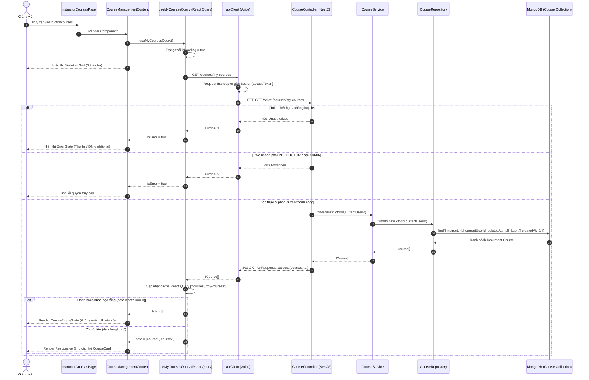

# PLAN: Lấy Dữ Liệu Thật Cho Trang Danh Sách Khóa Học Giảng Viên (`/instructor/courses`)

> **Mục tiêu:**
> 1. Xây dựng API Backend `GET /api/v1/courses/my-courses` cho phép Giảng viên (`INSTRUCTOR`) hoặc Quản trị viên (`ADMIN`) lấy danh sách toàn bộ các khóa học của chính mình chưa bị soft-delete (`deletedAt: null`).
> 2. Mở rộng `courseApi` và React Query hook trong `frontend/src/features/course/api/course.api.ts` để gọi API với type-safety tuyệt đối, không dùng `any`.
> 3. Cập nhật giao diện `/instructor/courses` (`CourseManagementContent`):
>    - Xử lý đầy đủ 4 trạng thái: **Loading** (skeleton cards), **Error** (thông báo lỗi và nút thử lại), **Empty** (giữ nguyên component `CourseEmptyState`), **Success** (hiển thị danh sách thẻ khóa học).
> 4. Xây dựng component `CourseCard` tối giản, thanh lịch, chuẩn mực hiển thị: `title`, `slug`, `price`, `level`, `status`, `createdAt`.
> 5. Tuân thủ ranh giới phạm vi nghiêm ngặt: Tuyệt đối không làm edit/delete/publish, pagination, search, filter, thumbnail upload trong milestone này.
>
> **Task Slug:** `instructor-courses-list`  
> **Plan File:** `docs/PLAN-instructor-courses-list.md`  
> **Primary Agent:** `project-planner`  
> **Executing Agents:** `backend-specialist`, `frontend-specialist`  
> **Skills:** `clean-code`, `api-patterns`, `react-best-practices`, `frontend-design`

---

## 1. Phân Tích Kỹ Thuật & Khảo Sát Hiện Trạng

### 1.1. Luồng Tích Hợp Toàn Trình (Sequence Diagram)



---

### 1.2. Hiện Trạng Backend (Backend Architecture Audit)

- **Guards**: `JwtAuthGuard` và `RolesGuard` đã được cấu hình toàn cục (`APP_GUARD`) trong `AuthModule`. Mọi route cần bảo vệ chỉ cần khai báo decorator `@Roles(RoleEnum.INSTRUCTOR, RoleEnum.ADMIN)`.
- **Identity Decorator**: `@CurrentUser('id') userId: string` đã có sẵn, tự động trích xuất `id` của user từ JWT Payload đã giải mã.
- **Repository**: `CourseRepository.findByInstructorId(instructorId)` trong `backend/src/modules/course/repositories/course.repository.ts` đã được cài đặt sẵn:
  - Lọc `{ instructorId, deletedAt: null }`
  - Sắp xếp `{ createdAt: -1 }` (khóa học mới nhất lên đầu)
  - Map sang domain `ICourse` bằng `this.toDomain(doc)`
- **Service**: `CourseService.findByInstructorId(instructorId)` trong `backend/src/modules/course/services/course.service.ts` đã ủy quyền trực tiếp tới `this.courseRepository.findByInstructorId(instructorId)`.
- **Controller**: `CourseController` (`courses`) hiện chỉ mới có endpoint `POST /courses`. Cần bổ sung `GET /courses/my-courses`.
- **Response Format**: `ApiResponse.success(courses, 'Lấy danh sách khóa học thành công')`.

---

### 1.3. Hiện Trạng Frontend (Frontend Architecture Audit)

- **API Base Client**: `apiClient` (`@/lib/api-client`) đã cấu hình interceptor tự động gắn `Authorization: Bearer <token>` từ `localStorage`.
- **Course API**: `frontend/src/features/course/api/course.api.ts` đã có:
  - `courseKeys.all = ['courses']`
  - `useCreateCourseMutation` (khi tạo khóa học xong đã gọi `queryClient.invalidateQueries({ queryKey: courseKeys.all })`).
- **Page & Components**:
  - `frontend/src/app/instructor/courses/page.tsx` bọc `<CourseManagementContent />`.
  - `frontend/src/features/course/components/course-management-content.tsx` hiện đang render cứng `<CourseHeader />` và `<CourseEmptyState />`.
  - `CourseHeader` có sẵn nút dẫn tới `/instructor/courses/new`.
  - `CourseEmptyState` có sẵn nút CTA tạo khóa học.

---

## 2. Đặc Tả API Hợp Đồng Dữ Liệu (API & Data Contract Spec)

### 2.1. Backend Endpoint Spec

```http
GET /api/v1/courses/my-courses
Authorization: Bearer <accessToken>
```

- **Authentication**: Bắt buộc (Bearer JWT).
- **Authorization**: Roles `INSTRUCTOR` hoặc `ADMIN`.
- **Request Parameters**: Không nhận `instructorId` từ client; lấy trực tiếp từ `req.user.id`.
- **Response Format (200 OK)**:
```json
{
  "success": true,
  "statusCode": 200,
  "message": "Lấy danh sách khóa học thành công",
  "data": [
    {
      "id": "673f8a...",
      "title": "Lập trình TypeScript Chuyên Sâu",
      "slug": "lap-trinh-typescript-chuyen-sau",
      "instructorId": "673e1b...",
      "description": "Nội dung chi tiết...",
      "shortDescription": "Mô tả ngắn gọn...",
      "thumbnailUrl": null,
      "price": 499000,
      "status": "DRAFT",
      "level": "BEGINNER",
      "createdAt": "2026-09-24T12:00:00.000Z",
      "updatedAt": "2026-09-24T12:00:00.000Z"
    }
  ]
}
```

---

## 3. Kế Hoạch Thay Đổi Tập Tin (Proposed File Changes)

### 3.1. Backend Changes

#### 1. [MODIFY] `backend/src/modules/course/course.controller.ts`
- Thêm method `getMyCourses`:
  ```typescript
  @Get('my-courses')
  @Roles(RoleEnum.INSTRUCTOR, RoleEnum.ADMIN)
  async getMyCourses(
    @CurrentUser('id') userId: string,
  ): Promise<ApiResponse<ICourse[]>> {
    const courses = await this.courseService.findByInstructorId(userId);
    return ApiResponse.success(courses, 'Lấy danh sách khóa học thành công');
  }
  ```

#### 2. [MODIFY] `backend/src/modules/course/tests/course.controller.spec.ts`
- Bổ sung mock `findByInstructorId` vào `mockCourseService`.
- Bổ sung bộ test case cho `GET /courses/my-courses`:
  - `should allow INSTRUCTOR to fetch their own courses`
  - `should allow ADMIN to fetch their own courses`
  - `should return empty array when instructor has no courses`

---

### 3.2. Frontend Changes

#### 1. [MODIFY] `frontend/src/features/course/api/course.api.ts`
- Bổ sung `myCourses` vào `courseKeys`:
  ```typescript
  export const courseKeys = {
    all: ['courses'] as const,
    lists: () => [...courseKeys.all, 'list'] as const,
    myCourses: () => [...courseKeys.all, 'my-courses'] as const,
    detail: (id: string) => [...courseKeys.all, 'detail', id] as const,
  };
  ```
- Bổ sung `getMyCourses` vào `courseApi`:
  ```typescript
  async getMyCourses(): Promise<ICourse[]> {
    const res = await apiClient.get<IApiResponse<ICourse[]>>('/courses/my-courses');
    return res.data.data;
  }
  ```
- Thêm custom hook `useMyCoursesQuery()`:
  ```typescript
  export function useMyCoursesQuery() {
    return useQuery({
      queryKey: courseKeys.myCourses(),
      queryFn: () => courseApi.getMyCourses(),
    });
  }
  ```

#### 2. [NEW] `frontend/src/features/course/components/course-card.tsx`
- Thiết kế thẻ hiển thị thông tin từng khóa học với:
  - **Header**: Tiêu đề (`title`), Slug (`slug`) hiển thị dưới dạng badge mã code hoặc phụ đề xám nhẹ, Trạng thái (`status` badge: Draft / Published / Archived với màu sắc tương ứng: Amber / Emerald / Zinc).
  - **Body**: Trình độ (`level` badge: Beginner / Intermediate / Advanced / All Levels với icon phù hợp), Giá bán (`price` định dạng `499.000 ₫` hoặc nhãn `Miễn phí` nếu = 0).
  - **Footer**: Ngày tạo (`createdAt` định dạng ngày tháng tiếng Việt thân thiện, e.g. `24 thg 09, 2026`).
  - Không vi phạm nguyên tắc thiết kế (tránh purple, thiết kế hiện đại, tinh tế dựa trên Shadcn `Card`).

#### 3. [NEW] `frontend/src/features/course/components/course-card-skeleton.tsx`
- Component khung chờ hiển thị 3 thẻ với hiệu ứng `animate-pulse` mô phỏng cấu trúc thẻ `CourseCard`.

#### 4. [MODIFY] `frontend/src/features/course/components/course-management-content.tsx`
- Tích hợp hook `useMyCoursesQuery()`.
- Xử lý phân nhánh hiển thị:
  - `isLoading`: Render `CourseCardSkeleton` grid.
  - `isError`: Render khối thông báo lỗi thanh lịch kèm nút "Thử lại" (`refetch()`).
  - `data.length === 0`: Render `<CourseEmptyState />`.
  - `data.length > 0`: Render `<div className="grid grid-cols-1 md:grid-cols-2 lg:grid-cols-3 gap-6">...</div>` với danh sách `<CourseCard />`.

#### 5. [MODIFY] `frontend/src/features/course/index.ts`
- Export `course-card.tsx` và `course-card-skeleton.tsx`.

---

## 4. Kế Hoạch Triển Khai Chi Tiết (Step-by-Step Tasks)

### Task 1: Backend API Endpoint & Unit Tests
- **Agent**: `backend-specialist`
- **Skills**: `clean-code`, `api-patterns`
- **Input**: `backend/src/modules/course/course.controller.ts`, `backend/src/modules/course/tests/course.controller.spec.ts`
- **Output**: Endpoint `GET /courses/my-courses` hoạt động chính xác với phân quyền và unit test 100% pass.
- **Verify**: `pnpm --filter backend test`

### Task 2: Frontend API Client & Query Hook
- **Agent**: `frontend-specialist`
- **Skills**: `react-best-practices`, `clean-code`
- **Input**: `frontend/src/features/course/api/course.api.ts`
- **Output**: `courseKeys.myCourses`, `courseApi.getMyCourses()`, `useMyCoursesQuery()`
- **Verify**: Typecheck `pnpm --filter frontend exec tsc --noEmit`

### Task 3: Frontend UI Components (`CourseCard`, `CourseCardSkeleton`)
- **Agent**: `frontend-specialist`
- **Skills**: `frontend-design`, `clean-code`
- **Input**: `frontend/src/features/course/components/course-card.tsx`, `course-card-skeleton.tsx`
- **Output**: Component thẻ khóa học hiển thị đầy đủ 6 thông tin yêu cầu (`title`, `slug`, `price`, `level`, `status`, `createdAt`) và component skeleton.
- **Verify**: Component render sạch, không lỗi lint.

### Task 4: Tích Hợp Vào `CourseManagementContent`
- **Agent**: `frontend-specialist`
- **Skills**: `frontend-design`, `react-best-practices`
- **Input**: `frontend/src/features/course/components/course-management-content.tsx`
- **Output**: Kết nối `useMyCoursesQuery` vào màn hình chính, xử lý mượt mà 4 trạng thái (Loading, Error, Empty, Data).
- **Verify**: `pnpm --filter frontend lint` & `pnpm --filter frontend build`

---

## 5. Tiêu Chí Nghiệm Thu (Verification Checklist)

| STT | Hạng Mục Kiểm Tra | Lệnh Kiểm Tra | Tiêu Chí Đạt | Trạng Thái |
| :--- | :--- | :--- | :--- | :--- |
| 1 | Backend Controller Unit Tests | `pnpm --filter backend test` | 100% test cases pass, bao gồm test `GET /courses/my-courses` | ✅ ĐẠT (94/94 passed) |
| 2 | Frontend Linting | `pnpm --filter frontend lint` | Không có lỗi ESLint (`0 errors`) | ✅ ĐẠT (0 errors, 0 warnings) |
| 3 | Frontend TypeScript Check | `pnpm --filter frontend exec tsc --noEmit` | Không có lỗi biên dịch TypeScript, không sử dụng `any` | ✅ ĐẠT (0 errors) |
| 4 | Frontend Production Build | `pnpm --filter frontend build` | Build thành công không có lỗi render hay missing import | ✅ ĐẠT (Turbopack static build passed) |
| 5 | Ranh Giới Nghiêm Ngặt | Kiểm tra git diff | Không sửa auth/profile, không thêm edit/delete/search/pagination | ✅ ĐẠT (Đúng scope) |

---

## 6. Socratic Gate: Trade-offs & Edge Cases Cần Lưu Ý

Trước khi bắt tay vào triển khai code, có 2 điểm kỹ thuật tinh tế cần lưu ý:

1. **Hiển thị Giá trị Tiền tệ (`price`)**:
   - Nếu `price === 0` hoặc không set: Hiển thị nhãn **"Miễn phí"** với phong cách tinh tế, thay vì `0 ₫`.
   - Nếu `price > 0`: Sử dụng `new Intl.NumberFormat('vi-VN', { style: 'currency', currency: 'VND' }).format(price)` để hiển thị chuẩn định dạng tiền tệ Việt Nam.
2. **Xử lý Ngày tháng (`createdAt`)**:
   - Dữ liệu trả về từ MongoDB là chuỗi ISO string (`Date`). Sử dụng `Intl.DateTimeFormat` hoặc hàm format nhẹ nhàng để hiển thị ngày tạo dễ đọc (ví dụ: `24/09/2026`), tránh phụ thuộc vào thư viện bên ngoài nặng nề.
