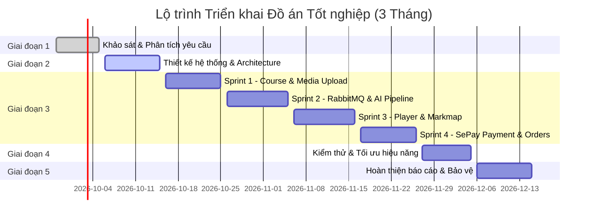

# 📅 KẾ HOẠCH TỔNG THỂ PHÁT TRIỂN HỆ THỐNG HỌC TRỰC TUYẾN VỚI VIDEO ĐA TƯƠNG TÁC
### Master Roadmap: 28/09/2026 – 22/12/2026 (3 Tháng)

> **Sinh viên thực hiện:** Trịnh Hồng Cường – **MSSV:** 28211151710  
> **Giảng viên hướng dẫn:** ThS. Nguyễn Hữu Phúc  
> **Mục tiêu:** Xây dựng hoàn chỉnh nền tảng học trực tuyến kết hợp chuyển đổi bài giảng thông minh (AssemblyAI + Gemini), trình phát video tương tác (In-video Quiz & Markmap viewer), xử lý hàng đợi RabbitMQ và thanh toán tự động SePay.

---

## 🧭 1. Tổng quan các Giai đoạn Dự án

---

## 🎯 2. Chi tiết Phân rã Công việc theo Từng Giai đoạn

### Giai đoạn 1: Khảo sát & Phân tích Yêu cầu (28/9 – 05/10/2026 | 8 ngày)
- [x] Khảo sát các nền tảng E-learning hiện tại và xác định điểm nghẽn của học tập thụ động qua video thông thường.
- [x] Phân tích bài toán tự động hóa trích xuất mindmap và tạo câu hỏi kiểm tra từ transcript video bằng AI.
- [x] Đặc tả luồng thanh toán tự động qua mã VietQR và cơ chế webhook của SePay.
- [x] Thiết lập bộ tài liệu định hướng (`a-agentic/project-brief.md`, `project-shape.md`, `docs/PROJECT_STRUCTURE.md`).

---

### Giai đoạn 2: Thiết kế Kiến trúc & Hợp đồng Dữ liệu (06/10 – 15/10/2026 | 10 ngày)
- [ ] Thiết kế cơ sở dữ liệu MongoDB:
  - Collections: `courses`, `chapters`, `lessons`, `orders`, `transactions`, `enrollments`.
  - Thiết lập indexes: `slug`, `courseId`, `orderIndex`, `deletedAt`, `sepayTransactionId`.
- [ ] Thiết kế kiến trúc Message Queue trên **RabbitMQ**:
  - Định nghĩa Exchange `elearning.video.events`.
  - Định nghĩa Queues: `video.process.queue`, `video.dead_letter.queue`.
  - Xây dựng cơ chế Manual ACK/NACK và retry backoff.
- [ ] Đặc tả giao tiếp AI Pipeline:
  - Format transcript của AssemblyAI (timestamps mảng từ và câu).
  - Format JSON output của Gemini API (Markdown cho Markmap + mảng câu hỏi trắc nghiệm In-video Quiz).
- [ ] Cập nhật thư viện dùng chung `share-lib`:
  - Khai báo các Enums: `VideoStatus`, `OrderStatus`, `RoleEnum` (`ADMIN`, `INSTRUCTOR`, `USER`).
  - Khai báo các Interfaces và DTOs dùng chung.

---

### Giai đoạn 3: Cài đặt & Lập trình (16/10 – 26/11/2026 | 42 ngày)

#### 🔹 Sprint 1: Quản lý Khóa học & Bài giảng (16/10 – 25/10/2026)
- **Backend**:
  - Xây dựng `CourseModule`, `ChapterModule`, `LessonModule` kế thừa `BaseRepository` và `BaseService`.
  - CRUD Khóa học, phân cấp chương học, sắp xếp bài học theo `orderIndex`.
  - Tích hợp lưu trữ tệp video (local / cloud storage).
  - Viết Unit tests cho `CourseService` (đạt 100% pass, AAA pattern).
- **Frontend**:
  - Xây dựng Course Catalog, bộ lọc danh mục, trang chi tiết khóa học.
  - Trang Dashboard Giảng viên: Tạo khóa học, kéo thả sắp xếp chương/bài.

#### 🔹 Sprint 2: Async RabbitMQ & AI Pipeline (26/10 – 05/11/2026)
- **Backend Worker**:
  - Tích hợp `@golevelup/nestjs-rabbitmq` hoặc RabbitMQ Microservice trong NestJS.
  - Producer: Publish message khi video bài giảng được upload.
  - Consumer 1: Gửi audio/video sang **AssemblyAI** để trích xuất text kèm timestamp.
  - Consumer 2: Gửi transcript sang **Google Gemini API** sinh Mindmap Markdown & In-video Quiz.
  - Cập nhật kết quả vào MongoDB và đổi trạng thái bài học thành `READY`.
  - Xử lý Dead Letter Queue (DLQ) khi xảy ra lỗi.
  - Viết Unit tests cho Consumer & Error handling.

#### 🔹 Sprint 3: Trình phát Video Đa tương tác & Markmap (06/11 – 16/11/2026)
- **Frontend Player**:
  - Xây dựng `InteractiveVideoPlayer`: Lắng nghe `timeupdate`.
  - Tự động tạm dừng (`pause()`) khi chạm mốc thời gian của câu hỏi ôn tập.
  - Hiển thị `InVideoQuizModal`: Cho phép học viên chọn đáp án, xem giải thích và bấm tiếp tục.
- **Frontend Mindmap**:
  - Tích hợp thư viện `@markmap/react` / `markmap-view` render cây Markdown được sinh bởi Gemini.
  - Hỗ trợ zoom, pan, thu gọn/mở rộng các nhánh kiến thức.
  - Layout responsive chia màn hình trực quan giữa video và mindmap.

#### 🔹 Sprint 4: Thanh toán Tự động SePay & Enrollment (17/11 – 26/11/2026)
- **Backend Payment**:
  - API tạo đơn hàng `/api/v1/payments/create-order` (sinh mã đơn hàng duy nhất).
  - Webhook Endpoint `/api/v1/payments/sepay-webhook`: Xác thực chữ ký/secret, kiểm tra Idempotency chống trùng lặp, mở quyền học viên (`Enrollment`) trong MongoDB Transaction Session.
  - API kiểm tra trạng thái đơn hàng (cho client polling).
  - Viết Unit tests cho Webhook Controller & Service.
- **Frontend Payment**:
  - Modal thanh toán VietQR động kèm ngân hàng, số tài khoản, số tiền và nội dung chuyển khoản.
  - Cơ chế tự động polling trạng thái thanh toán, tự động chuyển vào khóa học ngay khi có thông báo thành công.

---

### Giai đoạn 4: Kiểm thử Toàn diện & Tối ưu Hiệu năng (27/11 – 05/12/2026 | 9 ngày)
- [ ] Chạy kiểm thử tự động toàn bộ Unit tests backend (`pnpm test`).
- [ ] Kiểm thử tải và stress test với RabbitMQ (mô phỏng tải nhiều video cùng lúc).
- [ ] Kiểm thử luồng thanh toán thực tế với Webhook SePay (Sandbox/Live).
- [ ] Tối ưu hóa SEO, Lighthouse và Core Web Vitals trên Next.js App Router.
- [ ] Rà soát an ninh: Quét lỗ hổng, xác thực biến môi trường và quyền hạn Roles.

---

### Giai đoạn 5: Hoàn thiện Báo cáo Đồ án & Bảo vệ (06/12 – 15/12/2026 | 8 ngày)
- [ ] Viết tài liệu báo cáo Đồ án tốt nghiệp theo quy định của Trường và GVHD ThS. Nguyễn Hữu Phúc.
- [ ] Biên soạn Slide thuyết trình và video demo sản phẩm hoàn chỉnh.
- [ ] Triển khai sản phẩm lên máy chủ Production / Cloud (VPS, Docker, Cloudflare).
- [ ] Nghiệm thu đề tài và bảo vệ trước Hội đồng chấm Đồ án tốt nghiệp.

---

## 🏆 3. Tiêu chí Đánh giá Hoàn thành (Deliverables Checklist)

| STT | Sản phẩm bàn giao | Tiêu chí đạt |
| :---: | :--- | :--- |
| 1 | **Nền tảng Web Monorepo** | Chạy ổn định cả Frontend (Next.js 16) và Backend (NestJS 11), không lỗi lint, không type `any`. |
| 2 | **Quản lý Khóa học & Bài giảng** | Giảng viên tạo được khóa học, chia chương, tải video bài giảng. |
| 3 | **Hàng đợi RabbitMQ** | Xử lý video bất đồng bộ tin cậy, có Manual ACK và Dead Letter Queue chống thất lạc job. |
| 4 | **AI Video Pipeline** | AssemblyAI bóc tách transcript chính xác; Gemini sinh Markdown Mindmap và In-video Quiz chuẩn JSON. |
| 5 | **Trình phát Video tương tác** | Video tự động ngắt quãng để hỏi bài đúng timestamp; sơ đồ Markmap hiển thị cây kiến thức phân cấp mượt mà. |
| 6 | **Cổng thanh toán SePay** | Quét VietQR chuyển khoản thành công; Webhook kích hoạt khóa học tức thì, chống trùng lặp tuyệt đối. |
| 7 | **Hồ sơ Đồ án Tốt nghiệp** | Báo cáo hoàn chỉnh, slide thuyết trình và mã nguồn sạch sẽ trên GitHub. |
