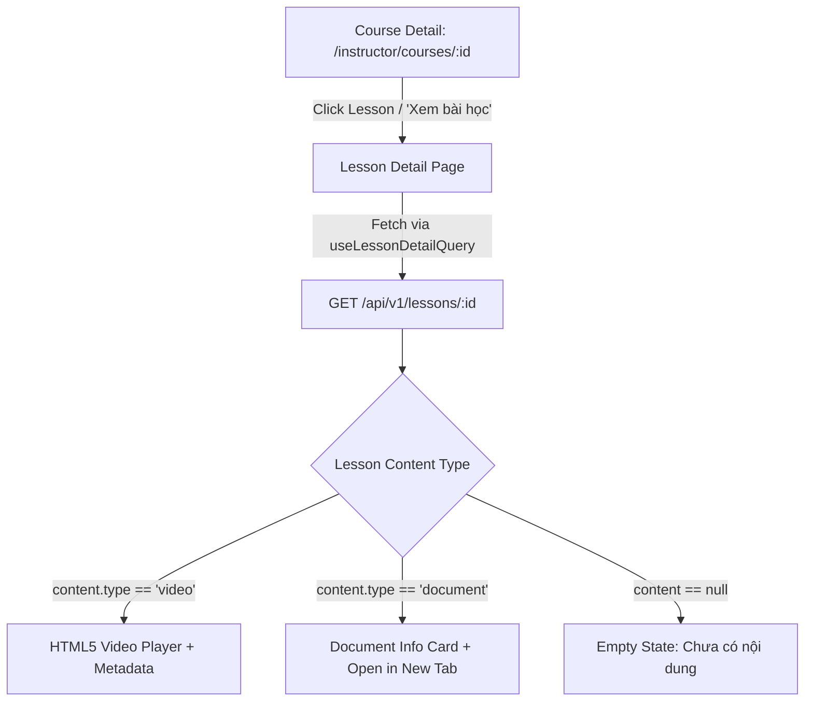

# Kế hoạch Triển khai: Milestone 26 — Lesson Detail + Content Viewer

> **Mục tiêu**: Xây dựng màn hình **Lesson Detail** và API backend cho phép người dùng click vào một Lesson trong Section để xem thông tin chi tiết bài học, trạng thái học thử (`isPreview`), và tiêu thụ nội dung (HTML5 Video Player hoặc Document Viewer Card) với đầy đủ các trạng thái Loading, Empty, và 404 Not Found.

---

## 1. Tổng quan & Ranh giới (Scope & Boundaries)

| Tiêu chí | Phạm vi trong Milestone này (IN SCOPE) | Ngoài phạm vi (OUT OF SCOPE) |
| :--- | :--- | :--- |
| **Backend API** | `GET /api/v1/lessons/:id` trả về `ApiResponse<ILesson>` | Sửa API tạo lesson, xóa lesson, sửa lesson, reorder |
| **Quyền truy cập** | `@Public()` hoặc authenticated JWT theo convention hiện có | Hệ thống Enrollment, kiểm tra mua khóa học, paywall |
| **Player Video** | Native HTML5 `<video controls>` phát qua `lesson.content.url` | Transcoding, HLS, DASH, streaming server, custom player |
| **Viewer Tài liệu** | Card thông tin tài liệu + Nút "Mở tài liệu" tab mới | Custom PDF viewer canvas, DRM, watermark, in-browser doc editor |
| **Empty State** | Hiển thị giao diện "Bài học chưa có nội dung" khi `content === null` | Form upload trực tiếp trên trang detail (đã có ở dialog) |
| **Frontend Routing** | `/instructor/courses/:courseId/lessons/:lessonId` & `/courses/:courseId/lessons/:lessonId` | Student Progress, Continue Watching, Quizzes, Comments, Ratings |
| **AI / Pipeline** | Không có | RabbitMQ, AssemblyAI STT, Gemini Mindmap/Quiz |

---

## 2. Kiến trúc Kỹ thuật (Technical Architecture)



### 2.1. Backend Architecture

- **Endpoint**: `GET /api/v1/lessons/:id`
- **Controller**: `LessonsController` (`backend/src/modules/course/lessons.controller.ts`)
  - Định tuyến `@Controller('lessons')` tách biệt với `LessonController` (`@Controller('sections')`) để bảo toàn tính độc lập của Single Responsibility Principle và không làm ảnh hưởng đến các unit test hiện có của `LessonController`.
  - Endpoint:
    ```ts
    @Get(':id')
    @Public()
    async getLessonById(@Param('id', ParseObjectIdPipe) id: string): Promise<ApiResponse<ILesson>>
    ```
  - Sử dụng `ParseObjectIdPipe` có sẵn trong module `base`: nếu ID không phải 24-character hexadecimal hợp lệ, lập tức trả về `400 Bad Request`.
- **Service**: Mở rộng `LessonService` (`backend/src/modules/course/services/lesson.service.ts`):
  - Phương thức `getLessonById(id: string, session?: ClientSession): Promise<ILesson>`
  - Tìm kiếm bài học qua `lessonRepository.findById(id, session)`.
  - Nếu không tìm thấy hoặc `deletedAt !== null`, ném `NotFoundException("Không tìm thấy bài học với ID '...'")` (404).
- **Module Registration**: Khai báo `LessonsController` trong `controllers` array của `CourseModule` (`course.module.ts`).

### 2.2. Frontend Architecture

- **API Layer**: `frontend/src/features/course/api/course.api.ts`
  - Thêm Query Key: `courseKeys.lessonDetail(id: string)` -> `['lessons', 'detail', id]`
  - Thêm API Call: `courseApi.getLessonById(id: string): Promise<ILesson>` gọi `GET /lessons/${id}`.
  - Thêm Hook: `useLessonDetailQuery(id: string)` kích hoạt khi có `id`.
- **Navigation Flow**:
  - `course-sections-list.tsx`: Truyền `courseId` xuống `SectionLessonsList`.
  - `section-lessons-list.tsx`: Nhận `courseId?: string`. Mỗi item bài học trở thành clickable row hoặc đính kèm nút "Xem bài học" điều hướng tới `/instructor/courses/${courseId}/lessons/${lesson.id}`.
- **Pages & Routes**:
  - `frontend/src/app/instructor/courses/[id]/lessons/[lessonId]/page.tsx`: Server component bọc giao diện Lesson Detail cho Giảng viên.
  - `frontend/src/app/courses/[courseId]/lessons/[lessonId]/page.tsx`: Route mirror đảm bảo tương thích hoàn toàn với URL quy chuẩn `/courses/:courseId/lessons/:lessonId`.
- **Feature Component**: `frontend/src/features/course/components/lesson-detail-content.tsx`
  - Quản lý 3 trạng thái:
    1. **Loading**: Skeleton giả lập khung video 16:9, tiêu đề, badges và mô tả.
    2. **Error / 404**: Hiển thị Card cảnh báo thân thiện, thông báo lỗi cụ thể và nút "Quay lại khóa học".
    3. **Success**:
       - Header: Nút "Quay lại khóa học" (`Link` với icon `lucide:arrow-left`).
       - Metadata tags: Badge thứ tự (e.g. `Bài 01`), badge học thử (`Học thử` - emerald / `Nội dung chính thức` - slate), badge loại nội dung (`Video` / `Tài liệu` / `Chưa có file`).
       - Content Viewers:
         - **Video**: Thẻ `<video controls controlsList="nodownload">` responsive tỉ lệ 16:9, bo góc, nền đen chống lóa, hiển thị thời lượng (phút:giây) và dung lượng file nếu có.
         - **Document**: Thẻ Card hiển thị icon tài liệu, tên file (`fileName`), kích thước (`fileSize`), định dạng MIME (`mimeType`), và nút hành động "Mở tài liệu" (`target="_blank" rel="noopener noreferrer"`).
         - **Chưa có nội dung**: Thẻ Empty State trực quan, giải thích rõ bài học chưa có nội dung đính kèm.
       - Mô tả chi tiết bài học (`description`).

---

## 3. Cấu trúc Tệp tin Dự kiến (File Structure)

```text
backend/
├── src/modules/course/
│   ├── course.module.ts                         # [UPDATE] Đăng ký LessonsController
│   ├── lessons.controller.ts                   # [NEW] Controller GET /lessons/:id
│   ├── services/
│   │   └── lesson.service.ts                   # [UPDATE] Thêm getLessonById(id)
│   └── tests/
│       ├── lessons.controller.spec.ts          # [NEW] Unit test LessonsController (200, 404, 400, @Public)
│       └── lesson.service.spec.ts              # [UPDATE/NEW] Unit test getLessonById trong LessonService

frontend/
├── src/app/
│   ├── instructor/courses/[id]/lessons/[lessonId]/
│   │   └── page.tsx                            # [NEW] Next.js route: Chi tiết bài học
│   └── courses/[courseId]/lessons/[lessonId]/
│       └── page.tsx                            # [NEW] Next.js route mirror tương thích
├── src/features/course/
│   ├── api/
│   │   └── course.api.ts                       # [UPDATE] Thêm getLessonById & useLessonDetailQuery
│   ├── components/
│   │   ├── lesson-detail-content.tsx           # [NEW] Component trình chiếu bài học & viewers
│   │   ├── lesson-detail-skeleton.tsx          # [NEW] Loading skeleton cho lesson detail
│   │   ├── section-lessons-list.tsx            # [UPDATE] Thêm click navigation & button "Xem bài học"
│   │   └── course-sections-list.tsx            # [UPDATE] Truyền courseId vào SectionLessonsList
│   └── index.ts                                # [UPDATE] Re-export LessonDetailContent & hook

a-agentic/features/course-management/
├── tech-spec.md                                # [UPDATE] Tài liệu hóa GET /lessons/:id & viewers
└── dev-history.md                              # [UPDATE] Ghi chép lịch sử phát triển Milestone 26
```

---

## 4. Chi tiết Nhiệm vụ Triển khai (Task Breakdown)

### Task 1: Backend — `LessonService.getLessonById`
- **Agent**: `backend-specialist`
- **Skill**: `clean-code`, `api-patterns`
- **Input**: `lessonId: string`
- **Output**: Thêm hàm `getLessonById(id: string)` vào `LessonService`, kiểm tra tồn tại và `deletedAt`. Ném `NotFoundException` nếu không tìm thấy.
- **Verify**: Unit test gọi `getLessonById` thành công với data hợp lệ và ném `NotFoundException` khi id không có trong DB hoặc bị soft-deleted.

### Task 2: Backend — `LessonsController` & Route Registration
- **Agent**: `backend-specialist`
- **Skill**: `clean-code`, `api-patterns`
- **Input**: File `lessons.controller.ts` mới, `course.module.ts`.
- **Output**:
  - `@Controller('lessons')` với endpoint `@Get(':id')` dùng `ParseObjectIdPipe`.
  - Gắn decorator `@Public()` để cho phép học viên/giảng viên xem thông tin theo convention hiện hành.
  - Đăng ký vào `CourseModule.controllers`.
- **Verify**: `pnpm test` chạy pass `lessons.controller.spec.ts` kiểm tra 200, 404, 400 ID sai định dạng, và metadata `@Public`.

### Task 3: Frontend API & React Query Hook
- **Agent**: `frontend-specialist`
- **Skill**: `react-best-practices`
- **Input**: `frontend/src/features/course/api/course.api.ts`.
- **Output**:
  - `courseKeys.lessonDetail(id)`
  - `courseApi.getLessonById(id)`
  - `useLessonDetailQuery(id)`
- **Verify**: Typescript biên dịch không lỗi, query key được cô lập theo `['lessons', 'detail', id]`.

### Task 4: Frontend UI — `LessonDetailContent` & Viewers
- **Agent**: `frontend-specialist`
- **Skill**: `frontend-design`, `clean-code`
- **Input**: `ILesson`, `ILessonContent`, `LessonContentTypeEnum` từ `share-lib`.
- **Output**:
  - `LessonDetailSkeleton` khi `isLoading`.
  - Error state khi `isError` kèm nút retry và quay lại.
  - HTML5 Video player khi `lesson.content?.type === 'video'`.
  - Document Info Card + nút mở tab mới khi `lesson.content?.type === 'document'`.
  - Empty state rõ ràng khi `lesson.content === null`.
  - Nút quay lại khóa học ("← Quay lại khóa học").
- **Verify**: Không sử dụng `any`, không dùng inline font classes, tương thích mobile/desktop, hiển thị đúng từng nhánh nội dung.

### Task 5: Frontend Routing & Navigation Kết nối từ Lesson List
- **Agent**: `frontend-specialist`
- **Skill**: `frontend-design`
- **Input**: `course-sections-list.tsx`, `section-lessons-list.tsx`, `app/instructor/courses/[id]/lessons/[lessonId]/page.tsx`, `app/courses/[courseId]/lessons/[lessonId]/page.tsx`.
- **Output**:
  - `SectionLessonsList` nhận `courseId` và cung cấp link/nút "Xem bài học".
  - Trang chi tiết tải đúng theo param URL và hiển thị nội dung bài học.
- **Verify**: Bấm vào một bài học trong danh sách Section dẫn thẳng đến trang chi tiết bài học với đầy đủ dữ liệu.

### Task 6: Living Docs Sync & Regression Testing
- **Agent**: `orchestrator`
- **Skill**: `context-maintenance`
- **Input**: Toàn bộ codebase sau khi sửa đổi.
- **Output**:
  - Chạy `npm run build` trên `share-lib`.
  - Chạy `npm run test`, `npm run build`, `npm run lint` trên `backend`.
  - Chạy `npm run build`, `npm run lint` trên `frontend`.
  - Cập nhật `dev-history.md` và `tech-spec.md` trong `a-agentic/features/course-management/`.
- **Verify**: 100% tests pass, không phát sinh TypeScript lỗi hay lint warning.

---

## 5. Phase X: Final Verification Checklist

- [ ] **Backend Unit Tests**:
  - `pnpm --filter backend test` kiểm tra toàn bộ suite, đặc biệt là `lessons.controller.spec.ts` và `lesson.service.spec.ts`.
- [ ] **Type Check & Linting**:
  - `pnpm --filter share-lib build`
  - `pnpm --filter backend lint && pnpm --filter backend build`
  - `pnpm --filter frontend lint && pnpm --filter frontend build`
- [ ] **UI/UX & Safety Checks**:
  - Không sử dụng màu tím cấm (No purple/violet ban).
  - Không dùng inline font classes.
  - Không dùng type `any`.
  - Không phá vỡ luồng upload video/tạo bài học hiện tại.
  - Xử lý mượt mà khi `content === null`.
- [ ] **Living Docs**:
  - `a-agentic/features/course-management/dev-history.md` được cập nhật đầy đủ.
