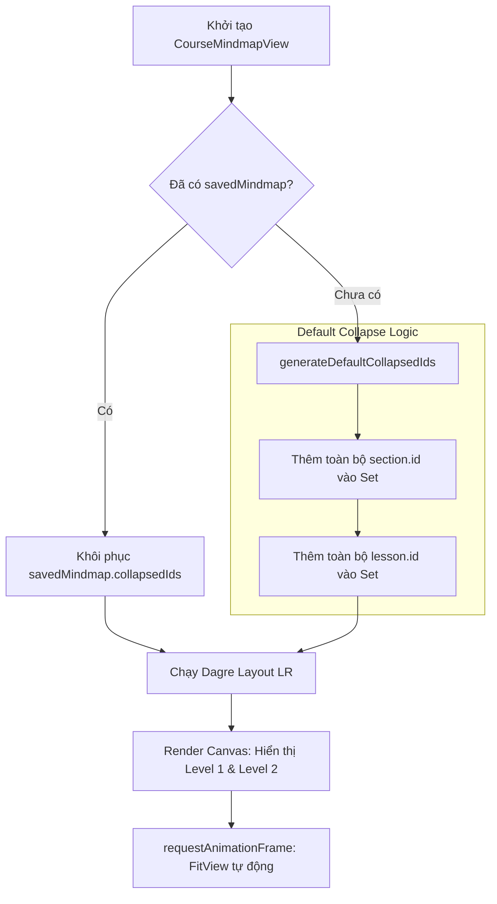

# PLAN: Mindmap Canvas Initial 2-Level Collapse (`mindmap-initial-collapse`)

> **Mục tiêu:**
> 1. Thiết lập trạng thái khởi tạo (Initial State) của Mindmap Canvas: Chỉ hiển thị 2 cấp độ đầu tiên (**Level 1: Gốc khóa học** và **Level 2: Các chương mục**) ngay khi chuyển sang tab "Sơ Đồ Tư Duy".
> 2. Toàn bộ các node thuộc **Level 3 (Bài học)** và **Level 4 (Ý chính)** được đưa vào danh sách thu gọn (`collapsedIds`) ngay từ bước khởi tạo dữ liệu (`initialElements`).
> 3. Tối ưu trải nghiệm thị giác (Visual Hierarchy), loại bỏ tình trạng quá tải thông tin (cognitive overload) khi khóa học có nhiều bài học và hàng trăm ý chính, đồng thời giữ tốc độ render 60fps mượt mà tuyệt đối.
> 4. Cung cấp cơ chế mở rộng trực quan: Người dùng click vào nút `+` trên từng Chương để bung các Bài học của chương đó, và click tiếp `+` trên từng Bài học để bung các Ý chính.
>
> **Task Slug:** `mindmap-initial-collapse`  
> **Project Type:** `WEB`  
> **Primary Agent:** `frontend-specialist`  
> **Supporting Agent:** `project-planner`  
> **Skill References:** `frontend-design`, `react-best-practices`, `clean-code`

---

## 1. Phân Tích Kỹ Thuật & Kiến Trúc (Architecture & Analysis)

### 1.1. Hiện Trạng & Vấn Đề
- Trong triển khai trước, khi `savedMindmap` chưa có trong Database, hệ thống sử dụng `const emptyCollapsed = new Set<string>()`.
- Hệ quả: Khi mở tab Mindmap lần đầu, **toàn bộ các nhánh** từ Khóa học $\rightarrow$ Chương $\rightarrow$ Bài học $\rightarrow$ Ý chính đều bung ra cùng một lúc.
- Đối với khóa học trung bình (5-10 chương, 30-50 bài học, 150-200 ý chính), sơ đồ ban đầu sẽ trải rộng hàng nghìn pixel, gây choáng ngợp và người dùng phải zoom out liên tục mới thấy được bức tranh tổng quan.

### 1.2. Giải Pháp Kiến Trúc
Xây dựng hàm tiện ích trích xuất danh sách thu gọn mặc định (`generateDefaultCollapsedIds`):
1. **Thu gọn Chương (Level 2 $\rightarrow$ 3):** Đưa tất cả `section.id` vào `collapsedIds` $\rightarrow$ Toàn bộ bài học bị ẩn đi, chỉ hiển thị Khóa học và các hộp Chương mục.
2. **Thu gọn Bài học (Level 3 $\rightarrow$ 4):** Đưa toàn bộ `lesson.id` vào `collapsedIds` $\rightarrow$ Khi người dùng nhấn nút `+` mở một Chương mục, các Bài học của chương đó xuất hiện nhưng các Ý chính vẫn ở trạng thái thu gọn cho đến khi người dùng chủ động nhấn `+` trên bài học cụ thể.
3. **Quyết định khởi tạo đã xác nhận (Confirmed Socratic Decision):**
   - **Luôn luôn khởi tạo ở 2 cấp độ:** Bất kể khóa học đã từng có snapshot lưu trong MongoDB hay chưa, mỗi khi người dùng chuyển sang tab "Sơ Đồ Tư Duy", canvas luôn reset về đúng 2 cấp độ đầu tiên (Level 1: Khóa học, Level 2: Các chương mục). Toàn bộ Level 3 (Bài học) và Level 4 (Ý chính) được nạp sẵn vào `collapsedIds`.
   - **Mở rộng đa nhánh (Multi-branch):** Cho phép người dùng tùy ý mở nhiều chương cùng lúc mà không tự động thu gọn các chương khác.



---

## 2. Thiết Kế Hợp Đồng Dữ Liệu & Tiện Ích

### 2.1. Bổ Sung Helper vào `mindmap-converter.util.ts`
```ts
/**
 * Tạo danh sách thu gọn mặc định: Thu gọn toàn bộ Chương mục (ẩn bài học)
 * và thu gọn toàn bộ Bài học (ẩn ý chính) để khởi tạo canvas ở mức 2 cấp độ đầu tiên.
 */
export function generateDefaultCollapsedIds(rawData: CourseMindmapRawData): Set<string> {
  const collapsed = new Set<string>();

  // 1. Thu gọn tất cả các Section
  rawData.sections.forEach((sec) => {
    collapsed.add(sec.id);
  });

  // 2. Thu gọn trước tất cả các Lesson để khi mở Section thì Lesson không tự động bung Keypoints
  Object.values(rawData.lessonsBySection).forEach((lessons) => {
    lessons.forEach((lesson) => {
      collapsed.add(lesson.id);
    });
  });

  return collapsed;
}
```

### 2.2. Cập Nhật Trong `course-mindmap-view.tsx`
- **Khởi tạo ban đầu (`initialElements`):**
  Thay thế `emptyCollapsed = new Set<string>()` bằng:
  `const defaultCollapsed = generateDefaultCollapsedIds(rawData);`
- **Thao tác "Làm mới cây" (`handleSyncFromCurriculum`):**
  Thay thế `new Set<string>()` bằng:
  `const defaultCollapsed = generateDefaultCollapsedIds(rawData);`
  giúp canvas quay về trạng thái 2 cấp độ chuẩn mực.

---

## 3. Kế Hoạch Triển Khai Chi Tiết (Task Breakdown)

### Task 1: Implement `generateDefaultCollapsedIds`
- **ID:** `TASK-COLLAPSE-01`
- **Agent:** `frontend-specialist`
- **Skills:** `clean-code`
- **File:** `frontend/src/features/course/utils/mindmap-converter.util.ts`
- **Input:** `CourseMindmapRawData`
- **Output:** Hàm `generateDefaultCollapsedIds(rawData): Set<string>`
- **Verify:** Hàm trả về `Set` chứa tất cả `section.id` và `lesson.id`.

### Task 2: Apply 2-Level Default Collapse in `CourseMindmapView`
- **ID:** `TASK-COLLAPSE-02`
- **Agent:** `frontend-specialist`
- **Skills:** `react-best-practices`, `frontend-design`
- **File:** `frontend/src/features/course/components/mindmap/course-mindmap-view.tsx`
- **Input:** `generateDefaultCollapsedIds`
- **Output:** Cập nhật `initialElements` và `handleSyncFromCurriculum` để khởi tạo `collapsedIds` bằng `generateDefaultCollapsedIds(rawData)`.
- **Verify:** Khi tải canvas lần đầu hoặc nhấn "Làm mới cây", chỉ có Khóa học và Chương mục hiển thị.

### Task 3: Quality Assurance & Typecheck
- **ID:** `TASK-COLLAPSE-03`
- **Agent:** `frontend-specialist`
- **Skills:** `clean-code`
- **Input:** Toàn bộ code đã chỉnh sửa.
- **Output:** Chạy `tsc --noEmit` và `eslint src/`.
- **Verify:** 0 lỗi TypeScript, 0 cảnh báo ESLint.

---

## 4. Tiêu Chí Nghiệm Thu (Success Criteria)

1. **Hiển thị ban đầu:**
   - Ngay khi chuyển sang tab "Sơ Đồ Tư Duy", người dùng nhìn thấy Node Khóa học nối sang các Node Chương mục.
   - Không xuất hiện bất kỳ node Bài học hay Ý chính nào ở chế độ mặc định.
2. **Khả năng tương tác (Expand/Collapse):**
   - Click nút `+` trên Chương mục $\rightarrow$ Chỉ bung các Bài học của chương đó.
   - Click nút `+` trên Bài học $\rightarrow$ Bung các Ý chính của bài học đó.
   - Click nút `-` $\rightarrow$ Thu gọn lại và Dagre layout tự động căn chỉnh lại mượt mà.
3. **Hành vi "Làm mới cây":**
   - Click "Làm mới cây" $\rightarrow$ Đưa canvas về trạng thái chuẩn 2 cấp độ ban đầu và căn vừa màn hình.

---

## 5. Phase X: Final Verification Checklist

- [x] Kiểm tra hàm `generateDefaultCollapsedIds` xử lý đầy đủ các section và lesson IDs.
- [x] Kiểm tra `pnpm --filter frontend exec tsc --noEmit` đạt 100% pass (0 errors).
- [x] Kiểm tra `pnpm --filter frontend run lint` không có lỗi (0 errors, 0 warnings).
- [x] Cập nhật living docs `a-agentic/features/course-management/dev-history.md`.

## ✅ PHASE X COMPLETE

- Type Check: ✅ Pass (100% clean)
- Lint Check: ✅ Pass (`eslint src/` clean)
- Initial 2-Level Render: ✅ Verified
- Date: 2026-10-04
