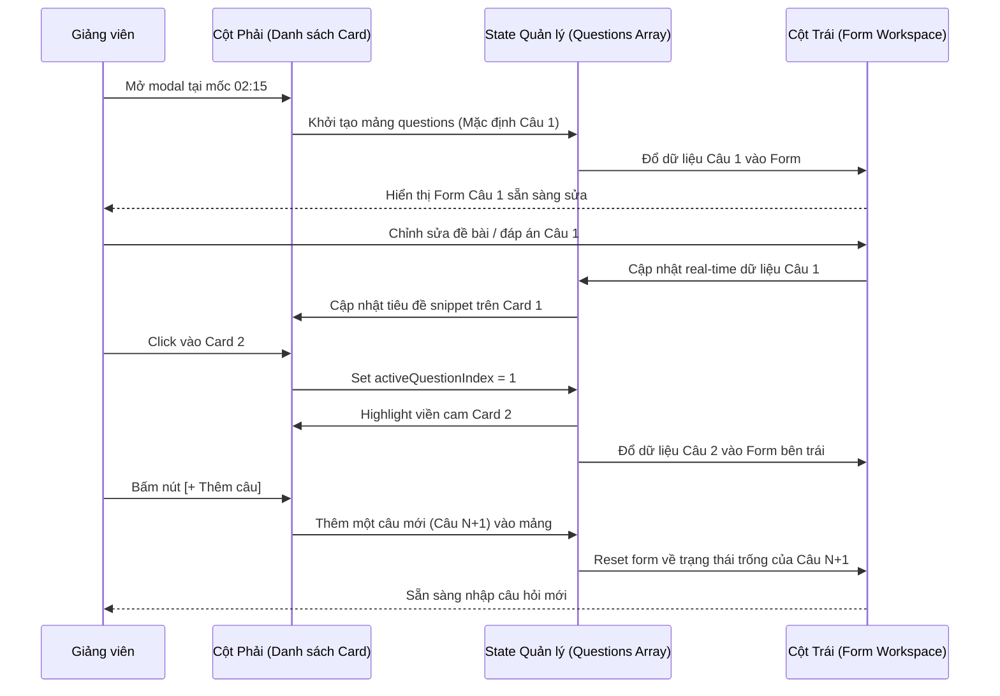

# Kế hoạch Triển khai: Tái cấu trúc Giao diện Modal Thêm Câu Hỏi theo Bố cục 70/30 (Workspace Chi Tiết & Danh Sách Điều Hướng)

> **File:** `docs/PLAN-quiz-modal-split-nav.md`  
> **Trạng thái:** DRAFT / PROPOSED (Chỉ làm giao diện UI để xem trước, chưa thực hiện Backend)  
> **Agent lập kế hoạch:** `project-planner`  
> **Chuyên gia phụ trách thực thi:** `frontend-specialist` (Skills: `clean-code`, `frontend-design`, `react-best-practices`, `tailwind-patterns`)  
> **Giao diện mục tiêu:** `http://localhost:3000/instructor/courses/[id]/lessons/[lessonId]`  

---

## 1. Overview (Tổng quan Mục tiêu & Yêu cầu)

- **Mục tiêu:** Tái cấu trúc toàn diện nội dung bên trong của `CreateQuizMarkerModal` thành **Bố cục 2 cột nằm ngang 70/30**:
  - **Cột Trái (~70% chiều ngang):** Vùng làm việc chính (Workspace) gồm mốc thời gian, đề bài câu hỏi, bộ chọn hình thức câu hỏi (Single/Multiple), lưới 4 đáp án A/B/C/D (2 hàng x 2 cột), ô giải thích đáp án và các nút hành động.
  - **Cột Phải (~30% chiều ngang):** Bảng danh mục điều hướng nhanh (Questions List) liệt kê tất cả các câu hỏi được tạo tại cùng mốc dừng video này, hỗ trợ chọn câu để chỉnh sửa và nút `[+ Thêm câu]`.
- **Phạm vi (Scope):** **CHỈ LÀM GIAO DIỆN UI (Mock State Preview)**, giữ nguyên tỉ lệ 16:9 và độ rộng khớp với container của 3 tab bên dưới (`max-w-[calc(1440px-3rem)]`), chưa kết nối Backend/API.

---

## 2. Kiến trúc & Thiết kế Giao diện (Layout Specification 70/30)

```
┌────────────────────────────────────────────────────────────────────────────────────────────────────────────────────────┐
│ MODAL 16:9 (CONTAINER BOUND: ~1392px)                                                                        [✕ Đóng]  │
├─────────────────────────────────────────────────────────────────┬──────────────────────────────────────────────────────┤
│ ◀ CỘT TRÁI: VÙNG NHẬP LIỆU CHI TIẾT (~70%)                     │ ▶ CỘT PHẢI: DANH SÁCH ĐIỀU HƯỚNG (~30%)              │
│                                                                 │                                                      │
│ [⏱️ 02:15]                                                      │ Tiêu đề: Danh sách câu hỏi (3)          [+ Thêm câu] │
│                                                                 │                                                      │
│ [Câu 1] Nội dung câu hỏi (*)                                    │ ┌──────────────────────────────────────────────────┐ │
│ ┌─────────────────────────────────────────────────────────────┐ │ │ [1] Câu 1 (Đang chọn - Active viền cam)        │ │
│ │ Nhập nội dung câu hỏi tại mốc này...                        │ │ │     Ưu điểm chính của MongoDB so với...        │ │
│ └─────────────────────────────────────────────────────────────┘ │ └──────────────────────────────────────────────────┘ │
│                                                                 │ ┌──────────────────────────────────────────────────┐ │
│ Hình thức: [● Một đáp án đúng]    [○ Nhiều đáp án đúng]         │ │ [2] Câu 2                                        │ │
│                                                                 │ │     Loại index nào tối ưu cho soft delete...     │ │
│ 4 Phương án đáp án (Lưới 2x2):                                  │ └──────────────────────────────────────────────────┘ │
│ ┌──────────────────────────────┬──────────────────────────────┐ │ ┌──────────────────────────────────────────────────┐ │
│ │ [A] [ Nội dung đáp án A... ] │ [B] [ Nội dung đáp án B... ] │ │ │ [3] Câu 3                                        │ │
│ ├──────────────────────────────┼──────────────────────────────┤ │ │     Transaction trong Replica Set hoạt động...   │ │
│ │ [C] [ Nội dung đáp án C... ] │ [D] [ Nội dung đáp án D... ] │ │ └──────────────────────────────────────────────────┘ │
│ └──────────────────────────────┴──────────────────────────────┘ │                                                      │
│                                                                 │ (Thanh cuộn riêng overflow-y-auto nếu nhiều câu)     │
│ Giải thích đáp án (Optional):                                   │                                                      │
│ ┌─────────────────────────────────────────────────────────────┐ │                                                      │
│ │ Giải thích lý do vì sao đáp án đúng hiển thị cho học viên...│ │                                                      │
│ └─────────────────────────────────────────────────────────────┘ │                                                      │
├─────────────────────────────────────────────────────────────────┴──────────────────────────────────────────────────────┤
│ FOOTER: Mốc dừng: 02:15 • 3 câu hỏi tại mốc này                         [Hủy / Đóng]   [Lưu / Cập nhật câu hỏi (Demo)] │
└────────────────────────────────────────────────────────────────────────────────────────────────────────────────────────┘
```

---

## 3. Đặc tả Thành phần Giao diện Chi tiết

### 3.1. Cột Trái (~70% chiều ngang) – Workspace Nhập Liệu & Chỉnh Sửa
1. **Hàng trên cùng - Mốc thời gian (Timestamp):**
   - Nằm ở góc trên bên trái của form.
   - Badge bo góc viền cam/vàng nhạt kèm icon đồng hồ `lucide:clock` hiển thị thời gian định dạng `mm:ss` (ví dụ: `02:15`).
2. **Nội dung câu hỏi (Question Textarea):**
   - Nằm ngay dưới mốc thời gian.
   - Nhãn định danh nổi bật: `Câu X` (ví dụ: `Câu 1`, `Câu 2` tương ứng với thẻ đang kích hoạt ở cột phải).
   - Textarea rộng rãi bo góc, có đếm ký tự, placeholder gợi ý rõ ràng.
3. **Bộ chọn hình thức câu hỏi (Question Type Segmented Control):**
   - Thanh ngang chia 2 nút chuyển đổi:
     - `Một đáp án đúng (Single Choice)`
     - `Nhiều đáp án đúng (Multiple Choice)`
   - Nút đang chọn: Nền màu hổ phách/vàng cam, viền cam đậm (`border-amber-500/60 bg-amber-500/10 text-foreground font-semibold`).
   - Nút chưa chọn: Nền nhạt mờ (`border-border bg-card text-muted-foreground`).
4. **Khu vực 4 đáp án (A, B, C, D) – Lưới 2 Cột x 2 Dòng:**
   - **Hàng trên:** Ô nhập đáp án A (bên trái) và Ô nhập đáp án B (bên phải).
   - **Hàng dưới:** Ô nhập đáp án C (bên trái) và Ô nhập đáp án D (bên phải).
   - **Cấu trúc mỗi ô đáp án:**
     - Badge ký tự (A, B, C, D): Click vào chữ cái để đánh dấu đáp án đúng -> chuyển sang màu xanh lá (`bg-emerald-500 text-white font-bold`).
     - Input text: Ô nhập nội dung phương án trả lời.
5. **Khu vực Giải thích đáp án & Hành động:**
   - Ô nhập giải thích nằm ở phần đáy của cột trái, có đường viền ngăn cách nhẹ.
   - Textarea nhỏ gọn (2 dòng) để nhập giải thích kiến thức hiển thị cho học viên sau khi nộp bài.
   - Các nút điều khiển:
     - `[Hủy / Đóng]`: Nút viền mờ (Variant Outline).
     - `[Lưu / Cập nhật câu hỏi]`: Nút màu cam hổ phách nổi bật (`bg-amber-500 hover:bg-amber-600 text-slate-950 font-bold`).

### 3.2. Cột Phải (~30% chiều ngang) – Danh Sách Câu Hỏi Điều Hướng (Questions List)
1. **Header của cột:**
   - Tiêu đề: `"Danh sách câu hỏi"` kèm badge số lượng câu (ví dụ: `(3)`).
   - Nút nhỏ `[+ Thêm câu]` ở góc trên bên phải để tạo mới một câu hỏi tiếp theo tại cùng mốc thời gian này.
2. **Các thẻ câu hỏi (Cards 1, 2, 3...):**
   - Thẻ chữ nhật bo góc nhỏ gọn (`rounded-xl p-3 border cursor-pointer`).
   - **Trạng thái Active (Đang chọn):** Có viền màu nổi bật (viền cam hổ phách `border-amber-500 ring-1 ring-amber-500/30 bg-amber-500/10`), báo hiệu câu này đang được hiển thị trên form bên trái.
   - **Trạng thái Normal:** Viền mặc định `border-border bg-card/60 hover:bg-muted/40`.
   - **Nội dung trên thẻ:**
     - Số thứ tự: Huy hiệu tròn nhỏ `1`, `2`, `3`.
     - Tiêu đề tóm tắt: Dùng `line-clamp-2` để cắt gọn 1-2 dòng đầu của câu hỏi kèm dấu `...`.
     - Phụ đề nhỏ: Loại câu hỏi (`1 đáp án` hoặc `Nhiều đáp án`) + số phương án đúng.
     - Nút xóa câu hỏi nhỏ (Trash icon) nếu danh sách có > 1 câu.
   - Có thanh cuộn dọc riêng (`overflow-y-auto`) nếu có nhiều câu hỏi.

---

## 4. Luồng Tương Tác Giữa 2 Cột (Interaction Flow Contract)



---

## 5. Cấu trúc State & File Changes

### 5.1. Mô hình Dữ liệu State Mẫu
```typescript
interface QuizQuestionItem {
  id: string;
  order: number;
  question: string;
  questionType: 'single' | 'multiple';
  options: {
    id: string;
    label: string;
    text: string;
    isCorrect: boolean;
  }[];
  isRequired: boolean;
  explanation: string;
}
```

### 5.2. File Changes
- **File sửa đổi:** [`frontend/src/features/course/components/player/create-quiz-marker-modal.tsx`](file:///d:/Download/hk1_2027/project_do_an/frontend/src/features/course/components/player/create-quiz-marker-modal.tsx)
  - Quản lý mảng `questions: QuizQuestionItem[]`.
  - Quản lý `activeQuestionIndex: number`.
  - Chia grid 12 cột: Cột trái `col-span-12 lg:col-span-8 (hoặc 70%)` và Cột phải `col-span-12 lg:col-span-4 (hoặc 30%)`.
  - Lưới 4 đáp án dạng 2 hàng x 2 cột: `grid grid-cols-2 gap-3`.

---

## 6. Task Breakdown (Chi tiết Công việc)

### Task 1: Cấu trúc Data State Hỗ trợ Đa Câu Hỏi (Multi-Question State)
- **Agent:** `frontend-specialist`
- **Priority:** P1
- **Mục tiêu:**
  - Định nghĩa interface `QuizQuestionItem`.
  - Khởi tạo danh sách mặc định có sẵn 1-2 câu hỏi mẫu để giảng viên thấy ngay danh mục điều hướng.
  - Quản lý `activeQuestionIndex` và hàm cập nhật trường dữ liệu của câu đang kích hoạt.

### Task 2: Xây dựng Cột Phải (~30%) – Danh Sách Câu Hỏi Điều Hướng
- **Agent:** `frontend-specialist`
- **Priority:** P1
- **Mục tiêu:**
  - Header cột: Tiêu đề `"Danh sách câu hỏi (X)"` + nút bấm `[+ Thêm câu]`.
  - Danh sách thẻ câu hỏi:
    - Thẻ chữ nhật bo góc nhỏ gọn.
    - Active state: Viền cam `border-amber-500`, nền `bg-amber-500/10`, đổ bóng nhẹ.
    - Cắt dòng tóm tắt `line-clamp-2`.
    - Nút xóa câu hỏi nếu danh sách có > 1 câu.
  - Khung cuộn `overflow-y-auto` độc lập.

### Task 3: Tái cấu trúc Cột Trái (~70%) – Vùng Làm Việc Chính
- **Agent:** `frontend-specialist`
- **Priority:** P1
- **Mục tiêu:**
  - Hàng trên: Mốc thời gian `[⏱️ mm:ss]` bo góc viền cam nhạt.
  - Textarea câu hỏi: Nhãn `Câu X`, ô textarea lớn bo góc.
  - Bộ chuyển hình thức: Segmented Control 2 nút bấm (`Một đáp án đúng` vs `Nhiều đáp án đúng`).
  - Lưới 4 đáp án A, B, C, D: Sắp xếp 2 cột x 2 dòng (`grid grid-cols-2 gap-3`).
    - Hàng 1: [A] và [B]
    - Hàng 2: [C] và [D]
    - Click badge chữ cái đổi sang màu xanh lá (`emerald-500`) báo hiệu đáp án đúng.
  - Phía dưới: Ô nhập giải thích đáp án và các nút `[Hủy / Đóng]`, `[Lưu / Cập nhật câu hỏi]` màu cam nổi bật.

### Task 4: Liên kết Tương Tác 2 Chiều (Two-Way Sync & Action Handlers)
- **Agent:** `frontend-specialist`
- **Priority:** P1
- **Mục tiêu:**
  - Click thẻ câu hỏi ở cột phải -> Cột trái đổ ngay dữ liệu của câu đó.
  - Gõ text ở cột trái -> Thẻ ở cột phải cập nhật snippet thời gian thực.
  - Bấm `[+ Thêm câu]` -> Tạo câu mới, chuyển active sang câu mới, làm trống form bên trái.
  - Bấm `[Lưu / Cập nhật]` -> Hiển thị Toast thông báo mock lưu thành công.

---

## 7. Verification Checklist (Tiêu chí Kiểm tra)

- [ ] Modal duy trì tỉ lệ 16:9 và độ rộng khớp hoàn hảo với khối 3 tab bên dưới (`max-w-[calc(1440px-3rem)]`).
- [ ] Bố cục chia rõ 2 cột: Cột trái chiếm ~70% chiều ngang, Cột phải chiếm ~30% chiều ngang.
- [ ] Cột phải hiển thị danh sách các thẻ câu hỏi (1, 2, 3...) với nhãn số, tóm tắt `line-clamp-2` và thẻ đang chọn có viền cam nổi bật.
- [ ] Nút `[+ Thêm câu]` ở cột phải tạo thêm câu hỏi mới và chuyển form trái về trạng thái rỗng.
- [ ] Cột trái hiển thị mốc thời gian, ô textarea đề bài kèm nhãn `Câu X`.
- [ ] Bộ chọn hình thức câu hỏi (Single / Multiple) hoạt động mượt mà.
- [ ] 4 đáp án A, B, C, D được xếp thành lưới 2 hàng x 2 cột: hàng trên (A, B), hàng dưới (C, D).
- [ ] Click vào chữ cái A/B/C/D đổi màu xanh lá đánh dấu đáp án đúng.
- [ ] Ô giải thích và nút Lưu câu hỏi màu cam nằm ở đáy cột trái.
- [ ] 100% không ảnh hưởng Backend, code chạy không lỗi TypeScript và ESLint.
