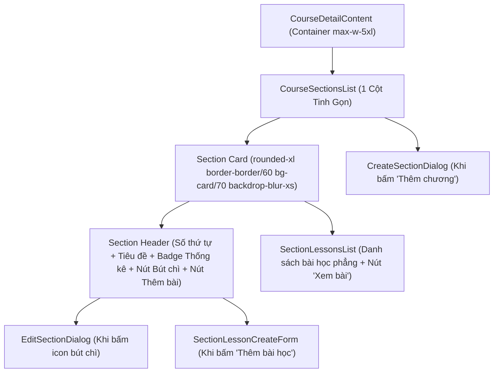

# PLAN: Tối Ưu Thẻ Chương Học & Loại Bỏ Inspector Panel Bên Phải (`simplify-curriculum-ui`)

> **Mục tiêu:**
> 1. **Loại bỏ Inspector Panel bên phải và Slide Drawer:**
>    - Hủy bỏ bố cục Master - Detail Split View 2 cột và ngăn kéo trượt (Drawer) trên mobile theo yêu cầu của người dùng.
>    - Trở về bố cục 1 cột thống nhất, rộng rãi, dễ theo dõi cho toàn bộ trang chi tiết khóa học.
> 2. **Nâng cấp giao diện Card Chương học theo Style mới:**
>    - Áp dụng styling hiện đại, tinh gọn cho mỗi Card Chương học:
>      `rounded-xl border border-border/60 bg-card/70 shadow-sm backdrop-blur-xs transition-all duration-300 overflow-hidden`
>    - Bổ sung nút cây bút chì (`lucide:pencil`) trực tiếp tại Header của mỗi Card Chương để mở modal `EditSectionDialog`.
>    - Tích hợp Badge thông số thống kê ngay trên Header của từng chương: Hiển thị số lượng bài học và tổng thời lượng (ví dụ: `6 bài giảng · 1 giờ 45 phút`).
> 3. **Hành vi Bài học trong Danh sách (`SectionLessonsList`):**
>    - Bỏ thao tác click chọn kích hoạt panel.
>    - Người dùng xem danh sách trực quan; chỉ khi nhấn vào liên kết / nút **"Xem bài học"** ở bên phải mới điều hướng sang trang bài giảng (`/instructor/courses/[id]/lessons/[lessonId]`).
> 4. **Dọn dẹp mã nguồn & Tối ưu Layout:**
>    - Thu hồi thư mục `frontend/src/features/course/components/inspector/` và cập nhật lại `index.ts`.
>    - Cân chỉnh container `CourseDetailContent` về `max-w-5xl` gọn gàng, liền mạch.
>
> **Task Slug:** `simplify-curriculum-ui`  
> **Plan File:** `docs/PLAN-simplify-curriculum-ui.md`  
> **Primary Agent:** `project-planner` & `frontend-specialist`  
> **Executing Agent:** `frontend-specialist`  
> **Skills:** `clean-code`, `frontend-design`, `react-best-practices`, `plan-writing`

---

## 1. Phân Tích Kỹ Thuật & Cấu Trúc Giao Diện Mới

### 1.1. Hiện Trạng & Yêu Cầu Thay Đổi

- **Trước thay đổi:**
  - Trang chi tiết khóa học bị chia làm 2 cột (Master Tree 68% bên trái và Inspector Panel 32% cố định bên phải).
  - Khi click vào chương hoặc bài học, panel bên phải slide hiển thị thông tin chi tiết.
  - Trên mobile, Inspector tự động bật slide drawer.
- **Yêu cầu tinh gọn mới:**
  - Người dùng không cần khối chi tiết bên phải lướt ra vì gây rườm rà.
  - Chỉ cần tập trung làm đẹp thẻ Card Chương học với hiệu ứng card tinh tế, viền bóng nhẹ và các nút thao tác nhanh (sửa chương, thêm bài học) ngay tại Header của từng chương.
  - Tích hợp thông số bài học và thời lượng trực tiếp vào từng thẻ chương học để giảng viên nắm bắt nhanh mà không phải mở thêm panel phụ.

---

### 1.2. Sơ Đồ Thành Phần Mới (Single Column Hierarchy)



---

## 2. Đặc Tả Giao Diện Card Chương Học Mới

### 2.1. Styling Của Thẻ Card Chương
```tsx
className="rounded-xl border border-border/60 bg-card/70 shadow-sm backdrop-blur-xs transition-all duration-300 overflow-hidden hover:border-border/90"
```

### 2.2. Chi Tiết Header Chương Học
1. **Số thứ tự chương:** Khối vuông bo góc `size-8 rounded-lg bg-sky-500/10 text-sky-700 dark:text-sky-300 border border-sky-500/20 font-mono text-xs font-bold flex items-center justify-center shrink-0` hiển thị `01`, `02`...
2. **Khối Tiêu đề & Thông số:**
   - Dòng 1: Tiêu đề chương in đậm rõ nét `text-sm sm:text-base font-semibold text-foreground`.
   - Dòng 2: Badge thông số thống kê tự động tính toán từ các bài học trong chương:
     - Badge bài học & thời lượng: `inline-flex items-center gap-2 text-[11px] text-muted-foreground font-medium`
     - Icon `lucide:book-open` kèm `${lessonsCount} bài học`
     - Dấu chấm tách biệt `·`
     - Icon `lucide:clock` kèm `${durationText}` (VD: `1 giờ 45 phút` hoặc `35 phút`)
   - Dòng 3 (Nếu có mô tả): Đoạn mô tả chương `text-xs text-muted-foreground leading-relaxed line-clamp-2`.
3. **Cụm Nút Hành Động:**
   - **Nút bút chì (`lucide:pencil`):** `Button variant="ghost" size="icon-sm"` để mở `EditSectionDialog`.
   - **Nút "+ Thêm bài học":** `Button variant="outline" size="sm"` để mở form thêm bài học nhanh.

---

### 2.3. Chi Tiết Danh Sách Bài Học (`SectionLessonsList`)
- Không gán sự kiện click trên toàn bộ hàng bài học.
- Dòng bài học hiển thị tinh giản:
  - Icon phân loại (`lucide:play-circle` cho video, `lucide:file-text` cho tài liệu).
  - Số thứ tự `01.`, `02.`, tên bài học.
  - Huy hiệu "Học thử" (nếu có `isPreview`).
  - Nút/Link **"Xem bài học"** với icon `lucide:arrow-right` ở bên phải để điều hướng sang `/instructor/courses/${courseId}/lessons/${lesson.id}`.

---

## 3. Kế Hoạch Triển Khai Chi Tiết (Task Breakdown)

### Task 1: Tối Ưu Header Section & Tích Hợp Thông Số Thống Kê
- **Mục tiêu:** Tạo sub-component `SectionHeaderItem` hoặc tích hợp trực tiếp trong `CourseSectionsList`:
  - Gọi hook `useSectionLessonsQuery(section.id)` để lấy số bài giảng và tổng thời lượng chính xác.
  - Hiển thị badge thống kê `X bài học · Y phút/giờ` ngay dưới tiêu đề chương.
  - Đặt nút icon bút chì (`lucide:pencil`) mở `EditSectionDialog`.
- **Agent:** `frontend-specialist`
- **Skills:** `frontend-design`, `react-best-practices`, `clean-code`
- **Priority:** P1
- **Dependencies:** None
- **INPUT:** `section: ISection`, hàm mở edit dialog, hàm mở create lesson dialog.
- **OUTPUT:** Section Header mới trong `CourseSectionsList`.
- **VERIFY:** Số lượng bài và thời lượng hiển thị chính xác theo dữ liệu thực tế, nút bút chì mở modal chỉnh sửa chương thành công.

---

### Task 2: Loại Bỏ Inspector Panel & Drawer Khỏi `CourseSectionsList`
- **Mục tiêu:**
  - Xóa bỏ state `selectedItem` và `isMobileDrawerOpen`.
  - Xóa bỏ việc import và render `CurriculumInspector` và `InspectorMobileDrawer`.
  - Đưa layout về 1 cột đầy đủ chiều ngang (`w-full`), bao bọc trong Card `CourseSectionsList`.
- **Agent:** `frontend-specialist`
- **Skills:** `clean-code`
- **Priority:** P1
- **Dependencies:** Task 1
- **INPUT:** `frontend/src/features/course/components/course-sections-list.tsx`.
- **OUTPUT:** `course-sections-list.tsx` tinh giản 1 cột, sạch sẽ, không còn side panel.
- **VERIFY:** Giao diện hiển thị 1 cột duy nhất, không còn cột phụ hay drawer nào xuất hiện khi click.

---

### Task 3: Điều Chỉnh `SectionLessonsList` Về Chế Độ Điều Hướng Độc Lập
- **Mục tiêu:**
  - Bỏ prop `selectedLessonId` và `onSelectLesson`.
  - Bỏ cursor pointer chọn cả dòng; chỉ giữ hover effect nhẹ.
  - Nút / Link "Xem bài học" bên phải giữ nguyên chức năng chuyển trang sang `/instructor/courses/${courseId}/lessons/${lesson.id}`.
- **Agent:** `frontend-specialist`
- **Skills:** `clean-code`, `frontend-design`
- **Priority:** P1
- **Dependencies:** Task 2
- **INPUT:** `frontend/src/features/course/components/section-lessons-list.tsx`.
- **OUTPUT:** `section-lessons-list.tsx` gọn gàng, độc lập.
- **VERIFY:** Click vào dòng bài học không gây phản ứng chọn thừa; click vào "Xem bài học" chuyển trang chuẩn xác.

---

### Task 4: Dọn Dẹp Mã Nguồn & Cập Nhật Container Layout
- **Mục tiêu:**
  - Xóa thư mục `frontend/src/features/course/components/inspector/`.
  - Cập nhật lại `frontend/src/features/course/index.ts` để bỏ export inspector (vẫn giữ `edit-section-dialog`).
  - Đưa container `CourseDetailContent` (`course-detail-content.tsx`) về `max-w-5xl` cân đối cho bố cục 1 cột.
- **Agent:** `frontend-specialist`
- **Skills:** `clean-code`
- **Priority:** P2
- **Dependencies:** Task 3
- **INPUT:** `course-detail-content.tsx`, `index.ts`.
- **OUTPUT:** Dự án sạch sẽ, không còn dead code.
- **VERIFY:** `tsc --noEmit` và `next build` thành công không có cảnh báo hay lỗi import thiếu.

---

## 4. Phase X: Kế Hoạch Kiểm Tra & Xác Nhận (Verification Checklist)

- [x] **Giao Diện & Chức Năng:**
  - [x] Không còn cột Inspector cố định bên phải trên màn hình Desktop.
  - [x] Không còn Drawer ngăn kéo trượt mở ra trên thiết bị di động.
  - [x] Thẻ Card Chương học áp dụng style bo tròn `rounded-xl`, nền mờ `bg-card/70 backdrop-blur-xs`, viền `border-border/60`.
  - [x] Tiêu đề chương hiển thị kèm badge thống kê: số bài giảng và tổng thời lượng tính toán tự động.
  - [x] Nút bút chì cạnh tiêu đề mở modal `EditSectionDialog` và cập nhật thông tin chương mượt mà.
  - [x] Nút "+ Thêm bài học" mở modal thêm bài học nhanh vào đúng chương tương ứng.
  - [x] Nút "Xem bài học" ở danh sách bài học điều hướng trực tiếp sang trang chi tiết bài học của giảng viên.
- [x] **Chất Lượng Mã Nguồn:**
  - [x] Không có màu tím (Purple Ban tuân thủ 100%).
  - [x] TypeScript check pass 100% (`pnpm --filter frontend exec tsc --noEmit`).
  - [x] Linter pass 0 errors, 0 warnings (`pnpm --filter frontend lint`).
  - [x] Next.js Build pass (`pnpm --filter frontend build`).

---

## ✅ PHASE X COMPLETE

- **Lint:** ✅ Pass (`eslint src/` exited with code 0)
- **TypeScript:** ✅ Pass (`tsc --noEmit` exited with code 0)
- **Build:** ✅ Success (Next.js Turbopack build passed)
- **Date:** 2026-10-02

