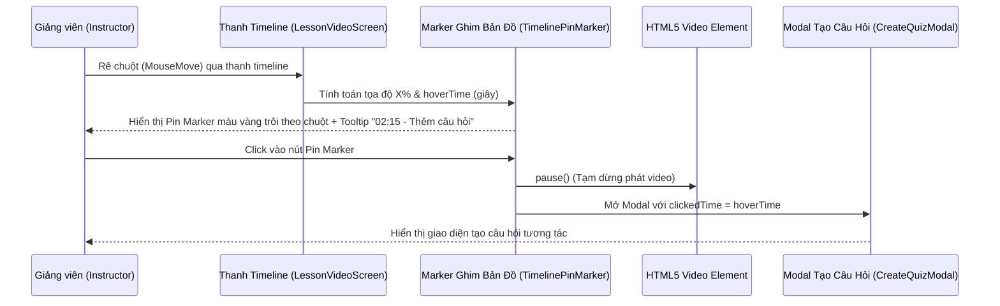

# Kế hoạch Triển khai: Nút Marker Hình Ghim Bản Đồ (Google Maps Pin) Trên Thanh Timeline Video (Chế độ Giảng viên)

> **File:** `docs/PLAN-timeline-pin-marker.md`  
> **Trạng thái:** DRAFT / PROPOSED (Chỉ làm giao diện UI, chưa kết nối logic hay API)  
> **Agent thực hiện:** `project-planner`  
> **Chuyên gia phụ trách:** `frontend-specialist` (Skills: `clean-code`, `frontend-design`, `react-best-practices`, `tailwind-patterns`)  
> **Giao diện mục tiêu:** `http://localhost:3000/instructor/courses/[id]/lessons/[lessonId]`  

---

## 1. Overview (Tổng quan Mục tiêu)

- **Mục tiêu:** Xây dựng thành phần giao diện Marker hình ghim bản đồ (Google Maps Pin) nổi bật trên thanh Timeline (Progress/Seekbar) của trình phát video (`LessonVideoScreen`) trong trang chi tiết bài học dành cho **Giảng viên** (`Instructor / Creator Mode`).
- **Phạm vi (Scope):** **CHỈ LÀM GIAO DIỆN (UI ONLY)**, mock state hiển thị, chưa ghép nối mutation API backend hay logic lưu trữ cơ sở dữ liệu.
- **Cơ chế tương tác:**
  1. Chỉ kích hoạt và hiển thị khi bài học đang mở ở phân hệ Giảng viên (`isInstructor = true`).
  2. Khi rê chuột (hover) trên thanh trượt timeline, tính toán tọa độ chuột X và mốc thời gian tương ứng.
  3. Xuất hiện con trỏ Marker hình giọt nước/ghim bản đồ màu vàng trôi theo vị trí chuột, trồi lên phía trên thanh timeline kèm tooltip mốc thời gian và hành động (`02:15 - Thêm câu hỏi`).
  4. Khi click vào Marker: Video tự động tạm dừng (`videoRef.current.pause()`), lưu lại `clickedTime` và mở Modal giao diện tạo câu hỏi tương tác trong video (`CreateVideoQuizModal`).

---

## 2. Kiến trúc & Thiết kế Giao diện (Design & Visual Spec)

### 2.1. Thiết kế Marker Ghim Bản Đồ (Google Maps Pin)
- **Hình dáng (Shape):** 
  - Khối giọt nước úp ngược: Đầu tròn bên trên, phần đuôi vuốt nhọn chỉ thẳng xuống đường rãnh timeline.
  - Sử dụng SVG chuẩn vector hoặc kết hợp CSS bo góc (`rounded-t-full rounded-bl-full rotate-45` với icon xoay ngược lại, hoặc SVG Drop Pin tùy biến sắc nét).
- **Màu sắc & Hiệu ứng:**
  - Nền: Vàng hổ phách nổi bật (`bg-amber-400` / `bg-yellow-400`).
  - Viền: Viền trắng dày nổi khối (`border-2 border-white dark:border-zinc-900`).
  - Đổ bóng: `shadow-lg shadow-amber-500/30`.
  - Icon bên trong: Dấu cộng `+` màu đậm (`text-slate-900 font-bold`) hoặc icon question mark nhỏ.
- **Tooltip phụ:**
  - Xuất hiện phía trên Marker ghim: Badge nền đen bóng mờ (`bg-zinc-900/95 text-white border border-zinc-700/60 rounded-md px-2 py-1 text-xs shadow-xl`).
  - Nội dung: `mm:ss - Thêm câu hỏi tương tác`.

### 2.2. Modal Tạo Câu Hỏi (Mock UI Dialog)
- Sử dụng cấu trúc Dialog chuẩn của dự án (`DialogLayout` / shadcn `Dialog`).
- **Nội dung Mock UI:**
  - Header: Tiêu đề "Thêm câu hỏi tương tác tại [mm:ss]".
  - Form fields (UI static / React Hook Form mock):
    - Mốc thời gian xuất hiện (được điền sẵn từ `clickedTime`).
    - Tiêu đề câu hỏi / Nội dung câu hỏi.
    - Loại câu hỏi: Trắc nghiệm 1 đáp án (Single Choice), Nhiều đáp án (Multiple Choice).
    - Danh sách câu trả lời A, B, C, D kèm radio chọn đáp án đúng.
    - Lựa chọn bắt buộc (Dừng video yêu cầu học viên trả lời trước khi xem tiếp).
  - Footer: Nút "Hủy bỏ" và nút "Lưu câu hỏi (Mock UI Demo)".

---

## 3. Kiến trúc Luồng Tương tác (Interaction Flow)



---

## 4. File Structure & Changes

```
frontend/src/features/course/
├── components/
│   └── player/
│       ├── lesson-video-screen.tsx              # [MODIFY] Bổ sung prop isInstructor, tính toán vị trí hoverX/hoverTime, tích hợp Pin Marker
│       ├── lesson-timeline-pin-marker.tsx       # [NEW] Component Marker hình ghim bản đồ màu vàng + Tooltip mốc thời gian
│       ├── create-quiz-marker-modal.tsx         # [NEW] Component Modal giao diện tạo câu hỏi tại mốc video
│       ├── lesson-player-studio.tsx             # [MODIFY] Truyền isInstructor xuống LessonVideoScreen
│       └── index.ts                             # [MODIFY] Export các component mới nếu cần
```

---

## 5. Task Breakdown (Chi tiết Công việc Thực hiện)

### Task 1: Xây dựng Component Marker Ghim Bản Đồ (`lesson-timeline-pin-marker.tsx`)
- **Agent:** `frontend-specialist`
- **Priority:** P1
- **Mục tiêu:**
  - Tạo component `TimelinePinMarker` với hình dáng giọt nước úp ngược (Google Maps Pin).
  - Styling với Tailwind: `bg-amber-400`, `border-2 border-white`, icon `+` ở giữa (`text-slate-900 font-bold`).
  - Tooltip hiển thị mốc thời gian `formatTime(hoverTime) + " - Thêm câu hỏi"`.
  - Hiệu ứng chuyển động mượt mà khi di chuột và hover scale nhẹ.
- **Verification:** Marker render chuẩn tỷ lệ vector, căn chỉnh đúng trục dọc chỉ xuống rãnh timeline.

### Task 2: Tích hợp Tương tác Hover & Click trên Seekbar (`lesson-video-screen.tsx`)
- **Agent:** `frontend-specialist`
- **Priority:** P1
- **Mục tiêu:**
  - Nhận prop `isInstructor?: boolean` (mặc định kiểm tra route hoặc truyền từ `LessonPlayerStudio`).
  - Gắn sự kiện `onMouseMove`, `onMouseEnter`, `onMouseLeave` trên slider wrapper:
    - Tính toán `rect = e.currentTarget.getBoundingClientRect()`.
    - `hoverRatio = (clientX - rect.left) / rect.width`.
    - `hoverTime = hoverRatio * duration`.
  - Hiển thị Marker tại vị trí `hoverRatio * 100%` khi `isInstructor` bật.
  - Khi click vào Marker:
    - Gọi `videoRef.current?.pause()` (hoặc `player.togglePlay()` nếu đang play).
    - Lưu `clickedTime = hoverTime`.
    - Kích hoạt mở modal `isQuizModalOpen = true`.
- **Verification:** Khi rê chuột qua timeline xuất hiện ghim vàng chạy theo; khi click vào ghim thì video dừng lại và mở state modal.

### Task 3: Xây dựng Giao diện Modal Tạo Câu Hỏi Mock UI (`create-quiz-marker-modal.tsx`)
- **Agent:** `frontend-specialist`
- **Priority:** P2
- **Mục tiêu:**
  - Sử dụng Dialog component (`Dialog`, `DialogContent`, `DialogHeader`, `DialogFooter`).
  - Hiển thị mốc thời gian `clickedTime` dạng badge nổi bật (`02:15`).
  - Form UI mẫu bao gồm:
    - Ô nhập câu hỏi.
    - 4 ô đáp án (A, B, C, D) kèm nút chọn đáp án đúng.
    - Lựa chọn checkbox "Bắt buộc trả lời để tiếp tục xem video".
  - Nút "Đóng / Hủy" và nút "Lưu câu hỏi (Demo UI)".
  - Thông báo Toast (sonner) mock khi bấm Lưu: "Đã lưu câu hỏi tại mốc [mm:ss] (Giao diện thử nghiệm)".
- **Verification:** Modal mở lên trơn tru, hiển thị đúng mốc thời gian đã click, đóng mở mượt mà.

### Task 4: Cập nhật Chế độ Giảng viên (`LessonPlayerStudio` & Route)
- **Agent:** `frontend-specialist`
- **Priority:** P2
- **Mục tiêu:**
  - Trong `LessonPlayerStudio`, xác định chế độ giảng viên thông qua prop `isInstructor` (hoặc kiểm tra đường dẫn `usePathname().includes('/instructor')`).
  - Truyền cờ `isInstructor={true}` vào `LessonVideoScreen`.
- **Verification:** Truy cập `http://localhost:3000/instructor/courses/.../lessons/...` hiển thị đầy đủ tính năng Marker ghim; ở chế độ học viên thông thường không hiển thị Marker này.

---

## 6. Socratic Gate & Trade-off Questions (Câu hỏi Xác nhận với Người dùng)

Trước khi tiến hành viết mã, cần làm rõ 3 quyết định thiết kế then chốt:

1. **Phân tách thao tác Click Tua (Seek) vs Click Ghim (Add Question):**
   - *Phương án A (Khuyến nghị):* Khi click trực tiếp vào nút Ghim vàng (hoặc phần đầu ghim trồi lên trên rãnh): Video dừng + mở Modal tạo câu hỏi. Còn nếu click vào lòng thanh rãnh trượt bên dưới: Vẫn thực hiện tua video (seek) thông thường.
   - *Phương án B:* Bất kỳ cú click nào lên toàn bộ thanh trượt ở chế độ Giảng viên đều tự động dừng video và mở Modal tạo câu hỏi.
2. **Biểu tượng bên trong Marker Ghim:**
   - *Lựa chọn 1:* Biểu tượng dấu cộng `+` đậm nét (`font-black text-slate-900`) biểu trưng cho hành động "Thêm mới".
   - *Lựa chọn 2:* Biểu tượng dấu hỏi `?` hoặc icon Trắc nghiệm (`lucide:help-circle`) biểu trưng cho "Câu hỏi tương tác".
3. **Phạm vi hiển thị các Marker câu hỏi đã tạo trước đó:**
   - Hiện tại bài toán tập trung vào Marker con trỏ hover để **thêm câu hỏi mới**. Bạn có muốn trên thanh timeline cũng hiển thị sẵn 1-2 Marker câu hỏi mẫu (đã tồn tại cố định tại mốc thời gian ví dụ 01:30, 04:15) để kiểm tra độ trực quan và tương thích với các điểm mốc milestone hiện tại không?
