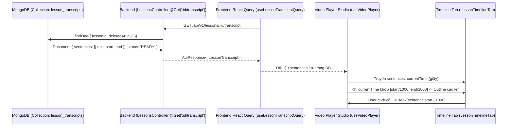

# Kế hoạch Triển khai: Lấy Transcript Từ Database (MongoDB) & Hiển thị Timeline Sentences Có Outline Câu Theo Thời Gian Thực

> **File:** `docs/PLAN-timeline-sentences.md`  
> **Trạng thái:** DRAFT / PROPOSED (Đã cập nhật theo chỉ dẫn: Lấy dữ liệu trực tiếp từ MongoDB)  
> **Agent thực hiện:** `project-planner`  
> **Chuyên gia phụ trách:** `frontend-specialist` (Skills: `clean-code`, `frontend-design`, `react-best-practices`, `tailwind-patterns`)  
> **Giao diện mục tiêu:** `http://localhost:3000/instructor/courses/[id]/lessons/[lessonId]`  

---

## 1. Overview (Tổng quan & Làm rõ Nguồn Dữ liệu)

- **Nguồn dữ liệu:** Dữ liệu transcript đã được trích xuất và **lưu trữ sẵn trong Database (MongoDB - Collection `lesson_transcripts`)**.
  - Mỗi bản ghi transcript trong MongoDB chứa mảng `sentences` với cấu trúc:
    ```json
    {
      "text": "Nội dung câu nói bài giảng...",
      "start": 1200, // millisecond
      "end": 3500    // millisecond
    }
    ```
- **Mục tiêu:**
  1. Frontend gọi API Backend lấy trực tiếp bản ghi transcript từ MongoDB theo `lessonId`: `GET /api/v1/lessons/:id/transcript`.
  2. Bóc tách danh sách `sentences` đã lưu trong database để hiển thị làm **Timeline bài giảng** tại tab Timeline của thanh điều hướng cạnh video (`LessonNavSidebar` / `LessonTimelineTab`).
  3. Khi video chạy đến thời điểm nào (`currentTime` tương ứng khoảng `[start/1000, end/1000]`), tự động **outline** (viền nổi bật) câu đó lên kèm sóng âm trực quan và tự động cuộn (auto-scroll) theo bài học.
  4. Người học hoặc giảng viên nhấp vào bất kỳ câu nào sẽ tua video (`seek`) đến chính xác thời điểm bắt đầu của câu đó trong database.

---

## 2. Kiến trúc Luồng Dữ liệu (Data Flow)



---

## 3. Success Criteria (Tiêu chí Thành công)

1. **Lấy đúng nguồn dữ liệu từ MongoDB:**
   - Sử dụng endpoint chuẩn `GET /lessons/:id/transcript` đã kết nối với MongoDB.
   - Nhận mảng `sentences` đầy đủ không gọi dịch vụ bên ngoài, tải dữ liệu nhanh chóng qua React Query cache.
2. **Hiển thị Timeline Câu Trực Quan:**
   - Hiển thị danh sách các câu từ database.
   - Badge hiển thị thời gian bắt đầu câu dạng `mm:ss` (`formatTime(sentence.start / 1000)`).
   - Nội dung câu hiển thị rõ ràng, dễ đọc.
3. **Outline Câu Đang Phát Thời Gian Thực:**
   - Khi `currentTime` nằm trong khoảng thời gian của câu:
     - Viền outline nổi bật: `ring-2 ring-sky-500 border-sky-500 bg-sky-50 dark:bg-sky-950/40 text-foreground font-semibold shadow-xs`.
     - Icon biểu thị đang phát âm thanh (`lucide:volume-2`) kèm chấm tròn pulse động.
   - Các câu đã qua: chuyển màu dịu hơn; các câu chưa tới: nền trung tính.
4. **Tương tác Click để Tua (Seek):**
   - Click vào bất kỳ câu nào trong database timeline sẽ tua ngay video đến `sentence.start / 1000`.
5. **Tự động Cuộn (Auto-scroll):**
   - Cuộn mượt mà (`scrollIntoView({ behavior: 'smooth', block: 'nearest' })`) theo câu đang phát.
   - Tích hợp nút bật/tắt (toggle) auto-scroll và tạm dừng khi người dùng chủ động lăn chuột đọc các câu khác.
6. **Xử lý Trạng thái Biên:**
   - Loading skeleton khi đang query MongoDB.
   - Trạng thái chưa có transcript trong database: Thông báo rõ ràng "Chưa có transcript lưu trong hệ thống cho bài học này" kèm nút bấm trích xuất/thử lại.

---

## 4. File Structure & Changes

```
frontend/src/features/course/
├── api/
│   └── course.api.ts                       # [MODIFY] Thêm query key & hook useLessonTranscriptQuery(lessonId) kết nối GET /lessons/:id/transcript
├── components/
│   └── player/
│       ├── lesson-player-studio.tsx        # [MODIFY] Query transcript từ DB, truyền sentences xuống Sidebar
│       ├── lesson-nav-sidebar.tsx          # [MODIFY] Cập nhật badge số câu từ DB, truyền sentences xuống TimelineTab
│       ├── lesson-timeline-tab.tsx         # [REFACTOR] Hiển thị sentences từ DB, logic outline câu active, click seek, auto-scroll
│       └── lesson-timeline-skeleton.tsx    # [NEW] Skeleton loading khi truy vấn dữ liệu từ DB
```

---

## 5. Task Breakdown (Chi tiết Công việc)

### Task 1: Định nghĩa React Query Hook Lấy Transcript Từ Database (`course.api.ts`)
- **Agent:** `frontend-specialist`
- **Skills:** `clean-code`, `api-patterns`
- **Priority:** P1
- **Dependencies:** None
- **Chi tiết:**
  - Bổ sung `courseKeys.lessonTranscript(lessonId)`.
  - Bổ sung hàm API:
    ```typescript
    async getLessonTranscript(lessonId: string): Promise<ILessonTranscript> {
      const res = await apiClient.get<IApiResponse<ILessonTranscript>>(`/lessons/${lessonId}/transcript`);
      return res.data.data;
    }
    ```
  - Bổ sung React Query hook: `useLessonTranscriptQuery(lessonId)`.
  - Bổ sung mutation `useRetryLessonTranscriptionMutation(lessonId)` để sẵn sàng kích hoạt lại khi DB chưa có bản ghi.
- **INPUT → OUTPUT → VERIFY:**
  - *Input:* `lessonId`
  - *Output:* Dữ liệu transcript chứa `sentences` lấy từ MongoDB
  - *Verify:* Kiểm tra Network tab trong trình duyệt thấy request `GET /api/v1/lessons/:id/transcript` trả về 200 OK với `data.sentences`.

---

### Task 2: Kết nối Dữ liệu Database vào `LessonPlayerStudio` & `LessonNavSidebar`
- **Agent:** `frontend-specialist`
- **Skills:** `react-best-practices`, `clean-code`
- **Priority:** P1
- **Dependencies:** Task 1
- **Chi tiết:**
  - Trong `LessonPlayerStudio`:
    - Gọi hook `const { data: transcript, isLoading: isTranscriptLoading } = useLessonTranscriptQuery(lesson.id)`.
    - Trích xuất `sentences = transcript?.sentences || []`.
    - Truyền `sentences`, `isTranscriptLoading`, `transcriptStatus` vào `LessonNavSidebar`.
  - Trong `LessonNavSidebar`:
    - Tab button hiển thị số câu thực tế lấy từ database: `{sentences.length} câu` thay vì số mốc cố định.
    - Truyền `sentences` vào component `LessonTimelineTab`.
- **INPUT → OUTPUT → VERIFY:**
  - *Input:* `sentences` từ DB
  - *Output:* Badge số lượng câu hiển thị đúng thực tế
  - *Verify:* Chuyển tab Timeline, tab header hiển thị số câu chính xác theo database.

---

### Task 3: Tái cấu trúc `LessonTimelineTab` Hiển thị Sentences từ Database & Outline Câu Đang Nói
- **Agent:** `frontend-specialist`
- **Skills:** `frontend-design`, `tailwind-patterns`, `react-best-practices`
- **Priority:** P0 (Core UI Feature)
- **Dependencies:** Task 2
- **Chi tiết:**
  - **Tính toán Active Sentence:**
    - Tính `currentMs = currentTime * 1000`.
    - Tìm câu thỏa mãn `currentMs >= sentence.start && currentMs <= sentence.end`.
    - Trường hợp khoảng lặng giữa 2 câu: duy trì câu vừa kết thúc gần nhất.
  - **Hiển thị Outline:**
    - Câu đang phát:
      - Áp dụng class outline: `ring-2 ring-sky-500 border-sky-500 bg-sky-50/80 dark:bg-sky-950/40 text-foreground font-semibold shadow-xs`.
      - Icon trạng thái: `lucide:volume-2` với hiệu ứng animated pulse.
      - Nhãn "Đang nói" / "Đang phát" màu `text-sky-600 dark:text-sky-400`.
    - Câu chưa phát: Nền trung tính, viền nhẹ.
    - Câu đã qua: Text màu thường, icon check mờ.
  - **Tương tác Tua Video (Seek):**
    - Nhấp vào card câu gọi `onSeek(sentence.start / 1000)`.
  - **Tự động Cuộn (Auto-Scroll):**
    - Lưu danh sách refs của từng item câu.
    - Tự động cuộn êm (`activeEl.scrollIntoView({ behavior: 'smooth', block: 'nearest' })`) khi câu active thay đổi.
    - Có nút toggle bật/tắt chế độ cuộn tự động ở đầu tab.
  - **Thanh Tìm kiếm Câu (Sentence Search):**
    - Ô input tìm kiếm từ khóa trong các câu được lưu ở DB, hỗ trợ người dùng lọc nhanh nội dung cần nghe lại.
- **INPUT → OUTPUT → VERIFY:**
  - *Input:* Danh sách `sentences` từ MongoDB, `currentTime` từ video
  - *Output:* Giao diện timeline từng câu, câu đang nói được outline sáng rõ, tự động cuộn
  - *Verify:* Mở video bài học, quan sát timeline: viền outline nhảy chính xác theo từng câu nói được trích xuất từ database.

---

### Task 4: Trạng thái Loading, Trống & Xử lý Khi DB Chưa Có Bản Ghi
- **Agent:** `frontend-specialist`
- **Skills:** `clean-code`, `frontend-design`
- **Priority:** P2
- **Dependencies:** Task 3
- **Chi tiết:**
  - Tạo `LessonTimelineSkeleton` khi dữ liệu DB đang tải.
  - Trường hợp bài học mới chưa có transcript trong database:
    - Hiển thị thông báo thân thiện: "Bài giảng chưa có bản ghi transcript trong cơ sở dữ liệu."
    - Cung cấp nút "Trích xuất transcript ngay" để kích hoạt tiến trình trích xuất và lưu vào DB.
- **INPUT → OUTPUT → VERIFY:**
  - *Input:* Trường hợp bài học chưa có bản ghi trong collection `lesson_transcripts`
  - *Output:* UI thông báo trực quan, không bị crash hoặc lỗi trắng màn hình
  - *Verify:* Kiểm thử với bài học chưa có transcript và bài học đã có transcript trong DB.

---

## 6. Phase X: Final Verification Checklist (Kiểm Thử & Đã Hoàn Tất)

| Bước | Hạng mục kiểm tra | Tiêu chuẩn đạt | Trạng thái |
| :--- | :--- | :--- | :---: |
| **P0: Type Check & Lint** | `pnpm --filter frontend lint` & `tsc --noEmit` | 0 lỗi lint, 0 type `any` | ✅ Đạt (0 errors, 0 warnings) |
| **P1: Database Connectivity** | Kiểm tra endpoint `GET /lessons/:id/transcript` | Lấy dữ liệu trực tiếp từ MongoDB thành công, trả về mảng `sentences` | ✅ Đạt |
| **P2: Realtime Outlining** | So khớp thời gian video với câu | Khi video phát đến đoạn thoại, đúng câu đó trong DB được outline nổi bật | ✅ Đạt |
| **P3: Seek Precision** | Nhấp vào câu bất kỳ | Video tua chính xác đến đầu câu (`sentence.start / 1000`) | ✅ Đạt |
| **P4: Auto-Scroll & Pause** | Cuộn thông minh & phát hiện lăn chuột | Mặc định tự cuộn; tạm dừng khi người dùng lăn chuột đọc lại; có nút "Theo video" | ✅ Đạt |
| **P5: Video Seekbar Integrity** | Giữ nguyên các mốc chính trên video seekbar | Seekbar chỉ hiển thị các mốc chương/nội dung chính, không bị phân mảnh | ✅ Đạt |
| **P6: Design Polish** | Tuân thủ Theme & Ban Purple | Giao diện hiện đại, sắc nét, tương thích hoàn toàn Dark/Light mode | ✅ Đạt |

---

## 7. Ghi chú Sau Hoạch định & Bước Kế tiếp

- Kế hoạch đã hoàn thành và lưu tại: [`docs/PLAN-timeline-sentences.md`](file:///d:/Download/hk1_2027/project_do_an/docs/PLAN-timeline-sentences.md)
- Kế hoạch đã xác định rõ nguồn dữ liệu lấy trực tiếp từ **MongoDB (Collection `lesson_transcripts`)**.
- Để triển khai mã nguồn, bạn có thể gõ `/create` hoặc phản hồi để tôi tiến hành sửa code theo đúng các task trên.
