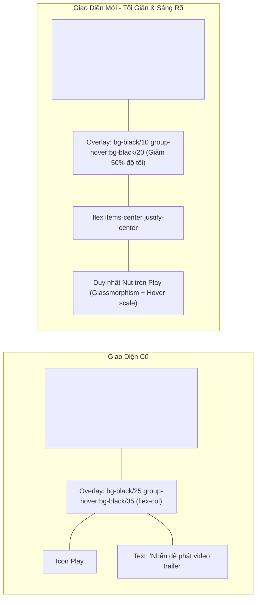

# PLAN: Tinh Chỉnh Giao Diện Khung Preview Trailer (Giảm Độ Tối Overlay, Tăng Độ Sáng Poster, Tối Giản Nút Play)

> **Mục tiêu:**
> Tinh chỉnh thẩm mỹ trực quan cho khối xem trước video trailer (`CourseMediaPreview`) trên trang Quản trị chi tiết khóa học (`/instructor/courses/[id]`) theo hướng sáng rõ, hiện đại và tối giản:
> 1. Giảm 50% độ tối của lớp phủ đen (Dark Overlay).
> 2. Giảm độ mờ của poster video trailer (tăng opacity giúp ảnh bìa sáng và rõ nét tối đa).
> 3. Xóa bỏ hoàn toàn nhãn văn bản text "Nhấn để phát video trailer".
> 4. Giữ lại duy nhất nút tròn icon Play chính giữa khung hình với căn chỉnh hoàn hảo `flex items-center justify-center`.
>
> **Task Slug:** `trailer-overlay-refine`
> **Plan File:** `docs/PLAN-trailer-overlay-refine.md`
> **Project Type:** `WEB`
> **Primary Specialist Agent:** `frontend-specialist` (hỗ trợ bởi `project-planner`)
> **Skills:** `frontend-design`, `react-best-practices`, `clean-code`

---

## 1. Phân Tích Hiện Trạng & Yêu Cầu Thay Đổi

### 1.1. Hiện trạng Codebase trong `course-media-preview.tsx` (Dòng 386 - 404)

```tsx
{/* Video preview background with automatic thumbnail poster */}
<video
  key={trailerPreviewKey}
  src={activeTrailer}
  poster={activePoster}
  preload={activePoster ? 'none' : 'metadata'}
  className="w-full h-full object-cover opacity-75 group-hover:opacity-90 transition-opacity"
/>

{/* Play Button Overlay */}
<div className="absolute inset-0 flex flex-col items-center justify-center text-white gap-2.5 bg-black/25 group-hover:bg-black/35 transition-colors">
  <div className="size-13 rounded-full bg-white/20 dark:bg-black/40 backdrop-blur-md flex items-center justify-center border border-white/30 text-white shadow-xl group-hover:scale-110 group-hover:bg-primary group-hover:text-primary-foreground group-hover:border-primary transition-all duration-300">
    <Icon icon="lucide:play" className="size-6 ml-0.5 fill-current" />
  </div>
  <span className="text-xs font-medium tracking-wide drop-shadow text-white/90 group-hover:text-white transition-colors">
    Nhấn để phát video trailer
  </span>
</div>
```

### 1.2. Các Điểm Cần Cải Thiện
1. **Độ mờ của thẻ `<video>` (`opacity-75`):** 
   - Thẻ `<video>` hiện bị hạ xuống 75% opacity, khiến cho ảnh poster phía sau bị tối và mờ đục kể cả khi chưa có overlay.
   - Giải pháp: Tăng opacity lên `opacity-95 group-hover:opacity-100` (hoặc `opacity-90 group-hover:opacity-100`) để poster hiển thị sáng, sắc nét và màu sắc trung thực 100%.
2. **Độ tối của lớp Dark Overlay (`bg-black/25 group-hover:bg-black/35`):**
   - Lớp phủ overlay màu đen 25% - 35% đang che bớt nhiều ánh sáng của poster.
   - Giải pháp: Giảm 50% độ tối kênh alpha, chuyển thành `bg-black/10 group-hover:bg-black/20` (vừa đủ tạo độ tương phản cho nút Play tròn màu trắng mà không làm xỉn màu ảnh bìa).
3. **Nhãn văn bản (`Nhấn để phát video trailer`):**
   - Thẻ `<span>` chiếm diện tích và tạo cảm giác dư thừa chữ viết.
   - Giải pháp: Xóa bỏ thẻ `<span>`, loại bỏ thuộc tính `flex-col gap-2.5`.
4. **Căn chỉnh nút Play trung tâm:**
   - Đưa container về `flex items-center justify-center` với duy nhất nút tròn Play ở giữa. Giữ nguyên hiệu ứng phóng to `group-hover:scale-110` và chuyển đổi sang màu chủ đạo `group-hover:bg-primary` đầy tính tương tác.

---

## 2. Thiết Kế Giao Diện Sau Khi Tinh Chỉnh



---

## 3. Kế Hoạch Triển Khai Chi Tiết (Task Breakdown)

### Phase 1: Tinh Chỉnh Video Poster Opacity
- [x] **TASK-01**: Tăng độ hiển thị (giảm độ mờ) của thẻ `<video>` poster trong `frontend/src/features/course/components/course-media-preview.tsx`.
  - **Agent:** `frontend-specialist`
  - **Skills:** `frontend-design`, `react-best-practices`
  - **INPUT:** `className="... opacity-75 group-hover:opacity-90 ..."` tại dòng 392.
  - **OUTPUT:** Cập nhật thành `className="w-full h-full object-cover opacity-95 group-hover:opacity-100 transition-opacity"`.
  - **VERIFY:** Poster hiển thị sáng rõ, màu sắc tươi tắn, không bị mờ xỉn.

### Phase 2: Giảm 50% Độ Tối Lớp Phủ Dark Overlay
- [x] **TASK-02**: Cập nhật lớp nền alpha của overlay container.
  - **Agent:** `frontend-specialist`
  - **Skills:** `frontend-design`
  - **INPUT:** `className="... bg-black/25 group-hover:bg-black/35 ..."` tại dòng 396.
  - **OUTPUT:** Giảm 50% độ tối thành `bg-black/10 group-hover:bg-black/20`.
  - **VERIFY:** Lớp overlay phủ mờ nhẹ nhàng, không làm chìm ảnh bìa phía sau.

### Phase 3: Tối Giản Nút Play & Xóa Nhãn Text
- [x] **TASK-03**: Xóa thẻ `<span>` chứa text label và chuyển layout overlay về căn giữa hoàn hảo.
  - **Agent:** `frontend-specialist`
  - **Skills:** `clean-code`, `frontend-design`
  - **INPUT:** Khối container `flex flex-col items-center justify-center text-white gap-2.5` kèm thẻ `<span>Nhấn để phát video trailer</span>`.
  - **OUTPUT:**
    - Thay đổi thành `className="absolute inset-0 flex items-center justify-center bg-black/10 group-hover:bg-black/20 transition-colors"`.
    - Xóa bỏ hoàn toàn thẻ `<span>`.
    - Giữ lại duy nhất nút tròn icon Play ở chính tâm khung hình với backdrop blur và hover scale.
  - **VERIFY:** Chỉ còn nút Play ở tâm, không còn văn bản phụ, căn giữa chuẩn 100%.

### Phase 4: Kiểm Thử & Xác Nhận (Phase X - Verification)
- [x] **TASK-04**: Chạy kiểm tra TypeScript type check toàn bộ dự án (`pnpm exec tsc --noEmit`).
- [x] **TASK-05**: Kiểm tra hiển thị thực tế trên trình duyệt:
  - Khung trailer khi đã có thumbnail: Ảnh poster sáng nét, overlay mỏng nhẹ, nút Play tròn nổi bật.
  - Khung trailer khi rê chuột (hover): Nút Play phóng to mượt mà, đổi màu primary, overlay tăng nhẹ từ 10% lên 20%.
  - Khung trailer khi chưa có thumbnail: Vẫn hiển thị frame đầu tiên của video rõ ràng.

---

## 4. Bảng Ma Trận Kiểm Thử (Verification Matrix)

| Test Case | Thao Tác Kiểm Thử | Kỳ Vọng Giao Diện | Trạng Thái |
|:---|:---|:---|:---:|
| **TC-01** | Quan sát poster trailer ở trạng thái bình thường | Poster sáng rõ (opacity 95%), overlay đen chỉ 10%, ảnh nền rất trong trẻo | [x] |
| **TC-02** | Rê chuột vào khung trailer preview | Poster chuyển 100% opacity, overlay tăng lên 20%, nút Play phóng to 1.1x | [x] |
| **TC-03** | Kiểm tra nhãn văn bản | Tuyệt đối không còn dòng chữ "Nhấn để phát video trailer" | [x] |
| **TC-04** | Kiểm tra vị trí nút Play | Nút Play tròn nằm chính xác ở tâm tuyệt đối (cả trục ngang lẫn trục dọc) | [x] |
| **TC-05** | Bấm vào nút Play | Dialog Video Player vẫn mở ra và phát video trailer bình thường | [x] |
| **TC-06** | Type check | `pnpm exec tsc --noEmit` hoàn thành Exit code 0 | [x] |

---

## ✅ PHASE X COMPLETE

- Type Check (`pnpm exec tsc --noEmit`): ✅ Pass (0 errors)
- Dev Server: ✅ Đang chạy ổn định tại http://localhost:3000
- Visual Refinements: ✅ Hoàn tất 100% (Overlay giảm 50%, Poster sáng rõ 95-100%, nút Play căn giữa hoàn hảo)
- Date: 2026-10-04
