# PLAN: Tự Động Đồng Bộ Thumbnail Làm Poster Cho Video Trailer Khóa Học

> **Mục tiêu:**
> Thiết lập cơ chế tự động liên kết và cập nhật ảnh bìa khóa học (`thumbnailUrl`) làm hình nền đại diện (`poster`) cho trình phát video trailer (`trailerUrl`) trên toàn bộ giao diện quản trị khóa học (`/instructor/courses/[id]`), xử lý mượt mà và tức thì 4 kịch bản người dùng (Case 1 đến Case 4) mà không cần can thiệp tải lại hay encode lại file video.
>
> **Task Slug:** `trailer-poster-sync`
> **Plan File:** `docs/PLAN-trailer-poster-sync.md`
> **Project Type:** `WEB`
> **Primary Specialist Agent:** `frontend-specialist` (hỗ trợ bởi `project-planner`)
> **Skills:** `react-best-practices`, `frontend-design`, `clean-code`

---

## 1. Phân Tích Bối Cảnh & Kiến Trúc Hiện Tại

### 1.1. Hiện trạng Codebase
- **Entity & DTO:** `CourseEntity` (`backend/src/modules/course/schemas/course.schema.ts`) và `ICourse` (`share-lib/src/interfaces/course.interface.ts`) đang lưu trữ 2 trường độc lập:
  - `thumbnailUrl?: string | null`
  - `trailerUrl?: string | null`
- **Giao diện hiện tại (`CourseMediaPreview` trong `course-media-preview.tsx`):**
  - Quản lý `activeThumbnail = localThumbnailUrl || thumbnailUrl` (hỗ trợ preview tức thì bằng ObjectURL trước khi upload xong).
  - Quản lý `activeTrailer = localTrailerUrl || trailerUrl`.
  - Khối hiển thị Video Trailer đang dùng thẻ `<video src={activeTrailer} preload="metadata" />` **chưa truyền thuộc tính `poster`**, khiến trình duyệt tự chụp frame ngẫu nhiên (hoặc hiển thị khung đen nếu chưa tải xong metadata).
  - Modal Video Player (`Dialog` xem video trailer) cũng chưa truyền thuộc tính `poster={activeThumbnail || undefined}`.
- **Hành vi trình duyệt với thẻ HTML5 `<video>`:**
  - Nếu chỉ gán `poster="..."` tĩnh, khi `poster` thay đổi sau khi thẻ `<video>` đã khởi tạo hoặc nạp metadata, một số trình duyệt (Chrome, Safari, Edge) sẽ **không kích hoạt vẽ lại (repaint) poster mới** trừ khi component video được remount bằng một React `key` phụ thuộc (`key={`${activeTrailer}_${activeThumbnail}`}`).

---

## 2. Đặc Tả 4 Trường Hợp Sử Dụng (Use Cases)

```mermaid
flowchart TD
    subgraph Case1 [Case 1: Upload Thumbnail trước]
        T1[Upload Thumbnail] --> T1_DB[Course.thumbnail được lưu]
        T1_DB --> T1_Check{Trailer đã có?}
        T1_Check -- Có --> T1_Poster[Trailer preview tự nhận thumbnail làm poster]
        T1_Check -- Chưa --> T1_Wait[Chờ upload trailer sau]
    end

    subgraph Case2 [Case 2: Upload Trailer trước]
        V2[Upload Trailer] --> V2_DB[Course.trailer được lưu]
        V2_DB --> V2_Check{Thumbnail đã có?}
        V2_Check -- Có --> V2_Poster[Trailer preview lập tức dùng thumbnail làm poster]
        V2_Check -- Chưa --> V2_Default[Hiển thị khung video mặc định]
    end

    subgraph Case3 [Case 3: Upload Thumbnail sau Trailer]
        V3_Exist[Trailer đã tồn tại trên preview] --> T3_Upload[Upload Thumbnail mới]
        T3_Upload --> T3_Instant[Thumbnail preview hiển thị]
        T3_Instant --> T3_Update[Trailer preview tự động đổi poster sang thumbnail mới ngay lập tức]
    end

    subgraph Case4 [Case 4: Thay Thumbnail]
        T4_Old[Đang có Thumbnail cũ & Trailer] --> T4_New[Upload Thumbnail mới]
        T4_New --> T4_Sync[Course.thumbnail thay đổi]
        T4_Sync --> T4_Auto[Trailer preview cập nhật poster mới - KHÔNG re-upload video]
    end
```

| Kịch bản | Trạng thái đầu vào | Hành động | Kết quả mong đợi |
|:---|:---|:---|:---|
| **Case 1** Upload thumbnail trước | Chưa có thumbnail, trailer có thể đã có hoặc chưa | Upload ảnh bìa khóa học | `Course.thumbnail` cập nhật thành công. Nếu trailer đã có sẵn, video preview trailer tự động nạp ảnh bìa này làm poster. Nếu sau đó upload trailer, trailer mới cũng tự dùng poster này. |
| **Case 2** Upload trailer trước | Đã có thumbnail (hoặc chưa có), chưa có trailer | Upload file video trailer | `Course.trailer` được lưu thành công. Khung preview trailer tự động phát hiện `thumbnail` đã tồn tại và áp dụng làm poster ngay lập tức. |
| **Case 3** Upload thumbnail sau trailer | Trailer đã upload và đang hiển thị trên giao diện | Bấm chọn / thay ảnh thumbnail mới | Ngay khi chọn ảnh (local preview) hoặc khi upload thành công, khung xem trước trailer đang mở/hiển thị phải tự động làm mới poster sang ảnh bìa vừa chọn. |
| **Case 4** Thay đổi ảnh thumbnail | Cả thumbnail và trailer đều đã tồn tại | Chọn ảnh bìa khác thay thế | `Course.thumbnail` đổi sang URL mới. Trailer preview lập tức hiển thị poster theo thumbnail mới mà không cần chạm vào file video trailer hay gửi request upload lại video. |

---

## 3. Kiến Trúc Kỹ Thuật (Architecture & Technical Decisions)

### 3.1. Single Source of Truth (Không trùng lặp dữ liệu)
- **Không tạo thêm trường `posterUrl` riêng trong MongoDB Database:**
  - Vì yêu cầu nghiệp vụ quy định rõ: *Poster của video trailer luôn luôn chính là Thumbnail của khóa học*.
  - Việc lưu thêm một trường `posterUrl` trùng với `thumbnailUrl` sẽ gây dư thừa dữ liệu (data redundancy) và nguy cơ bất đồng bộ dữ liệu (data drift) khi một trong hai bị sửa đổi độc lập.
  - Áp dụng triết lý Derived State: Poster URL được tính toán động từ `thumbnailUrl` ở tầng Presentation (`activePoster = activeThumbnail`).

### 3.2. Quản Lý Lifecycle Của ObjectURL & Phản Ứng Tức Thì (Instant Feedback)
- Khi người dùng chọn file thumbnail mới:
  - `localThumbnailUrl` được tạo ngay lập tức bằng `URL.createObjectURL(file)`.
  - Biến `activeThumbnail = localThumbnailUrl || thumbnailUrl`.
  - Khung trailer preview sử dụng `activeThumbnail` làm poster ngay trong tích tắc (optimistic instant update), đem lại cảm giác mượt mà, phản hồi tức thì cho người dùng trước khi upload xong lên máy chủ MinIO.
  - Khi upload thành công hoặc component unmount, `URL.revokeObjectURL()` được dọn dẹp bộ nhớ sạch sẽ, chống memory leak.

### 3.3. Giải Quyết Hạn Chế Cache / Repaint Của HTML5 `<video>`
- Để đảm bảo trình duyệt lập tức vẽ lại poster khi `activeThumbnail` thay đổi giữa các trạng thái (đặc biệt trong Case 3 và Case 4):
  - Gán React `key` cho thẻ video: `key={`trailer_preview_${activeTrailer}_${activeThumbnail || 'none'}`}`.
  - Đồng thời ở khối card preview, kết hợp hiển thị mượt mà giữa Poster Image (qua `next/image` hoặc `` với `object-cover`) và overlay controls phát video để chất lượng hiển thị poster sắc nét 100%, không bị ảnh hưởng bởi độ trễ decode video của trình duyệt.
  - Truyền `poster={activeThumbnail || undefined}` vào cả thẻ `<video>` trong Modal Video Player (`DialogVideoPlayer`).

---

## 4. Kế Hoạch Triển Khai (Task Breakdown)

### Phase 1: Phân Tích & Chuẩn Bị Component State
- [x] **TASK-01**: Cập nhật logic tính toán `activePoster` và quản lý React key trong `CourseMediaPreview` (`frontend/src/features/course/components/course-media-preview.tsx`).
  - **Agent:** `frontend-specialist`
  - **Skills:** `react-best-practices`, `clean-code`
  - **INPUT:** `activeThumbnail` (`localThumbnailUrl || thumbnailUrl`) và `activeTrailer` (`localTrailerUrl || trailerUrl`).
  - **OUTPUT:** Khai báo biến `const activePoster = activeThumbnail || undefined;` kèm theo các React keys đồng bộ: `trailerPreviewKey` và `trailerModalKey`.
  - **VERIFY:** Biến `activePoster` phản ánh chính xác trạng thái thumbnail hiện hành (cả local blob lẫn server URL).

### Phase 2: Đồng Bộ Poster Vào Khung Xem Trước Trailer (Trailer Preview Card)
- [x] **TASK-02**: Tích hợp `poster={activePoster}` và cơ chế hiển thị tối ưu cho card Trailer preview trong `CourseMediaPreview`.
  - **Agent:** `frontend-specialist`
  - **Skills:** `frontend-design`, `react-best-practices`
  - **INPUT:** Thẻ `<video>` hiện tại tại dòng 362 (`<video src={activeTrailer} ... />`).
  - **OUTPUT:** Thêm `poster={activePoster}`, `key={trailerPreviewKey}`, và `preload={activePoster ? 'none' : 'metadata'}` để hiển thị poster ảnh bìa vừa vặn tỉ lệ 16:9 (`object-cover`).
  - **VERIFY:**
    - Nếu đã có thumbnail: Khung trailer hiển thị hình ảnh của thumbnail làm poster nền phía sau nút Play.
    - Nếu chưa có thumbnail: Khung trailer hiển thị frame metadata ban đầu của video.

### Phase 3: Đồng Bộ Poster Vào Modal Trình Phát Video (Dialog Video Player)
- [x] **TASK-03**: Truyền `poster={activePoster}` vào thẻ `<video>` bên trong Modal Dialog Video Player (`course-media-preview.tsx`).
  - **Agent:** `frontend-specialist`
  - **Skills:** `clean-code`
  - **INPUT:** Thẻ `<video src={activeTrailer} controls autoPlay ...>` trong Dialog tại dòng 550.
  - **OUTPUT:** Bổ sung `poster={activePoster}` và `key={trailerModalKey}` vào thẻ `<video>`.
  - **VERIFY:** Khi mở popup phát video, poster ảnh bìa được nạp chính xác trước khi video buffer và phát.

### Phase 4: Tối Giản Hóa Giao Diện & Fallback Tự Nhiên (UX Decision)
- [x] **TASK-04**: Áp dụng thiết kế tối giản theo quyết định của người dùng:
  - **Agent:** `frontend-specialist`
  - **Skills:** `frontend-design`
  - **Quyết định UX:** Giữ giao diện hoàn toàn tối giản, chỉ có nút Play ở trung tâm và lớp phủ hover mờ; KHÔNG thêm badge/nhãn phụ ở góc preview để giữ giao diện thanh thoát và tập trung vào nội dung media.
  - **Fallback:** Khi trailer đã có nhưng chưa có ảnh thumbnail, thẻ `<video>` tự động hiển thị khung hình frame đầu tiên của video nhờ `preload="metadata"` và không truyền thuộc tính poster.

### Phase 5: Kiểm Thử & Xác Nhận (Phase X - Verification)
- [x] **TASK-05**: Kiểm thử đầy đủ 4 trường hợp (Test Matrix):
  - **Case 1**: Khóa học chưa có media → Upload thumbnail trước → Upload trailer sau → Xác nhận trailer preview có poster đúng ảnh vừa upload.
  - **Case 2**: Khóa học có sẵn thumbnail → Upload trailer lần đầu → Xác nhận trailer preview lập tức nhận thumbnail làm poster.
  - **Case 3**: Khóa học đã có trailer nhưng chưa có thumbnail → Upload thumbnail → Xác nhận trailer preview tự động cập nhật hiển thị poster.
  - **Case 4**: Khóa học đã có cả hai → Bấm "Thay ảnh bìa" chọn ảnh mới → Xác nhận cả card thumbnail và poster của trailer preview đồng thời đổi sang ảnh mới tức thì.
- [x] **TASK-06**: Chạy Type Check toàn dự án: `pnpm exec tsc --noEmit` xác nhận không có lỗi kiểu dữ liệu.

---

## 5. Bảng Ma Trận Kiểm Thử (Verification Matrix)

| Test Case | Thao Tác | Kỳ Vọng Giao Diện | Trạng Thái |
|:---|:---|:---|:---:|
| **TC-01** | Chọn ảnh thumbnail khi trailer chưa có | Thumbnail card hiển thị ảnh; Trailer card vẫn ở Empty State | [x] |
| **TC-02** | Tiếp tục chọn trailer sau khi đã có thumbnail | Trailer card lập tức hiển thị video với poster chính là thumbnail | [x] |
| **TC-03** | Chọn video trailer khi chưa có thumbnail | Trailer card hiển thị video với frame mặc định (`preload="metadata"`) | [x] |
| **TC-04** | Tiếp tục chọn thumbnail sau khi đã có trailer | Poster trên trailer card tự động chuyển sang thumbnail mới mà không cần reload | [x] |
| **TC-05** | Bấm "Thay ảnh bìa" chọn ảnh khác | Poster của trailer tự động cập nhật sang ảnh mới ngay lập tức | [x] |
| **TC-06** | Mở Video Modal Dialog | Video có poster là thumbnail trước khi bấm Play | [x] |
| **TC-07** | Type check | `pnpm exec tsc --noEmit` hoàn thành Exit code 0 | [x] |

---

## ✅ PHASE X COMPLETE

- Type Check (`pnpm exec tsc --noEmit`): ✅ Pass (0 errors)
- Dev Server: ✅ Đang chạy ổn định tại http://localhost:3000
- 4 Use Cases Validation: ✅ Pass 100%
- Date: 2026-10-04
