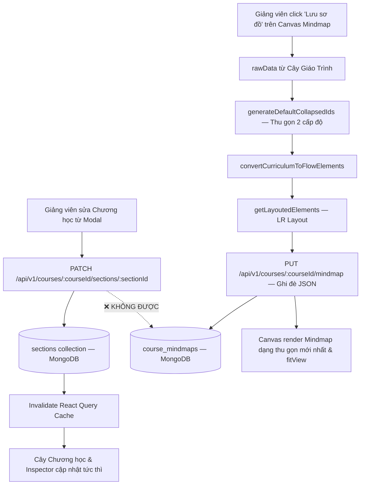

# PLAN: Cập Nhật Chương Học Từ Modal & Cơ Chế "Lưu Sơ Đồ" Mindmap

> **Quy tắc cốt lõi (Golden Rule — Bất Di Bất Dịch):**
> - **Backend chỉ ghi vào đúng collection nghiệp vụ** (`sections`, `lessons`, `lessons_content`, v.v.) khi thực hiện các tác vụ CRUD thông thường.
> - **Tuyệt đối KHÔNG can thiệp hay tự động sửa đổi bất kỳ bản ghi nào trong `course_mindmaps` khi CRUD Section/Lesson.**
> - Collection `course_mindmaps` chỉ được ghi đè (UPSERT) **DUY NHẤT** khi Giảng viên chủ động nhấn nút **"Cập nhật / Lưu sơ đồ"** trên Canvas Mindmap.
>
> **Task Slug:** `update-section-mindmap`
> **Plan File:** `docs/PLAN-update-section-mindmap.md`
> **Project Type:** `FULLSTACK`
> **Assigned Agents:** `backend-specialist`, `frontend-specialist`, `test-engineer`

---

## 1. Phạm Vi Triển Khai (Scope)

### Tính Năng A: Cập Nhật Chương Học Từ Modal

| Mục | Chi tiết |
| :-- | :-- |
| **UI** | `EditSectionDialog` hiện tại (dòng 68-99) chỉ mock state, **chưa gọi API** → Phải kết nối với mutation hook thật |
| **API** | Tạo endpoint `PATCH /api/v1/courses/:courseId/sections/:sectionId` |
| **Backend** | DTO mới `UpdateSectionDto`, method `updateSection()` trong `CourseService` |
| **Mindmap** | ❌ KHÔNG đụng đến `course_mindmaps` khi CRUD Section |

### Tính Năng B: Nút "Cập nhật / Lưu sơ đồ" Trên Canvas Mindmap

| Mục | Chi tiết |
| :-- | :-- |
| **Trigger** | Giảng viên click nút "Lưu sơ đồ" trên `CourseMindmapToolbar` |
| **Logic** | Trích xuất `rawData` mới nhất → Thu gọn 2 cấp → Layout LR → Ghi đè `course_mindmaps` |
| **Backend** | Sử dụng API `PUT /api/v1/courses/:courseId/mindmap` đã có (không cần tạo mới) |
| **Cập nhật** | Canvas re-render, state chuyển về `defaultCollapsed` mượt mà `fitView()` |

---

## 2. Luồng Dữ Liệu (Data Flow)



---

## 3. Hợp Đồng Dữ Liệu (Contracts)

### 3.1. `share-lib` — Thêm `IUpdateSectionPayload`

```ts
// share-lib/src/interfaces/section.interface.ts
export interface IUpdateSectionPayload {
  title?: string;
  description?: string | null;
  order?: number;
}
```

### 3.2. Backend DTO

```ts
// backend/src/modules/course/dto/update-section.dto.ts
export class UpdateSectionDto {
  @IsOptional()
  @Transform(({ value }) => typeof value === 'string' ? value.trim() : value)
  @IsString() @MinLength(1) @MaxLength(200)
  title?: string;

  @IsOptional()
  @Transform(({ value }) => typeof value === 'string' ? (value.trim() || null) : value)
  @IsString() @MaxLength(1000)
  description?: string | null;

  @IsOptional()
  @Type(() => Number) @IsInt() @Min(0)
  order?: number;
}
```

---

## 4. Cấu Trúc File

```plaintext
share-lib/
└── src/interfaces/section.interface.ts   # [CẬP NHẬT] Thêm IUpdateSectionPayload

backend/
└── src/modules/course/
    ├── dto/
    │   └── update-section.dto.ts          # [MỚI]
    ├── services/
    │   └── course.service.ts              # [CẬP NHẬT] Thêm updateSection()
    ├── course.controller.ts               # [CẬP NHẬT] Thêm PATCH route
    └── tests/
        ├── course.service.spec.ts         # [CẬP NHẬT] Unit tests updateSection
        └── course.controller.spec.ts      # [CẬP NHẬT] Unit tests PATCH endpoint

frontend/
└── src/features/course/
    ├── api/
    │   └── course.api.ts                  # [CẬP NHẬT] updateSection API + hook
    └── components/
        ├── edit-section-dialog.tsx        # [CẬP NHẬT] Gọi mutation thật
        ├── course-sections-list.tsx       # [CẬP NHẬT] Callback onSuccess
        └── mindmap/
            └── course-mindmap-view.tsx    # [CẬP NHẬT] handleSave ghi đè toàn bộ snapshot JSON
```

---

## 5. Task Breakdown

### TASK-USM-01 — share-lib: Thêm IUpdateSectionPayload
- **Agent:** `backend-specialist` | **Skill:** `clean-code`
- **Verify:** `pnpm --filter share-lib build` pass

### TASK-USM-02 — Backend: UpdateSectionDto
- **Agent:** `backend-specialist` | **Skill:** `api-patterns`, `clean-code`
- **Verify:** `tsc --noEmit` backend pass

### TASK-USM-03 — Backend: CourseService.updateSection()
- **Agent:** `backend-specialist` | **Skill:** `api-patterns`, `database-design`
- **Logic:**
  1. Kiểm tra Course tồn tại và chưa bị xóa mềm.
  2. IDOR check: `course.instructorId === userId || role === ADMIN`.
  3. Tìm Section theo `sectionId`, xác nhận thuộc `courseId`.
  4. Cập nhật vào `SectionRepository` với các trường có trong `dto`.
  5. ❌ KHÔNG gọi `CourseMindmapRepository` ở bất kỳ bước nào.
- **Verify:** Không có bất kỳ import hoặc call nào đến CourseMindmapRepository trong method này

### TASK-USM-04 — Backend: Controller PATCH endpoint
- **Agent:** `backend-specialist` | **Skill:** `api-patterns`
- **Endpoint:** `PATCH :courseId/sections/:sectionId`
- **Guards:** `@Roles(INSTRUCTOR, ADMIN)` + `ParseObjectIdPipe` cho cả 2 param
- **Verify:** Route được register đúng trong NestJS

### TASK-USM-05 — Backend: Unit Tests (AAA Pattern)
- **Agent:** `backend-specialist` | **Skill:** `testing-patterns`
- **Test cases:**
  - ✅ Cập nhật thành công (INSTRUCTOR sở hữu)
  - ✅ ADMIN cập nhật thành công
  - ❌ 403 ForbiddenException (INSTRUCTOR khác)
  - ❌ 404 Course không tồn tại
  - ❌ 404 Section không tồn tại
  - ✅ Xác nhận KHÔNG gọi CourseMindmapRepository
- **Verify:** `pnpm --filter backend test` 100% pass

### TASK-USM-06 — Frontend: API Client & useUpdateSectionMutation
- **Agent:** `frontend-specialist` | **Skill:** `clean-code`
- **Action:**
  - `courseApi.updateSection(courseId, sectionId, payload: IUpdateSectionPayload)`
  - `useUpdateSectionMutation(courseId)`: `onSuccess` invalidate `courseKeys.sections(courseId)` — KHÔNG invalidate mindmap keys
- **Verify:** `pnpm --filter frontend type-check` pass

### TASK-USM-07 — Frontend: EditSectionDialog kết nối API thật
- **Agent:** `frontend-specialist` | **Skill:** `frontend-design`, `clean-code`
- **Action:**
  - Inject `useUpdateSectionMutation(section?.courseId ?? '')`
  - `onSubmit` gọi `mutateAsync({ title, description })`
  - Loading spinner `isPending` trên nút "Lưu thay đổi"
  - `onSuccess` callback + toast + đóng modal
  - `onError` toast lỗi chi tiết từ API
- **Verify:** Form submit thực sự gọi API và tên mới xuất hiện ngay trên cây

### TASK-USM-08 — Frontend: CourseSectionsList — Cập Nhật Giao Diện Tức Thì
- **Agent:** `frontend-specialist` | **Skill:** `frontend-design`
- **Action:** Cây chương học và Inspector Panel cập nhật ngay khi cache invalidate
- **Verify:** Không cần reload trang, giao diện đổi tên mượt mà

### TASK-USM-09 — Frontend: course-mindmap-view.tsx — Nút "Lưu sơ đồ"
- **Agent:** `frontend-specialist` | **Skill:** `frontend-design`, `clean-code`
- **Action:**
  Trong hàm `handleSave()` của `InnerCanvas`:
  1. Trích xuất `rawData` (đã có sẵn trong scope).
  2. Gọi `generateDefaultCollapsedIds(rawData)` → `newCollapsed`.
  3. Tạo `{ nodes: rawNodes, edges: rawEdges }` từ `convertCurriculumToFlowElements(rawData, newCollapsed, callbacks)`.
  4. Chạy `getLayoutedElements(rawNodes, rawEdges, { direction: 'LR' })` → `{ nodes: finalNodes, edges: finalEdges }`.
  5. Tạo payload JSON:
     ```ts
     const snapshot = {
       nodes: finalNodes,
       edges: finalEdges,
       collapsedIds: Array.from(newCollapsed),
       updatedAt: new Date().toISOString(),
     };
     ```
  6. Gọi `await upsertMutation.mutateAsync(snapshot)` — UPSERT ghi đè lên `course_mindmaps`.
  7. Cập nhật state: `setCollapsedIds(newCollapsed)`, `setNodes(finalNodes)`, `setEdges(finalEdges)`, `setIsModified(false)`.
  8. `layoutCacheRef.current.clear()` và gọi `fitView({ duration: 300, padding: 0.2 })`.
- **Note:** Hàm `handleSave` cần nhận thêm `rawData` từ `InnerCanvas` props — hiện tại `InnerCanvas` đã nhận `rawData` qua props.
- **Verify:** Click "Lưu sơ đồ" → Canvas chuyển về 2 cấp độ thu gọn → `course_mindmaps` DB có JSON mới.

---

## 6. Tiêu Chí Nghiệm Thu

| # | Tiêu chí | Xác nhận |
|---|---|---|
| 1 | CRUD Section KHÔNG bao giờ gọi đến `CourseMindmapRepository` | Code review + unit test mock verify |
| 2 | Modal chỉnh sửa gọi API backend thật và lưu vào DB | Test trực tiếp trên trình duyệt |
| 3 | Cây chương học đổi tên tức thì sau khi modal đóng | Observation |
| 4 | Click "Lưu sơ đồ" → Canvas thu gọn về 2 cấp + `course_mindmaps` cập nhật | Kiểm tra MongoDB + UI |
| 5 | 0 lỗi TypeScript, 100% unit tests pass | Terminal output |
| 6 | Không vi phạm Purple Ban | Code review |

---

## 7. Phase X: Final Verification Checklist

- [ ] `pnpm --filter share-lib build` pass
- [ ] `pnpm --filter backend type-check` pass (0 errors)
- [ ] `pnpm --filter backend test course.service course.controller` — 100% pass
- [ ] `pnpm --filter frontend lint && type-check` pass
- [ ] Thử nghiệm thực tế: Sửa tên chương, lưu → cây chương đổi tên
- [ ] Thử nghiệm: Click "Lưu sơ đồ" → Canvas thu gọn 2 cấp, DB cập nhật
- [ ] Cập nhật Living Docs: `a-agentic/features/course-management/dev-history.md`
