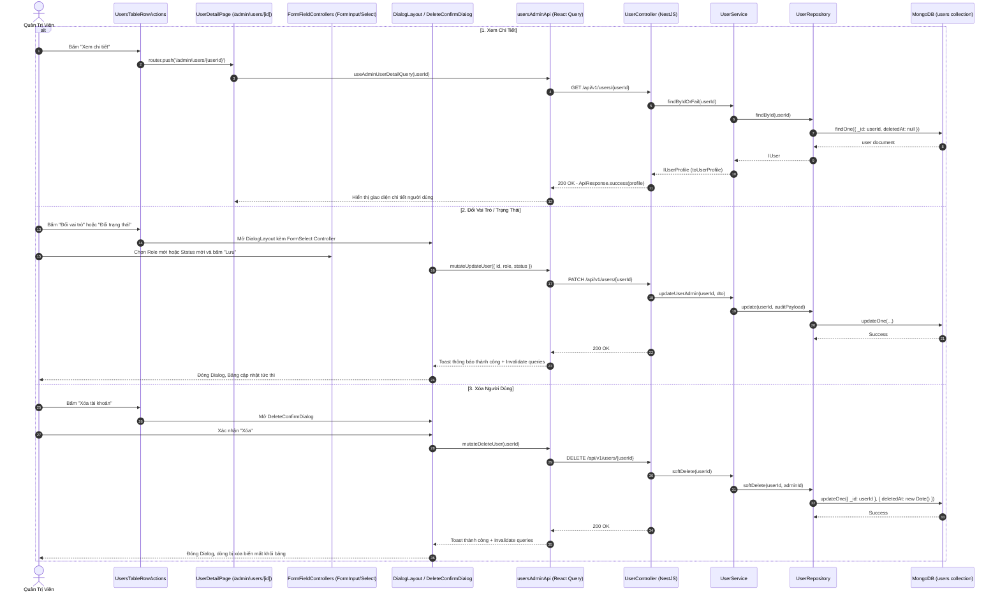

# Kế Hoạch Triển Khai: Form Field Controllers Dùng Chung, Row Actions & Trang Chi Tiết Người Dùng

> **Mục tiêu:**
> 1. Xây dựng bộ thư viện component **Generic Form Field Controllers** (`frontend/src/components/shared/form-fields/`) bọc `react-hook-form`:
>    - Chuẩn hóa toàn bộ Form Controls: `FormInput`, `FormTextarea`, `FormSelect`, `FormSwitch`, `FormCheckbox`, `FormLabel`, `FormErrorMessage`.
>    - Tự động normalize/trim whitespace cho chuỗi, đồng bộ 100% giao diện, validation error, icon, typography cho toàn bộ dự án hiện tại và các module tương lai.
> 2. Xây dựng bộ **Shared Dialog System** theo quy chuẩn kiến trúc dự án:
>    - `DialogLayout`: Layout modal dialog thống nhất (Header, Icon, Content, Footer với nút Hủy/Xác nhận và loading state).
>    - `DeleteConfirmDialog`: Modal xác nhận xóa chuẩn mực, hỗ trợ cảnh báo xóa mềm an toàn.
> 3. Hoàn thiện toàn bộ các tính năng tương tác trong **Row Actions** của User Table:
>    - "Xem chi tiết" ➔ Điều hướng tới trang chi tiết người dùng (`/admin/users/[userId]`).
>    - "Đổi vai trò" ➔ Modal chọn và cập nhật Role (`ADMIN`, `INSTRUCTOR`, `STUDENT`).
>    - "Đổi trạng thái" ➔ Modal cập nhật Status (`ACTIVE`, `INACTIVE`, `BANNED`).
>    - "Xóa tài khoản" ➔ Modal xác nhận và thực hiện soft delete.
> 4. Xây dựng **Trang Chi Tiết Người Dùng (`/admin/users/[userId]`)**:
>    - Giao diện Overview hồ sơ quản trị: Thẻ thông tin cá nhân, Avatar, Role, Status, Lịch sử tham gia, Phân quyền.
>    - Form cập nhật thông tin người dùng trực tiếp áp dụng bộ **Form Field Controllers** dùng chung.
> 5. Xây dựng trọn vẹn **Backend API** tương ứng trong NestJS/MongoDB:
>    - `GET /api/v1/users/:id`: Lấy thông tin chi tiết user (`@Roles(RoleEnum.ADMIN)`).
>    - `PATCH /api/v1/users/:id`: Cập nhật thông tin/vai trò/trạng thái (`@Roles(RoleEnum.ADMIN)`).
>    - `DELETE /api/v1/users/:id`: Xóa mềm user (`@Roles(RoleEnum.ADMIN)`).
>    - Viết đầy đủ Unit Tests cho Service và Controller theo chuẩn AAA Pattern.
>
> **Task Slug:** `user-details-form`  
> **Plan File:** `docs/PLAN-user-details-form.md`  
> **Primary Agent:** `project-planner`  
> **Executing Agents:** `backend-specialist`, `frontend-specialist`  
> **Skills:** `clean-code`, `frontend-design`, `react-best-practices`, `api-patterns`, `testing-patterns`, `plan-writing`

---

## 1. Phân Tích Kỹ Thuật & Khảo Sát Hiện Trạng

### 1.1. Yêu Cầu Kiến Trúc Dự Án (Architectural Constraints)

Theo quy định tại `RULE_GUIDE.md` (`project-architecture.md`):
1. **Forms & Inputs**:
   - Toàn bộ Form sử dụng `react-hook-form` kết hợp `<Controller />` hoặc dedicated form field components.
   - Validation phía Client bằng Zod schema (`@hookform/resolvers/zod`).
   - Tự động chuẩn hóa (trim whitespace) trên tất cả input/textarea trước khi lưu; từ chối hoặc chuyển các chuỗi rỗng/chỉ chứa khoảng trắng thành undefined/null.
2. **Mutations & Dialogs**:
   - Tất cả dialog CRUD phải sử dụng component khung `DialogLayout` để đảm bảo giao diện đồng bộ.
   - Hành động xóa phải sử dụng component `DeleteConfirmDialog`.
   - Mọi mutation phải có thông báo toast (`sonner`) khi thành công và thất bại.
3. **Backend Architecture**:
   - Các thao tác cập nhật/xóa user phải thông qua `UserService` (kế thừa `BaseService`) và `UserRepository` (kế thừa `BaseMongoRepository`).
   - Tự động ghi nhận audit fields (`updatedById`) và phát sinh log qua CLS context.
   - Bắt buộc có unit tests `*.spec.ts` trong `backend/src/modules/user/tests/`.

---

### 1.2. Sơ Đồ Luồng Tích Hợp (Sequence Diagram)



---

## 2. Thiết Kế Cấu Trúc Thư Mục Chuẩn

```
frontend/src/
├── components/
│   └── shared/
│       ├── form-fields/                      # 👉 TẦNG CONTROLLER FORM DÙNG CHUNG TOÀN HỆ THỐNG
│       │   ├── form-input.tsx                # Text, Email, Password, Number với Auto-Trim & Error Message
│       │   ├── form-textarea.tsx             # Textarea có auto-resize, counter độ dài, auto-trim
│       │   ├── form-select.tsx               # Dropdown Select chuẩn hóa (Options, Icon, Placeholder)
│       │   ├── form-switch.tsx               # Toggle Switch có nhãn & mô tả
│       │   ├── form-checkbox.tsx             # Checkbox control
│       │   ├── form-label.tsx                # Label thống nhất (hỗ trợ dấu required *)
│       │   ├── form-error-message.tsx        # Cảnh báo lỗi input chuẩn hóa
│       │   ├── types.ts                      # Props interfaces cho từng controller
│       │   └── index.ts                      # Barrel export của form-fields
│       │
│       └── dialog/                           # 👉 TẦNG DIALOG LAYOUT & XÁC NHẬN DÙNG CHUNG
│           ├── dialog-layout.tsx             # Layout khung dialog chuẩn (Header, Body, Footer buttons)
│           ├── delete-confirm-dialog.tsx     # Modal xác nhận xóa an toàn
│           └── index.ts                      # Export của shared dialog
│
├── features/
│   └── admin/
│       └── users/
│           ├── api/
│           │   └── users-admin.api.ts        # Mở rộng: getDetail, update, softDelete mutations
│           ├── components/
│           │   ├── users-row-actions.tsx     # Tích hợp DialogLayout & DeleteConfirmDialog
│           │   ├── user-role-dialog.tsx      # Modal đổi vai trò người dùng (sử dụng FormSelect)
│           │   ├── user-status-dialog.tsx    # Modal đổi trạng thái hoạt động (sử dụng FormSelect)
│           │   ├── user-details-view.tsx     # Giao diện trang chi tiết người dùng
│           │   └── user-edit-form.tsx        # Form chỉnh sửa hồ sơ áp dụng FormFieldControllers
│           ├── schemas/
│           │   └── user-admin.schema.ts      # Zod validation schema cho Update User
│           └── index.ts
│
└── app/
    └── (admin)/
        └── admin/
            └── users/
                └── [userId]/
                    └── page.tsx              # Dynamic Route trang chi tiết người dùng

backend/src/modules/user/
├── dto/
│   ├── update-user-admin.dto.ts              # DTO cập nhật User từ quyền Admin
│   └── query-users.dto.ts
├── repositories/
│   └── user.repository.ts
├── services/
│   └── user.service.ts                       # Bổ sung getUserDetail, updateUserAdmin
├── tests/
│   └── user.service.spec.ts                  # Test cases cho các endpoint mới
└── user.controller.ts                        # Bổ sung GET /:id, PATCH /:id, DELETE /:id
```

---

## 3. Kế Hoạch Triển Khai Chi Tiết (Task Breakdown)

### Task 1: Xây Dựng Bộ Form Field Controllers Dùng Chung
- **Mã Task:** `TASK-SHARED-FORM-FIELDS`
- **Agent Phụ Trách:** `frontend-specialist`
- **Skills:** `frontend-design`, `clean-code`, `react-best-practices`
- **Độ Ưu Tiên:** P0 (Cốt lõi tính đồng bộ UI)
- **Dependencies:** Không
- **Mô Tả Chi Tiết:**
  - Khởi tạo thư mục `frontend/src/components/shared/form-fields/`.
  - Xây dựng `form-input.tsx`: Bọc `Controller` của `react-hook-form`, nhận `control`, `name`, `label`, `placeholder`, `type`, `description`, `disabled`, `required`. Tự động áp dụng `onChange={(e) => field.onChange(typeof e.target.value === 'string' ? e.target.value : e.target.value)}` và `onBlur` tự động trim chuỗi. Hiển thị thông báo lỗi đồng bộ.
  - Xây dựng `form-textarea.tsx`: Hỗ trợ auto-trim, số hàng linh hoạt, hiển thị giới hạn ký tự.
  - Xây dựng `form-select.tsx`: Dropdown chọn giá trị với danh sách options `{ label, value, icon, disabled }`, bọc `Controller`, đồng bộ trạng thái disabled/error.
  - Xây dựng `form-switch.tsx` & `form-checkbox.tsx`: Hỗ trợ toggling boolean giá trị rõ ràng.
  - Xây dựng `form-label.tsx` và `form-error-message.tsx`: Đảm bảo kích thước chữ, khoảng cách, màu sắc lỗi `destructive` đồng nhất trên toàn hệ thống.
- **INPUT:** `control: Control<TFieldValues>`, `name: FieldPath<TFieldValues>`.
- **OUTPUT:** Bộ controllers tái sử dụng 100% cho mọi form trong ứng dụng.
- **VERIFY:** Lint và Type check không có cảnh báo nào.

---

### Task 2: Xây Dựng Hệ Thống Shared Dialog (`DialogLayout` & `DeleteConfirmDialog`)
- **Mã Task:** `TASK-SHARED-DIALOGS`
- **Agent Phụ Trách:** `frontend-specialist`
- **Skills:** `frontend-design`, `clean-code`
- **Độ Ưu Tiên:** P0
- **Dependencies:** Không
- **Mô Tả Chi Tiết:**
  - Tạo `frontend/src/components/shared/dialog/dialog-layout.tsx`:
    - Khung modal chuẩn gồm: Header (Icon tiêu đề, Title, Description), Body (padding đều đặn, hỗ trợ cuộn nếu nội dung dài), Footer (Nút Hủy bỏ, Nút Xác nhận hành động có loading state).
  - Tạo `frontend/src/components/shared/dialog/delete-confirm-dialog.tsx`:
    - Modal xác nhận xóa chuẩn mực: Icon cảnh báo đỏ (`lucide:alert-triangle`), Tiêu đề xóa, Nội dung cảnh báo hành động không thể hoàn tác, Nút "Hủy" và Nút "Xác nhận xóa" (variant `destructive`, disabled và có spinner khi đang xử lý).
- **INPUT:** Props điều khiển mở/đóng, tiêu đề, callback `onConfirm`.
- **OUTPUT:** Hệ thống dialog chuẩn hóa cho toàn dự án.
- **VERIFY:** Mở/đóng mượt mà, bấm ESC hoặc backdrop đóng an toàn.

---

### Task 3: Phát Triển Backend APIs (Get Detail, Update, Soft Delete User)
- **Mã Task:** `TASK-BACKEND-USER-APIS`
- **Agent Phụ Trách:** `backend-specialist`
- **Skills:** `clean-code`, `api-patterns`, `testing-patterns`
- **Độ Ưu Tiên:** P0
- **Dependencies:** Không
- **Mô Tả Chi Tiết:**
  - Tạo `backend/src/modules/user/dto/update-user-admin.dto.ts`:
    - Hỗ trợ cập nhật: `fullName`, `bio`, `role` (`RoleEnum`), `status` (`UserStatusEnum`). Validate chặt chẽ với `class-validator`.
  - Cập nhật `backend/src/modules/user/services/user.service.ts`:
    - `getUserDetail(id: string)`: Trả về `IUserProfile` (loại bỏ `passwordHash`), bắn `NotFoundException` nếu không tồn tại hoặc đã bị xóa mềm.
    - `updateUserAdmin(id: string, dto: UpdateUserAdminDto)`: Cập nhật thông tin qua `updateOrFail` kèm ghi nhận `updatedById`.
    - Kế thừa phương thức `softDelete(id: string)` từ `BaseService`.
  - Cập nhật `backend/src/modules/user/user.controller.ts`:
    - `GET /users/:id` ➔ `@Roles(RoleEnum.ADMIN)` ➔ Gọi `userService.getUserDetail(id)`.
    - `PATCH /users/:id` ➔ `@Roles(RoleEnum.ADMIN)` ➔ Gọi `userService.updateUserAdmin(id, dto)`.
    - `DELETE /users/:id` ➔ `@Roles(RoleEnum.ADMIN)` ➔ Gọi `userService.softDelete(id)`.
  - Viết unit tests trong `backend/src/modules/user/tests/user.service.spec.ts` kiểm thử đầy đủ các kịch bản thành công và lỗi (User không tồn tại).
- **INPUT:** HTTP Requests từ Client với token Admin.
- **OUTPUT:** 3 endpoints mới hoàn chỉnh, bảo mật và có unit tests 100% pass.
- **VERIFY:** Chạy `pnpm --filter backend test` thành công.

---

### Task 4: Mở Rộng Client API & Mutations Phía Frontend
- **Mã Task:** `TASK-FRONTEND-USER-API`
- **Agent Phụ Trách:** `frontend-specialist`
- **Skills:** `clean-code`, `react-best-practices`
- **Độ Ưu Tiên:** P1
- **Dependencies:** `TASK-BACKEND-USER-APIS`
- **Mô Tả Chi Tiết:**
  - Cập nhật `frontend/src/features/admin/users/api/users-admin.api.ts`:
    - `useAdminUserDetailQuery(userId: string)`: Fetch chi tiết người dùng.
    - `useUpdateUserAdminMutation()`: Gọi `PATCH /users/:id`, tự động hiển thị Toast thành công, invalidate query `usersAdminKeys.all`.
    - `useDeleteUserAdminMutation()`: Gọi `DELETE /users/:id`, hiển thị Toast thành công, invalidate query `usersAdminKeys.all`.
- **INPUT:** API Endpoints.
- **OUTPUT:** Hooks React Query type-safe, tích hợp thông báo người dùng tức thì.
- **VERIFY:** Type check TypeScript không có lỗi.

---

### Task 5: Hoàn Thiện Các Tính Năng Trong Row Actions
- **Mã Task:** `TASK-USER-ROW-ACTIONS`
- **Agent Phụ Trách:** `frontend-specialist`
- **Skills:** `frontend-design`, `clean-code`
- **Độ Ưu Tiên:** P1
- **Dependencies:** `TASK-SHARED-DIALOGS`, `TASK-SHARED-FORM-FIELDS`, `TASK-FRONTEND-USER-API`
- **Mô Tả Chi Tiết:**
  - Tạo `user-role-dialog.tsx`: Sử dụng `DialogLayout` + `FormSelect` để chọn Role mới và submit qua `useUpdateUserAdminMutation`.
  - Tạo `user-status-dialog.tsx`: Sử dụng `DialogLayout` + `FormSelect` để chọn Status mới và submit qua `useUpdateUserAdminMutation`.
  - Cập nhật `users-row-actions.tsx`:
    - "Xem chi tiết" ➔ Điều hướng tới `/admin/users/${user.id}` bằng `router.push()`.
    - "Đổi vai trò" ➔ Kích hoạt mở `UserRoleDialog`.
    - "Đổi trạng thái" ➔ Kích hoạt mở `UserStatusDialog`.
    - "Xóa tài khoản" ➔ Kích hoạt mở `DeleteConfirmDialog`, gọi `useDeleteUserAdminMutation`.
- **INPUT:** Dòng người dùng trong bảng.
- **OUTPUT:** Menu thao tác hoạt động 100% với dữ liệu thật, có dialog xác nhận và phản hồi toast.
- **VERIFY:** Thử đổi vai trò của 1 user ➔ Bảng cập nhật ngay lập tức badge vai trò mới.

---

### Task 6: Xây Dựng Trang Chi Tiết Người Dùng (`/admin/users/[userId]`)
- **Mã Task:** `TASK-USER-DETAIL-PAGE`
- **Agent Phụ Trách:** `frontend-specialist`
- **Skills:** `frontend-design`, `react-best-practices`, `clean-code`
- **Độ Ưu Tiên:** P1
- **Dependencies:** `TASK-SHARED-FORM-FIELDS`, `TASK-FRONTEND-USER-API`
- **Mô Tả Chi Tiết:**
  - Tạo `frontend/src/app/(admin)/admin/users/[userId]/page.tsx` và `frontend/src/features/admin/users/components/user-details-view.tsx`.
  - Phần Header trang:
    - Nút quay lại danh sách (`Link` tới `/admin/users` kèm icon mũi tên).
    - Tiêu đề "Hồ sơ người dùng", Breadcrumbs `Admin / Quản lý người dùng / [Tên user]`.
    - Thẻ tổng quan người dùng (Hero Profile Card): Avatar to, Họ tên, Email, Badges Role và Status, Ngày tạo tài khoản.
  - Phần Nội dung chi tiết:
    - Form chỉnh sửa thông tin nhanh (`UserEditForm`): Sử dụng `react-hook-form` kết hợp **bộ Form Field Controllers dùng chung** (`FormInput` cho FullName, Username, Bio; `FormSelect` cho Role và Status).
    - Các nút thao tác nhanh: Lưu thay đổi (với trạng thái pending), Đổi trạng thái, Khóa tài khoản, Xóa tài khoản.
  - Xử lý đầy đủ 3 trạng thái: Loading (Skeleton profile), Error (Card báo lỗi kèm nút thử lại), Success.
- **INPUT:** Route param `userId`.
- **OUTPUT:** Trang chi tiết người dùng chuẩn mực, chuyên nghiệp, đồng bộ hoàn toàn với giao diện Admin Dashboard.
- **VERIFY:** Truy cập `/admin/users/{valid_id}` hiển thị đúng thông tin user thật từ MongoDB.

---

## 4. Ranh Giới Phạm Vi Nghiêm Ngặt (Scope Boundaries)

| Trong Phạm Vi Milestone Này (IN SCOPE) | Ngoài Phạm Vi (DEFERRED TO NEXT MILESTONES) |
| :--- | :--- |
| Bộ Form Field Controllers chung (`FormInput`, `FormSelect`...) | Upload trực tiếp avatar bằng kéo thả ảnh trong form chỉnh sửa user admin |
| Shared Dialogs (`DialogLayout`, `DeleteConfirmDialog`) | Reset mật khẩu người dùng hoặc gửi email xác thực |
| 4 tính năng Row Actions (Detail, Change Role, Change Status, Delete) | Phân quyền ma trận chi tiết dạng Permissions Checkboxes |
| Trang chi tiết người dùng `/admin/users/[userId]` | Lịch sử đăng nhập / Activity Logs của người dùng |
| Backend CRUD APIs cho User (`GET /:id`, `PATCH /:id`, `DELETE /:id`) | Chức năng chuyển giao quyền sở hữu tài khoản (Account Ownership Transfer) |

---

## 5. Kế Hoạch Kiểm Thử & Nghiệm Thu (Phase X: Verification Checklist)

- [ ] **Kiểm thử Form Field Controllers**:
  - `FormInput`, `FormTextarea`, `FormSelect` render mượt mà, đúng chuẩn styling của hệ thống.
  - Tự động trim whitespace khi blur hoặc submit form, hiển thị lỗi Zod validation sắc nét dưới từng field.
- [ ] **Kiểm thử Shared Dialogs**:
  - `DialogLayout` hiển thị đầy đủ icon, title, description và các nút điều khiển.
  - `DeleteConfirmDialog` ngăn chặn xóa nhầm, hiển thị spinner khi mutation đang chạy.
- [ ] **Kiểm thử Backend APIs & Unit Tests**:
  - `GET /users/:id` trả về đúng thông tin user, trả về 404 nếu id không tồn tại.
  - `PATCH /users/:id` cập nhật role/status thành công, tự động cập nhật `updatedById`.
  - `DELETE /users/:id` soft delete thành công (`deletedAt != null`).
  - Toàn bộ unit tests trong `backend/src/modules/user/tests/` đạt 100% pass.
- [ ] **Kiểm thử Row Actions & User Details Page**:
  - Bấm "Xem chi tiết" chuyển đúng vào `/admin/users/[userId]`.
  - Trang chi tiết tải đúng dữ liệu thật từ database, cho phép chỉnh sửa thông tin qua form controllers.
  - Thao tác đổi Role, đổi Status, Xóa hoạt động chính xác từ cả bảng và trang chi tiết.
- [ ] **Kiểm tra Code Quality**:
  - `pnpm --filter frontend lint` đạt `0 errors`, `0 warnings`.
  - `pnpm --filter frontend exec tsc --noEmit` đạt `0 type errors`.
  - Không có bất kỳ type `any` nào trong toàn bộ code mới.
