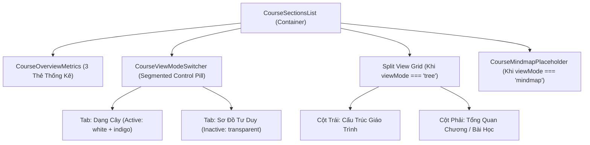
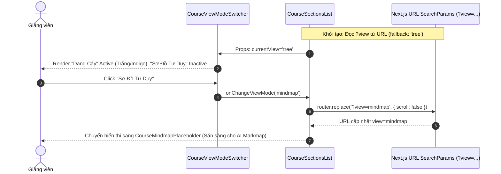

# PLAN: Thêm Bộ Điều Khiển Chuyển Đổi Chế Độ Xem (View Mode Switcher / Segmented Control)

> **Mục tiêu:**
> 1. Triển khai component chuyển đổi chế độ xem **View Mode Switcher** (Segmented Control) dạng viên thuốc (pill-shaped) cho trang chi tiết đề cương khóa học:
>    - **Lựa chọn 1:** "Dạng Cây" (Tree View - mặc định) kèm icon `lucide:folder-tree`.
>    - **Lựa chọn 2:** "Sơ Đồ Tư Duy" (Mindmap View) kèm icon `lucide:network`.
> 2. **Vị trí hiển thị:** Căn giữa (`mx-auto` / `justify-center`) trong khoảng whitespace ngay bên dưới 3 thẻ thống kê tổng quan (`CourseOverviewMetrics`: Tổng số chương, Tổng bài giảng, Thời lượng học) và bên trên phần tiêu đề "Cấu trúc giáo trình" kèm nút "+ Thêm chương".
> 3. **Đặc tả UI/UX:**
>    - Container ngoài: `inline-flex`, nền xám nhạt (`#f1f5f9` / `bg-slate-100`), bo tròn viên thuốc (`rounded-full`), padding mỏng `4px - 6px` (`p-1.5`).
>    - Nút đang chọn (Active): Nền trắng (`#ffffff` / `bg-white`), chữ màu xanh tím Indigo nổi bật (`text-indigo-600`), đổ bóng nhẹ (`shadow-xs`), bo góc tròn ôm khít (`rounded-full`).
>    - Nút chưa chọn (Inactive): Nền trong suốt (`bg-transparent`), chữ màu xám/đen nhạt (`text-slate-600`), hover sáng nhẹ (`hover:text-slate-900 hover:bg-slate-200/50`), bo tròn (`rounded-full`).
> 4. **Trạng thái & Điều hướng:** Đồng bộ trạng thái chế độ xem qua URL Search Params (`?view=tree` hoặc `?view=mindmap`) theo đúng chuẩn `Project Architectural Rules`. Khi chọn "Sơ Đồ Tư Duy", hiển thị giao diện placeholder trực quan để chuẩn bị sẵn sàng cho module Markmap tiếp theo.
> 5. **Công nghệ:** Tự dựng bằng HTML chuẩn + Tailwind CSS v4 kết hợp `@iconify/react` có sẵn trong dự án (Zero-dependency, gọn nhẹ, chuẩn accessible).
>
> **Task Slug:** `view-mode-switcher`  
> **Plan File:** `docs/PLAN-view-mode-switcher.md`  
> **Primary Agent:** `project-planner`  
> **Executing Agent:** `frontend-specialist`  
> **Skills:** `clean-code`, `frontend-design`, `react-best-practices`, `plan-writing`

---

## 1. Phân Tích Kỹ Thuật & Kiến Trúc Giao Diện

### 1.1. Hiện Trạng & Vị Trí Component

- File cấu trúc giáo trình hiện tại: [`course-sections-list.tsx`](file:///d:/Download/hk1_2027/project_do_an/frontend/src/features/course/components/course-sections-list.tsx).
- Cấu trúc DOM hiện tại:
  ```tsx
  <div className="space-y-6">
    {/* 1. Top Overview Metrics Bar */}
    <CourseOverviewMetrics ... />

    {/* VỊ TRÍ MỚI: View Mode Switcher căn giữa tại đây */}

    {/* 2. Main Grid: Left Tree Hierarchy & Right Contextual Panel */}
    <div className="grid grid-cols-1 lg:grid-cols-12 gap-6 items-start">
      ...
    </div>
  </div>
  ```
- **Giải pháp:** 
  - Đặt `<div className="flex justify-center">` chứa `<CourseViewModeSwitcher />` ngay giữa khối `<CourseOverviewMetrics />` và khối `<div className="grid grid-cols-1 lg:grid-cols-12 ...">`.
  - Quản lý trạng thái thông qua hook Next.js: `useSearchParams`, `useRouter`, `usePathname`.
  - Khi `viewMode === 'mindmap'`: Ẩn cụm 2 cột (Tree & Inspector), hiển thị `<CourseMindmapPlaceholder />`.

---

### 1.2. Sơ Đồ Cấu Trúc Thành Phần (Component Hierarchy)



---

### 1.3. Luồng Đồng Bộ URL Search Params



---

## 2. Danh Sách Nhiệm Vụ Chi Tiết (Actionable Task Breakdown)

### Task 1: Xây Dựng Component `CourseViewModeSwitcher`
- **Task ID:** `TASK-VMS-01`
- **File:** [`frontend/src/features/course/components/course-view-mode-switcher.tsx`](file:///d:/Download/hk1_2027/project_do_an/frontend/src/features/course/components/course-view-mode-switcher.tsx)
- **Agent:** `frontend-specialist`
- **Skills:** `clean-code`, `frontend-design`
- **Priority:** P1
- **Dependencies:** None
- **INPUT:** Interface props:
  ```typescript
  export type CourseViewMode = 'tree' | 'mindmap';

  interface CourseViewModeSwitcherProps {
    viewMode: CourseViewMode;
    onChangeViewMode: (mode: CourseViewMode) => void;
    className?: string;
  }
  ```
- **OUTPUT:** Component Segmented Control dạng viên thuốc:
  - Khung ngoài: `inline-flex items-center bg-[#f1f5f9] p-1 sm:p-1.5 rounded-full border border-slate-200/80 shadow-xs`
  - 2 Tabs:
    - `tree`: Icon `lucide:folder-tree`, Text "Dạng Cây".
    - `mindmap`: Icon `lucide:network`, Text "Sơ Đồ Tư Duy".
  - Hiệu ứng chuyển động mượt `transition-all duration-200 ease-in-out`.
  - Accessible: `role="tablist"`, `role="tab"`, `aria-selected={viewMode === item.id}`.
- **VERIFY:** Render độc lập không lỗi, active tab thể hiện đúng nền trắng chữ indigo và đổ bóng nhẹ.

---

### Task 2: Xây Dựng Component `CourseMindmapPlaceholder`
- **Task ID:** `TASK-VMS-02`
- **File:** [`frontend/src/features/course/components/course-mindmap-placeholder.tsx`](file:///d:/Download/hk1_2027/project_do_an/frontend/src/features/course/components/course-mindmap-placeholder.tsx)
- **Agent:** `frontend-specialist`
- **Skills:** `clean-code`, `frontend-design`
- **Priority:** P2
- **Dependencies:** None
- **INPUT:** Component hiển thị trạng thái chuyển tiếp cho chế độ Sơ Đồ Tư Duy.
- **OUTPUT:** Giao diện Placeholder trực quan, hiện đại:
  - Card bo tròn `rounded-2xl border border-border/70 bg-card p-10 text-center shadow-xs`.
  - Minh họa icon mạng lưới `lucide:network` hoặc `lucide:sparkles` với hiệu ứng gradient nhẹ.
  - Tiêu đề: "Sơ Đồ Tư Duy Khóa Học (Mindmap View)".
  - Mô tả: "Tính năng trực quan hóa kiến thức và tự động tạo sơ đồ tư duy bằng AI đang được chuẩn bị tích hợp."
  - Nút quay lại "Xem dạng cây": gọi `onChangeViewMode('tree')`.
- **VERIFY:** Component render gọn gàng, tương thích kích thước và không bị lệch viewport.

---

### Task 3: Tích Hợp View Mode Switcher Vào `CourseSectionsList`
- **Task ID:** `TASK-VMS-03`
- **File:** [`frontend/src/features/course/components/course-sections-list.tsx`](file:///d:/Download/hk1_2027/project_do_an/frontend/src/features/course/components/course-sections-list.tsx)
- **Agent:** `frontend-specialist`
- **Skills:** `react-best-practices`, `clean-code`
- **Priority:** P1
- **Dependencies:** `TASK-VMS-01`, `TASK-VMS-02`
- **INPUT:** Đọc `view` từ Next.js `useSearchParams()` (giá trị hợp lệ: `'tree' | 'mindmap'`, mặc định: `'tree'`).
- **OUTPUT:**
  - Hook đồng bộ URL:
    ```typescript
    const searchParams = useSearchParams();
    const router = useRouter();
    const pathname = usePathname();

    const rawView = searchParams.get('view');
    const viewMode: CourseViewMode = rawView === 'mindmap' ? 'mindmap' : 'tree';

    const handleViewModeChange = (mode: CourseViewMode) => {
      const params = new URLSearchParams(searchParams.toString());
      if (mode === 'tree') {
        params.delete('view');
      } else {
        params.set('view', mode);
      }
      const newQuery = params.toString() ? `?${params.toString()}` : '';
      router.replace(`${pathname}${newQuery}`, { scroll: false });
    };
    ```
  - Chèn component vào khoảng cách giữa:
    ```tsx
    {/* 1. Top Overview Metrics Bar */}
    <CourseOverviewMetrics ... />

    {/* View Mode Switcher Centered */}
    <div className="flex justify-center pt-1 pb-2">
      <CourseViewModeSwitcher
        viewMode={viewMode}
        onChangeViewMode={handleViewModeChange}
      />
    </div>

    {/* 2. Main Content: Conditional Render based on viewMode */}
    {viewMode === 'mindmap' ? (
      <CourseMindmapPlaceholder onBackToTree={() => handleViewModeChange('tree')} />
    ) : (
      <div className="grid grid-cols-1 lg:grid-cols-12 gap-6 items-start">
        ...
      </div>
    )}
    ```
- **VERIFY:** 
  - F5 giữ nguyên query param `?view=mindmap` hoặc `?view=tree`.
  - Nhấp qua lại giữa 2 nút chuyển đổi hiển thị mượt mà không load lại trang.

---

### Task 4: Kiểm Thử & Tinh Chỉnh Responsive (Phase X Verification)
- **Task ID:** `TASK-VMS-04`
- **Agent:** `frontend-specialist`
- **Skills:** `clean-code`, `frontend-design`
- **Priority:** P2
- **Dependencies:** `TASK-VMS-03`
- **INPUT:** Trình duyệt trên cả desktop (`>= 1024px`) và mobile (`< 768px`).
- **OUTPUT:**
  - Kiểm tra thẩm mỹ: Container viên thuốc `#f1f5f9`, viền nhẹ, active nút trắng đổ bóng nổi bật, chữ indigo rõ ràng.
  - Hover trạng thái nút inactive có đổi màu chữ mượt mà.
  - Không xuất hiện vỡ layout hoặc double scrollbar.
  - Chạy `pnpm --filter frontend lint` xác nhận không có lỗi type hoặc lint.
- **VERIFY:** Zero lint errors, giao diện chuẩn pixel theo ảnh chụp đính kèm.

---

### Task 5: Cập Nhật Tài Liệu Tiến Độ (Living Docs Synchronization)
- **Task ID:** `TASK-VMS-05`
- **File:** [`a-agentic/features/course-management/dev-history.md`](file:///d:/Download/hk1_2027/project_do_an/a-agentic/features/course-management/dev-history.md)
- **Agent:** `frontend-specialist`
- **Skills:** `clean-code`
- **Priority:** P3
- **Dependencies:** `TASK-VMS-04`
- **INPUT:** Ghi nhận sự kiện triển khai `CourseViewModeSwitcher` vào lịch sử phát triển.
- **OUTPUT:** Bổ sung entry mới vào `dev-history.md` ghi nhận giải pháp, file thay đổi, quyết định đồng bộ URL param và gotchas.
- **VERIFY:** Tài liệu được cập nhật đầy đủ, rõ ràng.

---

## 3. Ma Trận Rủi Ro & Chiến Lược Dự Phòng (Risk Matrix & Rollback)

| Rủi ro tiềm ẩn | Mức độ | Biện pháp phòng ngừa / Khắc phục |
| :--- | :--- | :--- |
| **Mất trạng thái khi reload trang** | Trung bình | Đã giải quyết triệt để bằng cách đồng bộ qua URL query params `?view=...`. |
| **Xung đột kiểu dữ liệu (Strict Typing)** | Thấp | Khai báo kiểu union rõ ràng `export type CourseViewMode = 'tree' \| 'mindmap'`, tuyệt đối không dùng `any`. |
| **Lệch căn chỉnh với 3 Card Thống Kê** | Thấp | Bọc container với `flex justify-center`, sử dụng `w-fit inline-flex` để tự co giãn tự nhiên theo nội dung. |
| **Xung đột màu Indigo với Purple Ban** | Thấp | Dùng tông chuẩn Indigo (`text-indigo-600` / `#4f46e5`), xanh tím công nghệ hiện đại theo đúng yêu cầu người dùng, không dùng màu tím hồng violet sến. |

---

## 4. Trạng Thái Hoàn Thành (Status & Verification)

- [x] **`TASK-VMS-01`**: Xây dựng component `CourseViewModeSwitcher` ([`course-view-mode-switcher.tsx`](file:///d:/Download/hk1_2027/project_do_an/frontend/src/features/course/components/course-view-mode-switcher.tsx)).
- [x] **`TASK-VMS-02`**: Xây dựng component `CourseMindmapPlaceholder` ([`course-mindmap-placeholder.tsx`](file:///d:/Download/hk1_2027/project_do_an/frontend/src/features/course/components/course-mindmap-placeholder.tsx)).
- [x] **`TASK-VMS-03`**: Tích hợp Switcher và hook đồng bộ URL Search Params vào [`CourseSectionsList`](file:///d:/Download/hk1_2027/project_do_an/frontend/src/features/course/components/course-sections-list.tsx) kèm React Suspense boundary.
- [x] **`TASK-VMS-04`**: Kiểm thử Lint & Typecheck (`pnpm --filter frontend lint` đạt 0 lỗi, 0 cảnh báo).
- [x] **`TASK-VMS-05`**: Cập nhật Living Documentation ([`dev-history.md`](file:///d:/Download/hk1_2027/project_do_an/a-agentic/features/course-management/dev-history.md) - Milestone 33).

